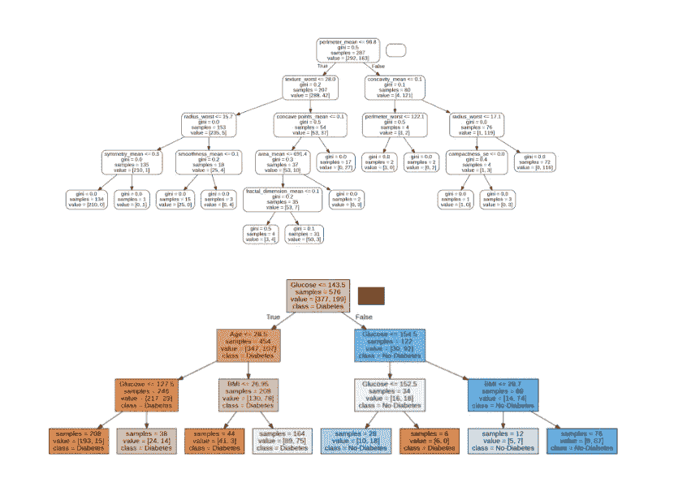

# 决策树 vs 随机森林

> 原文：<https://medium.com/mlearning-ai/decision-trees-vs-random-forest-c0fcabb757f2?source=collection_archive---------2----------------------->

## 你应该知道的主要区别！

上周我发表了两篇关于决策树的文章:一篇是关于[决策和分类树(CART)](https://pub.towardsai.net/decision-and-classification-tree-cart-for-binary-classification-hands-on-with-scikit-learn-b59474b2c039) 的，另一篇是关于如何实现[随机森林分类器的教程。](https://pub.towardsai.net/decision-and-classification-tree-cart-for-binary-classification-hands-on-with-scikit-learn-b59474b2c039)这两种方法可能看起来非常相似，但是每个数据专业人士或热心人士都应该知道它们之间的重要区别。