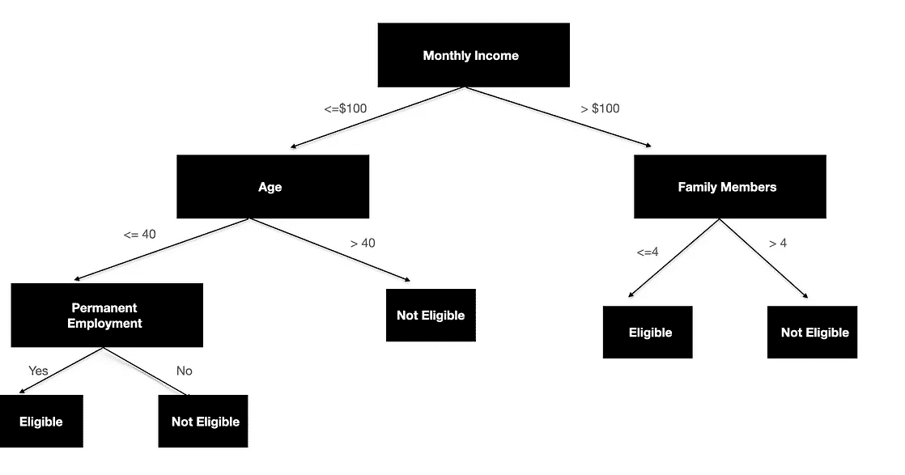
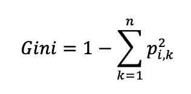
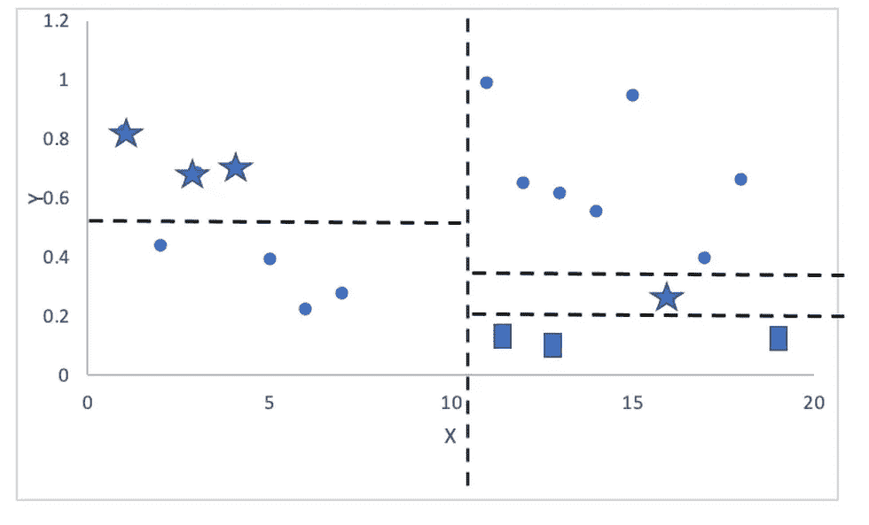

# 永不过时的决策树

> 原文：<https://medium.com/mlearning-ai/decision-trees-which-never-gets-old-2e2e63fa2b06?source=collection_archive---------4----------------------->

如果你正在与客户合作，并且已经与许多客户合作过，那么至少有一次你遇到了一个客户，他对你如何为他提供解决方案感兴趣，这背后的概念是什么，并且努力完全相信任何无法解释的模型，即使有很高的机会获得更高的准确性。这是人类的本性，如果他们不愿意接受一个无法解释的解决方案来实施他们自己的业务，这有时是可以理解的。

让我们考虑以下两种情况，其中企业需要一种解决方案，在给定 A、B、C 输入的情况下，不断增加一个称为 Z 的参数。

fig1 : Image by Author

1.  ***场景 01:*** *模型的基本技术是 A+B—C = z .*
    ——这很容易解释，企业也很容易理解我们必须增加 A 或 B，或者减少 C 以最大化 z
2.  ***场景 02:*** *模型的底层技术是黑盒。
    -例如通过图层进行数学计算。它将有数百层，在每一层，将对输入进行计算，最终它将提供非常准确的预测。*
    这对业务团队来说毫无意义，无论最终结果有多准确，他们都没有信心使用该模型来生成输出。

因此，在某些情况下，让业务团队使用可解释的模型变得比使用复杂的不可解释的算法提供非常准确的输出更重要。

决策树就是这样一种简单的基本建模技术，任何非技术人员都很容易理解。通过读出这些节点，可以很容易地理清如何进行预测。这可能是它在过去几十年里从未过时的原因。

# 什么是决策树？

fig 2: Image from Unplash by Alla Hetman, fig3: Image by Author

决策树基本上是一个倒置的树状结构，从一个根节点开始，以一组规则作为分支，在叶节点做出决策。

***根*** :代表全体数据的根节点

***分支*** :表示拆分父节点数据的规则

***内部节点/叶节点*** :除根节点外的其他决策点。如果节点的数据集再次被拆分，该节点被称为内部节点，或者如果它位于携带决策点的决策树分支的末端，则被称为叶节点。

## 决策树是如何构建的？

当在正常情况下做出决策时，不止一个属性参与决策过程，然而，所有属性对于最终决策可能不具有相同的相关性或重要性。决策树试图通过查看训练数据来找到这种重要性或相关性。

为了决定这一点，在多个算法中使用了几个分割标准。它们中的大多数试图到达同质的叶节点。当决策树以这种方式构建时，它将把数据分割成最相似组的节点放置在根节点处，并且在向下遍历叶节点时，它选择在每一步分割的节点和规则，使得每组具有更大的相似性，从而导致更好的分类。这里使用的一个常用术语是节点的不纯。节点越均匀，其杂质就越少。

以下是一些流行的拆分标准，

*   ***基尼指数*** 基尼指数表示随机选择时实例被错误分类的概率。它通过计算目标变量的概率分布来衡量目标变量类别的组合。

where k is the number of classes varying from 1 to n and p is the probability of the instance being classified to a particular class.

如果所有元素都属于同一类
基尼= 1 — ( + ⁰ + ⁰ +…。)= 0，表示节点非常纯。
如果等级随机分布，基尼系数会更高，如果等级平均分布，基尼系数会是 0.5。
因此，当分割时，我们试图选择提供最小基尼不纯指数的节点。

*   ***熵***
    熵衡量的是一个分支缺乏可预测性，换句话说就是一个分布的不确定性。在构建决策树时，它的目标是降低每次分裂的熵水平，从而选择提供最小熵的节点。

where k is the number of classes varying from 1 to n and p is the probability of the instance being classified to a particular class.

*   ***信息增益(ID3)*** 信息增益衡量一个特征给出关于一个类的多少信息。如果一个节点给出更多的信息，那么该节点被选择作为分裂节点。通过在节点内的类中具有较小的随机性，可以获得较高的信息增益。
    这个概念也与熵相关，因为信息增益实际上是分割数据集后熵减少的度量。如果熵的降低越大，可预测性越强，信息增益就越大。

*   **卡方检验**
    选择与目标变量关系最密切的变量作为分裂节点。当不存在这种显著性时，在构建决策树时，不显著的预测器类别被合并。
*   **F 检验**
    这是计算两个总体均值的统计差异。如果两个群体没有明显的不同，那么在构建决策树时，它们会被合并在一起。
*   **最小平方偏差**
    这试图最小化观察值与预测值之间的平方距离之和(即残差)。为残差提供最小值的节点被选为分裂节点。

## 需要注意什么？

如前所述，构建决策树很容易，并且是现有的最容易解释的模型之一。那么这里有什么问题呢？

Image by Author — Overfitted decision tree

*   **过度拟合数据**
    当决策树构建得越来越深时，它会尝试隔离甚至单个数据点，如果分裂会更纯粹的话。正如我们在上面的图像中看到的，右边的恒星很可能是一个异常值。如果决策树在预测时像这样训练，当一个新的数据点落入可能不是星形的区域时，它将被预测为星形。这叫做过度拟合。发生这种情况是因为当决策树继续将数据分割成较小的样本大小时，将为稀疏数据生成严格的规则，这些稀疏数据完全适合训练数据，但不适合任何其他一般数据集。因此，如果不采取必要的措施来克服这一点，决策树的这种内在本质就是倾向于过度拟合数据。
*   **贪婪本性带来的不稳定性**
    构建决策树时，它会查看给出最佳下一次拆分的即时最优解。这被称为算法的*贪婪*本性。因此，整体解决方案可能不是最佳解决方案，并且当引入全新的数据时，分裂节点可能会随着新数据的信息而改变，并且通过向下传播，决策树可能会改变。
*   **数据不平衡的问题**
    这是许多机器学习算法中最常见的问题之一。如果在训练之前没有采取必要的步骤，模型决策树将偏向于主导类。

## 如何在乌云中找到一线希望？

一方面，决策树是最好的可解释模型之一，但另一方面，如果模型面临上述问题，模型的准确性将被放弃。然而，有多种技术可以最小化这些缺陷。

*   **指定最大深度**
    一种方法是给算法指定一个最大深度。例如，在上面的场景中，如果最大深度被指定为 2，则隔离一颗星的分裂将不会发生。
*   **为每个节点分配最少实例**
    另一种方法是在一个节点被分割后分配最少数量的数据点。在上面的例子中，如果它再次被指定为 3，我们正在讨论的恒星将不会被孤立。当它被指定时，模型不会尝试从较少数量的数据点生成规则。
*   **指定多数类和少数类之间的比率**
    这是另一种减少过拟合的方法。例如，当 90%的点属于一个类时，我们可以停止分割
*   **使用修剪技术**
    顾名思义，这种方法会剪掉树枝，通过去除多余的枝条来让树长得更好。这可以在构建树时进行，称为预修剪或提前停止，或者在通过削减冗余的分裂来拟合树之后进行，称为后修剪。找出冗余分割的标准不同。在一些方法中，它检查信息增益、交叉验证错误等，并试图得到一个更小的树，该树仅在训练集上不是完美拟合的。
*   **超参数调整**
    虽然决策树不需要首先进行适当的特征选择，因为该树倾向于选择分割数据的最佳参数，但最好是使用超参数调整和交叉验证等技术，并使用特征子集来迭代模型。
*   **平衡数据集**
    当数据集中的类分布不均时我们说数据集是不平衡的。这里的问题是，在分类问题中，随着数据集更加突出，模型变得更加偏向多数类。例如，在关于来自 100 个样本的癌症测试的数据集中，如果 98 个样本是良性的，则该模型可以预测所有样本都是良性的，并且仍然具有较高的准确性。因此，最好使用欠采样、过采样等技术。并在建模前处理数据集。
*   **用领域知识进行实验**
    虽然最后提到了这一点，但这是最重要的事情之一。检查模型规则是否有商业意义总是更好，而不仅仅依赖于任何评估指标，特别是如果数据集不是太大的话。当决策树用新数据分割变化时，或者当存在类别不平衡时，这种实验就成为一种非常方便的工具。

如上所述，如果我们在构建模型时保持谨慎，这些限制中的大多数都可以最小化，并且能够提供一个良好平衡的模型来满足业务需求。

除了可解释性之外，如果我们不谈论决策树的光明面，这将是不完整的。下面是其中的一些。

*   作为一个非参数模型，不必对底层数据集做任何假设
*   不需要缩放或归一化，因为当分裂发生时，单个特征是焦点
*   不需要选择特征，因为决策树中的顶部节点自然是最重要的特征

## 决策树算法

有几种流行的算法来构建决策树。

它们的主要区别在于，

*   分裂标准的选择
*   拟合回归或分类决策树的能力
*   处理缺失值或不平衡数据
*   处理过度拟合的技术

下面列出了一些算法。

1.  ***ID3(迭代二分法)***
    -可用于二元和多元分类
    -使用香农熵挑选具有最大信息增益的特征作为节点
    -分裂标准是具有最大信息增益(或最小熵)的分裂。
    -分裂将递归发生，直到节点是同质的。
    -这使用贪婪搜索，并使用信息增益标准选择节点，然后从不探索替代选择的可能性。
    -这不处理缺失值或数字数据
2.  ***C4.5***
    -这是 ID3 算法
    的继承者-分裂准则是信息增益比
    -这可以处理连续和离散属性。
    对于连续变量，它会创建一个阈值，然后将列表拆分为属性值高于阈值的列表和属性值小于等于阈值的列表。
    -可以使用缺失值，并且在增益和熵的计算中不使用。
    -权重可应用于组成数据的特征
    -允许后期修剪
3.  ***CART(分类和回归模型)***
    -该算法生成分类树和回归树
    -用于二元分类
    -当选择特征以分割分类树时使用基尼指数，最小二乘偏差用于回归树
4.  **CHAID(卡方自动交互检测)**
    -这产生多个分裂
    -用于回归和分类任务
    -没有缺失值替换
    -没有修剪能力
    -使用卡方独立性测试来确定分类树中的最佳分裂和回归树中的 f 检验

除了这些算法像 ***C5.0，CHAID，火星*** 等等。也存在。

## 最后的想法

决策树有其自身的缺点，如过度拟合、次优化等，但当涉及到可解释性和用简单的数据解决简单的问题，并采取必要的措施来应对陷阱时，决策树将是一个真正有价值的选择。

在可解释性和准确性之间的战争中，如果有机会使准确性在其他模型中获胜，决策树在打包和提升方面有其自己的扩展，就像随机森林一样，其中过度拟合的概率和由于方差导致的不稳定性被降低，从而导致更健壮的解决方案。