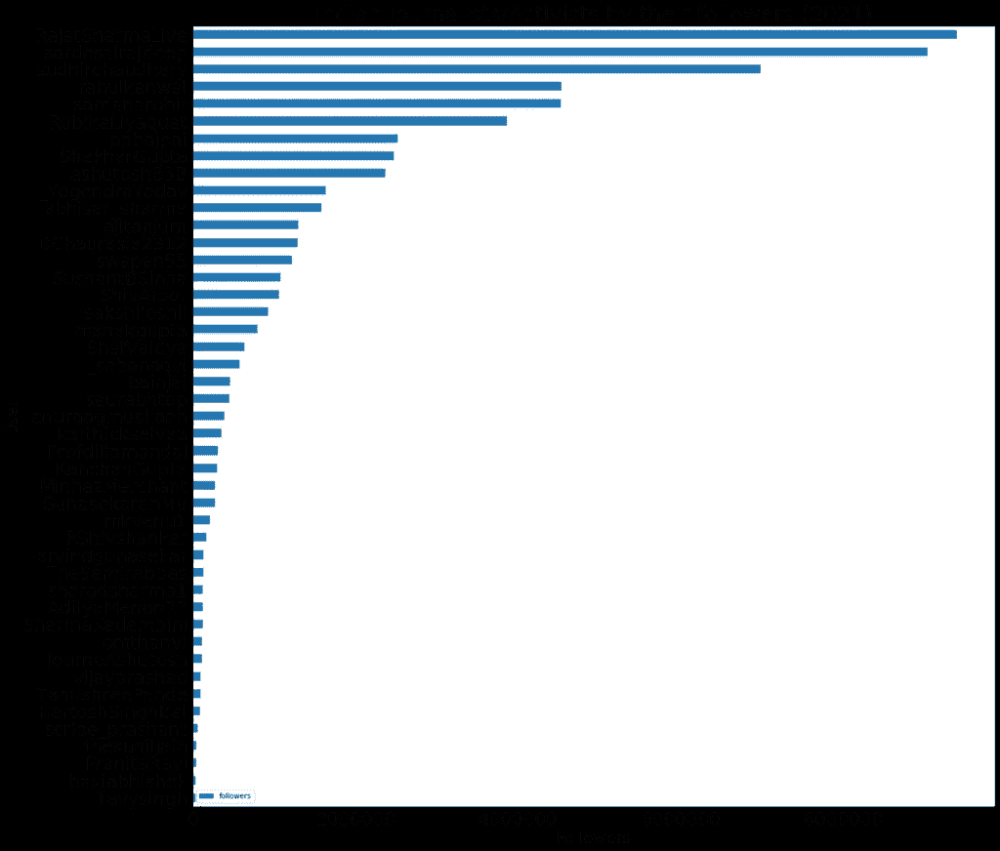
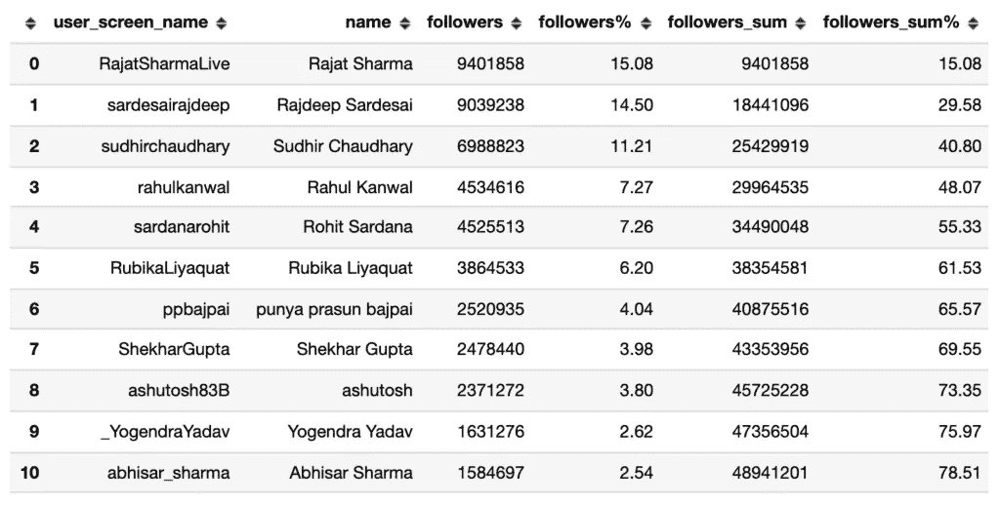
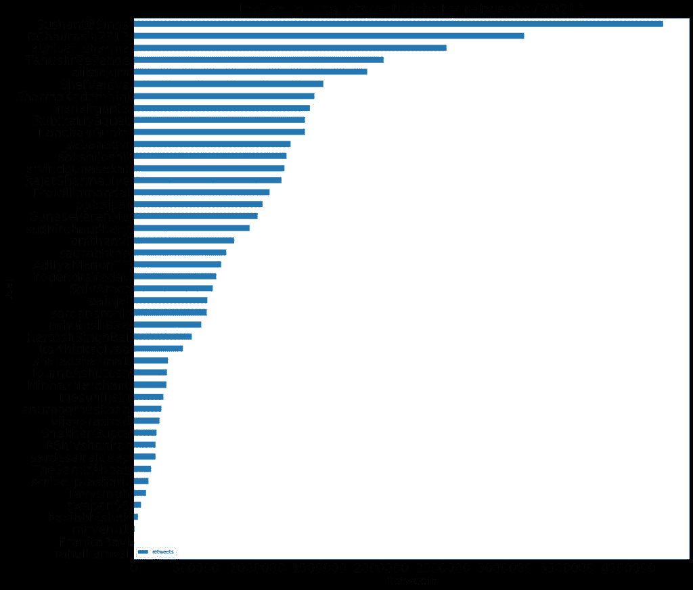
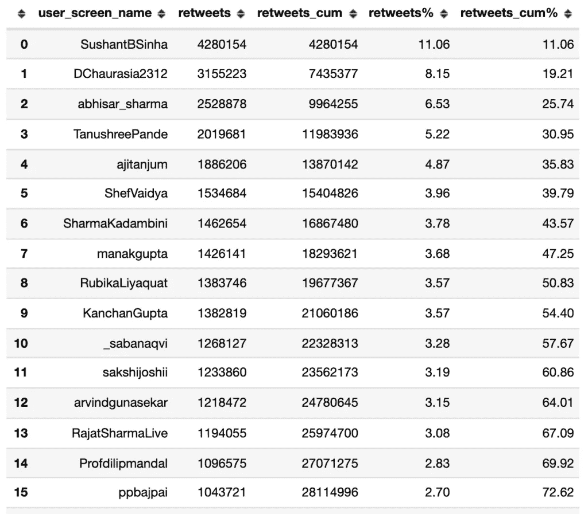

# 用数据解码推特上的印度新闻

> 原文：<https://medium.com/mlearning-ai/decoding-indian-journalism-on-twitter-with-data-1a98712067e0?source=collection_archive---------9----------------------->

注意:这篇文章最初是在我们的网站 ml-concepts.com 上写的。用这个[链接](https://www.ml-concepts.com/decoding-indian-journalism-on-twitter-with-data/)去贴吧。

> 如果你不读报，你是无知的，如果你读报，你是被误导的——马克·吐温

每个人都明白自由和公平媒体的重要性。有些人走得更远，甚至称之为充满活力的民主的第四大支柱，行政、立法和司法是前三大支柱。

随着所有公开可用的数据以如此快的速度被创建，我们现在有了一个可靠的机制来理解我们社会在宏观层面上的社会、政治和经济设计。我们还可以利用这些数据来了解我们的领导者是谁，以及他们如何影响我们和我们的系统。

在这篇文章中，我们将在 Twitter 上推出我们即将推出的关于理解和解读印度新闻的系列文章。这个系列是我们试图了解印度新闻界的名人录，他们的影响范围，网络和政治倾向。我们将努力了解谁是我们最有影响力的记者，他们的影响力到底有多大，他们彼此的立场如何。

在我们未来的一篇文章中，我们还将试图定义印度政治中的左翼、右翼和中间派，避免任何现成的定义。

我们还计划寻找对现有体制持批评态度的记者，并找出不持批评态度的记者。

谈到公共数据的可用性，Twitter 上有很多数据可以让我们深入了解我们的领导人如何相互交流，以及他们如何影响我们。为了完成这个系列，我们使用 Twitter 的开发者项目下载了大约 64 万条推文，包含前 200 名记者的 **3200 篇最新帖子。**

# 2021 年记者的粉丝排名

从数据中，我们发现前 10 名记者几乎占了 80%的追随者，而其他人加起来只有 20%。一旦你考虑到追随者之间会有明显的重叠，这就变得更加令人担忧，如果他们计划联合他们的努力，那么这 10 个把手会有更多的影响力。

这说明了印度新闻业是如何集中到仅仅 10 个人手中的。想象一下这 10 个顶尖人物塑造故事或掩盖故事的能力；他们的支持如何帮助政府或政党获得合法性。

# 2021 年记者的转发总量排名

令人惊讶的是，他们帖子的总转发量数据向我们展示了一个更加均匀的参与度分布。告诉我们一个略有不同的故事:我们没有看到少数账户手中有太多的集中度。这意味着尽管前十名拥有 80%的粉丝，但印度网民在 Twitter 上的参与度似乎更高一些。

这个帖子到此为止！请继续关注我们网站的下一篇文章【ml-concepts.com 

如果你对这项工作感兴趣，想帮助我们提出建议，或者想和我们一起研究数据，请通过评论框或者发邮件到 sourabharsh@gmail.com 联系我们。

 [## Mlearning.ai 提交建议

### 如何成为 Mlearning.ai 上的作家

medium.com](/mlearning-ai/mlearning-ai-submission-suggestions-b51e2b130bfb)