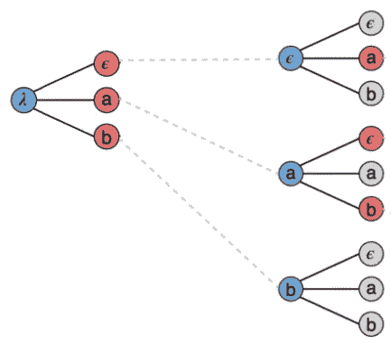

# 语言建模中的解码策略

> 原文：<https://medium.com/mlearning-ai/decoding-strategies-in-language-modelling-c5752710e31a?source=collection_archive---------7----------------------->

语言模型可以计算出词汇表中任何给定单词出现在输入序列之后的概率。但是他们如何选择实际输出哪一个呢？

How does the decoder choose the words “please”, “come” and “here” given the probability of every word in its vocabulary? Source: [GPT-3, RNNs and all that: A deep-dive into language modelling](https://towardsdatascience.com/gpt-3-rnns-and-all-that-deep-dive-into-language-modelling-7f67658ba0d5).

在高层次上，现代语言模型是这样工作的:你输入一系列单词，然后一个“编码器网络”逐个处理它们。该编码器网络的输出然后被传递到“解码器网络”,该“解码器网络”将输出单词序列。在每一步，解码器网络可以为它知道的词汇表中的每个单词分配一个概率。但是考虑到概率，你需要给模型一个策略来选择输出哪些单词。这种策略被称为**解码器策略**。

最简单的一个是**贪婪策略**:在每一步，简单地输出最可能的单词。

因此，在第一个绿色节点中，解码器 RNN 会为其词汇表中的每个单词分配一个概率，并简单地选择最可能的一个。这是一个很好的策略，它倾向于产生连贯的输出。但是如果应用程序类似于聊天机器人，你可能会发现这会产生相当无聊的对话。例如:

> **输入**:你觉得这本书怎么样？
> **贪婪策略输出**:耶没事。
> **输出更好**:我发现超级有意思。

贪婪搜索的一个简单变体是 **top-k sampling** :挑选一个数字 **k** ，取 k 个最有可能的单词和它们各自的概率。然后将概率归一化，并根据获得的概率分布对其进行采样。所以，不是每一步只取最有可能的单词，而是从 k 个最有可能的单词中选择，你如何选择是通过使用这些单词的标准化概率分布。例如，如果 k=5，归一化的概率是[0.45，0.25，0.2，0.05，0.05]，那么你会在 45%的时间里选择最有可能的单词，在 25%的时间里选择第二有可能的单词，等等……这就是 [GPT-J](https://www.infoq.com/news/2021/07/eleutherai-gpt-j/) ，EleutherAI 的 GPT-3 的开源替代品所做的。

理想情况下，我们可以计算每一个可能的输出句子(单词序列)的可能性。这就是**穷举搜索**:如果你想要 5 个单词的输出，把所有可能的 5 个单词的句子串在一起，给它们都分配一个概率，选择最有可能的一个。问题是，如果你的词汇表中有 n 个单词，你需要考虑 N⁵可能的输出。N 的典型值是 10000，因此计算量很大。

Beam search with beam width B=3\. For each possible word in the vocabulary {e, a, b} we consider the three most likely examples. Edited from [source](https://github.com/distillpub/post--ctc/issues/4).

采用这种想法并使其计算成本稍微降低的一种方法是进行**波束搜索**。这结合了上述所有策略的思想。挑梁宽度 **B** 。在输出的每一步:选择 B 个最有可能的单词，然后针对这 B 个可能性中的每一个，考虑 B 个最有可能的下一个单词。这样做，直到输出是所需的长度。然后计算每个可能输出的概率(如果我们输出 3 个单词，将有 B 种可能性)并输出最有可能的一个。

## **总之**:

*   解码策略是语言模型在知道概率后如何选择应该输出什么单词。
*   流行的解码策略包括贪婪搜索、top-k 采样和波束搜索。

**延伸阅读:**

*   [全面了解语言建模](https://towardsdatascience.com/gpt-3-rnns-and-all-that-deep-dive-into-language-modelling-7f67658ba0d5?source=your_stories_page----------------------------------------)
*   [通过构建对话式人工智能在实践中运用这些知识](/mlearning-ai/practical-introduction-to-language-modelling-f5337bc26c5)

 [## Mlearning.ai 提交建议

### 如何成为 Mlearning.ai 上的作家

medium.com](/mlearning-ai/mlearning-ai-submission-suggestions-b51e2b130bfb)