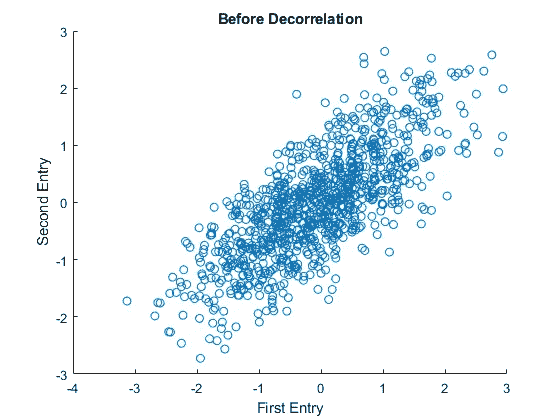
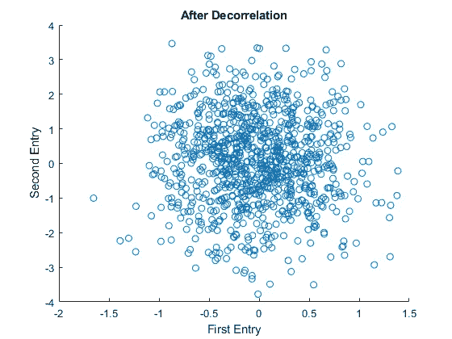
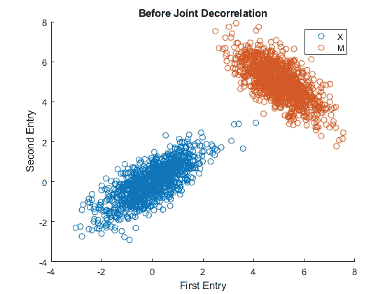
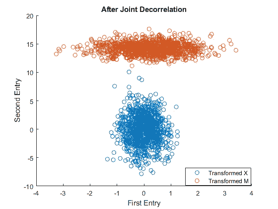

# 去相关高斯矢量

> 原文：<https://medium.com/mlearning-ai/decorrelating-gaussian-vectors-e7982c9a28e6?source=collection_archive---------3----------------------->

当我们处理随机向量/过程时，协方差和相关性是强有力的概念。高斯向量由其均值和协方差矩阵来描述。协方差矩阵向我们展示了向量中不同元素之间的关系。一些特定的高斯信号，如白噪声，具有不相关的样本，因此，协方差矩阵的非对角元素为零。然而，我们可能会经常遇到一些信号，它们的样本彼此相关，并且非对角线项不为零。在本帖中，我们将发现如何使相关条目不相关，以便我们可以获得非对角线条目等于 0 的协方差矩阵。

让我们创建 1000 个双变量高斯向量，其均值为[0 0]，协方差矩阵为[1 0.7；0.7 0.9].我们可以使用 MATLAB 上的散点图显示这 1000 个向量的分布如下。

```
N = 1000;
mu = [0 0];
sigma1 = [1 0.7;0.7 0.9];
X = mvnrnd(mu,sigma1,N);
X = X';figure()
scatter(X(1,:),X(2,:))
title('Before Decorrelation')
xlabel('First Entry')
ylabel('Second Entry')
```



正如我们所看到的，这个分布的主轴与主坐标轴不对齐。它源于向量元素之间有很强的相关性。让我们看看能否转换这些向量，使主轴与 x 轴和 y 轴对齐。为此，我们可以使用 MATLAB 的“eig”命令。这个命令给出了两个矩阵 V 和 D，它们对应于相关矩阵的特征向量和特征值。由于我们有零均值向量，我们可以用协方差来交换单词相关性。我们获得的 V 矩阵被转置并被选为去相关矩阵。(这个过程的推导留给另一篇文章)

```
[V,D] = eig(sigma1);
T = V';
y = T * X;
```

如果我们将这个测试矩阵乘以我们原始样本，我们将获得新的散点图和协方差矩阵，如下所示:

```
Sigma_Transformed = T * sigma1 * T’
Sigma_Transformed = 0.2482    0.0000
    0.0000    1.6518
```



现在主轴对齐，协方差矩阵的非对角线项为零。这仅仅意味着在去相关操作之后，每个向量具有不相关的元素。

让我们进一步展开讨论，看看能否通过一次变换使两种不同的分布去相关。我们可以称这个操作为联合去相关。除了之前创建的向量，我们再创建一个均值为[5 5]的分布，协方差矩阵为[0.7-0.5；-0.5 0.8].下面用不同的颜色绘制了这两种分布。

```
mu2 = [5 5];
sigma2 = [0.7 -0.5;-0.5 0.8];M = mvnrnd(mu2,sigma2,N);
M = M';figure()
scatter(X(1,:),X(2,:))
hold on
scatter(M(1,:),M(2,:))
hold off
title('Before Joint Decorrelation')
xlabel('First Entry')
ylabel('Second Entry')
legend('X','M')
```



这两种分布具有不同的均值和协方差矩阵。因为它们都有相关的条目，就像前面的例子一样，所以元素不与 x 和 y 轴对齐。此外，正如我们可以观察到的，红色分布与蓝色分布具有不同的主方向，因为它的互相关项是负的。

我们可以应用类似的程序在一个步骤中对这两个分布进行去相关。“eig”命令再次给出了特征向量，但现在它们被称为协方差矩阵的“广义特征向量”。与我们熟悉的通常的特征向量不同，广义特征向量用于联合描述两个矩阵。同样，这个过程的推导留给另一篇文章。

```
[F,D] = eig(sigma1,sigma2);
T_Joint = F';X_Transformed = T_Joint * X;
M_Transformed = T_Joint * M;figure()
scatter(X_Transformed(1,:),X_Transformed(2,:))
hold on
scatter(M_Transformed(1,:),M_Transformed(2,:))
hold off
title('After Joint Decorrelation')
xlabel('First Entry')
ylabel('Second Entry')
legend('Transformed X','Transformed M')
```



应用广义特征向量后得到的分布如上图所示。与前面的情况一样，两个分布通过单个变换矩阵与主坐标轴对齐。

我希望这篇文章能让你对相关性和解相关性概念有所了解。下一篇文章再见…

[](/mlearning-ai/mlearning-ai-submission-suggestions-b51e2b130bfb) [## Mlearning.ai 提交建议

### 如何成为 Mlearning.ai 上的作家

medium.com](/mlearning-ai/mlearning-ai-submission-suggestions-b51e2b130bfb)