# 深入学习

> 原文：<https://medium.com/mlearning-ai/deep-learning-3d22beb83edc?source=collection_archive---------0----------------------->

[机器学习的基本概念](https://www.youtube.com/watch?v=aUNnGCxvAg0&list=PL_iWQOsE6TfVmKkQHucjPAoRtIJYt8a5A&index=4)

机器学习算法试图模仿两个数据集之间的模式，使得它们可以使用一个数据集来预测另一个数据集。具体来说，监督式机器学习有助于将您所知道的作为输入，并快速将其转换为您想要知道的。另一方面，无监督学习也可以将一个数据集转换成另一个数据集，但是它转换成的数据集以前是未知或不理解的。与监督学习不同的是，没有“正确答案”表明您试图让模型复制。你只需要告诉一个无人监督的算法:“在这些数据中找到模式，并告诉我它们的情况。”

## 参数主义

参数化是关于学习的存储方式，并且通常是学习的方法。参数模型的特征是具有固定数量的参数，而非参数模型的参数数量是无限的(由数据决定；这适合于通常以一种或另一种方式计数的方法，因此基于在数据内被计数的项目的数量增加参数的数量)。碰巧，深度学习是一类参数模型。

1 受监督的参数学习机是具有固定数量旋钮(即参数部分)的机器，其中通过转动旋钮进行学习。请注意，每个旋钮代表预测对不同类型输入数据的敏感度。当你“学习”时，这就是你正在改变的。输入数据进入，根据旋钮的角度进行处理，并转换成预测。试错的概念不是正式的定义，但它是参数模型的一个共同属性(有例外)。当有任意(但固定)数量的旋钮要转动时，需要某种程度的搜索来找到最佳配置。在监督学习中，有一个重要的区别需要学习:特征是输入集中的一列数据。例如，如果您试图预测某人将选择的宠物类型，您的输入特征可能包括年龄、家庭区域、家庭收入等。另一方面，标签是最终的选择，如狗、鱼、鬣蜥、岩石等。一旦你训练了你的模型，你将会给它包含这些特征的新输入；它将返回该人的预测“标签”(宠物类型)。

2 无监督参数学习使用旋钮对数据进行分组，当发现有新的东西需要计数时，添加新的旋钮。但在这种情况下，每个组通常都有几个旋钮，每个旋钮都将输入数据的相似性映射到该特定组(有例外和细微差别——这是一个高级描述)。

**统计分类**

在统计分类中，两种主要的方法被称为**生成**方法和**鉴别**方法。这些通过不同的方法计算分类器，在统计建模的程度上不同。术语不一致，但可以区分两种主要类型:

*   给定一个可观察变量 *X* 和一个目标变量 *Y* ，一个**生成模型**就是联合概率分布的统计模型。
*   **判别模型**是目标 *Y* 的条件概率模型，象征性地给出一个观察值 *x*

类似地，基于生成模型的分类器是**生成分类器**，而基于鉴别模型的分类器是**鉴别分类器**，尽管该术语也指不基于模型的分类器。

尽管这种形式上的生成与鉴别的定义被广泛使用并且非常有用，但当你考虑到它实际上是一个**光谱**，你甚至可以在其中平滑地插值，并且许多流行的模型不完全属于这种二分法时，它就开始分崩离析了。此外，它假设有监督的学习设置，对于分类无监督或半监督的方法不太有用。

一个更一般(但更非正式)的定义来补充它可能是:

*   判别模型学习类之间的边界
*   生成模型了解数据的分布

不管精确的定义如何，该术语是构成性的，因为生成模型可用于“生成”随机实例，而鉴别模型或鉴别分类器可用于“鉴别”目标变量 *Y* 的值，给定观察值 *x* 。

关于监督模型、非监督模型、生成模型和判别模型之间的关系，有几点值得一提:

1.  并非所有的生成模型都是使用无监督学习来学习的。许多生成模型——从像朴素贝叶斯这样的基本模型到像 GAN 或这种生成上卷积网络这样的复杂模型——都是以监督或半监督的方式学习的。
2.  不是每个无监督学习算法都是生成模型。无监督学习算法属于所有的**生成-判别谱**，例如，k-最近邻(kNN)介于生成和判别(正式生成，非正式判别)之间。
3.  许多聚类算法是生成模型，例如潜在狄利克雷分配(LDA)。
4.  并非所有的判别模型都是使用监督学习来学习的。存在在无监督数据集上训练的判别模型，例如单目深度和光流模型。
5.  每个监督学习算法都是一个判别模型。有一些带有生成模型的监督学习算法的例子(例如，朴素贝叶斯)。

## 一些概率论

让我们更精确地定义监督学习。我们假设在训练过程中，我们得到了一个数据集:

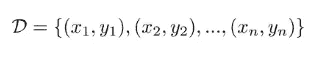

Training set consisting of tuples; the **y’s** are the true labels corresponding to the **x’s.**

例如，如果我们想解决一个图像分类问题，我们会收集一些狗、猫和长颈鹿的图片，然后我们会让人类浏览这些图片中的每一张，并给它们贴上真正的标签。我们将把它作为训练数据来学习如何对新图片进行分类。因此，监督学习的目标是学习这个函数:

We want to learn theta (θ, the parameters) so that this function closely approximates the true label **y.**

然而，要实例化一个监督学习方法，我们必须回答几个问题。一个重要的出发点是**预测概率通常比预测离散标签更有意义。**

1.  如果我们被允许有概率，我们就能更好地表达我们认为真实发生的事情；我们也许能够捕捉到这样一个事实，即 4 很可能是 4，但它也很有可能是 9。这种不确定性可能对决策有用。
2.  如果我们被允许有概率，问题会变得更简单:直觉上我们不能改变一个离散的标签一点点，它是一种要么全部要么什么都没有。然而，找到最佳θ的问题变得更容易，因为我们可以稍微改变这些概率，看看它们是否朝着更接近我们想要的方向变化。

因此，给定一个训练集，而不是学习一个将 x 映射到 y 的函数，现在我们将学习一个将 x 映射到 y 上的分布的函数:

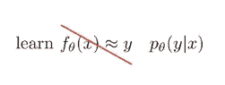

现在，我们将接受我们的输入，例如一只狗的图片，并输出其对应标签 y 的分布。

**复习条件概率**

随机变量被定义为一个函数，它为每个实验结果赋值。我们有:

*   输入 x
*   输出 y

我们可以把 x 和 y 的联合概率写成 p(x，y)。**联合概率**是一种统计方法，计算两个事件在同一时间点同时发生的可能性。换句话说，联合概率是事件 Y 与事件 X 同时发生的概率。

联合概率不应与条件概率相混淆，条件概率是在另一个动作或事件发生的情况下，一个事件发生*的概率。*

事实上，联合概率 p(x，y)可以使用概率的链式法则来分解:

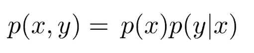

概率的**链规则**，不要与微积分的链规则混淆，允许仅使用条件概率计算一组随机变量的联合分布的任何成员。

事实上，你也可以改写上面的等式，将两边除以 p(x ),得到条件概率的定义:

所以如果你知道 p(x)和 p(x，y ),你可以恢复你的条件概率。

**监督学习**

我们将重点学习 p(y|x)。为了做到这一点，我们将使用“机器学习方法”，这是一个三步程序。这种分解学习问题的方式与 Marr 的分析水平密切相关:

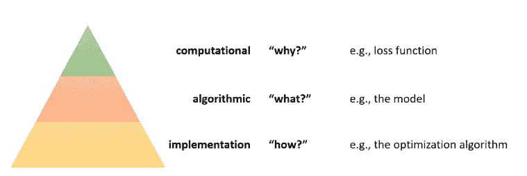

我现在将列出机器学习方法的三个步骤及其相应的 Marr 水平。

**1 定义你的损失函数:**你如何衡量一个特定的模型有多好？这个问题关系到金字塔的计算层面。

**2 定义你的模型类:**你将如何表现你的程序？这个问题关系到金字塔的中间:算法层。换句话说，我们要进行优化的结构是什么？

**3 选择一个优化器:**你将如何在模型类中搜索以找到最小化损失函数的模型？这个问题关系到金字塔的实现层次。

我们做出这些区分的原因是，当我们有这些不同层次的分析时，它可以帮助我们划分我们的思维，帮助我们建立抽象概念，这样我们就可以孤立地解决问题。

我们将从金字塔的中间开始，思考我们对问题的表述。

## 1 我们如何表示 p(y|x)？

例如，假设我们有这样的输入:

而我们的目标是把它映射到概率上，它是一个 0 到 9 之间的整数。

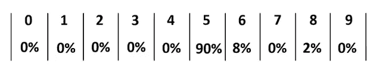

**有效的概率分布由总和为 1 的正数组成。**

让我们看一个简单的例子:

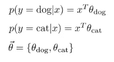

上图我们说*y 是狗的概率(以 x 为条件)构造为“x”转置“θ狗”；y 是猫的概率(以 x 为条件)构造为“x”转置“θcat”；参数由“θ dog”和“θ cat”串联定义。*

然而，这个程序没有输出一个有效的概率分布:一般来说，p(y = dog) + p(y = cat)的和不会是 1，除非非常非常仔细地选择θs。因此，我们违反了约束。

让我们来解决这个问题:不是让“x”转置“θ dog”等于 p(dog)，我们要定义它等于某个函数 f dog(x)；因此，我们在程序中有一些中间函数:

Take outputs from f dog and f cat, run them through a softmax

softmax 将接受 f dog 和 f cat，它将强制这些数字都为正数，并且总和为 1。理论上，它可以是任何双射(一对一和到上)函数，因为您想要一个使用您给定的输入的函数。

从定义域到值域的函数 f 是双射的，当(1)值域中没有一个元素是定义域中一个以上元素的像(2)值域中的所有元素都被使用。

但是除了这个条件之外，为什么我们可以使用很多不同的函数来使这些数字为正并且总和为 1 呢？

在机器学习中选择你的函数并不意味着产生正确的答案；通过选择正确的参数，你可以得到正确的答案。函数只需要足够通用，以便存在代表正确答案的θ选择。

It takes all of its inputs. it exponentiates them and then it divides by their sum; in this example, we see the dog output.

一般来说，你可能有 n 个标签(不仅仅是一只狗), p (y|x)可能是一个有 n 个元素的向量，每个可能的标签有一个元素:

有一个函数 f θ(x ),它是一个向量值函数，有 n 个输出，可能不是正的，也可能不是 1:

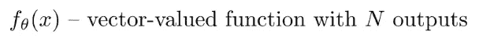

所以 softmax 会处理好这个问题:

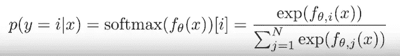

它唯一的工作是使数字为正数，并使它们的总和为 1。

## 2 我们如何选择参数θ？

到目前为止，我们已经有了一个将输入映射到输出的计算机程序的图像；我们已经决定，我们的输出应该是概率，我们将使用 softmax 来产生这些概率。

为了开始考虑定义我们的损失函数，让我们从一个更基本的问题开始:我们的数据集是如何生成的？如果我们的数据集由图片和它们相应的标签组成，那么产生这些图片的实际过程可能相当复杂，涉及光子和人们对拍摄什么的决定等等。

当试图对其建模时，我们可以提出一个非常粗略的模型:我们将把它表示为一个随机过程；在照片上存在一些 p(x)分布，并且当人们拍照时从 p(x)随机取样。

并且标签“狗”是从标签上的一些分布中取样的，这不是完全随机的并且取决于照片:

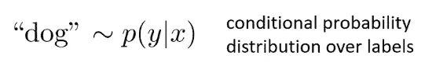

通过概率的链式法则，我们可以合成这两个样本，并从它们的联合分布 p(x，y)生成样本(x，y):

我们的数据集是从这个分布中采样的，由许多元组(x，y)组成，这些元组是根据分布 p (x，y)生成的。

说得更正式一点，看到特定训练集的概率是多少？我们需要假设不同的数据点是如何相互关联的。**我们要做的假设是，我们正在处理独立且同分布的数据。**

*   独立意味着每个(x，y)元组独立于每个其他(x，y)元组，这意味着如果你为 x1 观察一只猫，这不会改变你为 x2 看到一只猫或一只狗的可能性
*   同分布意味着每个(xi，易)来自同一个分布。

如果我们有这个假设，我们知道我们可以写出概率 p(D)把一个特定的训练集看作是 p(xi，易)的所有 I 的乘积。

为什么？因为“独立”意味着联合 p(D)是作为边数 p()和 p(yi)的乘积而形成的。

换句话说，如果你掷硬币两次，第二次掷硬币时看到正面的概率不取决于第一次掷硬币时看到正面的概率。所以如果你想知道连续两次正面朝上的概率，你只需要用第一次正面朝上的概率乘以第二次正面朝上的概率。因为它是同分布的，这就相当于把正面的概率取平方。

我们有一个与数据集相关的概率。由于我们正在学习 p(y|x ),我们可以使用概率链规则分解上面的公式:

现在，我们有了一个与数据集相关的概率，它被表示为 p(xi)乘以 p(易|xi)的所有数据点的乘积。我们正在学习的是(y|x)的 pθ。需要注意的是，这是学习过的函数，它取决于我们的参数:这是真实 p(y|x)的模型。当然，这并不是标签与图像联系起来的真实过程，而是这个过程的一个模型。我们将努力让这个模型尽可能精确。

**一个好的模型应该使数据看起来是可能的:一个θ比另一个θ更好，如果相应的 p θ(y|x)使整个数据集看起来更可能，并增加 p(D)** :

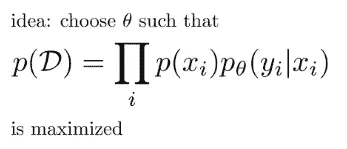

然而，这里的问题是，我们将这个概率 p(D)表示为一堆介于 0 和 1 之间的其他概率的乘积:如果你将数百万个介于 0 和 1 之间的数相乘，你将得到一个非常非常接近于 0 的数。本质上，这一目标在数字上具有挑战性。

我们可以取 p(D)的对数。当你对一个乘积取对数时，你会得到对数的和:

但是由于 p(xi)不依赖于θ，我们可以只把它当作一个常数:

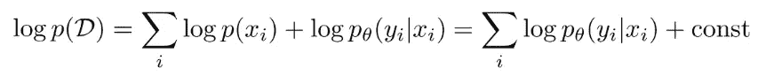

**我们可以等价地说，我们的目标是 p θ(yi|xi)的对数的所有数据点加上一些不依赖于θ的其他东西的和。**

我们可以将学习θ的问题公式化为寻找使 log p(D)最大化的θ的尝试:

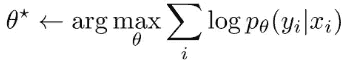

This is called maximum likelihood estimation (MLE), because this log probability is the likelihood and we are choosing θ to maximize the likelihood

很多时候，我们会把它写成最小化(这只是一个惯例):

This is also called the cross-entropy

我们还是想把 log p(D)最大化，等于说我们想把负的 log 概率最小化。这是我们的损失函数，它量化了θ有多差。

还有其他方法可以量化θ有多差。例如，你可能会有 0-1 的损失:它只是说，如果你得到了错误的答案，你会损失 1，如果你得到了正确的答案，你会损失 0:

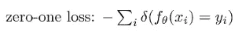

如果你在做一个连续回归问题，你可能会有一个均方误差损失:

如果您要预测一个连续的数值，您可能希望尽可能地接近该数值。

## 3 我们如何选择优化器？

现在，我们必须弄清楚如何找到使损失函数最小的θ设置。想象优化算法时，有助于思考的一件事是所谓的损失景观。你可以把损失景观想象成损失函数的一个情节。L(θ)表示损失函数。

假设θ是 2D:你可以想象一个横轴为θ1 和θ2 的图。纵轴代表函数 L(θ)。只要看一眼，你就知道最佳θ在哪里:就在那个碗的底部。

我们希望找到损失函数减小的方向，并在该方向上移动θ。算法的一个非常概括的草图是:

找到方向 v，使 L(θ)减小，然后选择新的θ，即旧的θ加上某个速率α乘以 v，α是某个小常数，也称为学习速率。然后，我们重复这个过程足够的次数，我们将有希望在最低限度内稳定下来。

有趣的是，最陡下降的方向实际上并不总是最佳选择，但所有这些方法的共同点是，它们都将朝着 L(θ)至少局部减小的方向移动。

从数学上来说，我们将一个方向表示为一个有 n 个条目的向量，这些条目指向 L(θ)将减小的方向。在 1D 更容易想象:

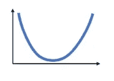

如果我位于某一点，函数在该点的斜率告诉我它朝哪个方向减少。如果斜率为负，函数向右递减；如果斜率为正，则函数向左递减:

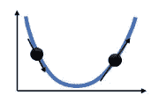

仅仅从斜率来看，我们就可以知道该走哪条路来减少函数，同样的直觉也适用于更高维度。一般来说，对于每个维度，我们应该沿着与该维度的斜率相反的方向前进。

什么是斜坡？斜率只是导数。我们所做的就是把每一维的方向设为函数 L 对θ的偏导数的负值。

在 2D，V1 当时是:

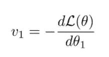

V2 是:

这些不是θ减小的唯一方向:事实上，有整个半个向量空间编码了θ减小的方向。所以，这些偏导数给你最陡下降的方向，但是如果你向左或向右一点，θ还是会下降。当然，如果反方向走，θ会增大。只要你和 v 有正的点积，你就会往 L(θ)减小的方向走。这是说，它不是一个独特的学位结构:它是最陡的，并不一定意味着它是最好的。

一个非常有用的概念叫做梯度，它的符号是∇.∇是一个矢量；向量的每一维都是我们的函数相对于θ的对应维的偏导数。

The gradient is formed by taking partial derivatives and stacking them up in a vector

下面是梯度下降算法的示意图:

1.  计算梯度步长
2.  将θ设置为:

因此，我们选择了优化器。

## [经验风险最小化](https://www.youtube.com/watch?v=PBYWWM9We-0&list=PL_iWQOsE6TfVmKkQHucjPAoRtIJYt8a5A&index=8)

一些人在进行监督学习时表示，他们正在将经验风险降至最低。

让我们回想一下零一损失，它为正确分类的损失分配 0，为不正确分类的损失分配 1

你可以把风险想象成你会犯错的概率。回想我们的生成过程:有人拍照。这是从图片分布中随机抽取的图片。它具有从标签的真实分布中采样的标签。鉴于这种情况，我们对或错的可能性有多大？

你弄错的概率只是零一损失的期望值。概括到其他损失，风险是该损失的预期价值。

如果我们使用负对数似然法，我们可以说风险是 x 上真实分布下的期望值和 y 上真实分布下的损失，即 x 和 y 以及我们所学的θ:

风险是我们希望最小化的。然而，我们不能计算真正的风险，因为我们不能得到无限的样本。相反，我们得到了一个数据集 d。因此，我们可以计算的是经验风险，这是对真实风险的基于样本的估计。您可以通过对所有样本的损失进行平均，得到这种基于样本的估计。

The empirical risk approximates the true risk

经验风险是真实风险的良好近似吗？有两种情况下我们可能会遇到麻烦。

1.  **过度拟合**发生在经验风险较低但真实风险较高的时候。这意味着您在训练集中的平均损失较低，但您损失的真实期望值并不低。

假设我正在尝试拟合这条线，点与我的训练数据相对应:

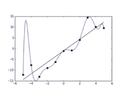

Overfitting

高次多项式将完美地拟合点，并导致非常低的经验风险，因为它正好通过点。然而，它的真正风险将是相当高的。这可能发生在(1)数据集太小或(2)模型太强大且参数太多的情况下

2.当经验风险与真实风险匹配时，就会发生投资不足，但两者都很高。

例如，这里真正的函数是某种曲线，但是我们选择了拟合一条线，而这条线并没有足够的力量来拟合这条曲线。

Underfitting

这可能发生在(1)如果模型的参数太少，或者(2)如果优化器配置得不好。

让我们试着从数学上理解什么是过度适应和不足适应。为了做到这一点，我们将重点关注回归——这意味着您正在根据您的输入预测一个连续变量或一个连续分布。

回归基本上是曲线拟合:

你有一些连续或离散的输入，你有一个连续的输出，你想预测输出。例如，你在预测狗有多大，有多重，房子有多贵，等等。

如果我们想采用概率方法，为了进行回归，我们需要一个连续值的概率分布来输出 y。有许多概率分布可以用来表示实数，但一个非常简单的选择是正态或高斯分布。

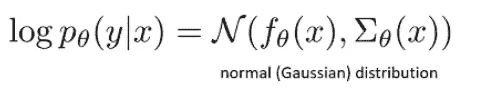

正态分布由两个参数定义:均值和方差。但是当然，我们想要解决一个预测问题——我们想要预测给定 x 的 y 上的分布，在我们的例子中，我们将有一个条件高斯分布；换句话说，该高斯分布的均值和方差本身就是 x 的函数。正态分布的对数概率可定义为:

这看起来像一个很大的等式，但它实际上由三个简单的东西组成:

*   **第一项**就是 f θ(x)和 y 之差，但是在 sigma 定义的特定范数下。*它在问均值 f θ(x)与真实标签 y 有多接近*
*   **第二项**(西格玛行列式的负 1/2 对数)试图使方差更低。它的意思是:*如果你能准确地拟合真实的 y，尽量使用较低的方差。*
*   **第三项**是一个不依赖于 x 或 y 的*常数*

如果我们不去学习 sigma，并将其固定为单位矩阵，那么正态分布就会减少到 f θ(x)与 y 之差的平方，再加上某个常数:

很多时候，当我们谈论回归时，我们选择的特定分布是正态分布，但我们选择σ作为恒等式，然后这个正态分布的对数正好对应于 f θ(x)和 y 之差的平方。

简化后，它与均方误差(MSE)损失相同:

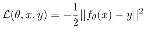

MSE 损失也是协方差 sigma 设置为恒等的正态分布的对数概率。如果你有一个线性模型，那么最小化 MSE 损失就相当于传统的线性回归。因此，本文中的分析将针对 MSE，但请记住，它可以扩展到其他损失。

现在，让我们试着更正式地理解过度拟合和欠拟合。这里的问题是:**对于不同的训练集，误差是如何变化的？**

这个问题是合理的，因为直觉上我们希望以这样一种方式进行分析，即我们理解我们算法的过度拟合或欠拟合趋势，而不管它是在哪个特定数据集上训练的——因为对于给定的数据集，我们可能会幸运或不幸。我们想知道，平均而言，对于从特定数据分布中采样的数据集，我们的算法是否会产生正确的答案？

这就是为什么这个问题如此重要。假设这条黑色曲线是我们的真实函数，这些蓝点代表一个特定的训练集:

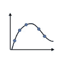

当我将模型与训练集相匹配时，我得到了橙色曲线:

在这里，经验风险低是因为橙色曲线直接穿过蓝色圆圈。然而，真正的风险很高，因为橙色曲线与黑色曲线非常不同。这太合身了。

现在想象我有一组不同的蓝点。我有同样的真函数，学习问题没有改变，x 和 y 上的分布也没有改变。唯一的区别是，我从相同的分布中抽取了不同的数据集。

如果您查看第二个和第三个数据集，您可能会得到以下一些多项式回归:

它们都是过度拟合的，它们都有较低的经验风险和较高的真实风险，但关键的是所有的橙色曲线都互不相同。这是一个非常重要的观察。**当我们过度拟合时，我们会看到不同的训练集——即使它们来自相同的分布——会导致非常不同的解决方案**。这是不可避免的，因为为了过度拟合，我们必须获得低经验风险(橙色曲线必须穿过蓝点)和高真实风险(它无法匹配黑色曲线)；所以当我们移动蓝点时，橙色曲线必须在不同的地方。总而言之:

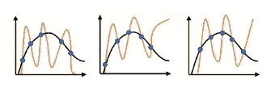

另一方面，如果你感到不适应，你的经验风险很高，你的真实风险也很高。你的体能在不同的训练组合之间不会有太大的差异:

事实上，如果您将这三个数据集聚合在一起:

对该聚合数据集的线性拟合可能看起来与它对单个数据集的拟合非常相似:

如果我们变得不适应，那意味着我们的模型不够强大；它没有足够的自由参数来精确拟合我们的函数，并且它没有利用训练集中存在的所有信息。因此，当训练集改变时，它不会改变太多，因为它不会提取所有信息

概括地说，在过度拟合中:

(1)训练数据拟合得非常好(2)真实函数拟合得很差(3)学习的函数每次看起来都不同

在欠拟合中:

(1)训练数据拟合不佳(2)真实函数拟合不佳(3)即使我们将所有数据集放在一起，学习到的函数看起来也相似

现在让我们更精确地计算一下。我们将写下误差的期望值，给定数据集的分布。所以，我们不是对 x 或 y 取一个期望值，而是对数据集 D 取一个期望值，如果我们能写出 D 的概率:

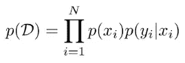

然后我们可以得到 D 的一个函数的期望值:

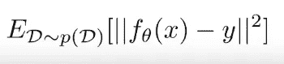

fθ(x)和 y 之间的误差的期望值是多少？

这里的 fθ(x)是在 D 上训练的，但 D 是一个随机变量。这不是一个衡量特定 fθ(x)的平均误差的表达式，它实际上是衡量你的训练算法的预期误差。对于 D 的每个值，你会得到不同的 fθ(x):这实际上是 D 的函数，现在，D 进入你的学习算法，产生一个θ，然后我们来看看它的误差。

换句话说，在预期中，如果我给你无限多的数据集，你分别在每个数据集上训练，你的平均误差是多少？当然，这只是一个理论上的练习:在实践中，当我们做机器学习时，我们只得到一个训练集。

上述等式也可以写成:

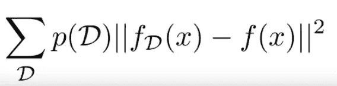

F(x)是真函数；fD(x)是我在 d 上训练得到的函数。

正如你可能知道的，某个函数的期望值，就是随机变量的所有值的和，这个值的概率乘以这个函数的值。在这种情况下，期望值是该数据集的概率乘以 fD(x)和 f(x)之间的平方差的所有可能数据集的总和。

然后我们可以得到这个误差的期望值，我们可以把它分成两项，把责任归于这两项。我们可以责怪其中一个人过度适应，也可以责怪另一个人不适应。

为了方便表示，我将使用 f bar (x)来表示 fD(x)的期望值。重要的是，f bar (x)是所有可能的函数的平均值，你将得到所有可能的数据集的加权概率

这并不是说 fD(x)就是你拥有无限数据时得到的结果，因为每个单独的 fD(x)仍然适合特定的有限大小的训练集，但你将它们的预测平均在一起。

现在，我们要用这个等式来计算预期误差，在正方形内，我们要减去 f 条，加上 f 条。

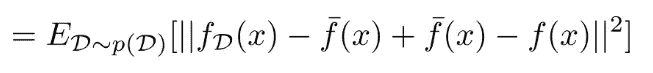

然后，我将在前两个术语周围加上括号，在第三和第四个术语周围加上括号。

现在我要计算这个量的平方:

第三项最终被抵消了，因为这一项:

不依赖于 d，因此，通过线性期望，我们可以把它取出来。此外，这个术语:

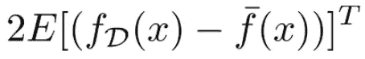

也最终等于 0，因为 f bar (x)表示 fD(x)的期望值；因此，fD(x)减去 f bar (x)的期望值等于 0。

现在，我们只剩下前两个术语:

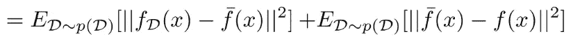

第一项是方差。注意这第一项实际上没有 f(x ),所以这与真正的函数无关；这是量化我们的预测随数据集变化的程度。换句话说，对于不同的训练集，fD (x)变化有多大？

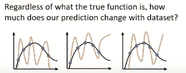

在第二项中，我们可以完全删除预期，因为 f bar (x)减去 f(x)不依赖于 d。它只是你所有预测的平均值(f bar (x))和真实函数 f (f(x))之间的平方差。我们称之为偏差，技术上是偏差的平方。偏差本质上量化了你得到的平均预测与真实函数的差距。

在这种情况下，偏差相当大。无论我们有多少数据，这个误差都不会消失，因为它量化了我们参数化不足的程度。

完全误差就是方差加上偏差的平方。因此，这两个术语解释了过拟合和欠拟合。

所以，如果方差太高，那么你的数据太少或者函数类太复杂:**过拟合**。另一方面，如果偏差太高，那么你就有一个不够复杂的函数类:**欠拟合**。

一旦我们认识到我们的误差是由方差和偏差组成的，那么我们就知道要得到一个运行良好的算法需要调节偏差和方差之间的平衡。了解哪个项大，哪个项小非常重要，因为我们用于减少方差的许多故障排除技术实际上会增加偏差，反之亦然

## 正规化

让我们来谈谈如何权衡偏差和方差:神经网络的一个关键思想是，它们使用“太复杂”的模型——复杂到足以适应数据中的所有噪声。然后需要“调整”它们，使模型足够复杂，但又不太复杂。模型越复杂，它就越适合训练数据，但如果太复杂，它就不能很好地概括；它会记住训练数据，但对未来的测试数据不太准确。

1.  获取更多数据解决差异。你拥有的数据越多，你就越不会过度拟合，你遭受的方差也就越小。获得更多的数据通常不会提高偏倚:

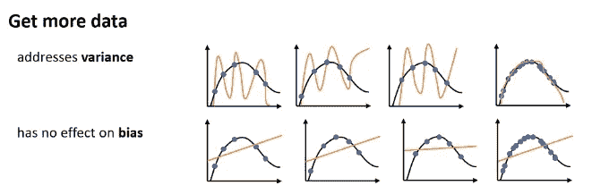

2.你可以改变你的模型类。比如你可以把你的 12 次多项式，改成线性函数；这可能会减少方差，增加偏差。但这是一个非常离散的选择。**理想情况下，我们想要更平滑地限制模型类的东西。**我们想为复杂性构建一个连续的旋钮。这就是正规化发挥作用的地方。

非正式地，正则化是我们添加到损失函数中的东西，通常是为了减少方差，尽管并不总是这样。理解正则化最简单的方法之一是通过贝叶斯解释，它将正则化视为关于我们参数的先验信念。

贝叶斯观点的高层次直觉是，当我们有高方差时，这是因为数据没有给我们足够的信息来识别参数。如果我们只有五个数据点，并且有一个 12 次多项式，那么函数是欠定的:有许多不同的 12 次多项式非常适合这五个数据点。

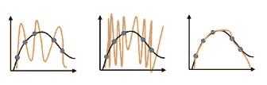

因此，我们需要以某种方式为算法提供更多一点的知识；由于数据中没有足够的信息，我们可以通过损失函数提供一些。我们需要回答这个问题:**给定数据集 D，最可能的参数向量θ是什么？**

换句话说，这个问题关系到你对这个领域的了解。在这种情况下，你可能有理由相信，对于你的问题，第三个函数更可能是一个好的选择。**贝叶斯观点试图构建整个学习问题，即如何从 D 中概率地得到θ。**

d 只是一组(xi，易)元组:

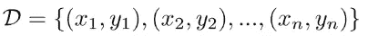

如果你想知道给定 D 时θ的分布，你可以应用条件概率的定义:

Up to a constant, this is equivalent to p(θ,D).

根据概率的链式法则，我们可以将其分解为:

这应该让我想起来了。根据 IID 假设，给定θ，D 的概率可以分解为所有数据点的乘积:

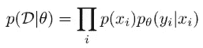

p(θ)呢？这是我们的副院长。这表达了θ是先验的可能性，甚至在看到你的训练集之前。

例如，甚至在没有看到数据集 D 的情况下，如果您认为对于您的特定问题，更平滑的函数更有可能，您可能会说第二个函数是更好的候选:

另一方面，如果您认为尖峰函数更有可能，那么第一个函数是更好的候选函数。

假设我们使用第二个函数。基于这个先验知识，我们如何建立一个先验，使得平滑函数更有可能？在回答这个问题之前，请注意我们现在有一个不同的损失函数:

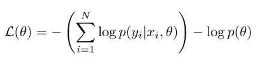

第一部分正是我们习惯的负对数似然。现在，我们简单地从负对数似然中减去先验。

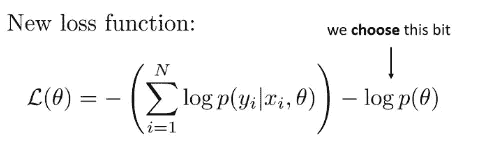

同样，我们必须选择先验，这是一个并非来自数据的设计选择。我们之前认为。

换句话说，由于系数小的多项式不会导致大的尖峰，什么样的分布会给小数字分配更高的概率？

有很多种分布可供我们选择，但一个非常简单的选择是使用正态分布，它将大部分概率分布在接近于零的小数字上。有多近？这是由方差决定的。我们选择的方差越小，函数出现尖峰的可能性就越小。

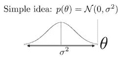

以下是均值为零的正态分布的对数概率表达式:

第二项和第三项不会影响θ，因此我们可以忽略它们，将它们表示为一个常数值。我们可以这样重写这个先验:

Lambda 是 sigma 平方的 1/2 倍，但我们不关心它的精确值，因为我们只是将它作为一个超参数，我们必须选择它，以便算法能够很好地工作。因此，我们新的损失函数是:

这和我们之前的目标是一样的。我们所做的就是在交叉熵损失函数 l 中加入一个二次惩罚项。

一种常见的替代选择是 L1(或“套索”)正则化，它使用的惩罚是 DLN 中所有权重的绝对值之和，从而产生以下损失函数:

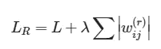

这也有利于小数字，但它有恒定的斜率(不像平方函数，斜率越来越大):它鼓励向量θ中尽可能多的元素为零，换句话说，它鼓励稀疏解。

另一个用于深度神经网络的正则化子叫做 dropout。在辍学中，我们在训练过程中实际上放弃了一些神经元。在整个训练过程中，在每次迭代中，在计算下一层之前，标准丢弃会将每一层中节点的一部分(通常为 1/2)置零。随机选择不同的子集来剔除会在过程中引入噪声并减少过拟合。在训练期间，退出会降低模型的容量，因此作为一般实践，在使用退出时会使用更宽的网络。如果你使用一个随机概率为 0.5 的辍学，那么你可能要加倍该层中隐藏神经元的数量。

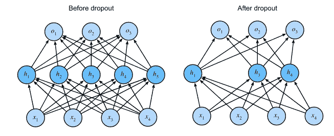

**为什么要多层？**

XOR 问题是在给定两个二进制输入的情况下，使用神经网络来预测 XOR 逻辑门的输出的问题。如果两个输入不相等，XOR 函数应该返回真值，如果相等，则返回假值。XOR 是一个分类问题，并且其预期输出是预先已知的。感知器是一种前馈网络，只能用一条线来分隔数据点。这是不幸的，因为 XOR 输入不是线性可分的。这个问题的解决方案是通过添加一个额外的单元层来扩展到单层体系结构之外，该单元层没有对外界的任何直接访问，称为隐藏层。这种架构是另一种被称为多层感知器(MLP)的前馈网络。一般来说，深度神经网络在学习复杂函数时往往惊人地强大，而不会牺牲泛化能力。深度学习背后的一个核心直觉是，深度网络通过学习内部表征来获得它们的力量。

深度学习完全是关于创建中间层，其中中间层中的每个节点代表输入的不同配置的存在或不存在。这样，如果输入的是一幅猫的图像，没有单独的像素必须与照片中是否有猫相关联。相反，中间层将尝试识别可能与猫相关或不相关的不同像素配置(例如耳朵、猫眼或猫毛)。许多类猫配置的存在将为最终层提供正确预测猫存在与否所需的信息(相关性)。你将训练一个神经网络，通过观察所有单独的数据点和*搜索相关性*来学习模式。

## 我们如何选择超参数？

这个想法是，我们把数据集分成训练集和验证集。通常，训练集可能是数据集的 80/90%,用于选择(1)参数θ(通过优化)和(2)那些影响优化的超参数，如学习率。

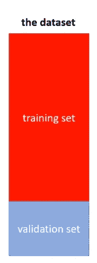

这是训练损失，它取决于 D 训练:

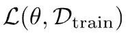

另一方面，验证集不用于训练；我们将使用它来做出设计您的方法所需的任何其他选择。具体来说，它用于选择(1)模型类(2)正则化子的超参数(3)要使用的特征。验证损失为:

这种损失将使我们能够诊断过度拟合和不足拟合。为什么？因为训练损失是你的经验风险，而验证损失使用的数据没有用于训练，因此是真实风险的无偏估计。通过比较这两个损失，你可以确定你是否过度拟合或拟合不足。

您通常会使用的机器学习工作流是:

1 在训练集上训练你的参数θ。

如果训练损耗不够低，说明你训练不足。为了减少欠拟合，您可以(1)减少正则化(2)改进您的优化器。

如果培训损失较低:

2 看验证损失。如果验证损失高于训练集，您可能会过度适应。为了减少过度拟合，你可以(1)增加正则化的数量(2)出去获取更多的数据

一旦你这样做了，你可以重复这个过程。

实际上，我们做的事情有点交错。我们在同一轴上看培训损失和验证损失。

例如，这是典型的过度拟合:

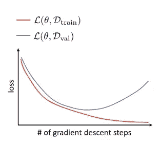

最初，这两个损失都在下降，但后来随着培训损失的进一步下降，验证损失开始上升。你的学习函数越来越适合那些训练点，代价是实际上偏离了真正的函数。

这是典型的不合身:

验证损失和训练损失以相似的速度减少，但是它们没有我们希望的减少得多。末端的间隙是偏差。

当查看过度拟合的情况时，一个想法出现了:在验证错误上升并停止我们的优化过程之前达到最佳点是否有意义？其实，*这叫早停*。当验证在过去的 n 次迭代中持续上升时，您只需倒回 n 步，并使用您当时拥有的任何东西。

但是这能减轻所有的过度拟合吗？不会，因为即使您可以在合适的最佳点停止优化器，验证错误也不会像使用适当的正则化时那么低。所以，提前停止是对抗过度适应的一种方法，但它不能解决你所有的问题。

现在，让我们假设你遵循了这个食谱:你没有欠适应，你没有过适应，你的损失都是好的。你如何评价你的模型的最终表现？

我们真的不能再依赖于无偏的验证损失，因为我们使用它来选择(1)模型类(2)正则化子的超参数(3)要使用的特征。我们也不能真正依赖训练损失，因为我们用它来选择(1)参数θ(通过优化)和(2)那些影响优化的超参数，如学习率。

我们可以为期末考试保留数据集的另一部分。我们称之为测试集，我们将用它来报告最终的性能。因此，我们将数据集分成三部分，而不是分成两部分。

超参数调整通常困难且耗时。在搜索过程中，我们可以使用一些技巧来指导我们。

*   网格搜索:尝试所有可能的超参数组合
*   随机搜索:随机尝试超参数的不同组合
*   坐标梯度下降:从一组超参数开始，尝试一次改变一个，接受任何减少验证误差的改变
*   贝叶斯优化/自动 ML:从一组在类似问题上运行良好的超参数开始，然后从那里进行某种局部探索(例如，梯度下降)。

有很多选择，比如探索什么范围，首先优化哪个参数，等等。一些超参数并不重要(人们使用 0.5 或 0 的辍学，但没有太多其他的)。其他因素可能更重要(例如，神经网络的大小和深度)。关键是要看类似问题的解决方法。

## [深度学习中的优化](https://www.youtube.com/watch?v=RdoZWcXmXhk&list=PL_iWQOsE6TfVmKkQHucjPAoRtIJYt8a5A&index=11)

我们将讨论最优化算法。让我们先回顾一下梯度下降。

我们可以将学习θ的问题公式化为寻找使 log p(D)最大化的θ的尝试:

This is called maximum likelihood estimation (MLE), because this log probability is the likelihood and we are choosing θ to maximize the likelihood

很多时候，我们会把它写成最小化(这只是一个惯例):

This is also called the cross-entropy

我们仍然希望最大化对数 p(D)，这与我们希望最小化负对数概率的说法相同。这就是我们的损失函数，它量化了θ的糟糕程度。要找到使损耗函数最小化的θ设置，我们必须找到方向 v，使 L(θ)减小，然后选择新的θ作为旧的θ加上某个速率α乘以 v。然后，我们重复这个过程足够多次。一般来说，我们将每个维度的方向设置为函数 L 的偏导数相对于θ维度的负值。

我们将详细讨论梯度下降法适用的情况，适用效果不佳的情况以及如何改进。我们会经常看到的一种图片是等高线图。这些线对应于水平集等高线；因此，对于沿其中一条等高线的所有θ值，损耗取相同的值:

我们将使用线条来可视化梯度下降的优化路径。每个橙色线段的端点表示梯度下降迭代之一的θ值；这些端点之间的线段表示步长(即梯度方向乘以学习速率)。

凸函数往往优化得很好。这里有一个一维函数:

如果函数上任意两点之间的线段完全位于图的上方，则该函数是凸的。相比之下，这个函数不是凸的:

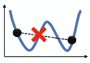

如果我在两点之间画一条线，它将与图形相交。这个函数也恰好有两个 optima。一般来说，一个函数可以是非凸的，即使它只有一个最优解。例如，这个函数只有一个最佳值，但是，因为它也有一个平台，如果我在这两点之间画一条线，它将与图形相交:

因此，一个函数是凸的意味着它只有一个最优值，但是一个非凸的函数并不意味着它有多个最优值。

证明凸函数上的梯度下降在不太大的迭代次数内就能找到全局最优解是可能的。这并不意味着梯度下降适用于所有凸函数，因为它并不总是朝着最佳方向移动。它将始终采用最陡的下降方向，但最陡的下降方向不是直接指向最小值的方向。例如，如果我们从起点看第一步:

我们看到它正在远离最佳状态。

想象这种功能。每个椭圆代表损失值相等的点。最佳的在中间。最陡下降的方向始终垂直于高程集的切线:

在这一点上，如果我们计算最陡的下降方向，我们会走另一条路:

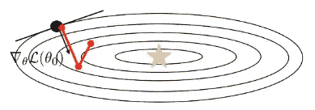

另一方面:

最终，这将达到最佳状态，但可能需要相当长的时间。

那么神经网络的损失面又是什么呢？

神经网络是一个更复杂的函数，具有许多参数和许多表示层:

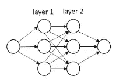

很难想象神经网络的损失面，因为神经网络有大量的参数。一些电视网的损失相当可观:

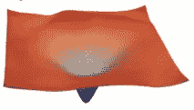

然而，这种损失通常是这样的:

一般来说，神经网络的损失景观肯定不是凸的。

## 在损失景观中，我们应该担心哪些地理特征？

有三个重要的特性需要了解。

当涉及到非凸损失景观时，局部最优是最明显的问题。问题是你可能有不止一个点的导数为零。在任何一个局部最优值，导数都为零，这意味着没有改善。

原则上，局部最优是非常可怕的，因为梯度下降可能会收敛到一个比全局最优更差的解，而你无法知道。有点令人惊讶的是，具有许多参数的神经网络在其损失景观中肯定存在局部最优，但这些最优往往不会比全局最优差太多。

您可以在下图中看到这一点:

在水平轴上，我们有通过梯度下降发现的解的损失的数值。这是一个直方图，所以垂直轴代表多少轮梯度下降，每一轮从不同的随机位置开始，实现了损失。这有点像是画出了导致损失的运行频率。不同的颜色代表不同大小的网络；这里的数字越大，对应的网络越大，参数越多。

粗略地说，对于黄色显示的最小网络，不同的损失值分布很广。它仍然没有那么宽，所有的数字都在 0.08 和 0.10 之间，但有一些可变性，这意味着优化正在陷入一系列不同损失值的局部最优。但是随着网络变得越来越大，实现不同损耗的网络的频率变得紧密得多；对于红色的最大网络，您可以看到损失仍有一些可变性，但解决方案在大约 0.072 和 0.078 的范围内聚集得更密集。

这意味着更大的网络确实有局部最优，但是这些局部最优彼此都非常相似，而且都非常好。

让我们转到第二个问题:

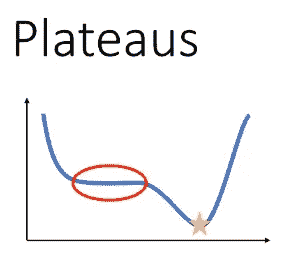

我们可以想象一个损失场景，在那里我们没有局部最优，但是我们有一个很大的区域，在那里损失的梯度非常小。如果没有这些停滞期，我们可以只使用小的学习率，并且能够缓慢而稳定地向最优进展。但是当这些平台期真的很平坦时，一个小的学习率可能意味着你要花很长时间才能度过这个平台期。因此，你需要足够大的学习速率，以免陷入这样的停滞状态。

第三期:

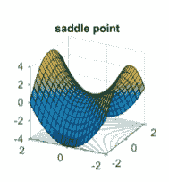

鞍点对于一维函数来说并不存在，但是对于高维函数来说，鞍点是相当常见的。直觉上，您可以将鞍点视为沿某些维度的局部最小值，但沿其他维度的局部最大值。在鞍点处，函数每个维度的偏导数为零，但是函数在某些维度上增加，而在其他维度上减少。

这就是为什么我们通过思考低维度而得出的关于函数的直觉是非常误导的。

**什么是临界点？**

临界点是梯度为零的任何点，这意味着损耗相对于θ每个维度的所有偏导数都是 0:

临界点有不同的类型；对于给定的临界点，它是最大值、最小值还是鞍点？你知道的方法是看二阶导数。

在 1D，如果你在一个临界点，二阶导数是正的，这意味着图表向上倾斜。这意味着您有一个本地最小值。另一方面，如果二阶导数是负的，那么这意味着你处于局部最大值。但是在更高的维度上，你可能有一些二阶导数是正的，一些是负的

一般来说，我们可以构造一个矩阵，叫做赫斯矩阵。hessian 矩阵基本上是梯度的二阶导数。

梯度是一个向量，其中每个条目都是相对于θ的相应维度的偏导数；赫斯矩阵是一个矩阵，其中每个条目都是相对于θ中两个条目的二阶导数。

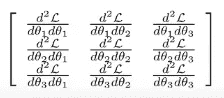

Hessian matrix

鞍点处的 hessian 矩阵将具有对角条目，对于某些维度为 1，对于其他维度为-1。

只有当所有对角线条目都有相同的符号时，该点才是最大值或最小值。否则，它就是一个鞍点。想象一下在更高的维度中会发生什么:所有 100 个对角线条目有相同符号的情况会有多频繁？在更高的维度中，每个对角线条目都是正的或者每个对角线条目都是负的似乎是非常不可能的。**所以，高维空间中最关键的点是鞍点。**

**改进方向**

是否有加速梯度下降而不需要二阶导数的方法(这意味着非常长的运行时间)？

1 动量就是它听起来的样子。如果我们还记得这张照片:

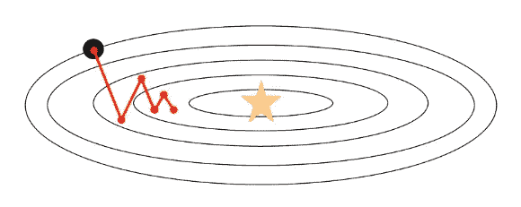

梯度下降会来回振荡，但是如果我们看几个连续的梯度更新，我们会注意到它们倾向于指向相反的方向。因此，我们很容易认为，如果我们能把它们平均起来，我们就能得到我们想要的方向。

直觉是，如果连续的梯度步骤指向不同的方向，我们应该取消不一致的方向，只保留一致的方向；另一方面，如果连续的梯度步骤指向相似的方向，我们应该在那个方向走得更快。

我们将要使用的动量更新规则非常类似于梯度下降。不同之处在于，我们也采用先前的方向，并将其乘以 0 到 1 之间的衰减因子:

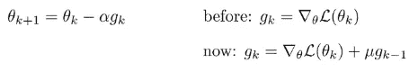

如果先前的方向和新的方向指向相反的方向，它们会相互抵消。如果它们指向相似的方向，它们实际上会加在一起，在那个方向上走得更快。动量带来很多好处，而且几乎没有成本。

我要讲的下一个问题是梯度的大小。梯度的符号很重要，因为它告诉我们梯度是向左还是向右；但是星等告诉我们它在每个维度上走了多远，信息却少得多。

更糟糕的是，在优化过程中，梯度的整体幅度可能会发生剧烈变化，这可能会使学习率难以调整。解释是 f θ(x)与 y 相差越大，梯度就越大。因此，如果最初 f θ(x)与 y 相差很大，那么梯度会很大，当梯度很大时，几乎肯定会超过最优值，从另一边出来。但是随着你的函数 f θ(x)越来越接近 y，梯度会变得很小，在这一点上，你可能会采取非常小的步骤，你可能想要一个更好的学习率。

有一个想法可以帮助我们缓解这种情况，那就是将每个维度上的梯度大小归一化。如果你能以某种方式计算出每个维度的平均梯度有多大，然后除以这个值，那么你就可以去掉这些烦人的比例因子。

RMSProp 就是这样一种算法。这个想法是平均估计梯度的每维大小:

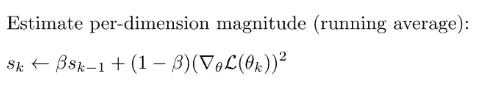

每一步，我们都要取 Sk 的旧值，乘以某个因子β(介于 0 和 1 之间的因子)。然后我们取 1-β，乘以梯度中每一项的平方。这大致是每个维度长度的平方。

当我们更新θ时，我们在梯度的方向上迈出一步，但我们用它除以 Sk 的平方根，也就是它的平均平方长度。因此，每一个维度都大致除以它的大小:

3 AdaGrad 是 RMSProp 的一个更具理论原则性的版本。使用 AdaGrad，我们也可以估计每个维度的大小，但是我们是累积估计的。

如你所见，它与 RMSProp 完全相同，但没有β和 1-β。这意味着 Sk 将会越来越大。

那么，AdaGrad 和 RMSProp 如何比较呢？

阿达格拉德对凸问题有一些非常吸引人的保证。然而，对于非凸问题，我们不断除以越来越大的 Sk 的事实意味着学习率随着时间的推移而降低——这可能是一个问题。只有在 Sk 变得太大以至于你的更新变得很小之前，你很快找到最优解，AdaGrad 才起作用。

另一方面，对于非凸问题，RMSProp 往往比 AdaGrad 更好一些，因为与 AdaGrad 不同，它会忘记。随着时间的推移，将 Sk-1 乘以β意味着算法会忘记很久以前看到的梯度。

亚当结合了动量和 RMSProp。我们使用动量来加速梯度下降，然后除以长度平方的移动平均值来归一化长度。

第一步，类似于动量:

与动量相似，我们在前进的过程中积累梯度。您可以将 mk(其中“m”代表平均值)视为梯度的移动平均值。

第二步:

vk 是二阶矩估计:也是移动平均值，但是是梯度长度的平方。

第三步，当我们将 m0 和 v0 初始化为零时，我们希望防止我们采取的步骤在开始时很小，随着时间的推移很大:

第四步，我们的更新:

**随机优化**

到目前为止，我描述的所有梯度下降版本实际上都不适合用于深度学习。例如，负对数似然损失要求对我们训练集中的所有数据点求和:

然而，在深度学习中，当数据集非常大时，事情往往会工作得最好。因此，有效地优化神经网络可能需要数百万个梯度步骤，这将是非常令人望而却步的。

我们可以认识到的一点是，这个总和实际上是基于样本的期望值估计值:

如果你考虑给定 x，y 的对数概率的数据分布下的期望值，你实际计算的损失总和只是基于样本的估计。并且期望值的基于样本的估计对于任何数量的样本都是无偏的。如果你使用更少的样本，你会得到一个更差的估计，但它仍然是一个无偏的估计。

如果我们希望梯度下降在计算上更快，我们可以做的事情之一是，我们可以简单地使用比每次更新的整个训练集更少的样本。我们可以选择 B 个样本的子集，然后对这些 B 个样本求平均值，其中 B 远小于 n:

当然，如果我们只选择这些样本一次，并在整个优化过程中使用它们，那是相当浪费的，因为我们没有使用我们的大部分数据。我们能做的是，我们可以在每一个梯度步骤中选择一个大小为 B 的不同子集，这样，我们用少量样本估计的梯度看起来就像真实的梯度，带有一些噪声，因为只是随机地，每一个梯度步骤都会得到一组略有不同的 B 样本。

**小批量随机梯度下降**

1 对整个训练集 D 的子集 B 进行采样

2 通过对批次 b 中所有点的梯度求平均值来估计一个近似的梯度方向。这大约是你的损失的梯度，但它不完全相同的原因是你使用了更少的点:

3 使用具有近似梯度的梯度下降。当然也可以用动量，亚当等。

每次迭代采样不同的小批量。这是随机分级下降的理想版本，但实际上你可以更有效地做事。

由于随机内存访问，每一步随机采样都非常慢。如果你有非常复杂的数据，它会在内存中按顺序排列；因此，如果您每次都索引到一个随机映像中，那么您会进行大量的随机内存访问，这会破坏您的缓存一致性。相反，您可以预先洗牌，就像洗牌一样，然后按顺序索引数据集。从技术上来说，这与常规梯度下降并不完全相同，因为您在开始时只洗牌一次，但您在批次中循环的顺序是随机的，因此在实践中，这与真正的随机梯度下降一样好，并且在计算上更便宜。

**学习率**

我们如何调整这些算法的学习率？

在该图中，垂直轴是训练损失；横轴是纪元，一个纪元就是你浏览整个数据集的次数。对于规则梯度下降，历元的数量等于优化步骤的数量；使用随机梯度下降，历元数等于数据集的总大小除以小批量的大小。

红色曲线显示了如果你有一个精心选择的学习率，你期望看到的训练损失。

绿色曲线下降的速度要慢得多，这意味着我们的学习速度可能低于正常水平。在深度学习中，低学习率会导致缓慢的优化和收敛到更差的最终结果。

黄色曲线开始时非常快，但之后就停滞了，这意味着我们的学习速度可能太高了。当我们走得太快时，我们一开始会走得很快，但之后你会卡在一个更差的值上。

**学习率衰减**

此时你可能会想:如果高学习率一开始很快，但后来停滞不前，我们为什么不从高学习率开始，然后切换到较低的学习率？

这是一个在 ImageNet 上训练的神经网络 AlexNet 的图表:

它正在接受学习率衰减时间表的训练，学习率每隔一段时间除以 10。您可以看到，最初，学习率为 0.01 时，准确率会迅速提高，然后会停滞不前。学习率下降得更多，现在你的准确率进一步提高，然后停滞不前。学习率再次下降，然后准确率进一步提高并趋于平稳。最终，你足够接近局部最优，然后你停止改进。值得注意的是，通常情况下，您不需要使用 ADAM 进行学习速率衰减。

**调谐随机梯度下降**

要调整的超参数:

*   **B 批**。通常，较大的批次导致噪声较低的梯度，这更安全但更昂贵。
*   **学习速度** α 是一个有些棘手的选择。一般来说，最好使用最大有效学习速度。你可能会想随着时间的推移让它腐烂。
*   对于动量μ，好的设置是 0.90 或 0.99，但你必须调整它以适合你的问题
*   ADAM 参数β1 和β2；通常，保留默认值。

您如何调整这些超参数？从技术上来说，您需要根据训练损失来调整这些参数，因为与正则化不同，它们不会试图为您提供新点的更好的泛化。

然而，在实践中，随机梯度下降超参数也经常在验证集上调整，这是一个有趣的选择。随机梯度和正则化之间存在复杂的关系；按照惯例，我们会把优化和泛化分开。但最近有相当多的研究研究如何巨大的随机梯度下降本身实际上可以作为一种正则化。因此，直觉告诉我们，如果你开始过度拟合，你会认为不同批次的梯度会有很大不同，所以你不想将它们平均化——你不想触及损失的最底层。这就是为什么有些人认为随机梯度具有理想的正则化效果的原始直觉，因此，当您调整随机梯度下降的超参数时，您实际上应该考虑验证损失。

**深度学习计算图**

所有的机器学习算法都是带有一些参数的程序。我们可视化程序的方法之一是绘制一个表示计算流程的图形。

计算图如下所示:

Computation graph for linear regression

此计算图表示线性回归。我们计算 x1 乘以θ1 加上 x2 乘以θ2；然后，我们减去 y 并对差值进行平方，这就得到了均方误差(MSE)损失。一般来说，当我们绘制神经网络的计算图时，我们是在绘制与损失函数相结合的图。

神经网络通常比我上面画的图要复杂得多，计算量也大得多。在我们可以为神经网络绘制计算图之前，我们需要谈论向量和矩阵；在此之后，我们可以设计计算图形的通用工具，并使用这些工具来训练许多不同类型的神经网络，只需最少的额外工程。

让我们像以前一样绘制同样的线性回归图，但使用向量的方式要简单得多:

Computation graph for linear regression

现在我们有一个节点 x，它表示两个条目 x1 和 x2 的向量；我们还有一个节点θ，代表θ1 和θ2；将这两个向量相乘后，我们从它们中减去标记 y，并求差的平方。这和我之前展示的计算图一模一样，只是用向量符号以更简洁的方式写出来。

同样，我们可以看看这张逻辑回归的精致图表:

Computation graph for logistic regression

用矩阵让这个更简单。我们可以用矩阵符号写逻辑回归:

因为一些矩阵θ乘以向量 x，因此我们的计算图变成:

我们可以更简洁地画出逻辑回归图。请注意，在这些计算中，我们有两种类型的变量。我们有像 x 和 y 这样的数据变量，它们是输入和目标输出；而我们有参数(θ)，通常影响一个具体的操作(虽然有时候有一些参数共享)。如果我们注意到这些特性，我们可以对这个组合图做更多的总结。我们知道，θ只会影响一个地方发生的事情，我们可以把它看作那个乘法的一个参数，并把它折叠到乘法节点中。我们可以画出同样的图，但更简洁地说，x 进入一个线性层(线性，因为它是一个矩阵向量乘积)，然后它进入 softmax，然后 softmax 进入损失函数:

现在我们有了这个高度简化的计算图表，我们可以将其与其他常见的可视化神经网络的方法进行比较。

绘制神经网络图的常用方法是将网络中的变量可视化为方框:

一切开始的第一个变量是输入 x；然后我们有一个线性层，默认有参数；这个线性层将 x 转换成某种中间表示，我们称之为 z(1)。z(1)是应用第一个线性图层的结果-上标 1 表示它是第一个图层。然后我们把这个 z(1)输入到 softmax 中。

一个更简单的图形是:

这里，我们切断损失，因为我们知道交叉熵损失总是遵循 softmax。我们也删除了绿色的梯形，而只是标记箭头。我们还删除了参数，因为线性层总是有参数。这是一种你会在研究论文中经常看到的图表。

[**逐步反向传播**](https://www.youtube.com/watch?v=lKRatcD9hEg&list=PL_iWQOsE6TfVmKkQHucjPAoRtIJYt8a5A&index=14)

逻辑回归的表达式非常简单，我们可以把方程写在一张纸上。然后，我们可以用微积分的规则，推导出这个表达式对每个参数的导数。我们可以用神经网络做同样的事情，计算出每一个权重矩阵的导数，并构建我们的梯度。但是考虑到神经网络包含许多功能，可能需要很长时间才能算出这些导数。此外，如果你改变你的网络，例如增加一层，你必须重新推导所有的导数，这将需要很长时间。

我们真正想要的是一种可以通过神经网络自动计算导数的算法，而不需要我们手工计算所有的微积分。然后，我们可以实现任何我们想要的神经网络，运行这个算法，得到一个梯度。这种算法被称为反向传播。

作为题外话，我们需要回顾一下微积分的链式法则(不要与概率的链式法则混淆)是如何工作的。神经网络由许多功能组成。通过函数的组合求导是微积分的链式法则帮助我们弄明白的

如果你有这样的表达:

这意味着你有一个输入 x，你把一个函数 g 应用到 x，你得到 y，你把另一个函数 f 应用到 y，最终，你得到 z。

假设你想对这个关于 x 的表达式求导，链式法则告诉你，导数是 g 的导数乘以 f 的导数的乘积:

同样的精确表达式也适用于多元函数——我们只需稍微注意一下顺序，因为标量乘法中的顺序是可交换的，而矩阵乘法则不是这样。

同样的链式法则成立:dz/dy 是向量，dy/dx 是矩阵。

让我们来看看这个神经网络:

我们可以用链式法则写出，例如，损失对 W(2)的导数。这等于 z(2)对 W(2)的导数乘以损耗对 z(2)的导数:

同样，我们可以写出对 W(1)的导数:

以下是我们如何更有效地做事的方法。中间的所有雅可比矩阵都是 nxn，但最后一个雅可比矩阵总是 nx1，因为损耗总是标量值:

因此，中间的这些乘积相当昂贵，因为它们将是 O(n)，而最后一个乘积相当便宜，因为它总是大致为 O(n)。

以下是我们如何利用这种直觉来构建一个更有效的算法。想法是我们从右边开始，所以我们总是把计算保持在 O(n)上。首先，我们计算:

这是一个矩阵乘以一个向量，计算起来很便宜。我们称之为δ(δ)。现在让我们更新我们的衍生品:

我们再一次从右边开始。我们计算:

这是一个矩阵乘以一个向量，计算起来很便宜。我们称之为γ(γ)。最后:

同样，最后一种产品很便宜。

基于这种直觉，我们可以推导出经典的反向传播算法。假设我们有这样一个网络:

首先，我们要做一个向前传球，我们要计算每一个 a(i)和 z(i)。然后，我们将进行反向传播，这就是反向传播所指的。我们首先将增量向量初始化为损耗相对于最后一个 z 的导数。然后，我们将从网络的末端回到前面，对于具有输入 xf 和参数θf 的每个函数(线性和非线性层)，我们将执行以下操作:

以这种方式更新 delta:

**内部表示**

早些时候，我们看到深层神经网络在学习复杂的函数时往往有惊人的强大，它们通过学习内部表征获得力量。

1.  通过梯度下降学习似乎非常类似于动态系统的进化。它们都用一组微分方程来描述。动力系统通常有一个“时间常数”，它描述了变化率，类似于学习率，只是梯度下降不是时间，而是通过时代演变。Saxe 等人(2013)表明，为了分析和理解深度 LNN 的非线性学习动力学，我们可以使用奇异值分解(SVD)将权重矩阵分解为正交向量，其中向量的正交性将确保它们的个性(独立性)。这意味着我们可以把一个深宽的 LNN 分成多个深窄的 LNN，所以它们的活动是相互分离的。SVD 简介:任何实值矩阵 A 都可以分解为 3 个矩阵:

a=uσv⊤

其中 U 是正交矩阵，σ是对角矩阵，V 也是正交矩阵。σ的对角元素称为奇异值。

2.表征相似性分析(RSA)是一种可以帮助我们窥探网络内部结构的方法。其主要思想是，当网络以相似的输入呈现时，网络中隐藏单元(神经元)的活动必须相似。如果我们在每个训练迭代中执行 RSA，我们可能能够看到窄网是否正在学习表示。

**实际实施**

在使用反向传播和梯度下降对其进行训练之前，我们需要回答几个关于神经网络的问题:

*   网络应该有多少层？
*   这些层有多大？
*   我们应该使用哪种类型的激活功能？

关于激活函数，一个特别流行的选择是被称为整流线性单元或 ReLU 的东西。ReLU 接受先前的激活，假设 z(1)，它将(1)设置为 0 和 z(1)对应条目之间的最大值:

它有一个完全线性的正分支，然后它有一个平坦的负分支。人们可能会认为它不够非线性，但实际上它工作得很好。它有许多非常吸引人的特性:

*   它在计算上实现起来非常便宜，这意味着对于非常大的神经网络，它可以大大加快它们的速度
*   它的导数非常简单，这也使得它们的计算效率更高，更容易使用

为了实现神经网络，我们必须讨论的另一个细节是偏差项。这是一个经典的线性层:

但是这一层有一个主要的限制。让我们想象 a(i)是一个零矢量。在这种情况下，线性层永远不会产生任何不为零的输出，这意味着到处都会有零。这种神经网络永远不能表示某些函数——它不是一个通用的函数逼近器。

解决方法是添加一个偏置向量，将线性图层转换为:

这也称为仿射层。结果是，如果你有一个神经网络，它有这种层和一个非线性，像一个乙状结肠，只要这些层足够大，你可以逼近任何函数到一个任意的精度水平。如果你没有偏见，你就不能这么做。现在，神经网络的参数将由权重矩阵 W1 和 W2 以及偏置向量 b1 和 b2 组成。

我们还需要什么来实际实现反向传播？我们需要能够计算:

Parameters θf for every function f

以及:

Input xf for every function f

**PyTorch 亲笔**

PyTorch、JAX 和 TensorFlow 等深度学习框架附带了一套非常高效和复杂的算法，通常称为自动微分。亲笔签名是 PyTorch 的自动区分引擎。

一切都从正向传播(通过)开始。当我们声明变量和操作时，PyTorch 跟踪所有的指令，当我们调用`.backward()`传递时，它构建图形。每当我们迭代或更改图形时，PyTorch 都会重建图形(或者简单地说，PyTorch 使用动态图形)。

对于梯度下降，它只需要有成本函数相对于我们希望学习的变量的梯度。在 PyTorch 中，这些变量通常被称为“可学习/可训练参数”或简称为“参数”。在神经网络中，权重和偏差通常是可学习的参数。

在 PyTorch 中，为了表示某个张量包含可学习的参数，我们可以将可选参数`requires_grad`设置为`True`。PyTorch 将在配置计算图时使用这个张量跟踪每个操作。当我们任意遍历类和函数时，PyTorch 可以跟踪我们的操作，理解这一点很重要。

神奇之处就在于此:在 PyTorch 中，`Tensor`和`Function`相互连接，构建了一个无环图，编码了一个完整的计算历史。每个变量都有一个`grad_fn`属性，该属性引用了一个创建张量的函数(除了用户创建的张量——它们的`None`为`grad_fn`)。在这一点上，我们开始向后传递，通过在我们希望开始反向传播的张量上调用`.backward()`来计算梯度。通常情况下，`.backward()`在损耗上被调用，它是图上的最后一个节点。

**重要注意事项**

*   可学习的参数(即`reguires_grad`张量)是“会传染的”。我们来看一个简单的例子:`Y = W @ X`，其中`X`是特征张量，`W`是权重张量(可学习参数，`reguires_grad`，新生成的输出张量`Y`也将是`reguires_grad`。因此，应用于`Y`的任何操作都将是计算图形的一部分。因此，如果我们需要绘制或存储一个张量为`reguires_grad`，我们必须首先通过调用该张量上的`.detach()`方法从图中`.detach()`它。
*   `.backward()`累积叶节点中的梯度(即感兴趣节点的输入节点)。我们可以在损失或优化器上调用`.zero_grad()`来将所有的`.grad`属性清零(更多信息，请参见 signatured . backward)。
*   回想一下，在 python 中，我们可以用`.method_name`访问变量和相关的方法。您可以使用命令`dir(my_object)`来观察对象的所有变量和相关方法，例如`dir(simple_graph.w)`。

# 卷积网络、递归神经网络和变换器

## [卷积网络](https://www.youtube.com/watch?v=jNW1Hi7Yi4c&list=PL_iWQOsE6TfVmKkQHucjPAoRtIJYt8a5A&index=17)

假设你有一张可爱小狗的照片。你想对一张小狗、猫、河马或长颈鹿的图片进行分类。

你可以训练一个完全连接的网络来解决这个问题:

然而，至少有两个问题:

**1 计算棘手**

如果我们观察这样一个网络中的第一个线性层，我们会看到它读入一个图像并产生第一个激活向量。该线性层中的权重数量将等于第一隐藏层中的激活数量 z(1)乘以整个图像中的数值数量。对于图像中的每个像素和每个颜色通道，我们需要与输出数量相等的多个权重。

假设:

*   这个图像是 128x128x3 (49.152 个数字)
*   我们的第一个隐藏层有 64 个维度，这实际上是一个非常小的隐藏层

即使这样，这个第一权重向量中的参数总数将是 49.152 的 64 倍，超过 300 万:

这只是这个微小的 64 维隐藏层的第一层。

**2 对换挡不稳健**

如果小狗的照片向左或向右移动哪怕一个像素，它在网络上看起来就会完全不同。

**一个想法**

在某种意义上，我们关心的许多视觉特征都是局部的。如果我们想识别这是一张小狗的照片，首先我们要提取边缘:

然后我们会提取一些局部区域，比如耳朵和鼻子:

> 关于这些属性的有趣的事情是它们都是局部特征:为了确定在特定位置是否有边缘，你只需要查看附近的像素。

我们可以利用这一观察来设计一种神经网络，这种网络可以通过首先进行局部运算，然后仅在信息量已经减少到更易于管理的水平时才执行全局运算，而不需要更多的参数。

**卷积**

我们将构建一个小型边缘检测器，并将其应用于图像中的每个区域，因为您识别图像边缘的方式不会因您观察的位置而改变:

*   我们的小检测器将被称为过滤器(或内核)。
*   它将具有与输入图像相同的深度(在这种情况下是 3 个颜色通道)。
*   由于有 64 个特征，我们将为每个 3x3x3 区域堆叠 64 个过滤器。这里我只画了四个:

*   对于输入图像中的每个位置，我们有 64 个过滤器，这为每个 3x3x3 区域产生一个长度为 64 的小向量。
*   我们将把这个 3x3x3 (27 个数字)过滤器应用于图像中的每个小块，并计算 64 个特征。现在，64 乘以 27 只是 1728，而不是 300 万。随着卷积滤波器沿图层的输入矩阵滑动，卷积运算会生成一个特征图，该图反过来会影响下一图层的输入。
*   之后，我们对它们中的每一个应用非线性，就像我们在常规神经网络中所做的那样
*   我们现在得到另一个盒子，它的深度是 64，宽度和高度也是 128。

现在，我们已经将 128x128x3 的图像转换成了 128x128x64 的激活图。好像每个像素都变成了 64 个特征的向量。过滤器是什么样子的？

你可以想象将这些滤镜中的每一个通过图像，对于相应的滤镜，激活将是该特征存在的程度。

另外，卷积神经网络的一个优点是，网络通过自动学习来学习优化滤波器，因此它们独立于先验知识和人工干预。

卷积利用了三个可以帮助改进机器学习系统的重要思想:稀疏交互、参数共享和等变表示。

1.  传统的神经网络层使用参数矩阵的矩阵乘法，其中单独的参数描述每个输入单元和每个输出单元之间的相互作用。这意味着每个输出单元都与每个输入单元相互作用。然而，卷积网络通常具有稀疏交互(也称为稀疏连通性或稀疏权重)。这是通过使内核小于输入来实现的。例如，在处理图像时，输入图像可能有数千或数百万个像素，但我们可以检测到小的、有意义的特征，如核仅占用数十或数百个像素的边缘。
2.  参数共享是指在一个模型中对多个函数使用相同的参数。在传统的神经网络中，当计算一层的输出时，权重矩阵的每个元素只使用一次。它被乘以输入的一个元素，然后不再被重新访问。作为参数共享的同义词，可以说网络具有绑定的权重，因为应用于一个输入的权重值与应用于其他地方的权重值绑定在一起。在卷积神经网络中，在输入的每个位置使用核的每个成员(可能除了一些边界像素，取决于关于边界的设计决策)。卷积运算使用的参数共享意味着我们只学习一组参数，而不是为每个位置学习一组单独的参数。
3.  在卷积的情况下，参数共享的特定形式会使图层具有一种称为平移等方差的属性。说一个函数是等变的意味着如果输入改变，输出也以同样的方式改变。

但这里有一个问题:我们没有把东西做得更小。我们已经减少了参数的数量，但我们的激活仍然是这些巨大的地图，具有与原始图像相同的分辨率和潜在的更大的深度，因为我们可能想要比原始图像中的颜色通道更多的特征。

**汇集**

为了降低图层的分辨率，我们将采用每 2×2×64 的补丁，并将其转换为 1×1×64，在每个区域内对每个通道进行最大激活。为什么是马克斯？直观地说，如果该图中的激活表示该特征存在的程度，那么我们可以通过取最大激活值来评估该区域中该特征的存在，这是有意义的。这使得它对小的平移变化也很稳健:如果图像移动很小的量，每个区域中的最大值可能无论如何都会保持不变。

在汇集之后，您可以执行另一个卷积，应用另一个非线性，然后执行另一个汇集。一般来说，卷积网络的典型层由三个阶段组成。

1.  在第一阶段，该层并行执行几个回旋，以产生一组线性激活。
2.  在第二阶段，每个线性激活都通过一个非线性激活函数运行，例如线性激活函数。该阶段有时称为检测器阶段。
3.  在第三阶段，我们使用一个池函数来进一步修改层的输出

**回旋并汇集**

回想一下先验概率分布的概念。这是一个模型参数的概率分布，在我们看到任何数据之前，它编码了我们对什么模型是合理的信念。先验可以被认为是弱的或强的，这取决于先验中概率密度的集中程度。弱先验是具有高熵的先验分布，例如具有高方差的高斯分布。这种先验允许数据或多或少地自由移动参数。强先验具有非常低的熵，例如具有低方差的高斯分布。这种先验在确定参数的最终位置时起着更积极的作用。一个无限强的先验将一些参数的概率设置为零，并表示这些参数值是完全禁止的，无论数据对这些值的支持程度如何。我们可以把卷积网络想象成类似于全连通网络，但其权重具有无限强的先验。这个无限强的先验表明，一个隐藏单元的权重必须与其相邻单元的权重相同，但在空间上有所偏移。先验还指出，权重必须为零，除非在分配给该隐藏单元的小的、空间连续的感受场中。总的来说，我们可以认为卷积的使用在层的参数上引入了无限强的先验概率分布。这个先验知识表明该层应该学习的函数只包含局部交互，并且与翻译是等变的。同样，池的使用是一个无限强的先验，每个单元对于小的平移应该是不变的。

CNN 看起来像什么？

例如，这是 LeNet，一个用于手写数字识别的网络。

*   它接受 32x32 个手写字符作为输入
*   C1 卷积层:28x28x6 (28 而不是 32，因为边缘(我们将在下面讨论)和 6，因为它有 6 个特征)
*   非线性
*   S2 池(二次采样):2x2 池，将 28x28 的地图转换为 14x14 的地图。
*   C3 卷积层:10×10×16(10 而不是 14 是因为边缘，16 是因为它有 16 个特征)
*   非线性
*   S4 池(二次采样):2x2 池，将 10x10 的地图变成 5x5 的地图。
*   5x5x16 足够小，现在您可以将这些激活展平到一个大矢量中，并将其放入一个标准的全连接线性层中

**实现卷积层**

我们将需要 N 维数组，通常作为“张量”的同义词使用。张量是矩阵的高维推广。

例如，输入图像可以是 3D 阵列；过滤器可以是 4D；激活可以是 3D 的。这类似于我们在标准神经网络中看到的权重和激活，其中我们有 2D 权重矩阵和 1D 激活。

假设我有一个激活 a(1)，我要把它变成 z(2):

我们的滤波器由 W 张量指定:

卷积运算将使用此过滤器，将其放置在输入地图的每个位置，并生成相应的地图。让我们把它写成 z(2)中沿纵轴的位置 I 和沿横轴的位置 j 的等式:

我们将 W(2)乘以输入激活图中的一个点；我们将通过以(I，j)为中心来获得该点，然后根据 l 和 m 向左或向右移动。这是一种说法，在卷积中，每个位置都有一个小的线性层，您可以滑动它。

这样做之后，不要忘记应用你的非线性:

**填充和边缘**

如果你的内核向左移动两步，离开了图像的末端，会怎么样呢？

你有两个选择:

**1 切掉边缘**

在某些指数变为负值或大于图像宽度时，不允许对过滤器进行评估

如果输入为 32x32x32，滤波器为 5x5x6，则输出为 28x28x6。

我们可以这么想。我们可以想象过滤器有一个半径，我们可以通过将它的高度减去一除以二来计算:

在我们的例子中，半径因此是 2。如果半径超出了图像的末端，那么它就是无效的——这就是为什么我们在每一侧(底部、顶部、左侧、右侧)切掉一些与半径相等的位置。32x32 就这样变成了 28x28。

然而，当你像这样切掉边缘时，我们的激活会随着每一层而收缩。有些人不喜欢这样，尤其是当这些激活图在你的网络末端变得非常小的时候。

**2 补零**

使用零填充，您可以在角和边上评估过滤器:任何超出图像或激活图末端的点都将被替换为零:

记住先减去图像平均值是很重要的，因为你放入的这些零将低于原始图像中的任何激活。通常，你取平均像素强度，然后从每个位置的像素强度中减去它，这样图像就在中间了。

零填充的一个优点是它在某种意义上更简单:激活映射的大小保持不变，您不必担心事情变得更小。

**交错卷积**

正如我们所说，每一层的标准结构包括三个步骤:

1 卷积
2 激活功能
3 汇集

然而，第一步在计算上可能非常昂贵，因为它不需要很多参数，但你要重复矩阵乘法很多很多次。

这里有一个让它便宜一点的想法:如果你跳过一些位置呢？您可以跳过一个称为步幅的量，而不是在输入图像的每个点评估过滤器。

重要的是，步长卷积不同于池化，因为在池化中，你确实要计算每个位置的激活，然后取最大值，而在步长卷积中，你要一起跳过一些位置。

**卷积神经网络的例子**

**AlexNet** 是一个经典的中等深度卷积神经网络:

之所以以这种方式绘制，是因为网络是在两个 GPU 上运行的，并且被手动分成两部分。这对网络的功能没有任何影响。

*   输入是 224x224x3 的图像
*   第一个卷积层是 11x11x96
*   这些过滤器的应用步长为 4。你将把图像的大小减少大约四分之一，减去由于边上的填充而产生的边缘效果；这为我们提供了一个 55x55x96 的激活图
*   ReLU 激活

*   3x3 最大池层，步幅为 2。您将减少到 27x27x96
*   标准化层。这已经不再广泛使用了。

突击测验:第一个卷积层有多少个参数？参数的数量仅取决于滤波器，滤波器为 11x11x96。

请记住，每个卷积层中 W 矩阵的大小为:

所以你最后得到 11x11x3x96，总计 34.848 个参数。我们遗漏了偏置向量中的参数数量，它只取决于输出的数量(96)。

这些是相当多的参数，但它仍然比我们拥有一个完全连接的层所需的参数低得多。

最后，我们有完全连接的层:

您可以看到一些模式:

*   池层减少了激活的规模
*   随着你越深入，特征的数量往往会增加:我们试图用更深层次的低分辨率激活图来总结图像中的所有信息，这有助于我们表现更抽象的特征。
*   一旦事情变得足够小，我们就将它们展平，并通过几个完全连接的层来产生一个答案

这些图案很有价值。但是 AlexNet 已经不再被使用了，现在处理视觉输入的最好的网络也变得更加深入了。

**VGG** 的建造试图追求标准化和模块化，当我们必须建立非常深的网络时，这真的很有帮助。

*   输入是一个 224x224x3 的图像，我们用步长 1 和零填充卷积来处理它:分辨率没有降低。这些是巨大的激活图，但是过滤器非常小(3x3x64)。
*   非线性
*   2x2 最大池层，以降低分辨率。
*   两层卷积
*   非线性
*   2x2 最大池层
*   三层卷积
*   2x2 最大池层
*   三层卷积

…

你可以在这里看到图案:我们有两到三层完全不会降低分辨率的回旋层，中间穿插着将分辨率降低一半的汇集层。每次我们将分辨率降低一半，我们通常会增加过滤器的数量，在某些时候，它足够小，我们可以构建我们的第一个完全连接的层。

一些观察结果:

*   更多的层意味着更多的处理，这就是为什么我们看到这些重复的块
*   大部分内存实际上是在开始时使用的，因为在开始时我们有这些巨大的激活图
*   参数的数量在完全连接的层中是最大的，其中我们将激活展平成一个巨大的向量

ResNet 最初有 152 层，但从那时起，人们就用类似的想法来扩展网络。

我将展示一个高度简化的 18 层原型的图表:完整的 152 层版本与此类似，只是所有内容都被拉伸了很多。

*   我们从一个 7x7 卷积开始，这样可以降低分辨率。然后，我们有这些重复的 3x3 卷积块，它们之间的分辨率降低；随着时间的推移，滤波器的数量会增加两倍，直到达到 512，然后保持不变。
*   我们有许多层的通用块，中间穿插一些池操作。
*   该模型的另一个显著特征是，我们不是在末端有一个巨大的全连接层，而是简单地取上一个卷积响应图，并对每个位置的特征向量进行平均
*   然后我们有一个线性层直接进入 softmax

我们来看看为什么 ResNet 可以用这么大的层数来训练。ResNet 论文的作者进行了一些实验，研究增加层数的影响。

在左边，你可以看到他们对一个标准卷积网络的实验，你可以把层数从 20 层增加到 32 层，从 44 层增加到 56 层。你可以看到，错误率随着层数的增加而增加。ResNet 的人发现，通过对神经网络架构的修改，你可以逆转这一趋势，并看到准确性随着层数的增加而增加。

**主旨是什么？**

在左边的规则网络中，你有你的权重层，它可以是卷积或完全连接的，你可以串联应用它们。另一方面，对于剩余网络，你取每组两个卷积，把第一个卷积的输入加到第二个卷积的输出上。

因此，如果在规则网络中，你考虑每组两个卷积计算某个函数 h(x)，在剩余网络中，该组两个卷积将计算 h(x)，其中 h(x)等于规则网络中发生的情况加上 X。X 绕过这些卷积，并在最后被相加。直觉告诉我们，你计算的是 x 的变化，而不是一个全新的 x。

为了理解这种直觉，我们必须重新考虑为什么训练非常深的网络如此困难。链式法则看起来就像一堆雅可比的乘法运算；对于任意深度的网络，损失对第一层权矩阵的导数将是大量雅可比矩阵的乘积。然后最后你乘以这个数 dL / dz(n):

这些雅可比矩阵可以是各种不同的东西。非线性的导数，线性层的导数，卷积的导数。如果我们简化一下，考虑一下标量，将许多数字相乘的问题是有两种可能的结果:如果大多数数字小于 1，我们将得到 0，而如果大多数数字大于 1，我们将得到无穷大。有一小部分情况下答案更有趣，这一小部分情况是当所有的数字都接近 1 时:只有当它们都接近 1 时，你才能从许多标量相乘中得到合理的答案。

对了，这就是为什么我们更喜欢 ReLUs 而不是 sigmoids 整流线性单位的导数是输入是否为正的指标，这意味着这些导数的大部分仅为 1。

对于矩阵来说，接近 1 并不意味着每一项都是 1，而是意味着矩阵的特征值需要接近 1。

如果我们回头看看我们的图像，残差层 dH/dx 由 dF/dx 加上恒等式给出，因为您只是添加了 x，只要卷积层中的权重不太大，您可能希望这个 dF/dx 也不会太大。在这一点上，这个总和将非常接近于恒等式:

## [让神经网络训练](https://www.youtube.com/watch?v=0dNAhN4ypFc&list=PL_iWQOsE6TfVmKkQHucjPAoRtIJYt8a5A&index=20)

请记住，神经网络优化景观是有问题的，神经网络是混乱的。他们需要很多技巧来训练好，知道这些技巧对于好的结果非常重要，就像理解所有理论上的细微差别一样重要。我们将讨论:

*   标准化输入和输出
*   标准化激活(批量标准化)
*   初始化权重矩阵和偏差向量
*   渐变剪辑
*   超参数优化的最佳实践
*   辍学学生

**标准化输入和输出**

假设你有这样一个神经网络:

它接受 2D 输入，我们的一些数据点如下所示:

在这里，一切看起来都很正常。X1 和 x2 各不相同，这是一个标准设置，你会期望一切正常。但是如果我们看看这个场景:

第一个维度与第二个维度的尺度非常不同。它的数值更大，范围更大。这些数据点代表的实际信息可能完全相同，如果您重新调整右侧数据点的条形，您可能会得到与左侧分布完全相同的结果。由此产生的梯度条件较差，网络将倾向于在传递到较小的数字之前关注较大的数字，即使它们对于预测问题不一定更重要。

标准化是我们解决这个问题的方法:我们转换我们的输入，使它们趋向于均值为零，标准差为一。如果你想让平均值为零，你要做的就是从 x 的每个维度上减去平均值:

x 的期望值是平均值，通过对数据集中的所有 x 取平均值来估算。

如果你也想让标准差为 1，那么你做同样的事情，然后除以数据集中 x 的标准差:

如果你正在解决一个回归问题，对于输出来说这样做也是一个好主意。

**标准化激活(批量标准化)**

为了使激活标准化，我们将使用小批量来估计平均值和标准差。不是通过对数据集中每个数据点的激活进行平均来估计平均值，这将是非常昂贵的，我们将通过对该批中所有数据点的激活进行平均来估计平均值。

我们对标准差做同样的事情。我们不是计算整个数据集的标准偏差，而是只计算批次的标准偏差。在实际实现中，我们还会有两个额外的激活参数(γ和β)。在我们减去平均值并除以标准差后，我们的激活将在一个特定的范围内，但我们可能不希望它进入下一层。相反，我们可能想对它们进行变换，将它们乘以一个标度，并加上一个偏差。

您可以将批处理规范化视为一个层，它根据当前批处理中进入批处理规范层的所有激活计算平均值和标准差，然后具有参数 gamma 和 beta。

一些实用的细节:

*   如果你使用批量范数，你通常可以使用更大的学习率，因为它会使你的导数更好地进行调节，并在某种程度上防止这些真正笨拙地缩放的客观景观，其中一些维度比其他维度具有更大的梯度。
*   具有批量范数的模型可以训练得更快，并且通常需要较少的正则化

**初始化权重矩阵和偏置向量**

我们不会尝试初始化我们的权重，以便它们接近一个好的解决方案，我们只是要初始化它们，以便在初始化时，神经网络的导数是高质量的，这意味着它们指向一个最优的方向。

对于小型网络，一个非常简单的选择是将权重初始化为一些小的随机数；例如，我们可以选择平均值为 0、标准差为 0.0001 的正态分布。但随着你的网络越来越深，这将很快给你不好的答案，因为如果激活为零，那么梯度也为零。如果梯度为零，那么你没有任何进展:

事实上，这相当于一个非常糟糕的平台期。

为了避免这个问题，我们使用 Xavier 初始化。Xavier 初始化的目标是初始化权重，使得激活的方差在每一层上都相同。这种恒定的变化有助于防止渐变爆炸或消失。我不会解释数学证明的所有细节，因为这不是本文的目的。下面是粗略的描述。

假设我们将在某个线性层初始化我们的权重，以便根据均值为 0 且方差为σw 平方的高斯分布对我们的权重进行采样

我们应该把方差设为多少？

*   偏差将被初始化为零，这是 z 中每个条目的公式

*   我们标准化 x，因此激活是高斯的。

这些 z 的大小是多少？如果平均值都是零，那么 z 的大小就是它们的标准差。如果我们写出 z 的方差，因为 z 是零均值，这就是 z 平方的期望值:

你得到平方和的期望值，并得到平方和中的每一项。这简化为:

的维数乘以σw 的平方乘以σa 的平方。

我们走上这条道路是因为我们担心我们对权重初始化的选择会增加或减少激活的幅度。如果前一层激活的差异为:

下一层有大量的激活:

然后我们知道:

如果我们希望激活的幅度在一层又一层之间保持不变，我们需要以某种方式确保 Da sigma w 的平方大约为 1。我们可以选择σw 的平方为 1/Da:

**基本原理是，我们需要标准偏差为 1 除以输入向量维数的平方根。**

我们忽略了一个细节:我们忘记了非线性。在我们应用这个线性层之后，我们将对 z 应用一些非线性函数，这个非线性函数将改变它们的大小。一种非常常用的非线性函数是整流线性单元。更深层次的网络几乎总是使用 ReLUs，因为它们比 sigmoids 表现得更好。然而，问题是 ReLU 会将我们的许多激活清零；事实上，如果我们的激活是正态分布的，并且平均值为零，那么 ReLU 会将其中的一半激活归零。

如果我们一半的激活将被删除，这确实会减少我们的差异。为了避免这种情况，我们将方差增大两倍，或者等效地将标准差平方根增大两倍:

一个更小的细节:偏见。之前，我们说过我们会把所有的偏置向量初始化为零。但是再一次，ReLU 会杀了他们中的一半。通常，尤其是当人们不使用半因子时，将偏差初始化为一些小的正常数是很常见的，比如 0.1，因为死单位。

**高级初始化**

到目前为止，我所描述的基本初始化对于大多数问题都很有效。然而，我们现在将讨论一种更高级的初始化形式，这既是因为有时它工作得很好，也是因为它有助于理解网络初始化发生了什么。

损失相对于某一层的权重的导数由许多许多矩阵的乘积给出，特别是该层和损失之间的所有雅可比矩阵。不用担心这些矩阵是什么，我们可以把它写成一个大产品。如果你把许多东西相乘，而所有的东西都小于 1，那么乘积大约为零；另一方面，如果它大于 1，它将是无穷大。只有当所有这些雅各比都接近一个时，你才能得到合理的答案:

对于一个接近 1 的矩阵，它的特征值必须接近 1。

我们可以把任何一个雅可比矩阵写成三个矩阵的乘积(例如，用奇异值分解):

*   u 和 V 是比例保持变换；它们是正交基。这意味着当你把一个向量乘以矩阵 U 或 V 时，它不会改变向量的长度，它只会以不同的方式旋转向量。
*   λ是对角的，λ的对角元素是雅可比矩阵的特征值。粗略地说，lambda 捕捉到了这个矩阵的所有缩放，U 和 V 捕捉到了所有旋转

如果我们可以强迫 lambda 在每个维度上都有一个尺度，那就足以确保这个雅可比的大乘积不会产生巨大或微小的数字。请记住，线性层的雅可比矩阵只是其权重矩阵的转置矩阵，因此，如果我们希望这些雅可比矩阵的特征值约为 1，我们必须获取权重矩阵，并对其执行类似奇异值分解的操作，然后以某种方式强制λ成为单位矩阵:

我们可以进行一些任意的初始化，对其进行奇异值分解，强制对角线一致，然后将它放回一起。强迫对角线相等，意味着放弃它，把最终的矩阵构造成 U 乘以 v。

**渐变裁剪**

有时，可能会发生这样的情况，你选择最陡下降的方向，一切都很好，你认为你正在取得良好的进展，然后你得到一些怪物梯度，完全打乱了你的网络:

渐变剪辑通常是修补这个问题的一种合理的权宜之计。有两种方法可以裁剪渐变。

*   一种方法是你可以裁剪渐变中的每一个条目，使它不大于某个常数 c，也不小于负 c。

*   你可以做的另一件事是，你可以剪切梯度的范数:你保持方向，只剪切长度。

要手动选择 c，您可以运行几个时期的训练，看看健康的梯度幅度是什么样的。这是万不得已的措施。

**合群和辍学**

我们将从讨论如何让神经网络更好地优化，转向讨论如何让它们更好地推广。

当我们在进行机器学习时，我们担心我们的模型是否会犯错误，以及大概如何让它少犯错误。神经网络将会有很多参数，因此会有很高的方差。这里有一个有趣的想法:如果我们有多个高方差学习者，我们训练许多神经网络而不是一个，也许这些多个神经网络都会同意正确的答案，但他们会不同意错误的答案。

这是另一种说法，即错误的方式比正确的方式多得多。这些网络有望独立出错，这意味着当一个模型出错时，另一个也可能出错，但方式不同。这是合奏背后的基本直觉。

假设我们正在解决一个回归问题，假设这条绿色曲线代表真实函数，而蓝色点是我的训练集:

我训练了一个大型神经网络模型，它的解用这条橙线表示，这条橙线在我的训练数据附近很好，但在远离训练数据的地方就很差。

我可以用完全不同的初始化训练另一个模型，得到另一个解。这两个模型在训练集上都很好，在测试集中都很差。

我再训练一个。如果我看看这三个模型的平均值，可能会相当不错。他们都会不同意，但总的来说，他们的错误都集中在正确的答案上。

当然，这张图有点理想化，但这是基本的直觉。

我接下来要描述的是构建自举系综的理论方法。方差被量化为我们从对某个数据集 D 的训练中获得的模型与来自该训练分布的所有可能数据集的所有模型的平均值之间的差值的期望值。

如果方差很大，你会认为你的误差很大。但是如果我们可以估计 f bar，那么我们应该可以消除很多方差。我们能不能以某种方式得到 m 个不同的训练，每组训练一个不同的模型，然后把这些模型平均起来？我们预计，如果所有这些不同的模型都不同意，并在测试点上犯不同的错误，那么他们的平均值将被迫同意接近正确的答案。

但是我们从哪里得到这些数据集呢？我们能不能从一个数据集中拼凑出多个独立的数据集，而不必处理更少的数据？

*   一个简单而天真的方法是将一个大数据集分割成 m 个不重叠的部分，但这是一种浪费，因为这样你就可以在更少量的数据上训练每个模型
*   也许我们不需要这 m 个数据集是不重叠的，我们可以用某种方式从一个大型数据集构建独立的数据集，这些独立的日期与原始日期的大小相同

这是可能的，这被称为替换重采样。我们将对原始数据集中的数据点进行重新采样。假设我们的原始数据集有三个点(当然，实际上我们会有更多)。

我们正在构建第一个重采样数据集；我们掷出一个三面骰子，得到这个:

话说回来:

如果我们从原始训练集中对新数据点 i.i.d .进行采样，它们也将是原始训练分布中的 i.i.d .样本。因为它们是独立采样的，所以它们最终是来自同一个原始分布的独立样本。这些数据集最终会变得独立。

这些模型之间的区别在于它们有不同的参数向量，因为它们是在不同但密切相关的数据集上独立训练的。一旦我们有了这些不同的模型，那么在对新的测试点进行分类时，我们必须以某种方式将它们的预测结合起来。

*   原则上的方法是将它们的概率平均在一起，所以你向前运行这些模型，从它们的软最大值中得到概率，然后你将这些概率平均在一起得到集合的预测
*   一个稍微简单但仍然有效的方法是简单地进行多数表决。我们也可以让他们预测他们认为正确的答案是什么，然后输出与网络多数投票相对应的答案，而不是看这些网络得出的实际概率

在实践中，当我们进行深度学习时，我们很少使用这种带有替换方法的重采样，因为有一种更简单的方法非常常用，似乎也同样有效。替换重采样的目的是在不同的模型之间获得足够的可变性，因此直观上我们不希望所有的模型都以相同的错误解决方案结束。使用替换对数据进行重新采样是让它们区分的一种方法，但我们通常用于训练深度网络的方法已经有很多随机性(不同的随机初始化、随机小批量洗牌、随机梯度下降)。由于所有这些随机性的来源，没有两次训练运行，即使是相同的精确模型和相同的精确数据，看起来也是一样的。因此，在实践中，我们甚至不需要生成这些单独的数据集，就可以从集成中获得很多相同的好处。如果我们只取 m 个不同的模型，并在完全相同的训练集上训练它们，我们将得到足够不同的模型。

从深度网络构建集成的实际方法是简单地在相同的训练集上训练 m 个不同的模型，然后将它们的概率平均在一起或者进行多数投票:

**更快的信号群**

这些网络可能非常庞大，而且培训成本非常高。但请记住，深度学习都是关于表示的，最后一层是那些通常特定于任务的层，并试图找出表示。这意味着我们可以尝试只集合最后几层。我们可以训练多个不同的网络，但让它们共享执行特征提取的主干，然后为每个头部提供一组不同的完全连接的层。

这不像真正的集合那么好，但是训练起来要快得多，而且通常更容易设置

通常，合奏越大效果越好，但是制作大型合奏真的很贵，尤其是如果你在训练 m 个独立的模型。这种计算很容易并行化，但仍然要付出一些代价。所以，我们能不能仅用一个网络就做出一个巨大的合奏。

这就是一种叫做辍学的技术想要做的。辍学背后的想法是，你要带着你的神经网络，你要随机杀死一些激活——你要进入每个隐藏层，有一定的概率，你会删除一些设置为零的单元。

这和合奏有什么关系？你可以把这个杀死一些激活的过程想象成在旧网络之外构建一个不同的网络；每组激活对应于一个不同的网络，因此通过选择不同的随机激活组来删除，您正在构建新的网络。但是这些网络没有单独的权重，它们实际上共享所有的权重，它们只是具有不同的架构。

我们实现的方式是:在每次向前传递期间，每次我们到达某一层时，我们将通过删除一半来计算该层的激活:

向后传球的工作方式完全相同。梯度是与 a 的外积，因此如果激活被设置为零，则其导数也将被设置为零。实际上，当您这样做时，就从网络中删除了该激活。

dropout 工作原理背后的直觉是，它迫使神经网络建立冗余的表示，并处理每个特征都有可能被删除的事实——因此它不能仅基于单个特征进行预测。它迫使网络变得健壮和更加可靠。当你以这种方式训练时，你会得到一些看起来非常非常庞大的集合，因为每一个特征删除的组合都可以被认为是一个不同的模型。

测试时会发生什么？

在训练时，一半的维度被强制为 0。在测试时，我们不使用任何丢弃，所以权重和激活之间的乘积是两倍大。因此，我们将砝码除以 2，以进行补偿，并使其回到原始刻度。

**超参数**

有了我们讨论过的所有这些技巧，我们最终会得到很多超参数。其中一些会影响优化:

*   学习率
*   动力
*   初始化
*   批量标准化

其中一些影响概括:

*   组装
*   拒绝传统社会的人
*   体系结构

我们如何选择所有这些参数？要做的一件重要的事情是识别哪种类型的参数应该影响什么。

例如，坏的优化超参数会在训练过程的早期出现。因此，我们可以调整它们，开始训练网络，观察训练误差，看看它在最初几个时期是如何演变的。其他超参数会影响验证误差。当调整超参数时，从非常广泛的混合参数开始，只训练一小会儿，然后看看基础训练进展如何，这通常是一个好主意。然后你再次调整你的超参数，缩小它们的范围，然后重复。

在网格搜索中，参数被详尽地定义和搜索。在随机搜索中，不会尝试所有指定的参数。与穷举搜索相比，这种方法更有优势，因为您可以选择该搜索所需的最大尝试次数。

## [递归神经网络](https://www.youtube.com/watch?v=PyZvbaC5oQY&list=PL_iWQOsE6TfVmKkQHucjPAoRtIJYt8a5A&index=30)

**如果我们有一个可变大小的输入会怎么样？**

序列输入可以是可变长度的。例如，它们可能是英语句子(第一个序列有四个元素，第二个序列有三个元素，第三个序列有五个元素):

这可能包括:

*   语序→情感分类问题:你网上有一篇评论，你想猜猜这是正面评论还是负面评论。
*   声音序列→从声音中识别音素的问题
*   图像序列→视频中的活动分类问题

您需要一个能够:

*   适应多个输入和多个不同数量的输入
*   共享功能

**一个想法**

层数变得与输入数相同。换句话说，每一层都有单独的输入:

如果你有一个长度为 4 的序列，那么你就有四层。如果你有一个长度为 3 的序列，那么你会有三层。如果你有一个长度为 5 的序列，那么你将有五层。

在每一层，我们现在有两个输入:

*   前一层的激活
*   新的输入 x

然后，我们对此应用常规线性运算:

像往常一样，我们应用非线性:

这非常像标准的线性层；唯一的区别是，现在您将新输入连接到先前的层激活，然后通过线性和非线性操作传递它们，而不是将线性层应用到先前的层激活。

缺失的层会发生什么？如果你有一个长度为 5 的序列，那么你会有五层，而如果你有一个长度为 3 的序列，那么你会有三层。

这里有一个有趣的技巧:如果我们有一个较短的序列，我们就假设在第一次输入之前的层(该层不存在)的激活都是零:

事实上，不管序列有多长，我们都会这样做；即使对于最长的序列，我们仍然有一个虚拟的前一层，其中激活都是零。执行我们的常规操作时:

在第一层，我们将把输入连接成一个大的零向量

这种设计的一个大问题是我们在每一层仍然有不同的权重矩阵。真正长的序列将最终需要许多这样的权重矩阵。然而，最后几层将被训练用于所有序列，而仅用于最长序列的第一层可能很少被训练。

为了将这种设计变成成熟的递归神经网络，我们需要做的一个额外的修改是共享权重矩阵。

这意味着所有这些层的 W(l)都是相同的

*   你如何评价这个网络的一切都不会改变
*   在测试时，一切都是完全一样的。我们只需将虚拟的第一层初始化为零，然后继续这些操作:

*   这只影响训练。在训练期间，我们必须强制矩阵 W(l)对于所有层都是相同的:

非常长的序列可能需要非常早期层的权重(我们只在非常长的序列中看到)，但现在这些权重与后面层中使用的权重相同，并且它们已经被训练得相当好。

如果我们强迫权重矩阵在每一层都完全相同，我们就可以有任意多的层

RNN 的基本设计:

*   深度等于序列长度的非常深的网络
*   每一层都获得不同的输入:它将前一层的激活与该时间步的输入连接起来，通过线性层，然后通过非线性层
*   第一层从虚拟的前一层获得零作为输入
*   权重矩阵在所有层共享，这意味着我们不需要数量等于最长序列长度的权重矩阵

**我们如何培养 rnn？**

简而言之，我们要稍微修改一下反向传播。

当我们运行反向传播时，基本设计是相同的。首先，我们向前运行一遍来计算每一步的所有 a 和 z。然后，对于向后传球，我们以同样的方式进行。我们将 delta 初始化为最终损耗相对于最后一层输出的导数，然后对于每个线性层和每个 ReLU，我们计算相对于其参数的导数和相对于其输入(即前一层)的导数。

问题是现在所有这些层的参数都是相同的。这意味着第 4 层的θf 与第 3 层的θf 是相同的变量。如果我们要在下一层运行这个算法:

从右边开始，我们将计算δ，即损耗相对于第四层输出的导数，然后在第四层，我们将计算损耗相对于权重和偏差的导数。然后，我们将计算新的增量，我们将回到第 3 层，在第 3 层，我们将用第 3 层 w 和 b 的梯度覆盖梯度。因此，从字面上看，层 l-1 的梯度将覆盖层 l 的梯度-我们不希望这样。**我们希望损失对 w 的导数和损失对 b 的导数能够解释 w 和 b 对每一层的影响，而不仅仅是第一层。**

解决这个问题非常非常简单。不用把导数“df / dθf”设为“df/dθf”x“δ”，只需要把它加到导数的值上:

你要这样做:

而不是这个:

在反向传播的开始，你初始化你所有的梯度，所有的导数为零，然后在反向传播的每一步，对于每一层，你把“df/dθf”x“δ”加到导数的当前值上。

如果我们有可变大小的输出会怎样？

例如，我们可能想要为图像生成文本标题，预测未来视频帧的序列或生成音频序列。以前，我们在每一层都有一个输入；现在，我们将在每一层都有一个输出。

一个迫在眉睫的问题是，这些输出中的每一个都有自己的损失。在每一步，就像前面一样，我们将执行这些操作:

现在，该层将有一些函数应用于 a (l ),这是某种读出函数，有时也称为解码器。f 的参数将在所有时间步中共享，就像线性层的参数一样。我们在每个 y hat(l)上都有损失，我们的总损失就是每一步损失的总和。这是一个非常简单的合并损失的方法。

我们的问题是，在这一点上，如何使用反向传播还不完全清楚，因为常规的神经网络是一个链，从下一层获得 delta，然后反向传播到上一层。现在，我们处在一个神经网络有分支的情况下。在每一个时间步，我们会从该步的损失中得到一个增量，并从下一步得到另一个信号。然后，我们需要生成一个返回到上一步的增量。

我们要画出这个过程的计算图。

输入 x 进入线性层，然后进入非线性层，然后是我们的第一个读出函数 f1，它可以是一个线性层，后跟一个 softmax，进入第一个时间步长的损耗:

适马 1 也进入第二线性层。所以，它产生一个值，比如说 a1，这个 a1 被两个下游函数使用:f1 和 lin2。

然后，lin2 进入 sigma 2，同样的机制。所有时间步长的损失相加，这就是最终产生最终损失值的原因。

我们可以把每一层想象成一个函数 f，它以 xf 为输入，以 yf 为输出。我们总是从最后一个函数开始反向传播，其中初始增量只有一个。这是表示常规神经网络反向传播的图形方式:

常规网络的算法只是一个循环，从最后一层开始向后进行，在每一层都要计算这些δ“YF ”,并用它们来计算δ“xf”和“dL/dθ”。

现在，我们将对此进行一点概括。我们必须处理的问题是，我们有一些节点，其输出进入多个节点。如果你看一下我上面画的计算图，你会注意到 sigma1 的输出进入 f1，也进入 lin2。在反向传播过程中，会有一个增量来自其中一个输出，另一个增量来自另一个输出。我们所做的就是把它们加在一起，然后把它们代入同一个算法。

这有时也被称为“反向模式自动微分”

**如果每一步都有多个输入和多个输出会怎么样？**

我们只是把之前看到的两个概念结合起来。在每一步，我们都:

*   将前一层的激活与新输入连接起来
*   应用线性层
*   应用非线性层
*   有一些读出功能(可以只是一个线性层和一个 softmax)来产生输出 y hat 在这一步

**是什么让注册护士难以训练？**

最基本的 rnn 是非常深的网络

我们必须重新考虑为什么训练非常深的网络如此困难。[链式法则](/mlearning-ai/backpropagation-6a2575f09537)看起来就像一堆雅可比的乘法运算；对于任意深度的网络，损失对第一层权矩阵的导数将是大量雅可比矩阵的乘积。然后最后你乘以这个数 dL / dz(n):

这些雅可比矩阵可以是各种不同的东西。非线性的导数，线性层的导数，卷积的导数。如果我们简化一下，考虑一下标量，将许多数字相乘的问题是有两种可能的结果:如果大多数数字小于 1，我们将得到 0(消失梯度)，而如果大多数数字大于 1，我们将得到无穷大(爆炸梯度)。有一小部分情况下答案更有趣，这一小部分情况是当所有的数字都接近 1 时:只有当它们都接近 1 时，你才能从许多标量相乘中得到合理的答案。顺便说一下，这是我们我们更喜欢 ReLUs 而不是 sigmoids 整流线性单位的导数是输入是否为正的指标，这意味着这些导数的大部分仅为 1。

对于矩阵来说，接近 1 并不意味着每一项都是 1，而是意味着矩阵的特征值需要接近 1。爆炸渐变并不太难处理，因为我们总是可以剪辑我们的渐变，以防止它们爆炸；RNNs 的最大挑战来自消失梯度。一个直观的解释是，如果你的梯度消失，来自后面步骤的梯度信号永远不会到达前面的步骤:当这种情况发生时，你的神经网络变得无法保持记忆

**通过 RNN 促进更好的梯度流动**

在每一层，我们都要将新的输入连接到先前的层激活，然后通过线性和非线性操作传递它们。我们称之为“RNN 动力学”。

当我们谈论消失梯度时，我们关心的特定导数是 RNN 动力学的雅可比:

这是 q 相对于先前激活的导数。当然，我们不只是想强迫导数总是有接近 1 的特征值(或者接近恒等式)，因为有时候我们确实想忘记一些事情，有时候我们想用各种有趣的方式来变换它们。我们只希望在真正想回忆的时候，它能接近身份。

换句话说，不要只是强迫他们是身份，而是想出一些设计，让网络可以决定它想要记住一些东西；当它决定要记忆时，那么这个导数就应该接近恒等式。

直觉告诉我们，对于每个单元，我们都有一个小小的神经回路来决定是记住还是忘记。如果你正在回忆，你只是照原样复制先前的激活，不要改变它；如果你忘记了，那你就用别的东西覆盖它

我们有一个细胞状态，然后乘以一个介于 0 和 1 之间的数 f(t)。这被称为遗忘门，因为如果它被设置为 0，你会忘记你所拥有的，否则你会记住:

然后，我们给它加上一个数字 g(t)。

*   如果 f(t)接近零，则单元状态由 g(t)代替
*   如果 f(t)接近 1，g(t)接近 0，则单元状态保持不变
*   如果 f(t)接近 1，g(t)不为零，那么单元状态以相加的方式被修改，这成为我们新的单元状态 a(t)

我们从哪里得到这些 f(t)和 g(t)？

**LSTM 细胞**

我们决定是记住还是忘记的方法是基于另一个时间信号 h (t-1)。H (t-1)与 a (t-1)一起作为前一时间步的输出。

然后我们在这个时间步，x(t)有我们的输入。我们将做和以前一样的事情:我们将 x(t)和 h (t-1)连接起来，并对它们应用线性和非线性层。这个线性层将产生比我们之前的输出大四倍的输出:

这四排中的每一排都有不同的功能。其中一个是我们之前看到的遗忘门 f(t ),另一个是我们之前添加到产品中的 g(t)。

1.我们取 f(t)并让它通过一个 sigmoid，它把它放在 0 的范围内，这就成了遗忘门。

2.我们取 i (t ),并让它通过一个乙状结肠。这被称为输入门，它控制对单元状态的修改

3.我们取 g (t ),让它通过一些非线性。可能是 tanh 或者 ReLU

g (t)逐点乘以 i (t ),然后将乘积加到遗忘门后的单元状态。直觉上，i (t)决定了你是否想要修改单元状态，而 g (t)决定了修改是什么。这非常好，因为它允许网络独立地选择是否修改，并且单独地选择如何修改

4.o (t)被称为输出门，它也通过一个 sigmoid，并控制下一个 h (t)。在遗忘门和 g (t)相加之后，我们获取单元状态 a (t ),并使其通过非线性。然后，我们逐点乘以 o (t ),这就变成了新的 h (t)

如果我们想要在那个时间步长上的读出功能/解码器，这个新的 h (t)也是我们使用的。

这里发生的是:我们试图保留 a (t)作为线性信号的角色。所有的非线性都被应用到 h 上，因此 a (t)上的梯度将会非常简单

*   没有影响 a (t)的非线性函数使得它的导数表现得非常好
*   同时，通过 g (t)的非线性修正和 h (t)的非线性读出，我们仍然保留了非线性的好处

为什么这些 LSTM 细胞工作得更好？最简单的原因是 a (t)在每一步都以非常简单的方式被修改

你可以认为 a(t)是长期记忆，而 h(t)是短期记忆——它一直在变化，并执行复杂的非线性处理。

**实用笔记**

*   rnn 几乎总是在每一步都有输入和输出
*   像第一部分中的那些天真的 rnn 几乎从不工作；在实践中，如果你想要一个 RNN，你可能会使用类似 LSTM 细胞，即使它需要更多的超参数调整比标准的全连接或卷积网络
*   对于处理序列，也有一些 rnn 的替代方法，在实践中可以更好地工作(时间卷积和变换)
*   有一些 LSTM 的变体稍微简单一点并且工作得一样好(门控循环单元)

**自回归模型和结构化预测**

我们在实践中实际使用的大多数 rnn 都有多个输入和多个输出，因为大多数需要多个输出的问题在这些输出之间有很强的依赖性。

这类问题有时被称为结构化预测，因为你预测的东西是有结构的，而不是像标签那样的东西。一个经典的例子是文本生成。不管文本的输出是否是正确的答案，单词和文本之间的关系决定了它是否是有效的文本。

假设您有一个由三个句子组成的训练集:

*   “我思故我在”
*   “我喜欢机器学习”
*   “我不只是一个神经网络”

暂且说你不关心泛化:你只是想让你的模型记住这三句话。我们将单词视为分类变量；每个时间步都是不同的单词，它只是 n 个可能单词中的一个。

你的神经网络会把单词“我”作为输入。然后我们让它完成句子，它可以用三种不同的方式来完成:“想”，“喜欢”，“我”。然后我们有一个 softmax 分布，将这些词转化为概率:

我们将从这个 softmax 分布中随机抽样，选择第二个单词。现在网络正在完成句子，说“我想”。然后我们继续下一个时间步骤；我们有一个线性层，使用以前的激活来计算新的激活，然后我们有第二个时间步的输出，它再次通过 softmax 分布。

问题是网络不知道哪个词是从那个 softmax 中随机抽样的:

网络认为它产生了 30%“认为”，30%“喜欢”和 40%“am”的输出。问题是你试图独立地对这些词进行取样。在第二个时间步，你可能会随机得到“机器”，然后在第三个时间步，你可能会随机得到“只是”。这一代人毫无意义，尽管网络在学习这种分布方面做得很好。我们因此得到一个无意义的输出，这是因为在这个任务中，单词之间的协方差和得到正确单词的概率一样重要。

这就是为什么接收可变长度输入和可变长度输出的网络如此重要。当我们运行这个网络来完成一个句子时，我们将从第一个时间步骤的 softmax 中采样，然后我们将在第二个时间步骤中输入我们的样本。这基本上会告诉网络我们采样了什么。现在网络知道它不只是预测任何一个句子中的第三个词:它是预测前两个词是“我认为”的句子中的第三个词。因此，它会正确地预测，如果前两个词是“我认为”，第三个词可能会是“因此”。

关键思想是过去的产出应该影响未来的产出，而让过去的产出影响未来的产出的方法是把昨天的产出当作今天的投入。

这种基本设计用于所有必须输出结构化序列的 rnn，如图像字幕模型或视频预测模型。

**自回归模型**

训练它的最简单的方法是将输入设置为整个训练序列，将地面真实输出设置为相同的序列，但是偏移一个步长。在训练过程中，你不是要求神经网络只是虚构一个句子，而是要求完成一个句子。你是说:在时间步长 t，取时间步长 1 到 t 的所有单词，在时间步长 t+1 输出单词。

你的 x 将会是句子中的所有记号，你的基本事实输出将会是所有向后移动一位的记号。最后一个将被替换为停止令牌。

基本上这个网络被教导，如果它看到“我”，它应该输出“思考”；如果它看到“想”，就应该输出“所以”等等。

**分配转移**

这是有问题的。我展示的基本设计将会很好地工作，但是如果你用它来训练非常长序列的非常复杂的网络，你可能会开始看到一些问题，这是由于分布的变化。

假设你有一个和以前一样的例子，但是网络犯了一些小错误:

为什么会这样？可能是训练的不太好吧。假设你运气不好，抽取了 10%的单词。问题是，现在你要用它作为下一个时间步的输入。由于只是一些随机的令牌，网络从来没有见过，要彻底搞混了。在下一个时间步，它会输出一些完全疯狂的东西，然后它不会产生任何合理的东西:

这是训练和测试之间的差异:网络总是将真实序列视为输入，但在测试时，它将一个(可能不正确的)预测作为输入。这称为分布转移，因为输入分布从训练期间的真实字符串转移到测试时的合成字符串。

**预定抽样**

基本的想法是，在训练过程中，我们会在每一步做出随机的决定。在一定的概率下，我们将给出网络在该时间步的真实输入，用 1 减去该概率，我们将给出它以前的输出作为输入。至关重要的是，我们没有通过这条边进行区分，所以网络不知道它正在将自己的输出作为输入。

你可以认为这是以某种概率用网络自己的前一时间步的输出来随机替换真实输入。这真的很有帮助，因为现在在训练期间，网络将自己的输出视为输入，因此，当它看到测试时间时，它不会完全混淆。

对于用模型自己以前的输出替换真实输入，我们要如何选择这个概率？直觉上，我们希望在开始时主要输入真实的输入，然后一旦网络变得相当好，我们希望主要输入模型自己的预测，以减轻这种分布变化。因此，我们为这种概率制定了一个时间表:使用真实输入的概率一开始非常高，然后逐渐下降。由于使用模型输出的概率是 1 减 1，所以随着时间的推移，你大部分时间都是在用自己以前的输出来训练网络

rnn 的一大优势是它们提供了极大的灵活性:

常规前馈网络具有一对一的映射，而 RNNs 可以有一个输入到多个输出，多个输入到一个输出，多个输入到多个输出，等等。

**实施细节**

我们经常用 RNNs 做的一件事是，我们在模型中间的某个地方有一个 RNN 主干，然后我们使用一个非递归编码器(一个常规的卷积网络，然后馈入 RNN)。您也可以使用某种复杂的解码器，将 RNN 或 LSTM 电池的输出送入多个层，然后产生输出:

您也可以有多个 RNN 层，在特定的时间步长将 RNN 的输出输入到另一个 RNN 层，然后最终输入到 softmax。

RNNs 可以使用的另一个技巧是双向模型。例如，在语音识别中，您的输入是声音序列，您希望产生相应的单词。大多数情况下，特定时间步的单词取决于该时间步的声音，但有时声音的其余部分会影响您对单词的理解。因此，如果不看整个话语，在特定时间步的单词可能很难猜测。双向模型是一个 RNN，其中首先有一个向前运行的递归连接层，然后在其上有另一个向后运行的层。这意味着你拥有过去和未来的信息。

# 序列到序列

我们将讨论如何使用递归神经网络来解决一些有趣的问题；我们将关注如何训练和利用序列对序列模型。

递归神经网络非常灵活，可用于解决各种不同类型的序列处理问题:

在本文中，我们将关注多对多问题。在此之前，让我们讨论如何建立一个基本的神经语言模型，该模型为表示文本的序列分配概率。语言模型对于我们将要讨论的很多内容来说是一个非常重要的概念，因为它们不仅可以分配概率，还可以经常生成文本。

这是一个生成短语的神经网络模型的例子。为此的训练数据将是自然语言句子的大集合。这里我只展示了三个:

他们是如何表现的？这里有几个选择，我们稍后会更深入地讨论，但一个非常简单的选择是将每个句子标记化，这意味着每个单词都成为一个单独的时间步长，然后以某种方式对该单词进行编码。

对单词进行编码的一个非常简单的方法是一个热矢量。one hot vector 只是一个长度等于字典中可能单词数量的向量，并且该向量中的每个元素都是零，除了对应于单词索引的元素，该元素被设置为 1。

还有更复杂的方式来表示单词。一个例子是单词嵌入，这是单词的连续向量值表示，旨在反映它们的语义相似性，以便表示相似事物的单词在欧几里德距离方面更接近。

现在，让我们假设单词是一个热门向量，这意味着我们的自然语言训练数据只是由这些热门向量的序列组成

**几个细节**

*   我们需要理解模型何时完成输出一个句子。举个例子，如果你给模型“我”，你想让它用“我思故我在”来完成这个句子，你怎么知道应该停在“m”呢？“我认为因此我是河马”也是一个有效的句子。因此，我们将在所有句子的末尾，在训练数据中包含一个特殊的标记。这是序列标记的结尾，有时也称为句尾标记。它不代表任何实际的词，它只是代表模型已经完成的事实。
*   我们需要以某种方式启动这个模型。对于第二个时间步长，它将使用第一个时间步长的输出作为输入。但是我们在第一个时间步用什么呢？我们可以简单地计算每个句子开始一个单词的频率，从中随机抽取样本，然后作为第一步输入到模型中。一个稍微好一点的解决方案，不需要我们有一个特殊的组件，就是引入一个句子开始标记。因此，该模型将学习它应该输出一个随机单词，其概率与实际开始一个句子的概率成比例。

有了这些开始标记和句子结束标记，我们知道如何让 rnn 生成完全随机的句子。但是，如果我们想让 RNN 完成一个句子，例如“我认为”，这样做根本不需要改变训练程序。我们仍然一次放一个代币进去。你输入“开始”，你让它做一个预测，但是你不从那个预测中取样；取而代之的是，你直接输入下一个你正在调节的词，也就是“我”。然后，你让它做一些预测，你忽略它，然后你输入“思考”，做一些预测，然后你实际上从中取样，输入到第四步。为了使你的一代适应一个特定的起始片段，你所要做的就是强迫最初的几个输入与那个片段一致，而不管网络输出的是什么。

条件语言模型

到目前为止，我们讨论了无条件语言模型；现在，我要谈谈我们如何建立条件语言模型。对于这些条件语言模型，文本是模型的输出，而不是输入。你要让这个模型以一些输入为条件，这些输入会告诉它你想要它生成什么样的文本。例如，您可以想象一个图像字幕的条件语言模型:

我们可以有某种编码器模型，通过卷积网络读入条件信息(小狗的图片)，这将产生一个代表 RNN 初始状态的向量。这个矢量 a0 是 RNN 的初始状态。这整个事情将被端到端地训练 CNN 和 RNN 将被一起训练以产生正确的文本。

总而言之，这是一个大型神经网络，由几个卷积层组成，可能是一些完全连接的层，其中一层进入 RNN。我们把这个网络的 RNN 部分称为 RNN 解码器，因为它的工作是把 a0 中包含的信息解码成英文文本；我们称卷积部分为 CNN 编码器，因为它的工作是将输入编码成 a0:

我们的训练数据将包含图片和标签。

例如，如果您想将法语翻译成英语，您可以让一个 RNN 读入法语文本，并为另一个生成英语文本的 RNN 生成初始隐藏状态激活。现在，你有了 RNN 编码器，而不是 CNN 编码器，无论法语句子的最后一步发生了什么，都会直接进入英语句子的第一步。

有一些细节可以让它真正发挥作用。第一，有时人们以相反的输入顺序阅读，从句尾开始，然后倒着读。这样更好的原因是，英语句子的开头可能与法语句子的开头关系更大，而不是与法语句子的结尾关系更大。通过颠倒输入句子，第一部分排在最后，这使它最接近输出句子的第一部分。

**序列对序列模型**

我们有两个不同的 rnn 用于输入和输出；编码器和解码器具有不同的权重，并且编码器为解码器产生初始隐藏状态激活。这是一个更现实的例子:

1 我们反向读入输入句子和
2 我们添加了多层；多个 LSTMs(两个到五个之间)堆叠在彼此之上
3 在成对的序列上首尾相连地训练网
4 序列可以具有不同的长度

**执行解码**

到目前为止，从这些 rnn 中得到一个句子的明显方法是一次做一步，然后在第一步我们必须输出一些东西，我们得到一个 softmax 分布。这意味着我们得到一个长度等于可能单词数的向量，你对它应用一个 softmax，然后把它变成一个概率向量。这是解码句子中第一个单词的概率分布。在这一点上，显而易见的事情可能是选择概率最大的单词，然后在下一个时间步骤中输入所选择的单词。这边走:

但是请注意，网络犯了一个小错误。在第一个时间步骤中，它有几个可能的单词可供选择(当然，在简化的场景中)，正确的单词应该是“a”，但单词“one”也有类似的概率，只是稍微大一点，因为法语单词“un”可能表示两个单词。这似乎是一个合理的选择，但它最终会打乱其余的解码。它为第二个选择了“小狗”这个词，但是“一只小狗很可爱”不是一个正确的英语句子。所以，网络选择“是”，这产生了一个有效的英语句子…但不是正确的翻译。

那么，哪里出了问题？问题是我们承诺在看到其余的解码之前选择“一”。第一个错误并不是那么不合理，却导致了一个完全不合理的结果。如果我们没有在第一个时间步选择“一”，而是选择了“一”，那么我们将在以后得到一个相当合理的世代。通过选择“a ”,在第三个时间点上“小狗”的概率会更高。

这里，概率取决于整个输入序列和我们为输出序列生成的所有前面的单词:

想法是**我们想要最大化所有概率**的乘积，这允许我们从我们的解码器得到最可能的输出序列。

由于处理大量概率的乘积很烦人，我们更喜欢在对数空间中表达它们，在对数空间中乘积变成总和:

为了最大化所有概率的乘积，我们不应该只是贪婪地选择第一步中最高的概率。这意味着，我们可能会在早期选择一个概率稍低的单词，以便在后来获得一个概率高得多的单词:贪婪地选择最有可能的单词并不总是最佳的。

有多少种可能的解码？对于 m 个单词，有 m 个长度为 t 的^ T 序列。如果我们在每一步只有四个记号，原则上我们可以在第一时间步选择这四个记号中的任何一个，在第二步选择这四个记号中的任何一个，在第三步选择这四个记号中的任何一个，依此类推。当然，这些序列中的大多数概率很低，但原则上它们中的任何一个都可能是最优的。从根本上说，解码是一种树形搜索，其中转换的成本是其对数概率的负值(因为在树形搜索中，您在进行的过程中对成本进行求和),并且搜索路径的数量呈指数增长。我们可以使用任何树搜索算法来解决这个问题，但在这种情况下精确搜索是非常昂贵的，因为这个问题没有一个很好的结构，使广度优先搜索和深度优先搜索这样的事情能够很好地工作。幸运的是，这个问题的结构使得一些简单的近似搜索方法非常有效。

基于我们对序列解码的了解，基本的直觉是，虽然在第一步选择概率最高的单词可能不是最佳的，但选择概率非常低的单词也不太可能导致好的结果——这在一般的搜索中并不总是正确的。所以，我们不能贪婪，但我们可以**有点**贪婪。这种算法被称为波束搜索，它不是在每一步贪婪地解码最佳字，而是存储迄今为止的 k 个最佳序列，然后更新它们中的每一个。将 k 设置为 1 的特殊情况只是正常解码，因为您总是选择最有可能的单词。

这是一个 k = 2 的波束搜索示例。我们要把法语中的一个句子翻译成英语，我们特意选择了一个有点不平凡的翻译，意思是没有完全对等的英语单词“entarté”。

每一步，我们追踪两个最有可能的假设。我们从“开始”令牌开始，并产生 softmax 分布——我们向前运行我们的 RNN 一步，在第一个单词上产生 softmax 分布，并跟踪两个最可能的假设。我们得到“他”和“我”。现在，我们将根据单词“他”向前移动 RNN，然后我们将根据单词“我”分别向前移动 RNN。对于这两个向前的步骤，我们将在第二个字上总共有四个不同的 softmax 分布。

然后，我们将计算当我们用“他”时，前两个单词的对数概率和，以及当我们用“我”时，前两个单词的对数概率和。我们现在有四个分数，我们取最好的两个:“我是”和“他打中了”。我们将继续进一步拓展这两个领域:

再一次，和以前一样。我们什么时候停止解码？很简单，如果我们的一个评分假设以 END token 结尾，我们停止扩展它并保存在那里。我们将继续下去，直到某个截止长度，或者直到你有一些预定义的完整序列数。最后，我们选择哪个序列？

请记住，这些分数中的每一个都是每一步的对数概率的总和，但每句话中的步骤数是不同的。句子越长，我们加起来的负数越多，这意味着一般来说，较长的句子倾向于具有较低的对数概率:为了避免短而差的翻译比长而好的翻译更经常被选择，我们实际上将分数定义为总对数概率除以步骤数。

总之，这就是光束搜索，它在大多数情况下都能很好地解码最有可能的句子。事实上，很小的 k 值通常也能很好地工作，所以 5 到 10 是非常典型的，但是甚至低至 2 的数字有时也能很好地工作。

**注意**

在这里，我想简单介绍一下序列对序列模型的注意概念。这源于这样一个事实，即在序列到序列模型中，我们有一个瓶颈问题:所有关于源序列的信息都必须包含在解码开始时的激活中。解码器不知道任何关于源序列的信息，除了编码器将什么放入第一个隐藏状态。当输入序列很长时，这可能是一个大问题。

如果我们允许解码器在解码时更多地查看输入序列，也许我们可以稍微放松一下。如果您的输入是一个完整的段落，并且编码器对其主旨进行了编码，我们希望解码器到达该点并引用回输入序列，以便提取出它感兴趣的特定标记。这将大大降低瓶颈的重要性，并且处理非常长的序列会容易得多。

基本想法是:

1.  编码时，我们将让编码器 RNN 的每一步产生一小段信息，描述在那个时间步出现的内容。这条信息对我们来说没有语义上的意义，它只是一个小小的激活向量，在孤立的情况下没有任何意义。它将被称为“关键”，并将作为学习过程的一部分来学习。
2.  解码时，我们将让解码器 RNN 的每一步输出一个长度相同的小向量，我们称之为“查询”。直观地说，它代表了我们在这个时间步需要的信息类型。
3.  我们将查询向量与每个关键字进行比较，以找到最相似的关键字，这将告诉我们输入中的哪个时间步长与解码过程中的这个时间步长最相关。然后，我们将把这些信息发送给解码器。

对这可能做什么的一些粗略的直觉是，一个键可能编码句子中正在发生的一些概念，像“这个词是句子的主语”；如果查询编码了一些概念，如“我需要知道句子的主题”，那么前面提到的键将被选中，因为它与查询最相似。然后，我们采取相应的时间步骤，获取其隐藏状态，并将其输入解码器。

重要的是，我们不需要手动指定这些东西。整个网络仍将进行端到端的训练，键和查询的实际内容将由神经网络确定——就像卷积网络中的过滤器具有某种直观的意义，但不是手动指定的。

实际上，我将使用字母 h 来表示编码器的隐藏状态。我将用字母 s 来表示解码器的隐藏状态。对于密钥，我将使用字母 k；每个时间步都有一个独立的关键点，关键点是我们应用于 RNN 隐藏状态的函数。例如，它可以只是一个线性层，后面跟着一个非线性层，并且在实践中，函数 k 通常只是一个线性变换。对于这个查询，我将使用字母 q 来表示它，用下标 l 代替 t。

关注点积“e”是一个分数，表示一个关键字与一个查询的相似程度。它将由 kt 和 ql 之间的点积给出，我们想要在点积最大的时间步长 t 中取出隐藏状态 ht。

为此，我们将创建一个向量 alpha(l)，通过关注点乘积的 softmax 获得:

注意力点积越大，这个 softmax 就越接近 arg max。然后，如果我们想要发送大致对应于最大点积的密钥，我们将在加权和中使用 alpha:

直观上，除了具有最大点积的时间步长之外，这些α对于所有时间步长 t 都是小数值；因此，这个加权和将由对应于点积的 arg max 的激活来支配。

直觉上，我们正在尝试提取时间步长 t 的编码器 RNN 状态，对应于键和查询之间最大的点积。我们称之为关注的原因是网络试图关注输入中最相关的部分。总而言之，对于特定的查询 qt:

1.  从编码器的隐藏状态“h”中学习密钥，例如利用线性层
2.  注意力分数“e”是通过给该查询的关键字打点来产生的
3.  我们对所有的点积“e”应用软最大值，我们称结果为“alphas”
4.  最大的 alpha 被发送到解码器

将 alpha 发送给解码器是什么意思？解码器可以以不同的方式使用阿尔法。

*   把它交给产生输出的函数，这样输出就变成了对应于最高注意分数的解码器状态和编码器状态的函数
*   如果您使用的是多层或堆叠 RNN，请将其提供给下一个 RNN 图层
*   将其交给下一个解码器步骤，以便注意力向量与例如新单词一起作为附加输入

**注意变量**

*   一个简单的选择是使用 k 和 q 作为恒等函数。在这种情况下，时间步长 t 处的关键字只是 ht，而时间步长 t 处的查询只是 sl。当你解码时，你的注意力分数是输入隐藏状态和解码器隐藏状态的点积。这很容易实现，但是表达能力有限
*   另一个非常简单的选择是使用线性乘法注意力，其中键和查询只是隐藏状态的线性函数。这是非常合理的，因为 RNN 隐藏态已经通过应用一个非线性函数形成了。因此，这并没有大大削弱我们的表达能力
*   最后一个变体稍微复杂一些。它仍然有键和查询，但最后，当你构造你的注意力向量时，你不是构造编码器隐藏状态的加权组合，而是构造由一些学习函数 V 转换的那些隐藏状态的加权组合。V 在这里代表“值”,解释是在编码期间你产生键-值对，而在解码期间你找到 k 和 q 之间最大乘积的时间步长，并取其值。这可以增加一点灵活性。

**总结**

*   每个编码器步长 t 产生一个密钥 kt
*   每个解码器步骤 l 产生一个查询 ql
*   解码器被发送对应于乘积 kt 和 ql 的最大值的编码器激活 ht
*   注意力是非常强大的，因为所有解码器步骤最终都与所有编码器步骤相关联
*   梯度表现得更好，因为沿着注意力路线相乘的雅可比数是 O(1)。这对于非常长的序列变得非常重要

## [变形金刚](https://www.youtube.com/watch?v=VDnEnlYzHOU&list=PL_iWQOsE6TfVmKkQHucjPAoRtIJYt8a5A&index=36)

之前，我已经谈过我们如何建立序列对序列模型，并通过使用注意机制来提高它们处理长范围依赖性的能力。

在这里，我们将讨论另一类处理序列的模型，它不使用循环连接，而是完全依赖于注意力。我们将建立一类叫做变形金刚的模型。

基本的问题是:我们能在没有任何明显复发的情况下摆脱注意力连接吗？原则上，注意力可以从输入字符串中获取你想要的任何信息，我们的 RNN 可以转化为一个纯粹基于注意力的模型。但是有一些警告:

**如果我们天真地使用基本的注意力机制来做这件事，我们可以访问编码器的隐藏状态，但不能访问解码器的先前状态。**

为了解决这个问题，我们使用自我关注。我们将获取序列中的所有时间步长，并对每个时间步长进行编码。这就像一个前馈模型。H1 是 x1 的某个函数；h2 是 x2 的某个函数；h3 是 x3 的某个函数。权重在所有时间步长上是共享的，因为函数在每种情况下都是相同的。

然后，我们将为每个时间步长产生一个值，其中 vt 是 ht 的线性函数:

我们还将输出一个密钥，其中密钥是 ht 的某个线性函数:

然后，每个时间步长也会输出一个查询；就好像我们把编码器和解码器放在了一起。到目前为止，我们已经得到了一个键、一个值和一个查询，它们都是 ht 的线性函数。

然后，我们将完全按照我们之前对注意力所做的那样去做，除了现在编码器和解码器之间没有区别。本质上，每一步都可以索引到其他每一步，包括它自己。

1.  我们将计算每个 qt 和每个 kt 之间的点积，这将给出我们的注意力分数
2.  我们将通过一个 softmax 来传递它们，我们将得到 alpha 值
3.  然后，我们取每一步的值，我们用阿尔法加权，这就给了我们注意力

这种自我关注机制在每一个时间点都产生了一个关注向量。您可以将此视为一个跨时间步长集成信息的层。我们可以越来越多地重复这个过程:

将它转化为可行模型的实际过程需要一些额外的步骤。自我关注的基本概念可以用来开发一种强大的序列模型，称为转换器，但要使它真正工作，我们需要开发一些额外的组件，并解决自我关注的一些基本限制。

以下是我们需要注意的事项:

*   **位置编码**解决了自我关注的一个问题，即自我关注没有任何接近和时间的概念。所有这些 x 都是完全并行处理的，不考虑它们的顺序。如果我们交换他们的顺序，自我注意层会产生完全相同的答案。当处理像自然语言这样的数据时，这可能是一个大问题，因为单词的顺序确实很重要
*   **多头关注**允许查询每层多个位置；在每一层，我们不只是在查询和键中有一个值，而是可以有多个值——这样我们就可以进行更复杂的操作。粗略地说，您可以将(键、值、查询)元组视为 CNN 中的过滤器；实际上，你永远不会构建一个每层只有一个过滤器的 CNN，同样，你也不想构建一个每层只有一个注意力头的纯自我关注模型
*   **增加非线性**，因为我们到目前为止讨论的模型完全是线性的。
*   **屏蔽解码**防止对未来的注意力查找。现在，注意力机制不区分过去和未来。当你试图用自我关注来解码一个语言模型时，这可能是一件非常糟糕的事情

# 从自我关注到变形金刚

**位置编码**

当我们看到一个句子时，我们所看到的既包括这个句子中的单词，也包括这些单词出现的顺序。例如，如果我们有这样一句话“他用馅饼砸了我”，那么天真的自我关注看到的只是一袋单词。如果你要排列单词，你会得到完全相同的注意力向量——而循环模型一次看一个单词，它会记住之前看到的单词。一般来说，单词在句子中的位置携带着重要的信息，当我们使用自我注意模型时，我们非常希望保留这些信息。

为了解决这个问题，我们将在开始时向表示中添加一些信息，表明它在序列中的位置。位置编码意味着第一个 ht 将是 xt 和 t 的函数:

这将保持记号在序列中的顺序，并允许自我注意利用它。简单地将 t 附加到输入 x 上并不理想，因为绝对位置没有相对位置重要。如果我给你两个句子(“我每天都遛狗”和“我每天都遛狗”)，重要的信息是单词 dog 相对于单词 walk 的索引，而不是单词 dog 本身的索引。

我们可以提出一种位置编码，它更关注相对位置而不是绝对位置。我们希望以这样一种方式来表示位置，即具有相似相对位置的标记具有相似的位置编码。例如，我们可以附加时间步长的频率，而不是附加实际的时间步长。位置编码可以是与 xt 的嵌入长度相同的向量；向量中的每一项都是应用于时间步长 t 除以某个频率的正弦或余弦:

早期的条目有很高的频率，因为它是 t 除以某个小数字；在向量的末端，它们有很低的频率，因为它被 t 除以一个很大的数，比如 10.000。如果你要画一张这些位置编码的图片，它们应该是这样的:

这里的每一行都是这个位置编码向量的不同维度，水平方向上的每一点都是序列中的索引。这种频域编码对于获得相对位置非常好。

然而，我们可以有更复杂的位置编码。例如，我们可以学习它。我们可以学习我上面展示的整个矩阵，使矩阵中的条目成为我们模型的可学习参数

在每个位置我们都有一个 x，对于每个输入序列都是不同的；在每个位置，我们也有一个 p，对于每个序列都是一样的，但它是学习来的——所以在每个时间步都有不同的 p，但一个序列的 p1 与另一个序列的 p1 完全相同，所以它只是一个学习常数。这比正弦-余弦编码更灵活，在某种意义上可能更优，因为我们最终学习了最适合我们序列模型的位置编码。缺点是有点复杂，你需要手动选择最大序列长度

我们如何将这些位置编码整合到我们的自我关注模型中？

在每个时间步，我们都有输入 xt 和位置编码 pt。转换器通常首先嵌入输入，然后将位置编码添加到嵌入中。所以编码就是 xt 的嵌入加上位置编码 pt。这是一个任意的选择，你可以用任何其他方式组合它们。

**多头关注**

因为我们现在完全依赖注意力，所以允许自我注意力机制整合来自多个时间点的信息可能是可取的。例如，如果在第二个位置，你需要句子的动词和主语来组合它们，那么让一个注意机制来提供主语，另一个注意机制来提供动词会很酷。

实现这一点的方法是，在每个步骤中可以有多个键、查询和值:

不同的颜色轮廓代表不同的头部。每个头部都会产生一个注意力得分，权重是为每个头部独立计算的。最后，通过堆叠三个头部形成一个完整的注意力向量。也许其中一个脑袋拉出一个主语，一个拉出一个形容词，一个拉出一个动词，等等。

每个自我关注层有多个头部来建立自我关注确实是一个好主意——通常情况下，八个头部左右的东西对大模型来说似乎很管用

**增加非线性**

到目前为止，自我关注在值上是完全线性的，因为我们的键、我们的查询和我们的值都是 ht 的线性函数。每个自我关注层都有一组不同的权重。然后，通过应用 softmax 计算我们的α，这是一个非线性操作，但实际注意力是通过这些 softmax 分数加权值的线性组合获得的。所以，注意力在 v 中是线性的，v 在 h 中是线性的。这意味着每个自我关注层都是前一层的线性变换，具有非线性权重，这不是很有表现力。

添加非线性的一个非常简单的方法是简单地用某种非线性层替换自我关注:

这个按位置排列的非线性函数处理信息，而自我注意层是记忆提取层。

**屏蔽解码**

自我关注的问题在于它无法区分过去和未来；相反，您希望第一个时间步骤只使用来自第一个步骤的信息来生成输出，然后您希望使用该输出作为第二个步骤的输入，然后第二个步骤可以处理该信息(包括来自第一个步骤的信息)，然后生成第二个步骤的输出，依此类推。

问题是我们有循环依赖。

编码时，第 1 步的自我关注可以查看第 2 步和第 3 步的值，该值基于第 2 步和第 3 步的输入。在测试时，步骤 2 和 3 的输入将基于步骤 1 的输出，这需要知道步骤 2 和 3 的输入。

有一个非常简单的解决方案，我们可以用来消除这个问题，这就是所谓的屏蔽注意力。你必须允许自我关注过去，但不要关注未来:

从数学上讲，要计算注意力分数，您只需在键出现在查询之前时执行与之前相同的操作，否则您会将注意力分数设置为负无穷大。这样，当你把它放到 softmax 中时，e 到负无穷远处就是零，未来的时间步长的权重总是为零，永远不会被使用。在代码中，处理不定式很烦人，所以您直接将指数设置为 0。

**总结**

我们可以实现一个实用的序列模型，完全基于自我关注，如果你结合我们描述的四个修改，序列模型将工作。

*   你必须用非线性位置前馈网络来交替自我关注层，以获得非线性变换
*   您必须对输入或输入嵌入使用位置编码，以使模型知道序列中标记之间的相对位置
*   你必须使用多头注意力，这样你就可以在每个自我注意力层整合来自多个不同时间点的信息
*   如果你想用模型来解码，你必须使用掩蔽注意力来防止峰值进入未来。

**变形金刚**

现在，我们将结合目前为止所学的内容，浏览经典变形金刚模型。

使用连续自注意和位置非线性来处理序列的模型设计通常被称为变换器，因为它们使用这些自电位机制在每层变换一个序列和另一个序列。

序列到序列 RNN 模型具有 RNN 编码器和 RNN 解码器。这些通常可以具有多层。为了把它变成一个变换器，我们将把编码器和解码器替换成连续的自关注层，交替进行位置非线性变换。

**编码器**将获得 x 的序列，具有相应的位置编码 p1、p2 和 p3。在每一个位置，我们将对这些进行编码，然后我们将它们传递到自我关注层。然后，我们将获得多头电位的输出，并将其传递到位置式非线性网络中。这样重复 n 次。

**在解码器**中，我们还将对输出步骤及其相应的位置编码进行位置嵌入。我们将使用掩蔽注意力，这意味着较早的时间步骤不会看到后面的时间步骤。然后，我们将有一个位置式非线性网络。

然后，我们会有交叉注意，它使用所有这些编码器产生的隐藏向量。这非常类似于我们在上一讲中描述的经典注意力，因此，交叉注意力将查看编码器中的时间步长，而不是查看相同序列中的其他时间步长的自我注意力:

经过交叉注意，我们有了另一个位置式非线性网络。这意味着每个解码器层有两个注意步骤:它有一个掩蔽的自我注意、一个非线性函数、交叉注意、另一个非线性函数，然后进入下一个块。这些块也重复 n 次，因此解码器块的内容是编码器块的两倍

最后，在 n 个这样的块之后，我们在每个位置应用一个 softmax 并读出输出:

让我们更仔细地看看交叉注意机制，它有点微妙。

我们将使用带有上标 l 的 ht 来表示编码器中 l 层的隐藏状态，使用 sl 上标 l 来表示解码器中的隐藏状态。这些状态是由位置非线性网络产生的。在交叉注意中，我们有:

*   在步骤 t，通过在解码器层 l 将矩阵 Wql 应用于位置式非线性网络的输出而获得的查询
*   在步骤 t，通过将矩阵 wk1 应用于编码器层 l 的位置式非线性网络的输出而获得的密钥
*   在步骤 t，通过将矩阵 wv1 应用于编码器层 l 的位置式非线性网络的输出而获得的值

然后，我们计算每个 t 和 l 之间的注意力得分，应用 softmax，然后计算我们的交叉注意力。

现实中，交叉注意力也是多头的。在展示真正的变形金刚模型之前，还有一个小细节:图层规范化。

层规范化与注意力模型没有任何关系，但事实证明它对转换器很重要，因为很难对它使用常规的批量规范化。主要思想是批处理规范化非常有用，但是很难将其用于序列模型，原因如下:

*   序列的长度是不同的，这使得在批处理之间进行标准化有点困难
*   序列可能很长，所以我们有时只有很小的一批

我们可以使用的一个简单的解决方案是用所谓的层规范化来代替批规范化，它类似于批规范化，但跨层中的不同激活，而不是跨批中的不同样本。在标准批处理规范中，在每一层，你都有一堆激活向量，每个输入一个；批次标准计算该批次中所有点的平均值和标准差。然后，当您使用批量归一化对它们进行变换时，一切都是针对每个元素的，对于每个元素，您减去平均值的对应元素，除以标准差的对应元素，乘以 gamma 的对应元素(这是学习到的比例)，然后加上 beta 的对应元素:

Layer norm 将是一个更传统的层，它只使用单个数据点中的信息，而不是计算批中不同向量的平均值，它通过平均每个维度的激活来计算单个数字:

**将所有这些放在一起**

这张图片摘自介绍变形金刚的论文，名为“注意力是你所需要的”。本文提出的是使用连续的自我注意和位置非线性函数来实现序列到序列模型——它们应用于机器翻译。

**编码器**

*   我们从输入序列开始，分别在输入序列中嵌入每个标记，并在嵌入中添加相应的位置编码
*   然后我们有了第一个多头自我关注层
*   你把所有人的注意力连接起来，以获得每个位置的阿尔法值
*   然后你就有了这个叫“Add & Norm”的东西，它是一个残差连接后面跟着一个层范数。原因是，他们希望每一层都是一个修改，从剩余连接中获得良好的渐变效果
*   然后你有一个位置非线性函数。特别是，它由一个线性层、一个 ReLU 和另一个线性层组成。
*   然后是另一个“添加&规范”

他们有 n 个这样的区块。每个块是多头自关注、加法和范数、位置非线性、加法和范数、将其传递到下一个块、多头自关注、加法和范数、位置非线性、加法和范数、将其传递到下一个块等等。

那是编码器。一旦你一直向前运行编码器，你将会计算出其中的六个块。编码器的产品是这些键和值

**解码器**

*   解码器具有相同的位置编码业务，每个编码器模块都有相应的解码器模块，但解码器模块稍微复杂一些。现在，多头注意力被屏蔽，只查看过去的时间步骤，因为它将用于生成序列。
*   添加定额
*   有一种交叉注意力会根据自我注意力的输出产生疑问。这些查询用于从编码器中查找键和值。
*   再次，有一个添加和规范。这个加法& norm 将把交叉注意和自我注意的结果加在一起。
*   然后，您有一个位置式非线性函数，它使用与编码器相同的架构，但权重不同
*   然后你有另一个 add & norm
*   然后你把它们传给下一个街区
*   在最后一个块的末尾，每个位置都有一个线性层，后跟一个 softmax，它输出该位置令牌的概率分布

解码器以掩蔽的注意力一次解码一个位置

**为什么是变形金刚？**

变形金刚的一些利与弊:

*   注意力计算在技术上是 O 的 n 的平方，尽管这并不像看起来那样是个大问题，因为大部分计算时间不是花在执行这些点积上，而是花在网络的所有其他部分上。实际上，就计算成本而言，变压器往往比 rnn 便宜得多
*   它们实现起来有些复杂，涉及到各种看似怪异的决策，比如位置编码，这使得它们的使用有些棘手。可能需要相当多的超参数调整才能让变形金刚训练良好
*   它们具有更好的长距离连接:输出中的每个位置都通过长度为 1 的跳跃连接到每个其他输出位置和每个其他输入位置。从计算上来说，在 GPU 等并行硬件上实现转换器可以让它们运行得更快
*   实际上，你可以把变形金刚做得比堆叠的 rnn 深得多。

总的来说，transformer 的好处似乎大大超过了它的缺点，在许多实际的序列到序列处理案例中，transformer 比 RNNs 和 LSTMs 工作得更好。

# 生成建模

生成模型的中心思想源于训练生成模型，该生成模型的样本 x∞pθ(x)来自与训练数据分布 x∞PD(x)相同的分布。

考虑一个医学诊断问题，其中我们拍摄了一个病人的 X 射线图像，我们希望确定病人是否患有癌症。生成模型首先解决为每个类 Ck 单独确定类条件密度 p(x|Ck)的推理问题。此外，它单独推断先验类别概率 p(Ck)。然后，它使用以下形式的贝叶斯定理:

等价地，我们可以直接对联合分布 p(x，Ck)建模，然后归一化以获得后验概率。找到后验概率后，我们使用决策理论来确定每个新输入 x 的类成员资格。显式或隐式建模输入和输出分布的方法称为生成模型，因为通过从中采样，可以在输入空间中生成合成数据点。

随着生成模型的应用范围不断扩大，我们可以确定三种基本的推理查询来评估生成模型:

1.  *密度估计:*给定一个数据点 x，模型赋予的概率是多少，即 pθ(x)？
2.  *采样:*如何从模型分布中*生成*新数据，即 xnew∾pθ(x)？
3.  *无监督表示学习:*我们如何学习一个数据点 x 的有意义的特征表示？

这是生成模型的分类:

具体来说，我们将讨论四种生成模型:

1.  自回归模型
2.  可变自动编码器
3.  标准化流动模型
4.  生成对抗网络

## 自回归生成模型

*自回归生成模型使用条件概率链规则隐式定义了序列的分布，由此在每一步中，给定前一个元素，预测下一个序列元素的分布*。训练自回归生成模型的主要原则是:

1.  我们把 x 分成它的维度 x1，…，xn
2.  我们将这些维度中的每一个离散化为 k 值(例如，当我们生成图像时，图像像素自然被离散化为 256 个值，因为像素只能呈现 256 种不同的颜色)
3.  我们用链式法则来表示 x 的所有像素或所有维度上的全关节
4.  用你最喜欢的序列模型来模拟这个 p(x)

使用自回归生成模型:

*   抽样
*   完成
*   陈述

让我们来看看这个类别中的一个流行的模型类别，它专门针对图像的自回归生成模型。这叫“pixel rnn”；我们的想法是，按照扫描线的顺序，从左到右，从上到下，一次生成一个像素。因此，整个图像的概率由所有像素的乘积给出，并且每个像素依赖于它的前一个像素，前一个像素被定义为所有前面的扫描线和当前扫描线中当前像素左侧的所有前面的像素。

每个像素由三个颜色通道组成，因此我们也必须一次生成一个颜色通道——实际上每个像素都有一个小网络，在给定所有先前像素的情况下生成红色，然后在给定所有先前像素和该像素自身的红色的情况下生成绿色，然后在给定所有先前像素和该像素的红色和绿色的情况下生成蓝色。然后每个颜色通道是一个 256 路 softmax，所以每个颜色通道的亮度可以有 256 个可能的值。

有了这个模型，一旦你训练了它，你可以给它一个图像的上半部分，它可以为下半部分完成不同的随机实现。

一些实际考虑:

1.  它非常慢，因为虽然基本的配方与语言模型相同，但如果图像是 32×32 像素，这意味着图像中大约有一千个像素，所以这就像一个一千个单词的句子。另外，每个像素本身有三个颜色通道，所以它提高到 3000。
2.  像这样逐行生成图像可能无法捕获图像中存在的一些空间上下文，因为位于扫描线正上方的像素在 RNN 排序中被认为是很远的。
3.  有许多实际的改进和更好的架构有可能改进 PixelRNN (PixelCNN，PixelTransformer，…)。

**条件自回归模型**

*条件自回归模型解决了这个问题:如果我们想要生成以另一条信息为条件的东西呢？*

例如，我们可以生成特定类型对象的图像，或者我们可以有一个模仿学习的条件自回归模型，该模型可以生成动作的分布。

配方非常类似于条件语言模型；你有一些你所依赖的东西，我们称之为“背景”。使用某种编码器网络来处理上下文，该网络可以只是前馈模型、CNN 或另一个 RNN，并且用于开始自回归生成模型的第一时间步。

编码器可能非常简单，如果你正在生成一个类的图像，或者它可能非常复杂，如果你在模仿学习中表示策略。

总而言之:

*   虽然自回归模型是非常强大的密度估计器，但采样本质上是一个顺序过程，在高维数据上可能会非常慢。此外，数据必须分解成固定的顺序；虽然对于某些模态(例如文本和音频)来说，排序的选择可能是明确的，但是对于图像等其他模态来说，排序的选择并不明显，并且可能会影响性能，这取决于所使用的网络架构。
*   自回归生成模型基本上类似于语言模型，但针对其他类型的数据——尽管更准确的说法是语言模型只是自回归生成模型的一种特殊类型。换句话说，自回归生成模型的概念实际上比语言模型更普遍
*   您可以用许多不同的方式来表示自回归模型(RNNs、LSTMs、PixelCNNs、Transformers……)
*   与我们稍后将讨论的其他模型相比，这些模型有一些有趣的权衡。*这种自回归生成模型的一个真正好处是，它们提供了概率的完整分布，因此它们会为每个可能的 x 分配一个概率，这些概率很容易得到*。缺点是它们对于大数据点(如图像)很慢，并且通常图像分辨率有限。

总结一下，pixelRNNs 和 pixelCNNs 的一些优点:

*   它们允许你明确地计算可能性 P(X)。这是一个显式的密度，我们可以优化。
*   能够做到这一点还有另外一个好处，那就是提供一个好的评估指标。你可以通过计算数据的这种可能性来衡量你的样本有多好。
*   它能够产生非常好的样本

然而，这仍然是一个活跃的研究领域，这些方法的主要缺点是生成是连续的，因此可能相当慢。

## 自动编码器

自动编码器是一类广泛用于各种无监督学习任务的模型。并非所有的自动编码器都是创成式模型；事实上，我们将在这里讨论的自动编码器很难用于生成，但我们将讨论一种特殊的自动编码器，称为变分自动编码器，它实际上是一个非常好的生成模型。

更广泛地说，*an***auto encoder***是一种人工神经网络，用于学习无标签数据的高效编码(无监督学习)。通过尝试从编码*重新生成输入来验证和细化编码。自动编码器通过训练网络忽略无关紧要的数据(“噪声”)来学习一组数据的表示(编码)，通常用于降维。变体是存在的，旨在迫使学习到的表征呈现有用的性质。

让我们从概率无监督学习模型的一个非常非常高的层面开始，例如像语言模型这样的东西。在很高的层面上，你可以认为它们有输入，其中输入对应于图像中的像素，目标是产生相同的图像，但在中间，你有一些结构，使重建图像的任务有点不平凡。因此，举例来说，PixelRNN 不能看到它还没有生成的像素；它必须先生成一个像素，然后才能看到这个像素是什么。

你可以认为这是生成模型的一般设计:你有一些输入(可能是一个图像，一个链接，一个自然语言句子)进入一个模型，这个模型有一个损失，就是产生与输出相同的东西。*一个任意的模型可以只学习相同的函数，但是某种结构被强加在该模型上，使得重建输入图像的任务不容易，并且迫使该模型学习有意义的表示*。中间那个结构的例子:

*   RNN/LSTM 序列模型只能根据先前的像素来预测像素值
*   PixelCNN 模型必须根据屏蔽邻域预测像素值
*   像素转换器，它基于被掩盖的自我关注进行预测

所有这些模型都有空间结构，这与图像中像素的排列或句子中单词的排列有关。但是，一旦我们认识到所有这些模型基本上都是读入 x，然后输出同一个 x，我们能使用更抽象的结构吗？更广泛地说，接受一些输入，然后负责产生与输出相同的东西的模型被称为自动编码器和*。自动编码器背后的基本思想是训练一个网络，将图像编码成某种隐藏状态，然后从该隐藏状态尽可能准确地解码图像。*

关于模型设计或数据处理或正则化的某些东西必须迫使自动编码器学习结构化表示。

*   **维数**:使隐藏状态(就维数而言)小于输入/输出，这样网络不得不压缩它。
*   **稀疏度**:强制隐藏状态稀疏，意味着隐藏状态下的大部分条目都是零，所以网络不得不压缩输入。
*   **去噪**:用噪声破坏输入，迫使自动编码器学习区分噪声和信号
*   **概率建模**:强制隐藏状态与先验分布一致。这是我们可以用来让自动编码器成为非常好的生成模型的方法。

1.  瓶颈自动编码器依赖于这样一个事实:无论你输入的维度是多少，你选择隐藏状态的维度要小得多。如果你有一个 100 乘 100 像素的图像，隐藏状态只有 128 维，它不可能学习恒等函数，因为它不能存储这 128 维中每个像素的值。这非常简单，而且确实有一些有趣的特性。这是主成分分析的非线性推广，因为如果编码器和解码器都是线性的，那么训练这种具有均方误差的瓶颈自动编码器进行重建就可以准确地恢复主成分分析——隐藏状态的维度就是您将要获得的主成分的数量。综上所述，好处是实现起来非常简单；缺点是简单的降维往往不能提供我们想要的结构。
2.  **稀疏自动编码器**依赖于这个基本原理:我们可以用一小组属性来描述输入——而不是通过指定每个像素的颜色来描述狗的图像，这不是结构化的和可解释的，你可以为狗拥有的每个属性(耳朵、翅膀、轮子等)赋予 1。).这种表示的一个有趣的特性是，对于大多数图像来说，大多数属性将为零，因为世界上有大量可能的对象不具有大多数属性。与结构紧密相连。稀疏原则说，你想要的是这种属性字典，它非常结构化，并且趋于稀疏。这很简洁，因为呈现的属性对于该对象来说是非常特定的，并且它们非常能描述该对象。顺便说一下，这个想法起源于神经科学，研究人员认为大脑使用这些稀疏表示来表示世界上的事物(“稀疏编码”)。实际上，要获得稀疏自动编码器，我们唯一需要做的就是选择一个稀疏损失。我们将训练具有反向传播的稀疏自动编码器，以在重构输入时最小化一些损失函数，但它将有一个附加损失函数应用于隐藏状态，这将促使隐藏状态变得稀疏。总而言之，好处是这是一个原则性的方法，可以提供一个清晰的表示；缺点是在实践中更难，因为它需要选择正则化子和调整超参数。
3.  **去噪自动编码器**依赖于一个已经学习了有意义结构的好模型应该能够填补空白的想法。如果你拍摄了一幅图像，并以某种方式破坏了它，然后你要求你的模型消除这种破坏，那么你的模型将不得不了解一些真实图像的样子。综上所述，好处是实现起来非常简单；缺点是不清楚为瓶颈选择哪一层，并且有许多特别的选择要做。
4.  **变型自动编码器**执行概率建模:它将自动编码器连接到概率生成模型。它还解决了其他自动编码器存在的一个大问题:从它们中采样或生成非常困难，这限制了它们的使用。一般来说，变分自动编码器意味着将输入信息压缩成受约束的多元潜在分布(编码)，以尽可能精确地重建它(解码)。

自回归模型定义了一个易处理的密度函数，基于此，我们可以直接优化训练数据的可能性。另一方面，变分自动编码器定义了具有潜在 z 的难以处理的密度函数。我们的数据似然性 p(x)现在是对 z 的所有可能值取期望值的积分——然而，我们不能直接优化它。

**潜在变量模型**

作为变分自动编码器的介绍，让我们首先讨论潜在变量模型。在统计学中，*潜在变量是不直接观察到的变量，而是从观察到的(直接测量的)*其他变量中推断出来的(通过数学模型)。旨在用潜在变量解释观察变量的数学模型被称为潜在变量模型。

更一般的说，假设我们的分布 p(x)非常复杂，我们不能简单地表示它。然后让我们在另一个变量 z 上引入另一个分布；p(z)只是一个零均值单位方差正态分布。然后，我们将生成模型构建为从 z 到 x 的概率映射。*换句话说，我们试图将 p(x)表示为两个非常简单的分布的组合。*其中一个是 p(z)，只是一个高斯；另一个是 p(x|z)，也是一个简单的分布，但是它的参数非常复杂，是 z 的确定性函数。

p(x)现在是 p(x|z) p(z) dz 上的积分。我们将讨论的所有复杂模型都基于这个原则:在非常抽象的潜在变量 z 上有一个简单的分布，在复杂变量 x 上有一个简单的条件分布，但是从 z 到 x 的映射是由神经网络表示的。

**我们如何训练潜变量模型？**

我们将有一些模型 pθ(x ),我们有一个 x 的数据集。我们以最大可能性进行训练:

因为你的每个 p(x)是:

我们替换为:

但是这个目标是完全难以实现的，因为你不能对所有可能的 z 进行积分——这个积分没有封闭形式的解。相反，当我们训练潜在变量模型时，我们需要使用一些更容易管理的东西:预期对数可能性。

我们不是对 z 进行积分，而是通过估计每张图像的 p(z|x)来猜测 z 是多少，然后最大化 x 与 z 的概率。但是我们如何计算 p(z|x)？这就是所谓的概率推理。

**深度学习中的潜在变量模型**

某个变量 z 有某个先验分布 p(z)。这种先验分布通常设置得非常简单，因为 z 的含义是不固定的；z 的意义完全由您的模型决定，因此您不需要学习或设计 p(z ),您可以选择简单的东西，如零均值恒等协方差多元正态分布。然后，你有一个解码器，它将向量 z 映射到 x 上的分布:这是一个神经网络。

使用模型生成的工作方式如下:

1.  从 p(z)中抽取样本 z:随机数生成。
2.  从 p(x|z)中抽取 z 样本:将随机数向量转换成图像

潜变量深度生成模型通常只是一个把随机数变成有效样本的模型。

**我们如何表示潜在变量模型？**

最简单的部分是表示 p(z):生成随机高斯数。表示 pθ(x|z)稍微复杂一点。

1.  方案一是说你的像素是连续值；您可以将它们表示为具有对角协方差的多元正态分布，这相当于说每个像素都有一个均值，每个像素都有一个方差。每个像素的平均值和方差通常都可以是 z 的函数，因此它们可能是神经网络的输出。通常，我们会简化这一过程，让 sigma 为常数，在这种情况下，您只会得到均方误差损失
2.  另一种选择是说，你的像素是离散值，在这种情况下，像素都取决于 z，但在 z 的条件下，他们可以被视为独立的。这实际上很好，但是有点慢。
3.  还有其他选择(离散逻辑、二元交叉熵等)

**pθ(x | z)应该用什么架构？**

对于微小的图像或非图像数据，一个简单的选择是使用一个大的完全连接的网络。对于更复杂的数据，更好的选择是(a)通过完全连接的图层运行 z 向量，将它们转换为较低分辨率的卷积图(b)使用转置卷积和取消卷积来提高分辨率，直到达到最终图像所需的最高分辨率

**训练潜在变量模型**

1.  第一种选择是进行推断，为每个训练图像 x 计算出 p(z|x ),然后最小化预期的负对数似然性(这就是变分自动编码器所做的)
2.  使用 z 到 x 的可逆映射
3.  不要费心去得到每个 x 的 z 值，而是去匹配分布本身。基本上随机抽样一个 z，抽样给定 z 的 x，并尝试在群体级别将这些样本与训练数据相匹配(这就是生成式敌对网络所做的)

我们猜测 z 的方法是对我们数据集中的每个数据点 xi 取 p(z|xi)下的期望值，然后我们将最大化 xi 和我们猜测的 z 的联合对数概率。实际上，p(z|xi)是一个分布，这意味着我们不知道哪个个体 z 与哪个 xi 相匹配，但我们可以猜测差异的概率:我们要做的是对所有这些可能性进行平均，这就是期望值的作用。这种方案的最大挑战是我们计算 p(z|xi)的方式:我们基本上已经把计算一个难以处理的积分的问题转化为以某种方式估计然后从 p(z|xi)采样的问题。这叫做概率推断，因为我们在推断哪个 z 和特定的 x 在一起。

**变分近似**

我们要做的事情背后的基本思想叫做变分近似。我们不是实际计算真实的分布 p(z|xi)，而是用一些更简单，更容易处理的分布来近似它。例如，我们可以说，特定图像 xi 的 p(z|xi)是具有某种均值和方差的高斯 qi(z ),每幅图像的均值和方差都不同。

当然，真实的 p(z|xi)不仅仅是一个高斯函数，它可能是一些非常复杂的东西——所以这是一个近似值，也许是一个相当粗糙的近似值。*值得注意的事实是，对于 qi(z)的任何选择，我们可以在 log p(xi)上构造一个下界，因此我们将计算出的量不等于 log p(xi)，而是小于或等于它*。这意味着，如果我们试图最大化 log p(xi)，我们可以最大化这个下限数量。

我们可以这样做:让我们从 log p(xi)的表达式开始，它使用了之前的难处理的积分。

然后，我们乘以 1，将对数改写为 qi(z)下的期望值:

现在我们要应用一个数学恒等式，它是变分近似的核心，也就是 Jensen 不等式:它允许我们用凹函数的期望来限制下面期望的任何凹函数。

换句话说，如果你有一个期望值的对数，这个量总是大于或等于期望值的对数。如果是凸函数，那么不等式就反过来了。

这是我们得到的结果:

现在我们做一点代数运算，把最后一行变成我们可以用梯度下降法优化的东西。首先，我们将应用一个非常有用的恒等式，即乘积的对数等于对数之和:

最后一项是气的负熵。

所有这些讨论的结论是*最大化我们最终拥有的这个量将推高 log p(xi)的下限，这意味着它最终也将最大化 log p(Xi)*。关于熵的简短插入语:

**熵允许我们问:**

1.  随机变量的随机性有多大？熵代表分布的随机程度；如果所有的结果都有相同的可能性，那么你有最高的熵，而如果一个结果是确定的，那么你有最低的熵。
2.  期望中的对数概率在自身下有多大？例如，如果您有两个这样的发行版:

这些是连续值分布。我们可以问:哪一个具有更高的熵？因为熵量化了随机变量的随机程度，所以最上面的一个具有更高的熵，因为有更多的值是可能的，这意味着这些值中的每一个的概率都必须更低(因为分布总是积分为 1)。

那么，我们对这种表达有什么期待呢？

我们最大化 qi 的熵，也最大化这些对数概率的期望值。

*   第一项是鼓励给 z 值赋予大量的概率质量，因为 log p(xi|z) +log p(z)很大
*   第二项将鼓励拓宽这个概率质量

*这意味着，我们将捕捉 p 下概率最大的点，但我们也将尽可能使所得分布 q 更宽，以便它覆盖尽可能多的概率质量，并具有最高的熵。*

**KL-散度**

信息论中我们应该讨论的另一个概念是 KL-散度。它可以被认为是:

1 衡量两个分布的差异，因为如果 q 和 p 完全相同，则散度为零:

2 对一个分布在另一个分布下的期望对数概率有多小的度量，减去熵。

**变分近似**

我们之前用 Jensen 不等式导出的表达式实际上是 KL 散度。我们称之为证据下限，它是两个分布的函数:p，这是我们正在学习的分布，qi，这是我们对后验概率的近似。那么是什么让齐(z)好呢？能够精确地近似 p(z|xi ),它们之间具有低的 KL 散度。

人们可以证明对数 p(xi)等于:

其中第二项是:

因此，如果我们想要 qi(z)很好地逼近 p(z | Xi ), KL 散度必须很低。

如果我们想知道如何训练我们的模型，我们可以通过最大化关于模型 p 的证据下限来训练我们的模型，并且如果我们想获得最佳 qi，我们也最大化关于 qi 的相同证据下限。这告诉我们，如果我们只是最大化证据下限，我们实际上是最小化 KL-散度。

目标是最大化证据下限:对于数据集中的每个 xi，我们将计算证据下限相对于模型参数的梯度。我们这样做的方法是我们首先从 qi(z)中采样一个 z；然后，我们将我们的梯度近似为该样本模型的梯度；然后，我们采取一个梯度下降步骤，并更新我们的 qi，以最大化预期下限(有不同的方法可以做到这一点)。

先说简单的:姑且说 qi 是 z 上的高斯分布，有均值和方差。对于数据集中的每一幅图像，我们都有不同的平均值和不同的方差来跟踪。

1.  **常规变分推断** 我们可以更新均值和方差的一种方法是，我们可以计算证据下限相对于这些量的梯度，然后对这些量进行梯度下降。但是这种方法有两个问题。第一个是我们需要优化的参数数量(至少)随着观察次数的增加而线性增长。不适合大规模数据集。第二个是，如果我们得到新的观察结果，或者有我们想要进行推理的测试观察结果，不清楚这如何适合我们的框架。一般来说，对于新的观察，我们需要重新运行优化程序。

**2。摊销变分推断
摊销变分推断 VI 的思想是，我们可以引入一个参数化的函数，从观测空间映射到近似后验分布的参数，而不是优化一组自由参数。在实践中，我们可能(例如)引入一个神经网络，该网络接受一个观察值作为输入，并输出与该观察值相关的潜在变量的均值和方差参数[4](https://gordonjo.github.io/post/amortized_vi/#fn:4)8[5](https://gordonjo.github.io/post/amortized_vi/#fn:5)。然后，我们可以优化这个神经网络的参数，而不是每个观察的单个参数。**

请注意，这直接解决了前面提到的问题。首先，变分参数的数量现在相对于数据大小是恒定的！在我们的例子中，我们只需要指定神经网络的参数，这与我们所拥有的观察值的数量没有任何关系。第二，对于一个新的观察值，我们需要做的就是将它通过网络，瞧，我们得到了它相关的潜在变量的近似后验分布！代价是不断向前通过网络！这些收益就是摊销期限的来源。

在φ上采取梯度上升步骤:通过计算 L. φ关于φ的梯度，φ出现在证据下界的两个地方:(1)它作为我们计算期望值的分布的参数出现(2)它出现在第二熵项内部

这是我们的证据下限:

熵项的梯度很容易处理，但是第一部分有点复杂。我们可以考虑计算第一部分的梯度的一种方法是，注意期望中的所有东西都不依赖于φ，所以我们可以将这些项收集到一个表达式中，我称之为 r(xi，z):

这类似于强化学习中的目标，即最大化奖励的期望值，其中期望值是相对于由策略确定的分布来取的。这里，我们有某个函数 r 的期望值，其中分布由 qφ决定:我们可以只使用策略梯度。

简单的版本应该是:

这个表达式的缺点与一般的政策梯度的缺点是一样的:方差很大，这意味着我们实际上可能不得不生成相当多的样本 zj 来获得精确的梯度估计。

有一种更好的方法可以训练这些模型，在实践中会更快更有效；它将利用这一事实，与强化学习的情况不同，在潜在变量模型的情况下，我们实际上可以计算 r 的导数，这被称为重新参数化技巧。

想法是这样的。我们有我们的表达方式:

我们想计算它对φ的导数，但φ不是任何分布，而是正态分布。这意味着我们也可以将 z 写成均值、方差和ε的确定性函数，这是一个标准的高斯样本:

这是因为具有非零均值和不为 1 的方差的高斯可以表示为 0-1 高斯的仿射变换。这里的一切都是确定的，除了ε，但是ε不依赖于φ。它不依赖于神经网络，所以我们可以等价地把我们的目标写成关于ε的期望值，这里我们用这个等式代替 z:

φ只出现在期望中:我们取期望的分布不再依赖于φ。我们重新参数化了分布，这就是为什么它被称为重新参数化技巧。所以现在我们可以如下估计关于φ的梯度:我们可以从零均值单位方差高斯中采样一串ε，然后通过使用微分链规则来应用关于φ的导数。我们无法在强化学习中做到这一点的原因是，奖励的导数对我们来说是未知的。

我们看待证据下限目标的另一种方式是这样的:

θ只进入第一项；第二项和第三项与θ无关，如果我们把它们放在一起，我们会注意到这只是负的 KL 散度。这样表达证据下界是很方便的，因为所有的难点基本上都在第一项中

如果我们应用重新参数化技巧，那么θ和φ现在都出现在期望值内，我们得到期望值的分布不依赖于任何一个参数。我们可以用ε的一个样本来估算，只需要代入ε。

在这一点上，画出最终的神经网络可能是有益的:

这就是如何实现一个可变的自动编码器。之所以称之为可变自动编码器，是因为如果你观察这个神经网络的结构，它看起来像一个自动编码器。它有一个参数为φ的编码器，在末尾有这个不寻常的噪声，均值和方差的东西；然后，它有一个参数为θ的解码器。因此，它只是一个自动编码器，与去噪自动编码器不同，噪声被放入隐藏状态 z，而不是一开始就放入。但是变分自动编码器有一个非常吸引人的解释，作为一个潜在的变量模型。

**再参数化绝招 vs 政策梯度:**有哪些权衡？

政策梯度:

*   可以处理离散和连续的潜在变量
*   它有很高的方差，需要多个样本和小的学习规则

重新参数化的技巧:

*   它只处理连续的潜在变量
*   它实现起来非常简单，如果你能使用它，效果会更好

现在，让我们把事情放在一起，并通过完整的变分自动编码器。

变分自动编码器是具有潜在变量 z 和观察变量 x 的潜在变量模型

*   它有一个编码器，执行推理:

这是一个神经网络，它接受 x，产生 z 的平均值和方差。

*   它有一个解码器:

这是一个接受 z 的神经网络，它产生 x 的平均值和方差。

这是目标:

物镜的第一部分看起来像一个自动编码器物镜:你将 xi 编码成均值和方差，得到 z，然后解码得到 x 上的结果分布，并尝试最大化真实图像的概率。

第二部分可以被认为是一种惩罚，惩罚 qφ(z|xi)偏离先验 p(z)多少。由此，我们可以得到一点关于为什么变分自动编码器工作的直觉:因为第二 KL-Divergence 项鼓励编码的 z 看起来类似于来自 p(z)的样本，在测试时间解码器将知道如何处理这些 z。

我们也可以训练变分自动编码器的条件模型；如果你有一个条件模型，那么你将 x 映射到某个输出变量 y，你希望 p(y|x)是某个相当复杂的分布。我们将使用和以前一样的直觉:p(y|x)可能是复杂的，但是 p(y|x，z)将是简单的。一切都和以前一样，只是现在我们生成 y，一切都以 x 为条件。

**带有回旋的阀门**

让我带你看一个潜在的架构，我们可以用它来做 VAE。你有你的图像，首先它必须进入编码器。这是架构:

到目前为止，一切都与任何其他卷积自动编码器相同，但现在我们将有一个输出均值的全连接层和另一个输出方差的全连接层:

然后我们对正态分布的ε进行采样，将其中一个乘以σ，得到 z。

这是我们的瓶颈表示:如果我们想要使用变分自动编码器进行表示学习，例如用于下游分类任务，这是我们将用作图像的压缩表示的向量。

但是为了训练 VAE，我们还需要一个解码器。为此，我们将使用转置卷积对矢量进行上采样，一直到 64 乘 64 的图像。然后，我们通过反向传播使用两个损失项来训练整个过程:

*   图像的负对数概率
*   由μz 和σz 确定的分布与我们的先验 p(z)之间的 KL-散度，它通常是零均值单位方差高斯分布。

我们的解码器为每个像素输出两个数字:平均值和方差。

**实践中的 VAEs**

*   一个常见的问题是，VAEs 很容易忽略潜在代码或生成较差的样本。原因是，如果你可以用一个规则的高斯分布来近似你的 x，特别是对于条件值来说，这样做要容易得多，因为最初 z 看起来只是一个噪声，并且弄清楚如何使用它是相当困难的。当您得到一个看起来不像输入的模糊的“平均”图像时，您可以知道这正在发生。
*   您可能会遇到的第二个问题是潜在的代码没有被压缩。当你的重建效果很好的时候，你可以知道这种情况正在发生，但是当你从 p(z)中采样一个 z，然后解码，你会得到一个不切实际的图像。

对于问题 1，KL-散度太低:通常，qφ(z|x)会忽略 x，只输出零平均值和单位方差。这意味着 z 不携带 x 的任何信息，这意味着您的解码器 pθ不使用 z。这就是为什么它会产生这些模糊的平均图像:z 中没有对实际重建 x 有用的信息。

问题 2 的特征是相反的，KL-散度太高:有太多的信息被打包到 z 中，这意味着您可以完美地重建 x，但是因为当您从 z 中采样时，它与先前的 x 相距太远，所以您的解码器不知道如何处理它。

为了控制 KL-散度，一个非常常见的技巧是在 KL-散度前面放一个乘数。你可以根据你看到的问题来调整这个超级参数:如果你有问题一，你需要减少测试，而如果你有问题二，你需要增加测试。

有时很难找到既能在训练早期产生好的样本又能产生好的重建的测试版。直观地说，在训练的早期，VAE 需要学会注意 z，在训练的后期，它需要做得更好。它可以是非常有用的，实际上安排测试来改变测试。例如，您可以从非常低的β值开始，这样 VAE 学会使用 z，然后再提高β，使样本变好。换句话说，一旦你的重建看起来不错，你可以增加测试，然后你的样本也会变得更好

**可逆模型和归一化流程**

我们将讨论一种不同的模型，这种模型在结构上有点类似于变型自动编码器，但是训练起来要简单得多。想法是这样的:我们将有一个确定性的解码器，直接把 z 转换成 x，而不是让解码器代表给定 z 的 x 上的分布。

现在，如果我们想计算 p(x)用于训练，我们可以使用变量变化公式，它表示如果 x 是 z 的确定性函数，那么 p(x)等于:

它的意思是，如果你在 z 上有一些分布，z 以确定的方式变换，得到 x，然后得到 x 上的密度，你所要做的就是修改 z 上的密度，根据 f 改变体积的多少。

如果我们可以计算雅可比 df/dz 的行列式，并且可以计算其倒数，那么我们就可以用一个确定性函数来实现这种模型，映射这些堆栈。所以行列式只是对 f 引起的局部密度变化的修正，基本思想是，如果我们可以学习从 z 到 x 的可逆映射，这可以使行列式容易计算，我们可以建立这种模型，而不必担心所有的变分推理。我们也不需要下界，可以得到精确的概率。

这类模型有时被称为标准化流程模型。我们的训练目标只是最大似然:最大化数据集中所有 xi 的对数概率。我们使用上一张幻灯片中变量变化公式的表达式，将 p(x)写成 p(z)；p(z)还是一些很简单的分布。如果我们将这个公式代入培训目标，我们的目标是:

我们要选择一个特殊的结构，使得这个很容易计算。一个正常化的流程模型由多层可逆转换组成，因此为了实现这些类型的模型，我们需要做的就是弄清楚如何创建一个可逆层，然后将这些可逆层组合起来，形成一个深度网络。

一些观察结果:

*   如果每一层都是可逆的，那么整个事物都是可逆的
*   通常，可逆层也有非常方便的行列式
*   整个模型的对数行列式就是各层对数行列式的和
*   我们的目标是设计一个可逆层，然后将它们组合起来，创建一个完全可逆的神经网络

有许多不同的方法来设计可逆层；我将从一种最简单的类型开始，称为非线性独立分量估计(NICE)。

通常，神经网络中的层是从 z 到 x 的某种映射。例如，x 由应用于(Wz+b)的 ReLU 给出。但是我们不能用这个，因为这是不可逆的。这里有一个想法:如果我们强制该层的一部分保留所有信息，以便我们可以恢复被非线性部分改变的任何内容，会怎么样？

我们可以把 z 分成两部分。第一部分从数字 1 到 d，第二部分从数字 d+1 到 n，X 也会有两个部分:第一部分被完全复制到 z 的第一部分，但它也通过一些神经网络，它被添加到 z 的第二部分。

问题变成:如果我们有 x，我们能恢复 z 吗？如果是这样，那么这一层是可逆的。然后，我们可以组成这样的可逆层的整个网络。

1.  恢复 z(1:d) = x(1:d)
2.  恢复 gθ(z(1:d))
3.  recover z(d+1:n)= x(d+1:n)—gθ(z(1:d))

我们需要的技巧是无损保留第一部分，而非线性部分仅依赖于第一部分。这意味着您可以恢复非线性分量并将其减去。

雅各宾派呢？

我们需要行列式来计算我们的标准化流程目标；x 和 z 都有这两部分，所以这将是 df/dz 作为一个矩阵:

这个矩阵的导数是:

然而，你可能知道行列式不受左下块的影响，因为右上块是零。所以像这样的矩阵的行列式是下三角矩阵。它只是由对角线元素决定，对角线元素都是 1，所以行列式是 1。

这非常方便:因为这种特殊的形式，对于这些可逆层，决定因素总是一个，这意味着目标中的项对训练模型没有任何影响。不幸的是，它在表示上有点限制，因为行列式总是一个，因此我们不能总是改变行列式的大小。这种网络只将 z 转换成 x，但它从不重新调整它们，因此以这种方式训练非常复杂的分布可能非常困难。

因此，在实践中，我们看到的是，如果我们采用这种可逆层，堆叠几个这样的层，并使用它们来训练生成模型，我们可以很好地模拟简单的数据集(MNIST)，但当我们开始查看更复杂的图像时，它往往会崩溃(CIFAR10)。

我们可以对这个模型做一个小小的改变，使它更具表现力，这就是所谓的 Real-NVP:非体积保持变换。我们将像以前一样把 z 和 x 分成两部分，但现在我们将有两个神经网络:一个缩放网络和一个偏置网络。我们将后半部分乘以第一个神经网络，然后加上第二个神经网络的项，这样 x 的后半部分等于 z 的后半部分乘以第一个神经网络加上第二个神经网络输出的指数:

这也是一个可逆运算，你得到逆运算的方式和之前非常相似。你只要利用 z 的前半部分等于 x 的前半部分，就可以恢复 z 的前半部分；一旦你恢复了，你就可以恢复 gθ和 hθ，然后你可以通过 x 的后半部分，减去 g，然后除以指数 h，来求解 z 的后半部分。

现在雅可比矩阵有了更有趣的形式:

右下角的方块是这些指数值的对角线，这意味着行列式不再是 1 了。以增加第二个非线性分量为代价，它明显更有表现力，并且这可以产生高得多的质量的图像

关于正常化流程的一些总结性评论

*   标准化流程的一大优势是你可以从中获得精确的概率或可能性；你实际上可以计算 p(x ),而变分自动编码器只能给出 p(x)的一个界限
*   你不需要任何下限
*   这在概念上更简单

它也有几个主要缺点:

*   它需要一个特殊的架构，所以你不能只使用常规层
*   由于每一层都是可逆的，每一层的维度必须保持不变，这对于高分辨率图像来说是一件大事。如果你的图像中有一百万个像素，那么你在 z 轴上需要一百万个维度，而一个可变自动编码器可能有一个比图像维度低得多的潜在代码，这可能是一个主要的限制

## [生成性对抗网络](https://www.youtube.com/watch?v=39CmbTX1S8M&list=PL_iWQOsE6TfVmKkQHucjPAoRtIJYt8a5A&index=58)

我们在今天的讲座中要探讨的想法是，我们是否可以不训练编码器，就像我们对 VAEs 所做的那样，我们可以只训练整个模型来生成看起来与人口水平上的真实图像相似的图像。

换句话说，与其试图猜测每个真实图像对应的 z 值是多少，然后用它来监督我们的网络，不如我们只是生成一堆随机图像，然后试图改变我们的网络，使这些随机图像在总体水平上类似于我们训练集中给我们的真实图像的总体，怎么样？*这意味着我们想要从复杂的、高维度的训练分布中取样，而且没有直接的方法可以做到这一点；因此，解决方案是从简单分布(如随机噪声)中采样，然后学习到训练分布的转换(使用神经网络)。*

举个例子:假设我有两套面孔。没有两张脸是完全相同的，但是它们在总体水平上看起来有点相似，所以如果我从一个分布中取五个样本，从另一个分布中取五个样本，你可能无法分辨出这些样本来自哪个分布。在这种情况下，我们可以说这两种分布在总体水平上是相似的。这就是我们如何基本上尝试匹配分布，而不必弄清楚任何特定图像的潜在变量实际上是什么。我可能还会问你，你是否能猜出哪一组脸是真实的:如果我告诉你，其中一些脸实际上是由潜在变量模型生成的，你能猜出是哪一组吗？这种在群体水平上匹配分布的模型可以变得非常好，甚至比这好得多。

我们将这样设置:我们将设置一个游戏，在这个游戏中，唯一的获胜步骤是生成逼真的图像。换句话说，*这个想法是训练一个网络去猜测哪些图像是真的，哪些是假的；该分类器将输出该图像是真实图像的概率*。为了训练这样一个网络，你需要的只是一个带标签的训练集；虚假图像可能来自我们的生成模型，而真实图像可能来自我们的训练集。

然后，该模型可以用作我们的生成器的损失函数:换句话说，将 z 变成 x 的生成器的损失函数可以是由该分类器产生的结果图像的现实主义得分。这种方法背后的基本直觉是，我们将通过训练一个分类器来学习一个损失函数，以在伪图像和真实图像之间进行分类，然后我们将使用它作为我们的生成器的负损失，以使它根据该分类器生成的图像更加真实。

*   **生成器网络**:通过生成看起来真实的图像来欺骗鉴别器
*   **鉴别器网络**:尽量区分真假图像

GAN 的核心思想是基于通过鉴别器的“间接”训练，鉴别器本身也是动态更新的。这基本上意味着生成器没有被训练成最小化到特定图像的距离，而是被训练成欺骗鉴别器。这使得模型能够以无人监督的方式学习。

这里有一个潜在的算法:

1.  获得真实图像的真实数据集
2.  得到一个生成器 Gθ(z)，它甚至可以随机初始化
3.  生成虚假图像的数据集
4.  训练你的鉴别器，它只是一个分类器，试图预测图像是来自真实数据集还是虚假数据集
5.  使用这个鉴别器来构造某种用于训练 G(z)的损失函数

这个方法几乎是可行的，但是在我们构建一个可行的方法之前，我们需要解决几个主要问题。

如果我们只做第五步一次，大问题是在第五步 G(z)很容易骗过 D(x)。如果 D(x)被训练用于来自一个非常糟糕的生成器的假图像，那么针对步骤五的新生成器只需要比旧生成器更好，但它可能仍然不是非常真实。为了让它工作，我们选择了一种迭代的方法。在得到一个生成器后，我们将对我们的伪图像进行采样，然后只用一个梯度步骤更新我们的鉴别器:我们实际上不会训练鉴别器收敛，我们将只采取一个梯度步骤。这将给我们一个稍微好一点的鉴别器，然后我们将只为一个梯度步骤更新我们的生成器，然后我们将生成新的假图像；因此，不是预先生成所有的假图像并训练您的鉴别器收敛，而是实际上交替更新鉴别器以更好地区分真假，然后更新生成器以生成更真实的图像。*这将是一种游戏，在这种游戏中，鉴别者将不断试图跟上发电机，而发电机将不断试图愚弄它。*因为他们有这种竞争过程，所以生成器赢得游戏的唯一方法就是生成与真实图像真正无法区分的图像

**总结**

一个已知的数据集作为鉴别器的初始训练数据。训练它包括向它呈现来自训练数据集的样本，直到它达到可接受的准确度。发电机根据它是否成功骗过鉴别器进行训练。通常，生成器被播种以从预定义的潜在空间采样的随机化输入。此后，由生成器合成的候选者由鉴别器评估。独立的反向传播过程被应用于两个网络，使得发生器产生更好的样本，而鉴别器在标记合成样本方面变得更加熟练。

**关于这个基本想法为什么实际可行的更多直觉**

G(z)想干什么？理想情况下，它的目标是以某种方式说服鉴别器为所有生成的图像输出 0.5。为了做到这一点，它必须生成看起来逼真的图像；但更微妙的一点是，为了在所有生成的图像上真正获得 0.5，你不仅仅需要生成看起来真实的图像，*你实际上需要生成所有可能的真实图像，这就是为什么甘匹配分布。*

假设我们有一个包含猫和狗照片的数据集；这些图片一半是猫，一半是狗。我们的生成器在生成非常真实的图像方面做得非常好，但是它只生成狗，所以它没有覆盖整个发行版。想象一下在这种情况下鉴别器要做什么:

*   如果我们给一只猫拍照，然后把它传给鉴别器，鉴别器会说它是真实图像的概率是 1。这是因为训练集有大约一半的真实图像包含猫，但是没有一个虚假图像包含猫。
*   如果我们给一只狗拍照，然后把它传给鉴别器，鉴别器会说它是真实图像的概率是 0.25。这是因为训练集有大约一半的真实图像包含狗，但所有的虚假图像都是狗。

*这就是为什么为了让生成器赢得这场对抗鉴别器的游戏，它不仅要生成真实的图像，还要生成所有真实的图像。*为了完全公开，GANs 的一个特殊问题是，在实际的实例化中，这些模型经常会遇到所谓的模式崩溃问题，我不会在这个讲座中过多讨论这个问题。模式崩溃问题是一种过度拟合，当这种情况发生时，GANs 实际上不能捕捉整个分布。

**实际设置 GANs 的技术细节**

前面过程描述的经典 GAN 也可以表示为一个两人游戏—一个最小-最大问题，其中有两个玩家分别试图最小化(生成器)或最大化(鉴别器)同一目标。这个表达式基本上只是交叉熵损失:它取阳性标记图像，并最大化那些图像的对数概率；然后，它采用负标记图像并最大化这些图像的对数概率。

在二进制分类问题中，负标签的概率正好是 1 减去正标签，所以这就是你看到“1 — D”的原因。这两个都是预期值:

D 试图最大化对数似然，使得 D(x)接近 1(真实)，D(G(z))接近 0(虚假)；g 正试图做相反的事情。这不再是一个传统的梯度下降优化问题，实际上是寻找两人博弈的纳什均衡问题。下面是 GAN 游戏，按照θ(G 的参数)和φ(D 的参数)改写:

该算法基本上与φ上的梯度上升步骤(因为φ最大)和θ上的梯度下降步骤(因为θ最小)之间的变换相同。这两步只是交替进行。

为了实现这一点，我们必须弄清楚两个重要的细节:

1.  **如何利用随机梯度下降或上升来实现这一点，因为我们想使用小批量**

对于使用随机梯度上升或下降，我们通过使用第一个期望的小批训练点来近似梯度，然后对于第二个期望，我们采样相同数量的 z，并通过生成器运行它们。这基本上给了我们一个小批量梯度上升或小批量梯度下降的版本。损失是交叉熵损失。发电机损耗只是用相同的小批量 z 估算的；你只要让它们通过发生器，问鉴别器它们的概率是多少，然后用它作为你的发生器的损耗。

**2。如何计算梯度**

计算这些梯度非常简单；鉴别器的梯度只是交叉熵损失；发生器的梯度可能稍微复杂一点，因为计算发生器的损失函数需要生成图像，然后将它们传递给鉴别器。我们计算发生器梯度的方法是通过鉴别器反向传播到发生器

**GAN 实际上优化了什么特定的目标？**

我们能否以某种方式来分析这个双人游戏，并能够正式声明，在收敛时，这应该会最小化数据分布和我们的 GAN 生成的图像分布之间的差异？

出于理论分析的目的，我们将最优 D(x)表示为 G(z)的函数的封闭形式；我们有一个外部最小化和内部最大化，所以内部最大化的解可能可以表示为 G 的函数的封闭形式。显然，我们不能在代码中实现它，我们需要实际训练一个神经网络来完成，但至少在理论上，我们可以将 D 的解表征为 G 的函数

一个非常有用的特性是可以用来描述贝叶斯最优分类器的恒等式。假设我们有一组正标签图像(来自 p(x))和一组负标签图像(来自 q(x))。P(x)是 p(数据), q(x)是从 p(z)中对 z 进行采样，然后通过 g 得到的图像分布，我称之为 D*的最佳鉴别器就是对数似然的 arg max，我们可以将它写成 log(D)的 p 下的期望值加上 log(1-D)的 q 下的期望值。

现在我们要对 D 求导。我们不求任何参数的导数，我们只求函数 D 的导数，我们将该导数设为 0，然后求解 D。如果我们能够求解将我们设为 0 的 D，我们将恢复最佳鉴别器。至关重要的是，这并不意味着你的神经网络可以代表最佳鉴别器——这更多是在我们有一个非常有表现力的函数的情况下，我们可以不担心参数，只表征将是最佳解决方案的函数。

我要说的是，如果我把这个插进去:

那么导数就是 0。期望值就是概率的所有可能 x 的总和乘以期望值内的量，因此 p(1/D(x))下的期望值就是 p(x)的所有 x 的总和除以 D(x):

第二个任期也是如此。在这两个期望中，分母和期望的分布相互抵消，所以我们只剩下:

等于 0。如果我们的正标记点来自 x 的 p，负标记点来自 x 的 q，这个表达式 D*(x)实际上是我们可以得到的最佳分类器。这就是贝叶斯最佳分类器。

取 p 数据(x)为 p，pG(x)为 q，我们可以导出最佳分类器 D*(G)作为 G 的函数。如果 G 是固定的，并且我们优化了鉴别器的收敛，如果我们的神经网络非常非常有表现力，在极限情况下我们应该得到:

现在，G 的目标是什么？我们可以简单地将 D*G(x)代入上述最小-最大优化，将其转化为 G 的最小化，我强调这纯粹是一个理论练习，我们这样做的唯一原因是为了了解 GAN 的真正目标是什么。所以如果我们把这个代入。我们基本上只需要写出:

## GAN 优化了什么？

这是我们得到的表达式:它有两个有趣的期望值表达式。它们真的有什么意义吗？

让我们定义另一个分布，我们称之为 q，它是 p 数据和 pG 的平均值。因此，我们将 q(x)定义为:

然后，我们可以将生成器目标的表达式写成:

每一项都是 KL 散度:

原来这个表达式其实是另一个散度度量，叫做詹森-香农散度。它有一些有趣的特性:

*   如果分布匹配，它会变为零
*   与 KL 散度不同，它是对称的

这意味着 GAN 确实在尝试匹配数据分布

**关于 GANs 的一个小实用旁白**

根据我们到目前为止的所有推导，结论应该是发电机损耗为:

这相当于说:让我们把图像是假的可能性降到最低。在实践中，我们实际上经常使用稍微不同的损失:

这相当于说:让我们最大限度地提高图像真实的可能性。这两个东西非常相似，它们代表相同的概念，但是当你离最优值很远的时候，它们的梯度看起来有点不同。最大化图像是真实的概率更好的原因与函数 log x 和函数 log 1 减去 x 的形状有关:

*   如果你有一个非常糟糕的发电机，你会有一个大的损失值，所以你会在这两条曲线的左侧。
*   如果你有一个非常好的发电机，你会有一个低损耗值，所以你会在这两条曲线的右边

最小化图像是假的概率的问题是，当发生器坏的时候，梯度趋向于非常小，然后一旦发生器好了，梯度在右边变得非常陡；我们并不真的希望这样，因为当发电机坏的时候，对发电机来说学习得很好是最重要的。如果它在糟糕的时候不能进步，它就永远不会变好

**关于 GAN 架构的一些实用笔记:你实际上是如何设置 GAN 的？**

*   你可以拥有一个完全连接的架构。你可以把你的 z 通过两个各有 512 个单元的全连接层安装起来，产生一个 MNIST 数字。然后，您的鉴频器也可以有两个完全连接的层，每层 512 个单元，并产生真/假输出，最后是 sigmoid 非线性。

*   你可以有一个更复杂的卷积 GAN，可能在精神上类似于一些 VAE 架构，你可能有一些转置卷积实际上产生一个更高分辨率的图像，然后卷积鉴别器产生你的真/假标签

*   BigGAN 是一种非常现代的 GAN，可以生成高分辨率图像。这种架构要复杂得多，但在概念上与前一种非常相似。基本原理是相同的:它将是某种转置卷积型结构

*   条件 gan 生成特定类别的图像。你所要做的就是把你的类标签，这里显示为 y，连接到你的生成器的输入和你的鉴别器的输入。你把你的类标签表示成一个热向量，把它连接到 z，然后对于鉴别器，把它连接到 x

*   CycleGAN 关注的是一个非常特殊的问题:不只是生成任何图像，而是具体地从一个领域转换到另一个领域。例如，如果你收集了大量斑马的照片和马的照片，你能把斑马的照片变成马吗？问题是，你会得到这些图像，但你不会得到成对的图像:这不像英语到法语的翻译，你会得到一个英语句子和一个相应的法语句子。你只会得到一批马和一批不同的斑马

我们有两个条件生成器和两个鉴别器:

g 把 X 变成 Y，所以它以 X 为条件，可能是一匹马的照片，它的工作是生成 Y，斑马的照片。

Dx 的训练中，正的是马的真实图片，负的是 G 的后代，Dy 的训练中，正的是斑马的真实图片，负的是 F 的后代。我们现在可以想象训练这两个生成器和两个鉴别器，现在我们将有一个生成器把马变成斑马，另一个生成器把斑马变成马。但是我们还没有完成，因为这里没有说你应该生成哪匹马或哪匹斑马。所以问题是为什么翻译的斑马看起来和原来的马一模一样？

这就是周期一致性损失的来源:如果我把这匹马变成斑马，然后把那匹斑马变回马，我应该得到同一匹马，这是用距离来衡量的。从字面上看，图像中的像素应该在绝对值差方面很接近。所以，这就是 CycleGAN 背后的想法:两个 GAN，每个域一个，一个 loss 表示:如果你从一个域映射到另一个域，然后再返回，你应该在你开始的地方结束。

**简要总结**

*   GAN 是一款双人游戏。这是它的方程式:

*   我们可以推导出最佳鉴别器，并由此确定在纳什均衡下什么目标实际上是最小的

这并不能保证我们真的会找到纳什均衡。所以，这个推导只是表明，如果我们找到纳什均衡，这个 GAN 的不动点，它将最小化散度。

*   我们可以训练全连接或卷积 gan，在确定它们的架构方面，我们有很大的自由

## 训练 GANs 的现代技术

如果您只是按照我之前描述的方式实现 GAN 训练，您可能会发现，在所有最简单的问题中，它都需要大量的超参数调整才能正常工作。对于 GANs 来说，一个特别困难的场景可能说明了这个问题:假设 x 是一维的，所以我可以在幻灯片上画出来。现在，假设这些蓝色的圆圈代表真实的数据；假设这些橙色圆圈代表您的电流发生器产生的样本。你可以想象这样的分布:

如果我用 pdata 和 pG 训练我的鉴别器，我的鉴别器可能如下所示:

它将非常接近真实数据的 1.0，非常接近生成数据的 0.0，我们将在中间的某个地方有一些决策边界，离任何一个分布都非常远。

记住生成器完全是通过使用通过鉴别器的梯度来学习的，那么生成器梯度在生成的数据附近实际上会是多少呢？嗯，鉴频器在所有这些点上都输出零。

如何确保即使发生器相对于鉴别器非常差，产生的数据离 p 数据非常远的时候，鉴别器仍然给我们一个有意义的梯度信号？

*   我们可以做的一件事是我们可以改变我们的鉴别者；也许我们可以以某种方式改变鉴别器的训练方式，这样即使它可以很好地从 pG 中分类 p 数据，它仍然被鼓励在这两个分布之间产生更平滑的斜率，以给生成器一些梯度信号来引导它朝向 p 数据

*   我们可以做的另一件事是，我们可以基本上稍微改变一下分布，也许我们可以以某种方式修改 p 数据和 pG，使它们重叠更多，然后鉴频器就不会那么尖锐，这样我们就会看到更强的梯度信号

这两个都是可行的想法，我们实际上可以用一些实用的方法来实例化这种直觉。以下是一些改进的 GAN 技术，不分先后，都值得注意:

*   最小平方 GAN 是一种修改 GAN 鉴别器的方法，以输出一个实数值，而不是零和一之间的概率，并训练鉴别器，使其产生更平滑的斜率
*   Wasserstein GAN 是一种将鉴别器修改为 Lipschitz 连续的方法，这也促使它在 p 数据和 pG 之间具有更清晰的斜率
*   梯度惩罚是一种改进 Wasserstein GAN 的方法，因此鉴别器被约束为更加连续
*   谱范数是一种真正约束鉴别器连续的方法
*   实例噪声试图通过向 p 数据和生成的样本添加大量噪声来改变分布，希望使它们的分布重叠更多

在本文中，我将主要关注 Wasserstein GAN，然后简要说明梯度惩罚和频谱范数，但请记住，最小平方 GAN 和实例噪声等也是可行的选择

## 瓦瑟斯坦·甘

高层次的直觉是，经典 GAN 使用的 Jensen-Shannon 散度没有任何方法来说明距离。基本上，如果你有这种情况:

你可以说这两个分布真的相差很远。或者，您可以看到这种情况，并注意到这两个发行版非常接近:

就 JS 散度而言，这两种情况大致相同，因为在这两种情况下，分布之间的重叠可以忽略不计。因此，在这两种情况下，JS 背离，KL 背离，以及其他大多数纯粹使用概率的背离几乎是相同的，尽管很明显底部的背离要好得多。这就是为什么当发生器非常差时，在 GAN 中获得有意义的梯度如此困难的高级原因:因为一个好的梯度应该告诉你，改善上面情况的方法是向下面情况移动，但是如果你的散度测量认为这两个分布几乎相同，那么它当然不会有太大的梯度。

这在数学上成立的原因是，如果你以 GAN 目标的形式来看 JS 散度的形式，你会看到它基本上是以一种分布下的对数概率来表示的，而在另一种分布下的期望。所以如果 p 数据对于所有的 x 都近似为 0，而 pG 不为 0，对于所有的 x 都近似为 0，那么这些表达式不会给你任何有意义的梯度。就 JS 散度而言，这基本上解释了为什么顶部情况被认为与底部情况非常相似，尽管在底部情况下这些分布实际上非常接近。

我们可以做的是纠正这个问题，试图找到一种方法来训练具有不同散度测量的 GAN，以更好地捕捉两个分布之间的距离。你可以这样考虑一个更好的度量标准:考虑在欧几里得空间中所有的概率位相距多远；想象一下那些分布基本上都是一堆堆的素材堆。你要走多远才能把泥土从一堆移到另一堆？这有时被称为最优运输问题。将一个发行版运输到另一个发行版需要走多远？你要移动的总距离就是这两个分布之间的距离。

Wasserstein 距离被正式定义为 y 和 x 之间距离的期望值，其中 y 和 x 根据联合分布γ的最优选择来分布。所以，你找到了最小化这个期望值的最佳伽马值。

伽马是 x 和 y 上的联合分布，其中相对于 x 的边际是 p 数据，相对于 y 的边际是 pG。直觉上，γ(x，y)中 x 和 y 之间的相关性表明哪个 x 应该被传输到哪个 y

为了计算 Wasserstein 距离，您需要找到使这些距离的期望值最小化的 gamma，即对于每个到达特定 x 的 y，使 x 和 y 之间的差异最小化。直观地说，找到 gamma 就像找到将 p 数据中的所有点移动到 pG 的最佳方案。

不幸的是，实际上像这样直接学习 gamma 是非常非常困难的，因为 p 数据是未知的，gamma(x，y)本身可能是非常非常复杂的分布

基于 Kantorovich-Rubinstein 对偶，我们可以使用一个非常酷的定理，它为我们提供了一个更容易处理的方法来求解 Wasserstein 距离。该陈述是 Wasserstein 距离也等于 f 的 p 数据下的期望值减去 f 的 pG 下的期望值的所有可能函数 f 上的上确界:

粗略的直觉是，f 将会来自你得到拉格朗日乘子的地方。因此，对 gamma 有一个限制，即 gamma 的裕量需要与 p 数据和 pG 匹配，基本上要取两者之和。这个关于 Wasserstein 距离的表达式真正吸引人的是，它表达了 pG 和 p 数据下期望的差异，就像常规的 GAN 一样

最高法院接管了这个有趣的表达说:

这就是说，你应该对 1-Lipschitz 函数这样做。这意味着 x 的 f 和 y 的 f 之差应该小于或等于 x 和 y 之差，这有点等同于说函数是有界斜率——所以永远不应该太陡，因为如果 f 太陡，那么它可以在 p 数据下任意最大化 x 的 f，在 pG 下任意最小化它。这个斜率限制是一种速度限制，当你把一个分布的小部分带到另一个分布的时候，你能走多快。

我们如何强制 f 的斜率应该以某个常数为界？这基本上是实例化 WGAN 的困难部分。这里有一个想法，不一定是最好的，但它是一个:

如果只有一个 1 层网络，一个线性层后跟一个 ReLU 非线性层，并且 W 中的所有条目都在-0.01 到+0.01 之间，则斜率不能大于 0.01 x D。

如果您有一个 2 层网络，那么您可以将两个权重矩阵中的所有条目限制在-0.01 和+0.01 之间。那么你的斜率也是有界的。当然，它比以前大了很多，因为你实际上是把这些 w 相乘，但它仍然被一个常数限制，所以这不能保证它是 1-Lipschitz，但它确实保证它是某个常数的某个东西-Lipschitz，这意味着斜率将是有界的，这意味着你将得到 Wasserstein 距离的某个倍数。

需要注意的是，作为一种强制执行 Lipschitz 约束的方式，权重裁剪显然是很糟糕的。如果削波参数很大，那么任何权重都需要很长时间才能达到它们的极限，从而使训练评论家直到达到最优变得更加困难。如果剪裁很小，当图层数量很大或者没有使用批规范化时，这很容易导致渐变消失。

但是如果我们想完成 Wasserstein GAN 的手术，这就是它的工作原理。我们会像以前一样有一个生成器，我们会有一个鉴别器，现在不是输出图像是真实的概率，而是输出一个实数。那个实数是无约束的，所以你只是有一堆线性层，末端有 ReLUs，没有 sigmoid。鉴别器将使用权重限幅，所以下面是它的工作方式。

在随机梯度算法的每次迭代中，您都要使用 WGAN 物镜更新鉴别器。然后，将 theta 中的所有权重矩阵剪切到一些常数之间，这将确保对于某个固定的有限 k，鉴别器是 k-Lipschitz。最后，更新生成器以最大化 G(z)的 f 的期望值

我们如何做更好的鉴别器正则化，因为权重削波是一种加强 Lipschitz 常数的可怕方式？

*   一种非常简单而有效的方法叫做梯度罚函数。如果我们开始的想法是，我们想要限制斜率，为什么我们不直接写下斜率的表达式，然后把它加到我们的目标中？

*   谱范数是一种更复杂的方法。梯度惩罚的问题是，它实际上不是一个约束，它只是一个惩罚。所以你真的需要一个 Lipschitz 约束，但这只是给你一个惩罚。如果你真的想要一个约束，你可以用网络中每个权重矩阵的奇异值来限制 Lipschitz 常数。

如果你的 x 的函数 f 是多个函数的合成，Lipschitz 常数可以写成三个函数的合成。我们所要做的就是限制我们网络每一层的李普希兹常数。ReLUs 的最大斜率是 1，所以你不用担心它们；线性层的最大斜率是 w 的谱范数，其定义为:

你所要做的就是确保在每一步之后，你的网络中每个权重矩阵的谱范数小于或等于 1；为了确保这一点，您只需将每个权重矩阵除以其光谱质量

## 摘要

GAN 训练真的很难，因为鉴别器可以提供很差的梯度。各种各样的技巧可以使它更加实用。例如，您可以拥有:

*   平滑实值鉴别器(LSGAN、WGAN、WGAN-GP、谱范数)
*   实例噪声

 [## Mlearning.ai 提交建议

### 如何成为 Mlearning.ai 上的作家

medium.com](/mlearning-ai/mlearning-ai-submission-suggestions-b51e2b130bfb)