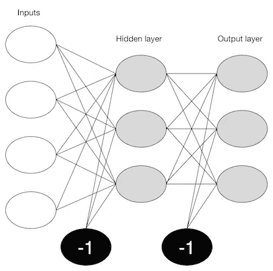
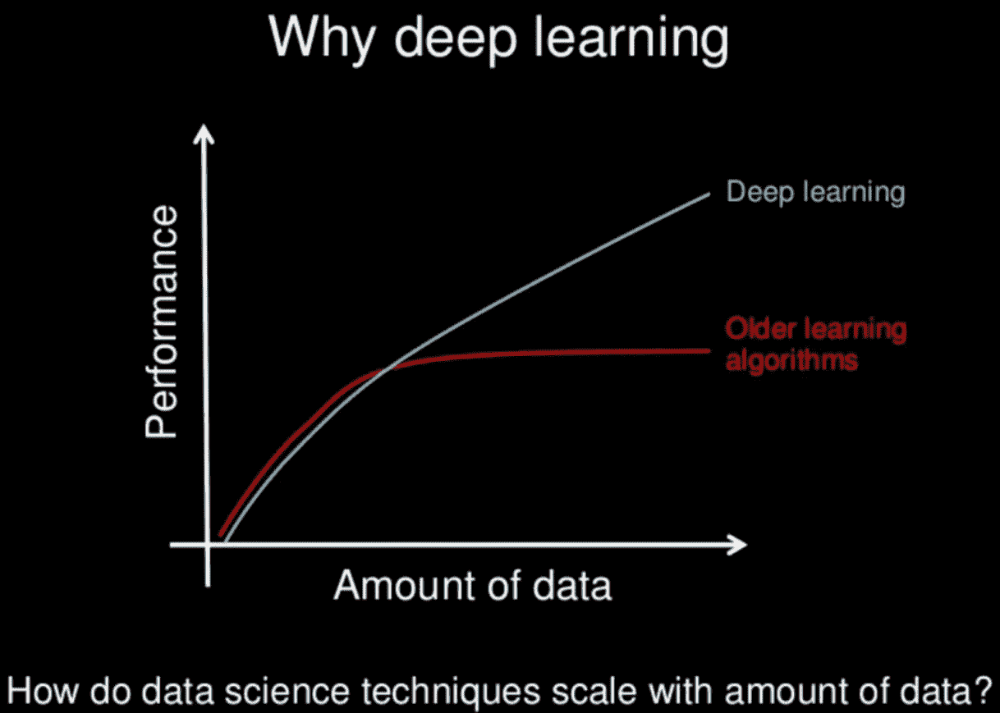
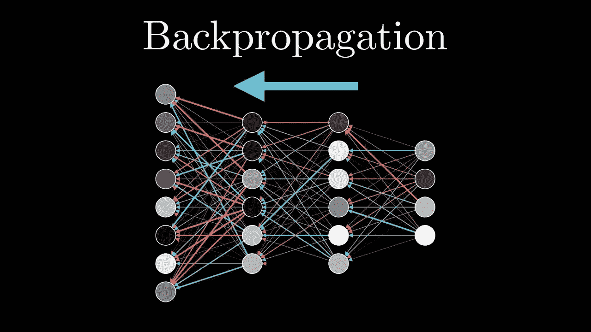
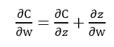
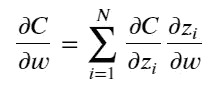
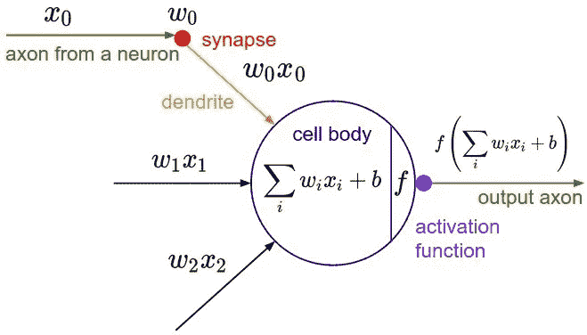
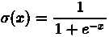
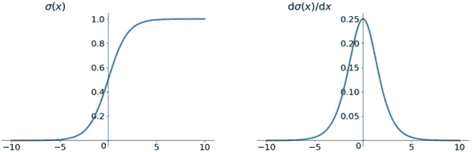
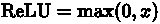
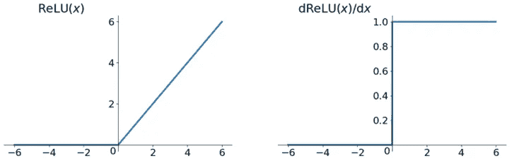

# 深度学习简介

> 原文：<https://medium.com/mlearning-ai/deep-learning-and-its-concepts-30aa243eb14?source=collection_archive---------9----------------------->

## 计算机视觉、深度学习面试问题、神经网络、机器学习、Pytorch、Tensorflow

深度学习是人工神经网络的一个更容易接近的名字。深度学习中的“深”是指网络的深度。人工神经网络可以非常浅。

神经网络受到大脑皮层结构的启发。最基本的是感知器，生物神经元的数学表示。就像大脑皮层一样，可以有几层相互连接的感知器。

第一层是输入层。这一层中的每个节点接受一个输入，然后将其输出作为输入传递给下一层中的每个节点。同一层中的节点之间通常没有连接，最后一层产生输出。

我们称中间部分为隐藏层。这些神经元与外界没有联系(例如输入或输出)，只被前一层的节点激活。

Neural Network Diagram

## **为什么深度学习比机器学习好？**

传统的机器学习算法解决了我们的许多案例，但在处理高维数据时，它们并不有用，因为在高维数据中我们有大量的输入和输出。例如，在手写识别的情况下，我们有大量的输入，其中我们将有与不同类型的手写相关联的不同类型的输入

第二个主要挑战是告诉计算机它应该寻找哪些特征，这些特征将在预测结果中发挥重要作用，同时实现更高的准确性。

## **利用深度学习可以解决什么样的问题？**

深度学习用于以模仿人类解决问题的方式来解决问题。

我们可以使用深度学习来解决图像识别、物体检测和自然语言处理等问题——翻译、造句、文本到语音、语音到文本对动作语义的理解

# 深度学习概念

## 在本文中，我将涵盖以下六个概念:

> 1.损失函数与成本函数
> 
> 2.输入层、隐藏层和输出层
> 
> 3.反向传播
> 
> 4.链式法则
> 
> 5.激活功能
> 
> 6.权重初始化。

# **1。损失函数 vs 成本函数:**

损失函数计算单个训练示例的误差。

成本函数计算整个训练示例的误差。

# **2** 。**输入层、隐藏层和输出层**

第一层是输入层。这一层中的每个节点接受一个输入，然后将其输出作为输入传递给下一层中的每个节点。同一层中的节点之间通常没有连接，最后一层产生输出。

我们称中间部分为隐藏层。这些神经元与外界没有联系(例如输入或输出)，只被前一层的节点激活。

# **3** 。**反向传播**

反向传播是神经网络训练的本质，也是基于前一时期获得的错误率微调神经网络权重的方法。权重的适当调整使我们能够降低错误率，并通过提高其泛化能力来使模型可靠。

反向传播是“误差反向传播”的简称这是训练人工神经网络的标准方法。这有助于计算损失函数相对于网络中所有权重的梯度。推导反向传播涉及向量函数的链式法则的许多巧妙应用。

# **4。链式法则**

链式法则是一种计算函数导数的方法，该函数的变量本身就是其他变量的函数。如果 c 是标量𝑧的标量值函数，而𝑧本身是另一个标量变量𝑤的标量值函数，那么链规则规定

对于不止一个变量的标量值函数，链式法则实质上变成了加法法则。换句话说，如果𝐶C 是𝑁N 变量𝑧1,…,𝑧𝑁z1,…,zN 的标量值函数，每个变量都是某个变量𝑤w 的函数，则链式法则表示

# **5。激活功能**

激活函数有助于确定神经网络的输出。这些类型的函数附加到网络中的每个神经元，并根据每个神经元的输入是否与模型的预测相关来确定是否应该激活它。

激活函数还有助于将每个神经元的输出标准化到 1 和 0 之间或-1 和 1 之间的范围。

在神经网络中，输入被输入到输入层的神经元中。每个神经元都有一个权重，输入数乘以权重就得到神经元的输出，输出传递到下一层。

激活函数是馈送当前神经元的输入和去往下一层的输出之间的数学“门”。它可以像阶跃函数一样简单，根据规则或阈值打开或关闭神经元输出。

## **常用激活功能:**

**a . s 形函数**

函数公式和图表如下

Sigmoid 函数是深度学习开始时最常用的激活函数。这是一个容易推导的平滑函数。

在 sigmoid 函数中，我们可以看到它的输出在开区间(0，1)。我们可以想到概率，但严格意义上，不要把它当成概率。乙状结肠函数再次流行起来。它可以被认为是神经元的放电频率。中间斜率比较大的地方，是神经元的敏感区。在坡度非常平缓的一侧，是神经元的抑制区。

**B .双曲正切函数**

双曲正切函数公式和曲线如下

双曲正切函数。双曲正切函数和 sigmoid 函数的曲线相对相似。我们来对比一下。首先，输入大或小时，输出几乎平滑，梯度小，不利于权重更新。区别在于输出间隔。

tanh 的输出区间为 1)，整个函数以 0 为中心，比 sigmoid 要好。

在一般的二进制分类问题中，双曲正切函数用于隐藏层，sigmoid 函数用于输出层。但这些都不是一成不变的，具体要用的激活函数，要根据具体问题具体分析，还是要看调试。

**C** 。 **ReLU 功能**

ReLU 函数公式和曲线如下

ReLU 函数实际上是取最大值的函数。注意这不是完全区间可导的，但是我们可以取一个次梯度，如上图所示。ReLU 虽然简单，但却是近年来的重要成果。

ReLU(整流线性单位)功能是目前比较流行的激活功能。

# **6。权重初始化**

重量初始化有两种主要类型:-零初始化和随机初始化。

**零初始化**:在此过程中，偏差和权重被初始化为 0。如果权重被设置为 0，则权重矩阵中关于损失函数的所有导数变得相等。因此，在随后的迭代中，权重都不会改变。将偏移设置为 0 会抵消它可能产生的任何影响。

由于零初始化，所有隐藏单元变得对称。一般来说，零初始化对于分类来说不是非常有用或准确，因此在需要任何分类任务时必须避免。

**随机初始化**:与 0 初始化相比，这包括为权重设置随机值。唯一的缺点是设置非常高的值将增加学习时间，因为 sigmoid 激活函数映射接近 1。同样，如果设置的值较低，随着激活函数映射接近 0，学习时间会增加。

因此，设置过高或过低的值通常会导致渐变爆炸或消失的问题。

类似“He 初始化”和“Xavier 初始化”的新型权重初始化也已经出现。这些都是基于特定的方程，这里没有提到，因为它们非常复杂。

*更多内容请看*[***plain English . io***](https://plainenglish.io/)*。报名参加我们的* [***免费周报***](http://newsletter.plainenglish.io/) *。关注我们关于*[***Twitter***](https://twitter.com/inPlainEngHQ)*和*[***LinkedIn***](https://www.linkedin.com/company/inplainenglish/)*。查看我们的* [***社区不和谐***](https://discord.gg/GtDtUAvyhW) *加入我们的* [***人才集体***](https://inplainenglish.pallet.com/talent/welcome) *。*

 [## Mlearning.ai 提交建议

### 如何成为 Mlearning.ai 上的作家

medium.com](/mlearning-ai/mlearning-ai-submission-suggestions-b51e2b130bfb)