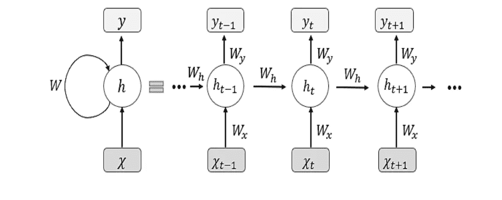
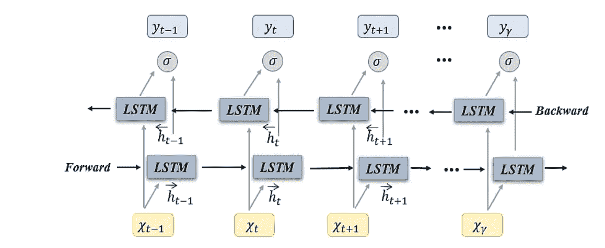

# 深度学习定义备忘单:序列模型版本

> 原文：<https://medium.com/mlearning-ai/deep-learning-definition-cheatsheet-sequence-model-version-b292b1a90cbc?source=collection_archive---------1----------------------->

> 本文面向已经了解深度学习和序列模型的基本机制，并希望快速复习核心概念的人。

深度学习已经深深扎根于我们日常生活的许多方面。现在的人们可以很容易地免费获得高质量的深度学习教育。学了这么多之后，你的大脑会不知所措，所有的信息在你的大脑里变得混杂和纠结。本文概述了序列模型的定义和一些主要功能，包括 RNNs，LSTM，GRU，比尔斯特姆。

# 递归神经网络

RNN Architecture

## 主要功能

1.  克服了传统神经网络的限制，传统神经网络不能共享跨输入数据的不同位置学习的特征。
2.  使用时间上的反向传播来计算梯度。
3.  它有参数 W，在某个时间步长(Xt)的输入向量。在每个时间步长使用相同的函数和相同的参数集(在每个时间步长保持单个隐藏向量)。

## 限制

1.  遭受消失梯度问题，因此在处理长序列时丢失有用信息，这也被称为长期依赖性问题。
2.  计算量大且速度慢。该模型通过整个序列向前和向后传播，以计算损耗和梯度。

# **LSTM(长短期记忆)**

LSTM Structure

## 主要功能

1.  RNN 体系结构的一种变体——它不是在每个时间步长保持单个隐藏向量，而是在每个时间步长保持两个不同的隐藏向量(使用以前的隐藏状态和当前状态来计算更新的隐藏状态)。
2.  LSTM 的结构:*输入门、遗忘门、输出门、门电路
    -* ***输入门*** *:* 是否写入单元(范围:0–1)
    -***遗忘门*** :是否擦除单元(范围:0–1)
    -***门电路*** :写入单元多少(范围:-1–1
3.  Sigmoid 函数输出 0-1 之间的数字。0 表示不允许任何内容通过，1 表示允许所有内容通过。
4.  隐藏状态与单元格状态的区别
    - ***隐藏状态*** :记住前一事件的信息，并在每个时间步忘记/覆盖。
    -**-*单元格状态*** :携带当前状态下远近时间步长的信息，创建一条不间断的梯度公路。单元状态是长期记忆，它通过用遗忘门实现逐点乘法并将输入门和输出门的逐点乘法的结果相加来存储来自先前单元的信息。

## 限制

1.  计算量大且训练时间长。
2.  复杂的架构，但无法完全消除渐变消失的问题。
3.  无法从当前时间步长的另一侧获取信息。

# GRU(门控循环单元)

## 主要功能

1.  提高了 LSTM 的设计复杂度和训练速度。
2.  GRU 的结构:*更新门，重置门*
    - ***更新门*** :从前一时间步(0–1)通过多少信息。LSTM 中遗忘门和输入门的组合。
    -**-*复位门*** :要从之前的时间步长(0-1)中忘记多少信息。
3.  它没有保存长期记忆的细胞状态。GRU 只有隐藏状态，能够保存长期和短期依赖的有用信息。

## 限制

1.  收敛慢，学习效率低(见*参考文献 1* )。

# 双向长短期记忆

Bidirectional LSTM Architecture

## 主要功能

1.  这是一个由两个 LSTMs 组成的强大算法。它包含先前和未来时间步的信息。
2.  在序列的开头安装一个 LSTM，在序列的结尾安装另一个 LSTM。
3.  提高模型捕获序列中上下文信息的能力。

## 限制

1.  在做预测之前，你需要完整的数据序列。因此，它在实时应用中的部署有许多限制
2.  计算成本高且速度慢。
3.  将深层叠加到一定程度会产生消失梯度问题。

*参考文献*

1.  物理学杂志| [王欣等 2019 J. Phys.: Conf。爵士。 **1325** 012089](https://iopscience.iop.org/article/10.1088/1742-6596/1325/1/012089/pdf)