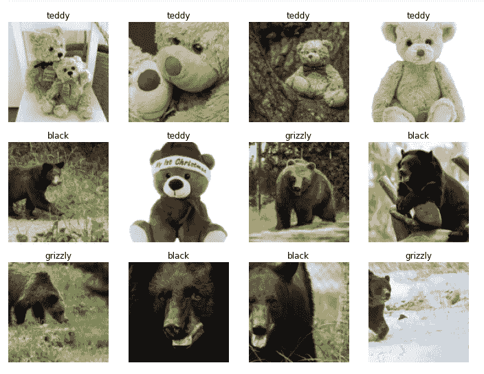
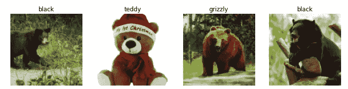
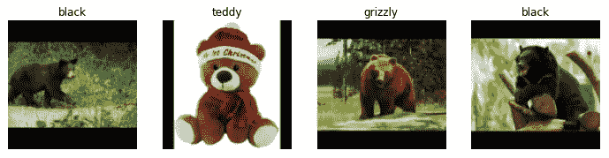
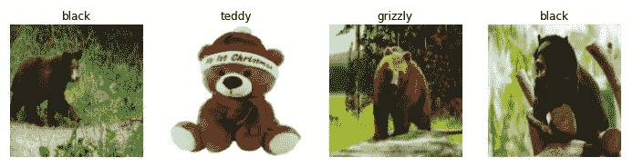
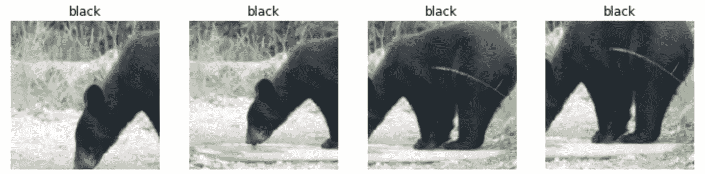
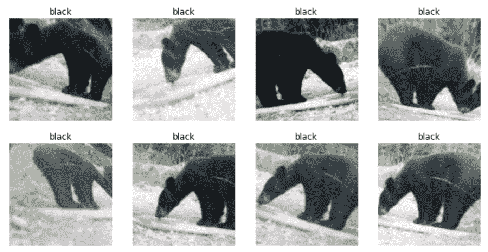
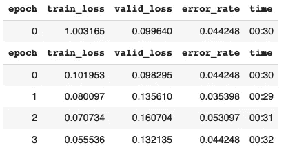
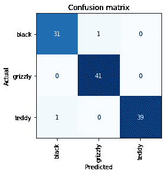
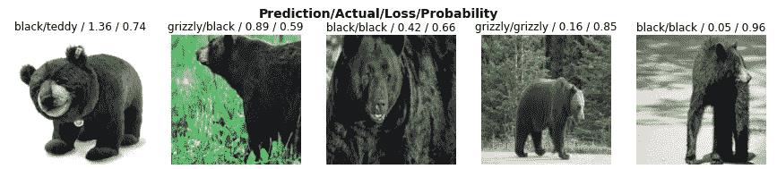
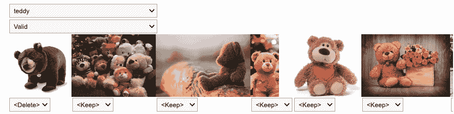

# 使用 PyTorch & Fastai & DuckDuckGo API 进行熊图像分类的深度学习

> 原文：<https://medium.com/mlearning-ai/deep-learning-for-bear-image-classification-using-pytorch-fastai-duckduckgo-api-89bb7452c730?source=collection_archive---------2----------------------->

让我们在 google colab 中安装环境。

查看我的 ipynb 文件[这里](https://github.com/SueGK/course22Fastai/blob/master/mynotes/02_Deployment.ipynb)！

```
#hide
! [ -e /content ] && pip install -Uqq fastbook
import fastbook
fastbook.setup_book()#hide
from fastbook import *
from fastai.vision.widgets import *
```

# 通过 DuckDuckGo API 收集数据

```
bear_types = 'grizzly','black','teddy' # define types of bear that we'd like to download the images
path = Path('bears')
if not path.exists():
  path.mkdir()  # create a directory to save downloaded images
  for o in bear_types:
    dest = (path/o)
    dest.mkdir(exist_ok=True)
    urls = search_images_ddg(f' {o} bear') # search images through DuckDuckGo
    download_images(dest, urls=urls) # download all the URLs for each of our search terms. We'll put each in a separate folderfns = get_image_files(path) # 
fns(#568) [Path('bears/teddy/f97da50d-4f1a-4a62-ad93-0575d8fe92ae.jpeg'),Path('bears/teddy/669d7bba-02a8-411e-b70f-b8bd82628121.jpg'),Path('bears/teddy/af9a2a15-07e5-4a3b-a202-e89856d7d42a.jpg'),Path('bears/teddy/22e4d7e7-fb15-4244-9ebd-d10f1af97624.jpg'),Path('bears/teddy/f2191ec9-fc7c-43f4-b9bf-57cdbb703354.jpg'),Path('bears/teddy/473cc5d8-11cb-40aa-b478-e054edfda62e.jpeg'),Path('bears/teddy/4aa392b2-c12b-4c23-8cce-67bebfdd7d80.jpg'),Path('bears/teddy/525f957c-446c-4308-97cb-ad052405d51a.jpg'),Path('bears/teddy/3c6208c5-20cc-49bf-a428-8703fc9af235.jpg'),Path('bears/teddy/91282a54-eafa-44e0-82bb-a610d8625141.jpg')...]# Often when we download files from the internet, there are a few that are corrupt. Let's check:
failed = verify_images(fns)# remove all the failed images
failed.map(Path.unlink)(#0) []
```

# 从数据到数据加载器

```
bears = DataBlock(
    # provide a tuple where we specify what types we want for the independent and dependent variables:
    blocks=(ImageBlock, CategoryBlock), # What kinds of data we are working with
    get_items=get_image_files, # How to get the list of items
    splitter=RandomSplitter(valid_pct=0.2, seed=42), # How to create the validation set
    get_y=parent_label, # How to label these items, gets the name of the folder a file is in
    item_tfms=Resize(128)) # Transformation: picture resize
​dls = bears.dataloaders(path) # the path where the images can be founddls.train.show_batch(max_n=4, nrows=1) # check training set
dls.valid.show_batch(max_n=4, nrows=1) # check validation set
dls.show_batch(max_n=4, nrows=1) # check data
​
```



# 不同类型的图像变换

# 调整大小

# 1.调整默认值

默认情况下，Resize 使用全宽或全高裁剪图像以适合所需大小的正方形。这可能会导致丢失一些重要的细节。



# 2.用零填充图像(黑色)

`bears = bears.new(item_tfms=Resize(128, ResizeMethod.Pad, pad_mode='zeros')`



# 3.挤压/拉伸图像:

`bears = bears.new(item_tfms=Resize(128, ResizeMethod.Squish)`



相反，我们在实践中通常做的是随机选择图像的一部分，并只裁剪该部分。在每个时期(这是一个完整的通过我们在数据集中的所有图像)，我们随机选择每个图像的不同部分。这意味着我们的模型可以学习关注和识别我们图像中的不同特征。这也反映了图像在现实世界中的工作方式:同一事物的不同照片可能会以略微不同的方式被裱起来。

# RandomResizedCrop

`item_tfms=RandomResizedCrop(128, min_scale=0.3)`



# 数据扩充

`batch_tfms=aug_transforms(mult=2)`



```
# Default
dls.valid.show_batch(max_n=4, nrows=1)# Pad
bears_pad = bears.new(item_tfms=Resize(128, ResizeMethod.Pad, pad_mode='zeros'))
dls_pad = bears_pad.dataloaders(path)
dls_pad.valid.show_batch(max_n=4, nrows=1)# Squish
bears_squish = bears.new(item_tfms=Resize(128, ResizeMethod.Squish))
dls_squish = bears_squish.dataloaders(path)
dls_squish.valid.show_batch(max_n=4, nrows=1)# RandomResizedCrop
​
# min_scale: determines how much of the image to select at minimum each time:
bears_random = bears.new(item_tfms=RandomResizedCrop(128, min_scale=0.3))
dls_random = bears_random.dataloaders(path)
dls_random.train.show_batch(max_n=4, nrows=1, unique=True)
# unique=True to have the same image repeated with different versions of this RandomResizedCrop transform.# Data Augmentation
bears_aug = bears.new(item_tfms=Resize(128), batch_tfms=aug_transforms(mult=2))
dls_aug = bears_aug.dataloaders(path)
dls_aug.train.show_batch(max_n=8, nrows=2, unique=True)
```

# 获取模型并使用它来清理您的数据

```
bears = bears.new(
    item_tfms=RandomResizedCrop(224, min_scale=0.5),
    batch_tfms=aug_transforms())
dls = bears.dataloaders(path)learn = vision_learner(dls, resnet18, metrics=error_rate)
learn.fine_tune(4)​
```



# 纠错

# 1.混淆矩阵

让我们看看这个模型所犯的错误是否主要是认为灰熊是泰迪熊(这对安全不利！)，或者说灰熊是黑熊，或者别的什么。

```
interp = ClassificationInterpretation.from_learner(learn)
interp.plot_confusion_matrix()
```



# 2.plot _ top _ losses

这有助于了解我们的错误究竟发生在哪里，以及它们是否是由于数据集问题(例如，图像根本不是熊，或者标记不正确，等等)。)，或者一个模型问题(也许它没有处理用不寻常的光线拍摄的图像，或者从不同的角度拍摄的图像，等等。).为了做到这一点，我们可以根据图像的损失对其进行分类。

如果模型是不正确的(尤其是如果它也相信它的错误答案)，或者如果它是正确的，但不相信它的正确答案，损失是一个更高的数字。

```
interp.plot_top_losses(5, nrows=1)
```



# 模型错误检查后清除数据

进行数据清理的直观方法是在训练模型之前进行。但是正如您在这个案例中看到的，模型实际上可以帮助您更快更容易地发现数据问题。因此，我们通常更喜欢先训练一个快速简单的模型，然后用它来帮助我们清理数据。

fastai 包括一个方便的数据清理 GUI，称为 ImageClassifierCleaner，允许您选择类别和训练与验证集，并查看丢失率最高的图像(按顺序)，以及允许选择图像进行删除或重新标记的菜单:

```
#hide_output
cleaner = ImageClassifierCleaner(learn)
cleaner
```



*   ImageClassifierCleaner 实际上不会为您删除或更改标签；**它只返回要更改的项目的索引。**
*   要删除(取消链接)所有选择删除的图像，我们将运行:

`for idx in cleaner.delete(): cleaner.fns[idx].unlink()`

*   要移动我们选择了不同类别的图像，我们可以运行:

`for idx,cat in cleaner.change(): shutil.move(str(cleaner.fns[idx]), path/cat)`

# 模型应用

# 使用模型进行推理

模型由两部分组成:

*   **架构**
*   **训练好的参数**

预测结果:

*   `('grizzly', TensorBase(1), TensorBase([0.0546, 0.9432, 0.0022]))`
*   与您最初提供的格式相同的预测类别(在本例中是一个字符串)
*   预测类别的索引
*   每个类别的概率。
*   最后两个基于数据加载器的 vocab 中的类别顺序；即所有可能类别的存储列表。在推理时，您可以将数据加载器作为学习者的属性进行访问:

`learn_inf.dls.vocab`

`Outcome: (#3) ['black','grizzly','teddy']`

```
learn.export() # fastai will save a file called "export.pkl"
​
# check if the file exists
path = Path()
path.ls(file_exts='.pkl')(#1) [Path('export.pkl')]
```

# 在笔记本电脑中部署您的应用

```
# create our inference learner from the exported file
learn_inf = load_learner(path/'export.pkl')# get predictions for one image at a time
learn_inf.predict('images/grizzly.jpg')('grizzly', TensorBase(1), TensorBase([0.0546, 0.9432, 0.0022]))
```

# 参考

[程序员实用深度学习— 2:部署](https://course.fast.ai/Lessons/lesson2.html)

[](/mlearning-ai/mlearning-ai-submission-suggestions-b51e2b130bfb) [## Mlearning.ai 提交建议

### 如何成为 Mlearning.ai 上的作家

medium.com](/mlearning-ai/mlearning-ai-submission-suggestions-b51e2b130bfb)