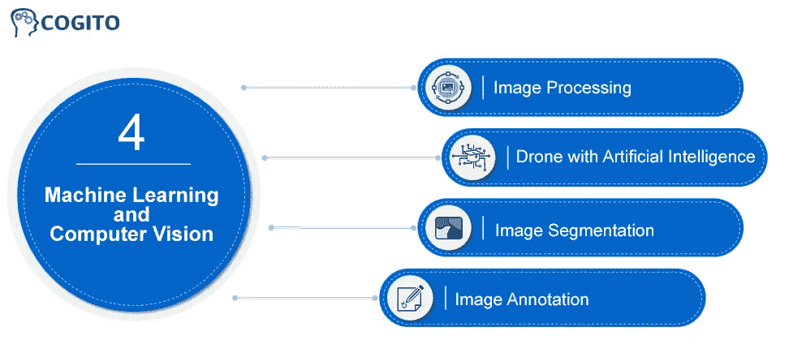

# 计算机视觉中的深度学习:原理和应用

> 原文：<https://medium.com/mlearning-ai/deep-learning-in-computer-vision-principles-and-applications-ae5f8511c938?source=collection_archive---------7----------------------->

最近有很多关于计算机视觉的可能用途的讨论。这项技术在很大程度上复制了人类的视觉，可以对图片进行广泛的分析。然而，许多人似乎不确定计算机视觉和机器学习之间的区别。鉴于这两种技术(计算机视觉和机器学习)的广度有多少重叠，这是可以理解的。

机器学习和计算机视觉都是人工智能 AI 的子集，人工智能是一个包含广泛技术的广义词。在这篇博客中，我们将重点关注机器学习和计算机视觉之间的差异，这两者都需要对视觉输入进行解释。

为了进一步了解这些技术(机器学习和计算机视觉)带来了什么，我们将看看它们的定义、应用和未来。

# 什么是机器学习和计算机视觉？

让计算机在没有明确编程的情况下运行的技术被称为机器学习。在过去十年中，自动驾驶汽车、语音识别、成功的在线搜索以及对人类基因组的进一步了解都是通过机器学习实现的。机器学习现在如此普遍，以至于你可能每天都在不知不觉中使用它成千上万次。许多研究人员认为这是接近人类水平人工智能的最有效技术。

另一方面，计算机视觉是计算机科学的一个分支，它致力于开发能够像人一样处理、解释和理解视觉输入(图片或视频)的计算机网络。计算机视觉的前提是教会计算机如何在像素级别解释和理解图像。从技术上来说，机器使用复杂的软件算法来检索视觉输入，处理它，并解释这些发现。

## 机器学习在计算机视觉中的应用

如今，机器学习和计算机视觉技术被常规用于产生能够产生快速和准确结果的强大系统和算法。用于计算机视觉应用的机器学习模型包括支持向量机(SVM)、神经网络(NN)和概率图形模型。

在下面的章节中，我们将看看几个使用机器学习模型的计算机视觉应用程序。

**图像处理**

图像处理需要修改或转换图像数据，以提高图像质量或提取重要信息。图像处理学科已经取得了重大进展，复杂的机器学习和计算机视觉算法现在被用来快速准确地分析巨大的数据集，以检测隐藏的模式。

遥感、农业、3D 绘图和其他部门都采用了人工智能图像处理。

**具有人工智能的无人机**

另一个由机器学习模型实现的高效计算机视觉应用是用于无人机的人工智能驱动软件。人工智能(AI)无人机软件是一项强大而复杂的技术，在各个领域都有广泛的应用，从航空测绘到建模和分析。

**图像分割**

计算机视觉辅助的图像分割是图像处理技术发展的下一步。这种方法已经彻底改变了商业，并为高科技的未来打下了基础。这种方法还支持科技行业在更困难的领域进行实验，使以前被认为是奇迹的事情变得实际可行。

**图像标注**

图像标注是计算机视觉和机器学习领域的前沿和热门应用。图像注释软件使用计算机视觉和机器学习技术来感知、解释、分析和分割视觉数据(视频和图像)中的不同项目。结果，用户可以快速且精确地注释大规模的照片。

注释图像也是训练 AI 和机器学习系统的一个有价值的工具。因此，算法的模式识别精度提高了，机器学习或人工智能算法产生的输出质量也提高了。有几个数据标签公司，像 **Cogito** 和 **Anolytics.ai** 可以为你的人工智能模型提供高质量的图像注释服务

**结论**

总结一下**计算机视觉**与机器学习的对比，这两种视觉技术在未来都有光明的前景。这两种视觉系统的技术每天都在发展，科学家们不断发现可以提高系统的质量和精度。**最初发表于**——[计算机视觉的有趣机器学习模型](https://datafloq.com/read/interesting-machine-learning-models-for-computer-vision/)

 [## Mlearning.ai 提交建议

### 如何成为 Mlearning.ai 上的作家

medium.com](/mlearning-ai/mlearning-ai-submission-suggestions-b51e2b130bfb)