# 用于肺癌检测的深度学习模型

> 原文：<https://medium.com/mlearning-ai/deep-learning-model-for-lung-cancer-detection-5219b27a0947?source=collection_archive---------2----------------------->

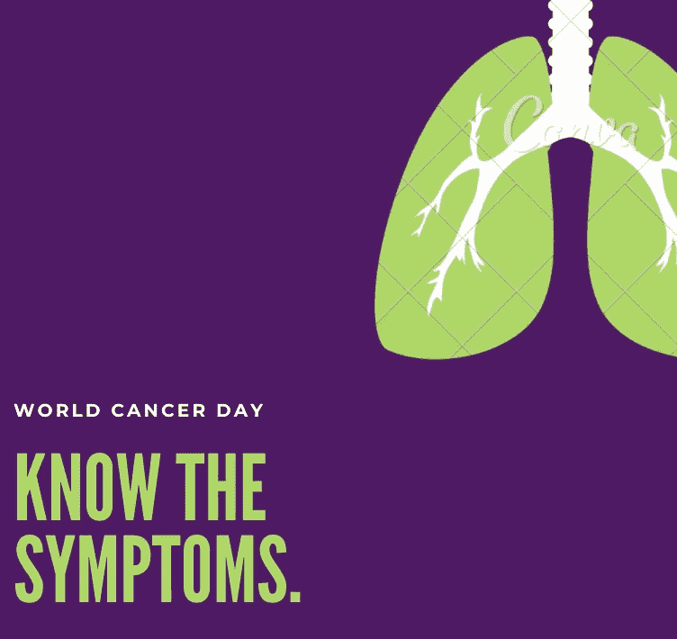

Image by Canva

癌症已经成为许多人生活的一部分，当家人、朋友和爱人告诉我们他们患有癌症时，这总是一个令人振奋的消息。

关于为什么有人会得这种威胁生命的疾病，有很多原因，包括遗传、习惯、生活方式等等。当人们被诊断患有癌症时，最常见的选择是接受治疗或手术。

很明显，预防比治愈癌症更好，有了预防，许多人可以过上更好、更充实的生活。但问题是，没有多少人有意识去进行定期检查，如果有咳嗽或疲劳等小症状，大多数人会忽视它们。

因此，在这篇文章中，我使用 Keras 开发了一个深度学习模型，以检测具有一系列症状的特定人是否患有癌症。

本文的数据集可以从[这里](https://www.kaggle.com/mysarahmadbhat/lung-cancer)下载。它包含每个具有症状的个体的肺癌状态。

## 用于肺癌检测的深度学习模型

目的:利用 Keras 模型判断个体是否患有癌症

指导方针:

1.  数据准备
2.  数据分析和可视化
3.  数据预处理
4.  训练和评估模型

列描述:

1.  性别:男，女
2.  年龄:患者的年龄
3.  吸烟:是=2，否=1。
4.  黄手指:是=2，否=1。
5.  焦虑:是=2，否=1。
6.  Peer_pressure:是=2，否=1。
7.  慢性病:是=2，否=1。
8.  疲劳:是=2，否=1。
9.  过敏:是=2，否=1。
10.  喘息:是=2，否=1。
11.  酒精:是=2，否=1。
12.  咳嗽:是=2，否=1。
13.  气短:是=2，否=1。
14.  吞咽困难:是=2，否=1。
15.  胸痛:是=2，否=1。
16.  肺癌:有，没有。

## **1。数据准备**

```
df = pd.read_csv('/kaggle/input/lung-cancer/survey lung cancer.csv')
df.info()
```

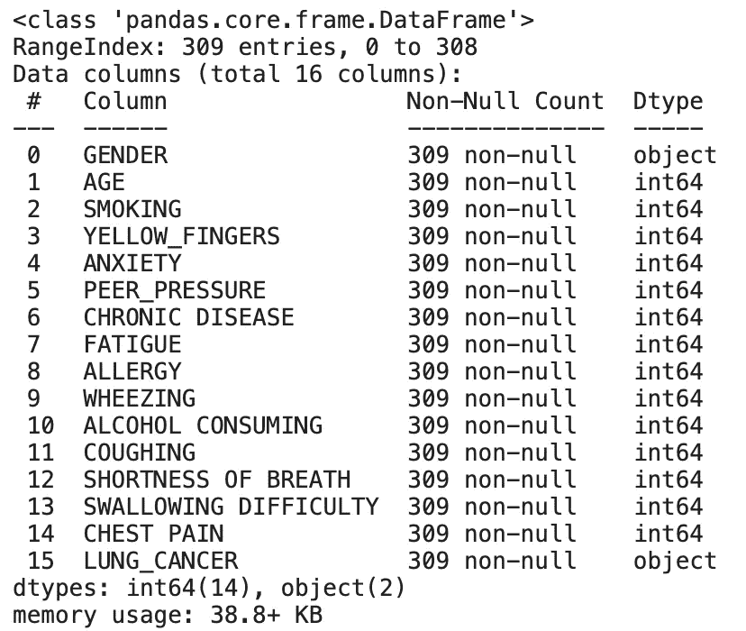

数据集包含 309 行 16 列，数据集中没有空值。

让我们看看上面的数据中是否有重复的行。

```
#Duplicate Checkingprint(f'Total Duplicated Rows : {df.duplicated().sum()}')
```

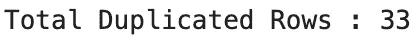

在下一段代码中，我们将从数据集中删除重复的行，以保持模型的准确性

```
#Remove Duplicated Rowsdf = df[~df.duplicated()]
print(f'Total Duplicated Rows : {df.duplicated().sum()}')
```

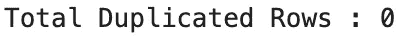

删除重复后，我们将把包含字符串值的列替换到类(1 和 0)中。

```
#Changing Value for Gender Column Male : 1, Female : 0df['GENDER'] = df['GENDER'].replace({'M' : 1, 'F' : 0})
df['GENDER'].value_counts()
```

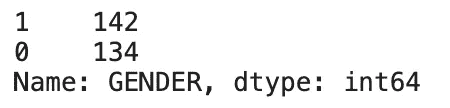

```
lung_key = {'YES' : 1, 'NO' : 0}df['LUNG_CANCER'] = df['LUNG_CANCER'].replace(lung_key)
df['LUNG_CANCER'].unique()
```

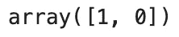

现在，我们的数据集已经准备好进行分析和模型开发了。

## 2.数据分析和可视化

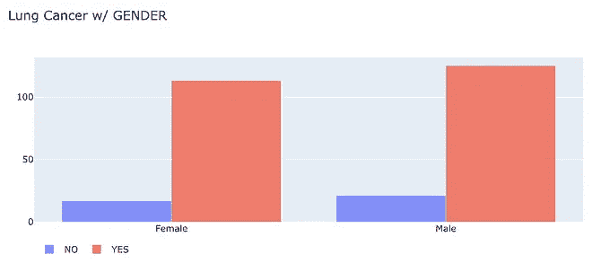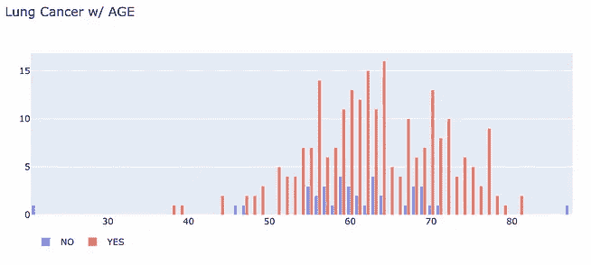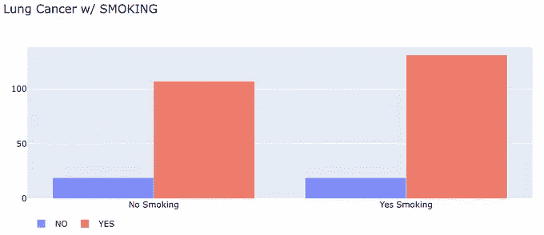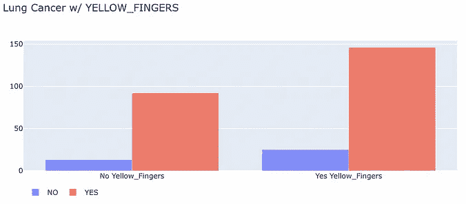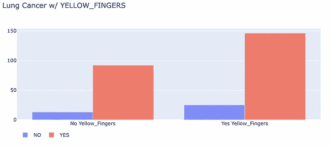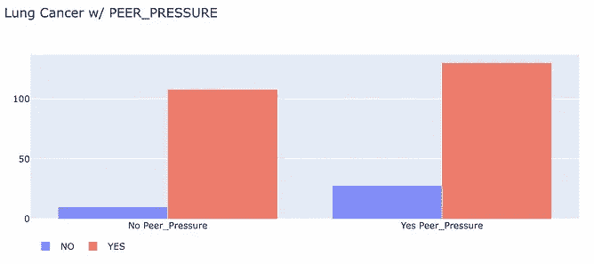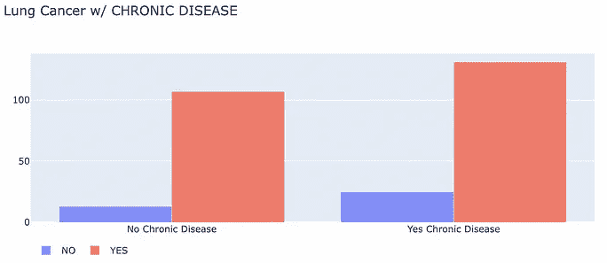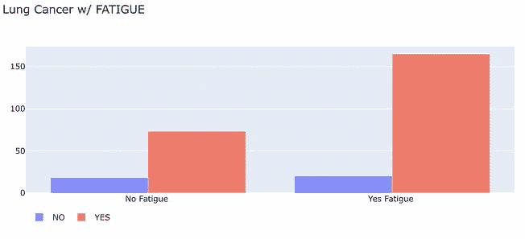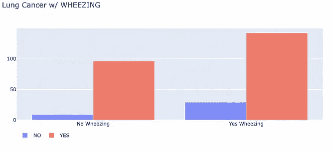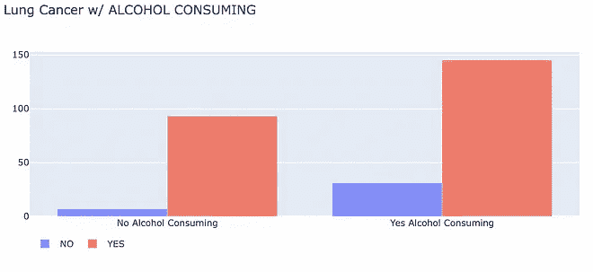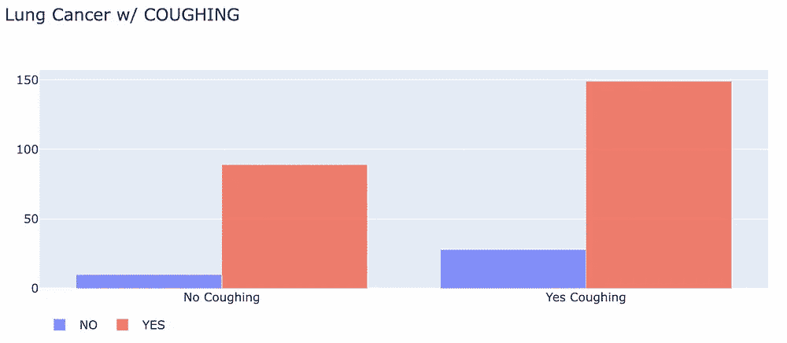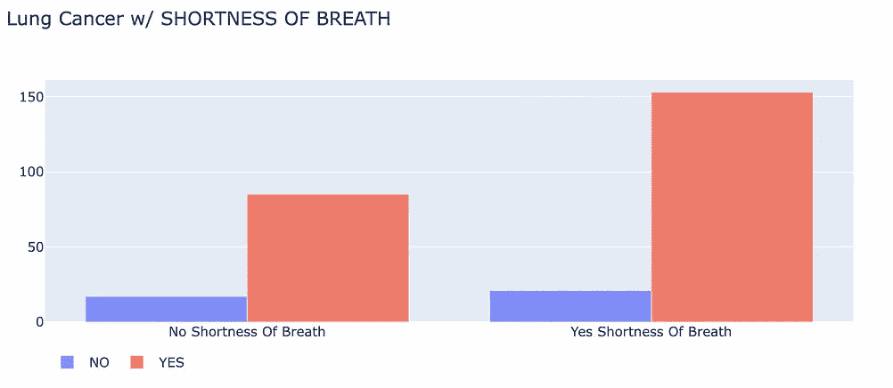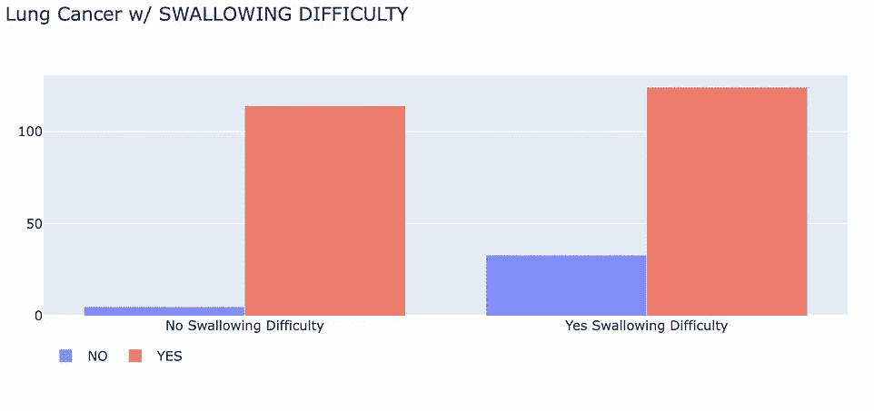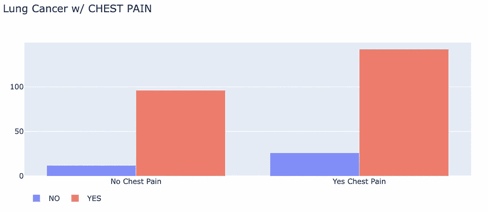

关键见解:

1.  总体而言，男性患肺癌的几率比女性略高(125 比 113)
2.  根据年龄分布，患肺癌的人都是 60 多岁
3.  对于肺癌患者，最常见的症状是胸痛、气短、咳嗽、疲劳、过敏和喘息
4.  此外，与吸烟者相比，酗酒者患癌症的风险更高。

现在，在我们了解肺癌及其症状之间的相关性之后，下一步是预处理我们的数据以训练模型。

## 3.数据预处理

```
from keras.models import Sequential
from keras.layers import Dense
from sklearn.preprocessing import StandardScaler
from sklearn.model_selection import train_test_split
from sklearn.pipeline import Pipeline
from sklearn.compose import ColumnTransformer#Splitting datasetX,y = df[['CHEST PAIN','SHORTNESS OF BREATH','COUGHING','FATIGUE ','ALLERGY ','WHEEZING']], df['LUNG_CANCER']X_train,X_test, y_train, y_test = train_test_split(X,y,test_size = 0.2, random_state= 42)#Scale Features Pipeline
num_features = [x for x in range(len(X.columns))]
num_transformer = Pipeline(steps = [
    ('scale', StandardScaler())
])preprocessor = ColumnTransformer(transformers = [
    ('num', num_transformer, num_features)
])X_train = preprocessor.fit_transform(X_train)
print(X_train)
```

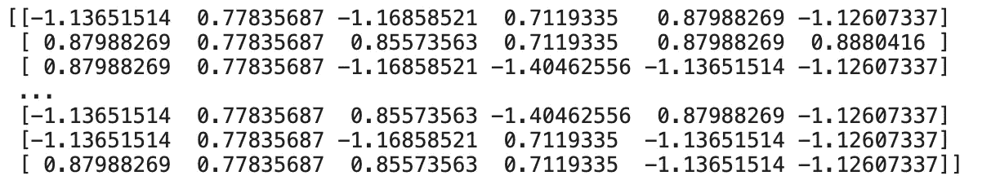

在分割我们的数据并标准化来自特征的值之后。该训练模型了。

## 4.训练和评估模型

```
model = Sequential()

model.add(Dense(6, input_shape = (6,), activation = 'relu'))
model.add(Dense(6, activation = 'relu'))
model.add(Dense(1, activation = 'sigmoid'))

model.compile(loss = 'binary_crossentropy', optimizer = 'adam', metrics = ['accuracy'] )

model.fit(X_train,y_train, epochs= 100, batch_size = 5)
_,scores = model.evaluate(X_test,y_test, verbose = 0)
print(f'Model Accuracy : {round(scores*100)}%')
```


上面的代码是开发深度学习模型所需的步骤。所以从我们的输入、隐藏层和输出开始。

然后，基于其损失、优化器和度量来编译模型。至于 loss 参数，我们放入‘binary _ cross entropy ’,因为目标变量是一个类标签。自变量“adam”是用于训练深度学习模型的随机梯度下降的替换优化算法。

最后，上面的模型显示了 79%的准确性，这意味着它足以确定一个具有上述几种症状和习惯的人是否患有癌症。

我希望这篇文章可以鼓励有抱负的数据科学家更多地解决医疗保健问题，通过开发一个强大的模型来确定某种疾病，我相信许多人可以得救。

此外，非常感谢你们所有的支持和掌声，如果你们有任何建议或意见或建议，请随时在下面给我任何意见。

保持健康，保持安全！

参考资料:

[](https://www.kaggle.com/mysarahmadbhat/lung-cancer) [## 肺癌

### 吸烟会导致肺癌吗？

www.kaggle.com](https://www.kaggle.com/mysarahmadbhat/lung-cancer) [](https://www.kaggle.com/kelvinprawtama/lung-cancer-detection-keras-dlm/notebook) [## 肺癌检测-DLM Keras

### 使用 Kaggle 笔记本探索和运行机器学习代码|使用肺癌数据

www.kaggle.com](https://www.kaggle.com/kelvinprawtama/lung-cancer-detection-keras-dlm/notebook) [](/mlearning-ai/mlearning-ai-submission-suggestions-b51e2b130bfb) [## Mlearning.ai 提交建议

### 如何成为 Mlearning.ai 上的作家

medium.com](/mlearning-ai/mlearning-ai-submission-suggestions-b51e2b130bfb)