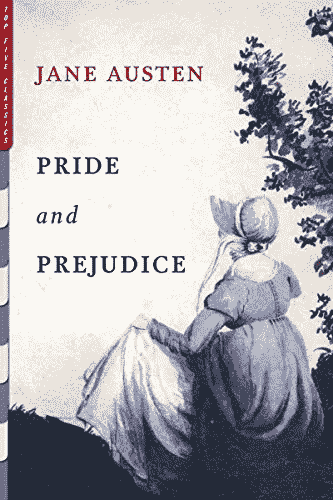

# 使用 Keras LSTM 生成文本的深度学习模型

> 原文：<https://medium.com/mlearning-ai/deep-learning-model-to-generate-text-using-keras-lstm-25ae07b8c2d1?source=collection_archive---------2----------------------->

**深度学习**是我已经回避了一段时间的话题。不知何故，它的潜力令人生畏。我一直觉得深度学习模型很复杂，在我的 Mac OSx 上不太容易使用。我担心我无法拟合一个模型，然后最终看到一些输出。但后来，我建立了一个深度学习模型，用 Keras LSTM 生成文本或故事，只需要很少的…