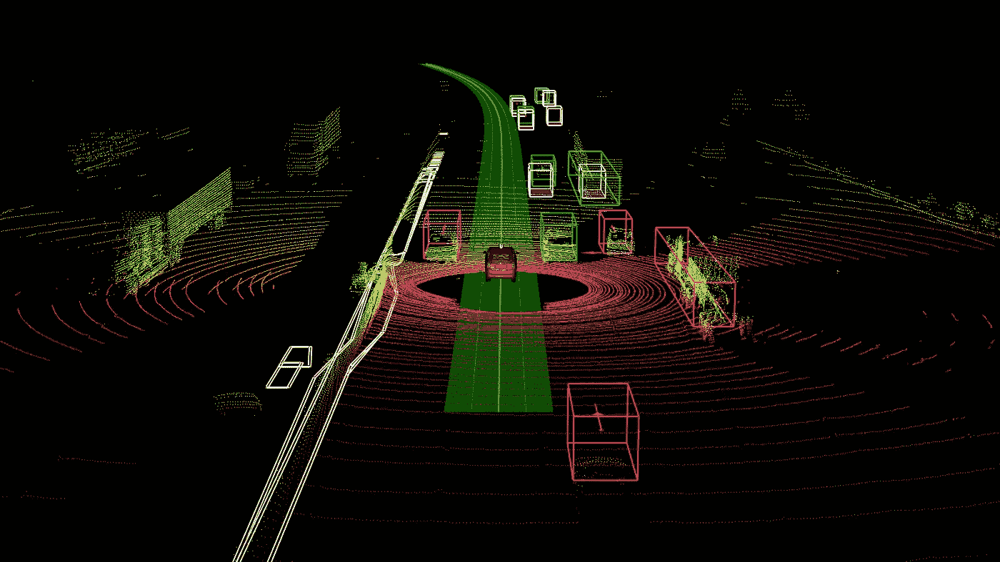

# 三维点云的深度学习

> 原文：<https://medium.com/mlearning-ai/deep-learning-on-3d-point-clouds-1c79d2fc3fd0?source=collection_archive---------0----------------------->

**没有像素和体素的深度学习**

([source](https://navoshta.com/kitti-lidar/))

深度学习被广泛应用于许多领域，具有代表性的数据格式。比如在计算机视觉中，深度学习可以用卷积神经网络消费图像和视频；在 NLP 中，深度学习可以在 LSTM 或变形金刚的主要帮助下消耗文本数据；在 web 或搜索引擎开发中，深度学习可以处理复杂的图形…