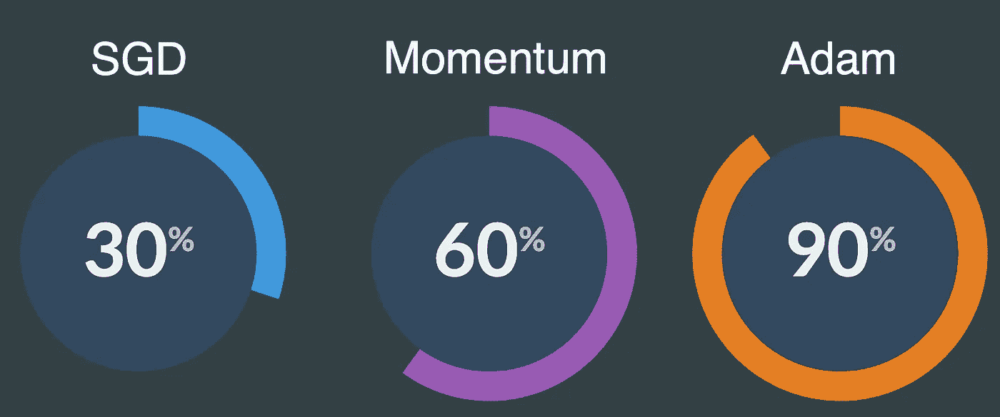
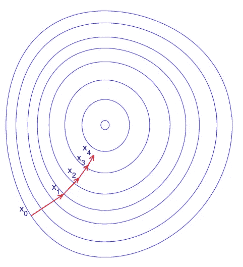
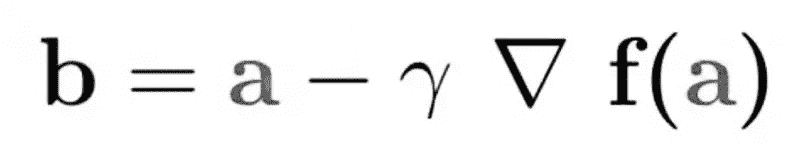
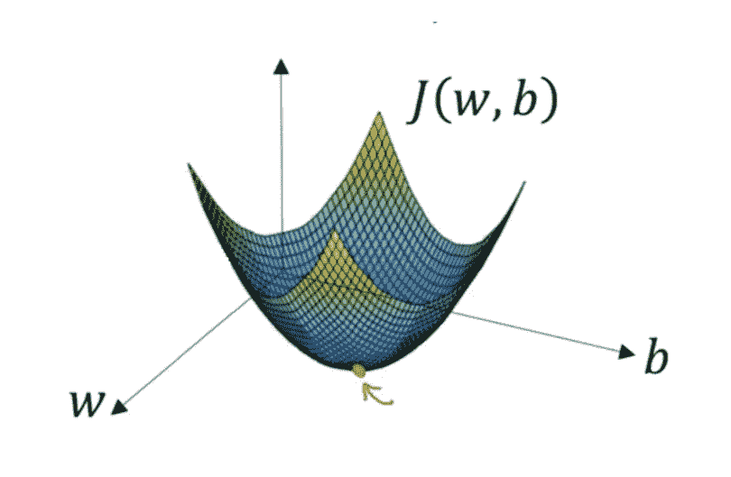
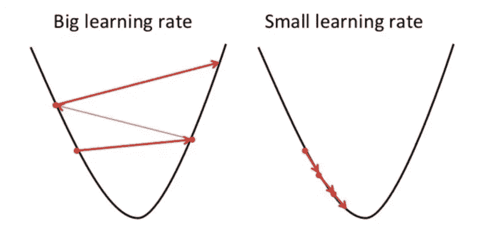
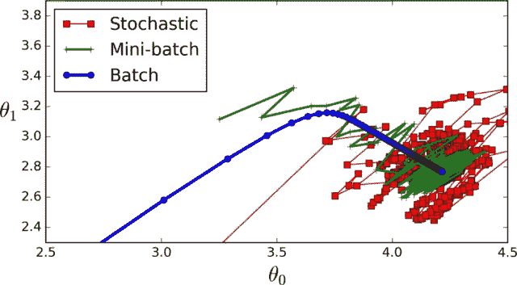
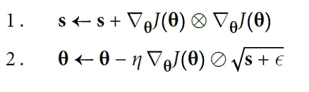
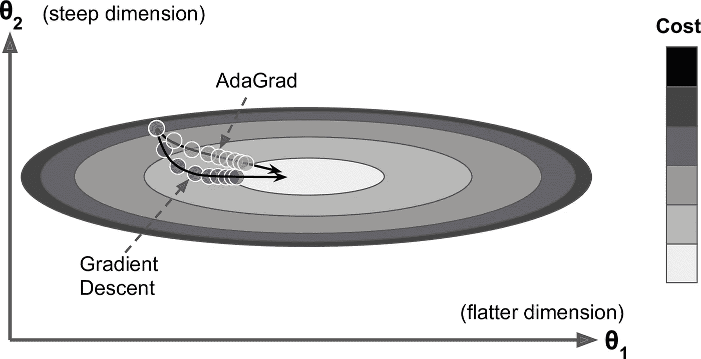
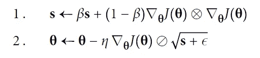
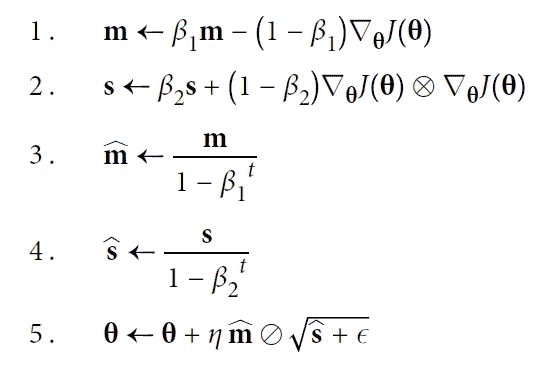

# 深度学习优化器

> 原文：<https://medium.com/mlearning-ai/deep-learning-optimizers-4c13d0799b4d?source=collection_archive---------2----------------------->



在深度学习中，优化器扮演着重要的角色。它在亏损中起着关键作用。基本上，优化确实减少了损失。深度学习中优化器是怎么玩的？那么，如果输入层的权重发生变化，输出层也会发生变化，那么就进入了这个深度学习模型。进一步层用重量。随着事情的发展，我们可能会以模型精确度非常低而告终。在这种情况下，我们可以使用优化器来减少损失。让我们从导致不同优化算法的梯度下降的基础知识开始。

**什么是渐变？**

> **“梯度衡量的是如果你稍微改变输入，函数的输出会有多大的变化。”——莱克斯·弗里德曼(麻省理工学院)**

梯度只是衡量相对于误差变化的权重变化。梯度可以称为函数的斜率。如果梯度更高，那么斜率将更陡，模型可以学习得更快。如果斜率为零，模型停止学习。在数学术语中，梯度是输入的偏导数。

**梯度下降**

梯度下降是一种寻找微分函数局部最小值的优化算法。它用于找到尽可能使成本函数最小的函数参数值。

您已经定义了梯度下降迭代计算的初始参数值，因此该值变为最小值，从而给出了成本函数。

让我们更好理解地解释一下。此时想象一个人在山顶。目标是到达大本营，比如说山脚。这里的问题是这个人是盲人。为什么人会到达底部？。嗯，你必须一小步一小步地向更高的倾斜方向前进。重复这个步骤，直到到达底部的大本营。这就是梯度下降的工作原理。


想象下面的图片从上往下展示了我们的山，红色的箭头是我们登山者的脚步。在这种情况下，可以把梯度想象成一个向量，它包含了被蒙住眼睛的人所能走的最陡的一步的方向，以及这一步应该走多长时间。



注意，从 X0 到 X1 的梯度比从 X3 到 X4 的梯度长得多。这是因为决定向量长度的山的陡度/斜率较小。这完美地代表了山的例子，因为山越往上爬就越不陡。因此，对于爬山者来说，坡度的减小伴随着坡度的减小和步长的减小。

**渐变下降是如何工作的？**

下面的等式描述了梯度下降的作用: *b* 是我们攀登者的下一个位置，而 *a* 代表他当前的位置。负号指的是梯度下降的最小化部分。中间的γ是一个等待因子，梯度项(δf(a))就是最陡下降的方向。



所以这个公式基本上告诉了我们需要去的下一个位置，也就是最陡下降的方向。让我们看另一个例子来真正把这个概念讲清楚。

假设你有一个机器学习问题，想要用梯度下降来训练你的算法，以最小化你的成本函数 *J* ( *w* ， *b* )，并通过调整其参数( *w* 和 *b* )来达到其局部最小值。下图显示横轴代表参数( *w* 和 *b* )，纵轴代表成本函数 *J* ( *w* 、 *b* )。梯度下降是一个凸函数。



我们知道我们想要找到对应于成本函数最小值的 *w* 和 *b* 的值(用红色箭头标记)。为了开始寻找正确的值，我们用一些随机数初始化 *w* 和 *b* 。然后，梯度下降从该点开始(在我们的图示顶部附近的某个地方)，并且在最陡的下行方向上(即，从图示的顶部到底部)一步接一步地前进，直到到达成本函数尽可能小的点。

**学习率是多少？**

在梯度下降算法中，学习速度起着至关重要的作用。它显示了与前一步相比需要采取多少步骤。让我们以上面的攀岩者为例，最重要的是，每一步都是由学习速度决定的。简单的步骤为(学习率*旧步骤)。如果量级是 4.2，学习率是 0.01，那么下一步就是 0.042。这与前一个不同。希望这能阐明为什么学习率在 GD 是重要的。



如果学习率选择作为一个大的学习率，攀登者永远不会到达底部，或者模型不会到达局部最小值。如果学习率很小，那么模型如预期的那样达到局部最小值。

# 梯度下降变体

根据用于计算梯度的数据量，梯度下降有三种变体:

*   批量梯度下降
*   随机梯度下降
*   小批量梯度下降

**批量梯度下降**

批量梯度下降(也称为普通梯度下降)计算数据集中每个观测值的误差，但仅在评估完所有观测值后执行更新。

批量梯度下降不经常使用，因为它代表了计算资源的巨大消耗，因为整个数据集需要保留在内存中。

**随机梯度下降**

随机梯度下降(SGD)为每个观测值执行参数更新。因此，*只需要* *一个*来执行参数更新，而不是循环遍历每个观察值。SGD 通常比批量梯度下降更快，但其频繁更新会导致错误率的方差更高，有时会跳跃而不是降低。


**小批量梯度下降**

它是浴梯度下降和随机梯度下降的组合。小批量梯度下降对一批观测值进行更新。这是神经网络的算法选择，批量大小通常从 50 到 256。



**带动量的新币**

有动量的 SGD 总是比 SGD 快。基本上，动量在这里起着关键作用。动量导致在正确的方向上加速梯度，并导致更快的收敛。想象一个保龄球在光滑的表面上沿着缓坡滚下:它开始时很慢，但它会很快增加动量，直到最终达到极限速度(如果有一些摩擦或空气阻力)。这是背后非常简单的想法。梯度下降只是沿着斜坡有规律的小步走，所以到达底部需要更多的时间。

回想一下，梯度下降简单地通过直接减去成本函数 J(θ)相对于权重(∇θJ(θ)的梯度乘以学习速率η来更新权重θ。方程为 **θ ← θ — η∇θJ(θ)** 。它不关心早期的梯度是什么。如果局部梯度很小，它走得很慢。

动量优化非常关心以前的梯度是什么:在每次迭代中，它从动量向量 m(乘以学习率η)中减去局部梯度，并且它通过简单地添加这个动量向量来更新权重(见下面的等式)。换句话说，梯度是用于加速度，而不是速度。为了模拟某种摩擦机制并防止动量增长过大，该算法引入了一个新的超参数β，简称为动量，它必须设置在 0(高摩擦)和 1(无摩擦)之间。典型的动量值为 0.9。

动量算法

**1。m←βmη∇θj(θ)**

**2。θ ←θ + m**

您可以很容易地验证，如果梯度保持不变，终端速度(即权重更新的最大大小)等于梯度乘以学习速率η乘以 1β(忽略符号)。例如，如果β = 0.9，那么终端速度等于 10 倍梯度乘以学习率，因此动量优化最终比梯度下降快 10 倍！这使得动量优化比梯度下降更快地脱离平稳状态。

梯度下降下陡坡的速度相当快，但之后下谷的时间就非常长了。相反，动量优化将越来越快地滚下山谷，直到它到达底部(最优)。

在 Keras 中实现动量优化是显而易见的:只需使用 SGD 优化器并设置其动量超参数，然后就可以轻松获利了！

```
optimizer = keras.optimizers.SGD(lr=0.001, momentum=0.9)
```

**内斯特罗夫加速梯度**

内斯特罗夫动量优化或内斯特罗夫加速梯度(NAG)的思想是测量成本函数的梯度，不是在局部位置，而是在动量方向上稍微向前。动量优化的唯一区别是梯度是在θ + βm 处测量的，而不是在θ处。

内斯特罗夫加速梯度算法

**1。m →βm η∇θjθ+βm**

**2。θ →θ + m**

这个小的调整是可行的，因为通常动量向量将指向正确的方向(即，朝向最优值)，所以使用在那个方向上稍微远一点测量的梯度比使用原始位置的梯度稍微更准确，如下图所示，其中∇1 表示在起点θ测量的成本函数的梯度，而∇2 表示位于θ + βm 的点处的梯度。如您所见，内斯特罗夫更新最终略微接近最佳值。过了一段时间，这些小的改进累积起来，NAG 最终明显快于常规的动量优化。此外，请注意，当动量将重量推过山谷时，∇1 继续推过山谷，而∇2 则推回谷底。这有助于减少振荡，从而更快地收敛。


与常规动量优化相比，NAG 几乎总是会加快训练速度。

要使用它，只需在创建 SGD 优化器时设置 nesterov=True:

```
optimizer = keras.optimizers.SGD(lr=0.001, momentum=0.9, nesterov=True)
```

阿达格拉德

再次考虑细长碗问题:梯度下降从快速下最陡的斜坡开始，然后慢慢下到谷底。如果算法能够尽早发现这一点，并修正其方向，使其更多地指向全局最优，那就太好了。

AdaGrad 算法通过沿最陡维度缩小梯度向量来实现这一点

AdaGrad 算法



第一步是将梯度的平方累加到向量 s 中(回想一下，⊗符号表示逐元素乘法)。换句话说，每个 si 累加成本函数相对于参数θi 的偏导数的平方。如果成本函数沿第 I 维陡峭，则 si 在每次迭代中会变得越来越大。

第二步几乎与梯度下降相同，但有一个很大的不同:梯度向量按比例缩小一个因子(⊘符号表示元素级划分，ϵ是一个平滑项，用于避免被零除，通常设置为 10-10)。这种矢量化形式相当于对所有参数θi(同时)计算θi。

简而言之，这种算法降低了学习速度，但是对于陡峭的维度，它比斜率较缓的维度更快。这被称为自适应学习率。它有助于将结果更新更直接地指向全局最优。一个额外的好处是它需要更少的学习率超参数η的调整。



对于简单的二次问题，AdaGrad 往往表现良好，但遗憾的是，它在训练神经网络时往往会过早停止。学习率变得如此之低，以至于算法在达到全局最优之前完全停止。因此，即使 Keras 有一个 Adagrad 优化器，你也不应该用它来训练深度神经网络(尽管它对于线性回归等更简单的任务可能是有效的)。但是，了解 Adagrad 有助于掌握其他自适应学习率优化器。

**RMSProp**

虽然 AdaGrad 的速度有点太快，最终永远不会收敛到全局最优，但 RMSProp 算法通过仅累积来自最近迭代的梯度(而不是自训练开始以来的所有梯度)来解决这一问题。这是通过在第一步中使用指数衰减来实现的。

RMSProp 算法



衰减率β通常设置为 0.9。是的，它又是一个新的超参数，但是这个默认值通常工作得很好，所以您可能根本不需要调整它。

正如您所料，Keras 有一个 RMSProp 优化器:

```
optimizer = keras.optimizers.RMSprop(lr=0.001, rho=0.9)
```

除了非常简单的问题，这个优化器的性能几乎总是比 AdaGrad 好得多。事实上，在 Adam 优化出现之前，它是许多研究人员的首选优化算法。

**亚当**

Adam 代表自适应矩估计，它结合了动量优化和 RMSProp 的思想:就像动量优化一样，它跟踪过去梯度的指数衰减平均值，就像 RMSProp 一样，它跟踪过去平方梯度的指数衰减平均值

亚当算法



*t 代表迭代次数(从 1 开始)。

如果你只看步骤 1、2 和 5，你会注意到 Adam 与 Momentum optimization 和 RMSProp 非常相似。唯一的区别是，步骤 1 计算的是指数衰减平均值，而不是指数衰减总和，但除了一个常数因子(衰减平均值只是衰减总和的 1-β1 倍)之外，它们实际上是等效的。步骤 3 和 4 有些技术细节:由于 m 和 s 初始化为 0，所以在训练开始时它们会偏向 0，所以这两个步骤有助于在训练开始时提升 m 和 s。

动量衰减超参数β1 通常被初始化为 0.9，而标度衰减超参数β2 通常被初始化为 0.999。如前所述，平滑项ϵ通常被初始化为一个很小的数，如 10–7。

```
optimizer = keras.optimizers.Adam(lr=0.001, beta_1=0.9, beta_2=0.999)
```

由于 Adam 是一种自适应学习速率算法(如 AdaGrad 和 RMSProp)，它需要对学习速率超参数η进行较少的调整。您可以经常使用默认值η = 0.001，这使得 Adam 比梯度下降更容易使用。

希望这篇文章能让你更好地理解优化器。新一集再见:)