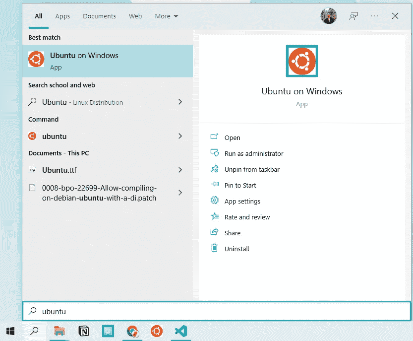
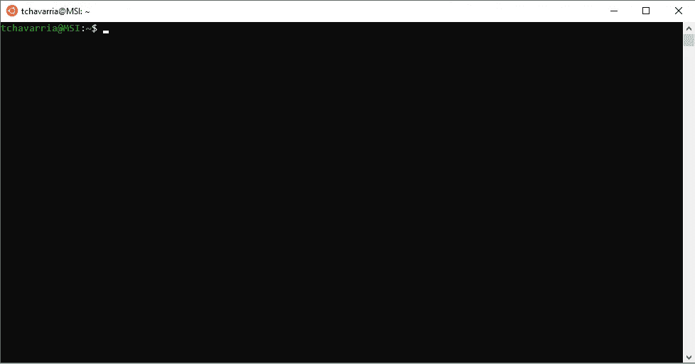
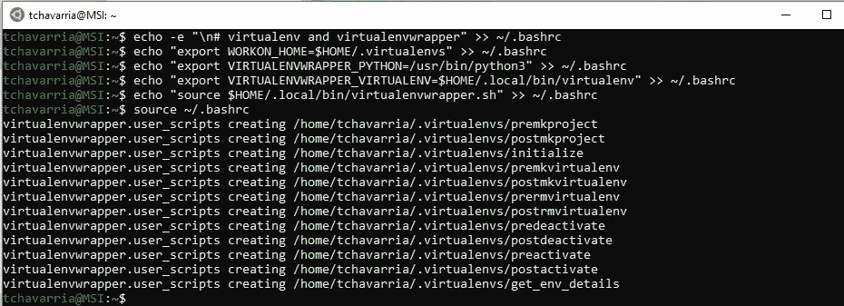
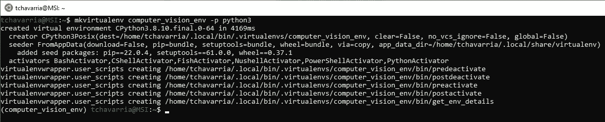
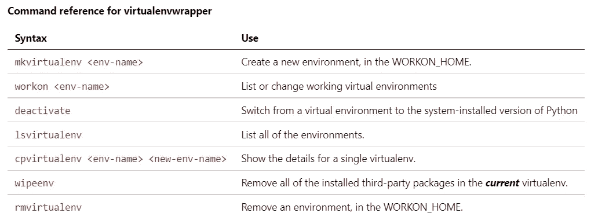
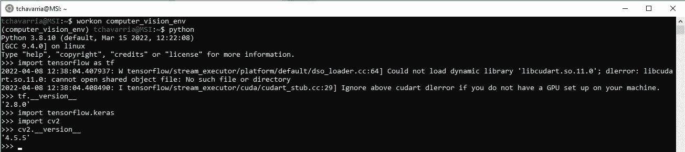

# Windows 10 + Ubuntu (WSL)上的深度学习设置(TensorFlow & Keras)

> 原文：<https://medium.com/mlearning-ai/deep-learning-setup-tensorflow-keras-on-windows-10-ubuntu-wls-f50640d7c8fc?source=collection_archive---------2----------------------->

当涉及到使用机器/深度学习和 Python 时，大多数人建议您使用基于 Unix 的环境。

机器学习工具可以很容易地在 Linux 上安装和配置，使您可以将精力集中在开发和改进代码上，而不是浪费时间解决安装冲突。

Windows 操作系统用户一直遭受这种痛苦，甚至试图按照参考文献进行操作都很困难，因为他们是基于 Unix 操作系统的。

为了避免这个问题，我建议使用 Linux 的 Windows 子系统(WSL)。

**WSL:** 让你在 Windows 机器上几分钟内安装一个完整的 Ubuntu 终端环境，让你不用离开 Windows[【1】](https://ubuntu.com/tutorials/install-ubuntu-on-wsl2-on-windows-10#1-overview)就能开发跨平台的应用。

本文将介绍如何在我们的 WSL 中设置和安装深度学习环境。

# **第一步:启用并打开 WSL**

首先你需要启用 WSL，你可以按照这篇文章来实现:[ [启用 Linux 子系统，在 Windows 10 中安装 Ubuntu](https://www.ssl.com/how-to/enable-linux-subsystem-install-ubuntu-windows-10/)。

1.在搜索栏上键入 Ubuntu:



2.打开应用程序:



# **第二步:安装依赖项:Ubuntu + Tensor Flow**

1.  现在，首先，使用以下命令更新您的系统

```
sudo apt-get update
sudo apt-get upgrade
```

2.随后安装编译器工具

```
sudo apt-get install build-essential cmake unzip pkg-configsudo apt-get install gcc-9 g++-9
```

3.安装 X windows 库和 OpenGL 库

```
sudo apt-get install libxmu-dev libxi-dev libglu1-mesa libglu1-mesa-dev
```

4.图像和视频 I/O 库

```
sudo apt-get install libjpeg-dev libpng-dev libtiff-devsudo apt-get install libavcodec-dev libavformat-dev libswscale-dev libv4l-devsudo apt-get install libxvidcore-dev libx264-dev
```

5.安装优化库

```
sudo apt-get install libopenblas-dev libatlas-base-dev liblapack-dev gfortran
```

6.安装 HDF5 以处理大型数据集

```
sudo apt-get install libhdf5-serial-dev
```

7.安装 Python 3 开发库，包括 Tk 和 GTK GUI 支持

```
sudo apt-get install python3-dev python3-tk python-imaging-tksudo apt-get install libgtk-3-dev
```

# 步骤 3:安装 pip 和虚拟环境

现在，让我们创建一个虚拟环境。Python 虚拟环境允许我们:

*   独立完成我们的 python 项目
*   避免依赖关系的破坏和重置我们的系统。
*   让我们可以轻松地与任何人共享项目。

它们是 python 开发的最佳实践。

1.  安装 pip

```
wget https://bootstrap.pypa.io/get-pip.py
sudo python3 get-pip.py
```

2.安装虚拟环境工具

```
pip3 install virtualenv virtualenvwrapper
```

安装后，不要忘记使用以下命令清除包缓存:

```
sudo rm -rf ~/get-pip.py ~/.cache/pip
```

3.用一些 virtualenvwrapper 设置更新我们的 bash 概要文件，以使这些工具协同工作

```
echo -e "\n# virtualenv and virtualenvwrapper" >> ~/.bashrc
echo "export WORKON_HOME=$HOME/.local/bin/.virtualenvs" >> ~/.bashrc
echo "export VIRTUALENVWRAPPER_PYTHON=/usr/bin/python3" >> ~/.bashrc
echo "export VIRTUALENVWRAPPER_VIRTUALENV=$HOME/.local/bin/virtualenv" >> ~/.bashrc
echo "source $HOME/.local/bin/virtualenvwrapper.sh" >> ~/.bashrc
```

4.获取。bashrc 文件来保存更改

```
source ~/.bashrc
```

输出将显示在您的终端上，表明安装了 virtualenvwrapper。



当心你的~/中的错别字。bashrc 文件。这可能会导致错误。

现在，我们将创建虚拟环境来存放 OpenCV 和其他组件。

5.创造虚拟

```
mkvirtualenv <env-name> -p python3
```

您的输出应该如下所示:



之后，要在这个虚拟环境中工作，只需使用以下命令

```
workon <env-name>
```

然后 ***瞧！*** 你将进入你的虚拟环境。

如果您想退出虚拟环境，只需使用以下命令

```
deactivate
```

你将从虚拟环境中退出。

让我们列出主要的 virtualenvwrapper 命令[【2】](https://virtualenvwrapper.readthedocs.io/en/latest/command_ref.html#managing-environments)。



# 步骤 4:将 TensorFlow & Keras 安装到虚拟环境中

1.  安装一些 TensorFlow 需要的 Python 库，标准的图像处理库(包括 OpenCV)和机器学习库。

```
pip install numpy
pip install pandas
pip install opencv-contrib-python
pip install scipy matplotlib pillow
pip install imutils h5py requests progressbar2
pip install scikit-learn scikit-image
```

2.成功安装上述库后，安装张量流和 Keras

```
pip install tensorflow
pip install keras
```

# 步骤 5:验证安装

```
workon <env-name>
python
>>> import tensorflow as tf
>>> tf.__version__
2.8.0
>>> import tensorflow.keras
>>> import cv2
>>> cv2.__version__
4.5.5
```

您的输出应该如下所示:



# 参考资料:

[1].[https://Ubuntu . com/tutorials/install-Ubuntu-on-wsl 2-on-windows-10 # 1-概述](https://ubuntu.com/tutorials/install-ubuntu-on-wsl2-on-windows-10#1-overview)

[2].[https://virtualenvwrapper . readthedocs . io/en/latest/command _ ref . html #管理-环境](https://virtualenvwrapper.readthedocs.io/en/latest/command_ref.html#managing-environments)

[3].[https://pyimagesearch . com/2019/12/09/how-to-install-tensor flow-2-0-on-Ubuntu/](https://pyimagesearch.com/2019/12/09/how-to-install-tensorflow-2-0-on-ubuntu/)

[](/mlearning-ai/mlearning-ai-submission-suggestions-b51e2b130bfb) [## Mlearning.ai 提交建议

### 如何成为 Mlearning.ai 上的作家

medium.com](/mlearning-ai/mlearning-ai-submission-suggestions-b51e2b130bfb)