# 用 Pytorch 和 OpenAI-gym 进行深度 Q 学习:出租车难题

> 原文：<https://medium.com/mlearning-ai/deep-q-learning-with-pytorch-and-openai-gym-the-taxi-cab-puzzle-e7a3028f732?source=collection_archive---------0----------------------->

## 初学者的强化学习

利用深度学习模型选择适当动作的强化学习

[Unsplash from petekasprzyk](https://unsplash.com/photos/NZOgPLpL4Lk)

在[之前的一篇文章](https://towardsdatascience.com/reinforcement-learning-teach-a-taxi-cab-to-drive-around-with-q-learning-9913e611028f)中，我试图解释我们如何通过 Q-learning 算法应用强化学习基础，从 OpenAI 自动玩一个简单的游戏`Taxi-v3`。这种方法为深度 Q 学习算法铺平了道路。

Deep-Q-Learning 或者更一般的深度强化学习已经被 Deepmind 和它的 AlphaGo 程序所强调。在本文中，我们将一步一步地介绍这种新方法，我将尝试让您快速了解它带来的挑战，即使是对于非常简单的环境，如`Taxi-v3`游戏。

# q 表提醒

让我们提醒一下 Q 表是什么。

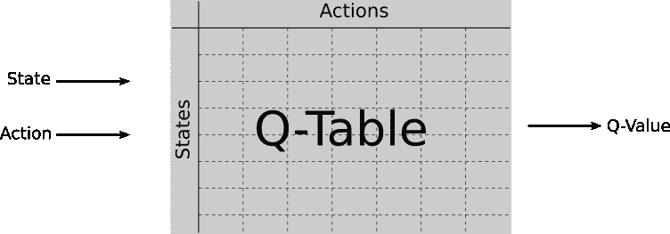

Use of a Q-table

Q 表只是一个通过探索然后利用一个环境和经历来学习的表，将夫妇`(state, action)`映射到`Q-values`。Q 值是通过与环境玩耍而获得的，并由于贝尔曼方程而逐渐更新

Bellman equation. How to update Q-values in the Q-table

看待 Q 表的另一种方式是把它看作一个通用函数

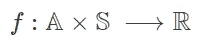

General function

其中`A`是动作空间，而`S`是状态空间。

这个函数可以是任何东西，对于状态或动作是连续值或合成向量的更复杂的环境尤其如此。

对我们来说，这种普通或复杂的功能可以用神经网络(NN)甚至深度神经网络(DNN)来近似。

# 深度 Q 学习

所以深度 Q 学习的原理很简单，只要用深度神经网络代替 Q 表就搞定了！…嗯，没那么快。如果你认为原理是一样的，那你就对了，但邪恶存在于细节之中。

就像 Q 学习算法一样，DQL 使用ε贪婪探索/开发算法首先探索、构建一种记忆，然后开发收集的信息。事实上，DQL 方法有三个主要组成部分:

*   培训网络
*   目标网络(与训练网络相同)
*   足够大的内存

## 网络培训

你可能对深度学习模型训练很熟悉。你得到了一些数据，标记良好的数据，你得到了你的模型。您要做的是向模型提供数据，计算期望值和模型预测值之间的损失，然后在网络内部传播损失以更新其权重。你这样迭代几次，直到“收敛”，你就完成了。

强化学习的问题是你没有这样的数据。你所拥有的只是一个你可以探索和玩耍的环境，但你不知道回报是什么样的，你必须自己去发现(或者你的模型必须去发现)。

让我们看一下培训代理网络的不同步骤。

## 首次探索

就像 Q-learning 的情况一样，我们首先需要初始化我们的网络，通常使用随机值(相同的权重分配给两个网络！).接下来是探索阶段，我们让代理在环境中随机导航，采取行动并获得相应的奖励。

所有的经历都记录在一个记忆里，一个大的经历回放记忆。这一步或预热步骤只是为了初始化我们网络的训练，收集一些有用的数据。

## 探索与开发:ε-贪婪行动选择

一旦记忆被注入了一些随机探索，我们就可以开始利用我们的训练模型。就像 Q-table 方法一样，我们使用ε-贪婪动作选择为当前状态选择一个动作。这意味着对于给定的状态，我们以概率`ε`随机选择要采取的动作，或者我们采取训练模型预测的动作。由于训练模型预测给定状态的每个可能动作的 Q 值，我们选择最有回报的动作，即具有最高 Q 值的动作。

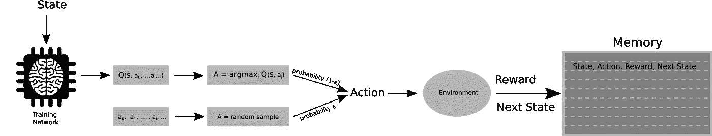

然后，新的元组`(state, action, reward, next state)`被推入重放存储器，以丰富数据多样性。请注意，在此阶段不会训练训练模型，训练模型仅用于计算预测的 Q 值，因此预测的操作在流程开始时可能不准确。

## 网络培训

在进行了一些探索并收集了一些数据之后，我们可以开始网络的训练过程。这就是记忆发挥作用的地方。

首先，我们从记忆体验回放中随机抽取一批样本。这批数据将被输入网络以预测 Q 值。每一次经历都代表了环境的一种状态，当代理人采取存储在记忆中的行动时得到的奖励以及最终的状态。所以一个经历就是一个元组`(state, action, reward, next state)`。

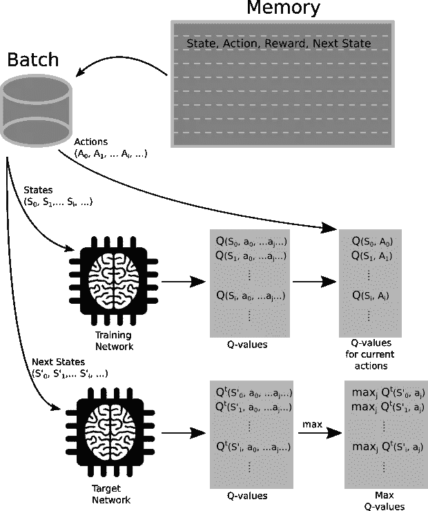

Forward pass

该批中的状态被发送到训练网络以预测 Q 值，但是我们只保留与每次体验的存储器中写入的动作相对应的 Q 值。这些 Q 值是我们预测的 Q 值，将用于计算模型损耗。

为了以监督的方式训练深度学习模型，我们需要带标签的数据，但我们已经说过，我们没有来自我们环境的任何数据。然后，我们需要构建标记数据，这就是目标网络的目标。目标网络获取下一个状态，并预测所有行动中的最佳 Q 值，因为这是我们希望我们的模型预测的，对每个状态采取的最有回报的行动。换句话说，下一个状态是我们希望训练模型预测的状态。为了达到这种状态，模型必须选择适当的动作，对于目标模型，它是对应于其最高 Q 值的动作。

## 失败

我们刚才说的是:对于内存样本`(state S, action A, reward R, next state S')`，我们希望我们的训练模型预测与目标网络相同的最高 Q 值`Qt(S')`，对应于动作`A’`，但它却预测了`Q(S, A)`。观察到的损耗为

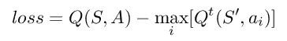

Naive loss

然而，如果我们处理这种简单的天真损失，我们会错过一个关键信息，即预期报酬，我们的模型不会使最终报酬最大化。这就是贝尔曼方程发挥作用的地方

Bellman equation

现在，预期 Q 值不仅由最大预测 Q 值给出，而且还受预期回报`R`的调节。γ因子是一个折扣因子，是一个超参数，用于调整目标 Q 值的权重。

## 反向传播

因此，我们现在有了由训练模型预测的 Q 值，以及由目标网络预测的目标(或标记的)Q 值。剩下的和我们在训练深度学习模型时发现的一样，也就是损耗反向传播。通常在强化学习中，我们使用 Huber 损失:

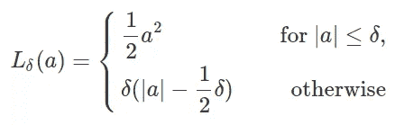

Huber loss

## 概述

概括了训练我们模型的所有步骤:

1.  通过一些随机的预热步骤初始化内存
2.  重置环境，使我们处于已知状态
3.  用ε-贪婪动作选择策略选择一个动作
4.  执行此操作的一个步骤，并将结果存储到内存中
5.  从记忆中取样一批
6.  使用训练网络和目标网络预测 Q 值
7.  计算训练网络中的 Huber 损耗和反向传播
8.  定期更新目标网络

# 查看目标网络

你可能想知道为什么我们要麻烦第二个网络，目标网络，为什么我们不使用同一个网络？很高兴你这么问！答案是，你可以使用同一个网络，但是…你可能会遇到一些问题。

我再说一遍，但我们这里没有任何标记的数据来训练模型。我们计算每批的标记数据，因此如果我们使用训练模型来标记数据，并且我们从内存中采样相同的条目，我们可能没有相同的目标！目标数据是一个移动的目标，如果我们过于频繁地更新它，我们将无法在训练模型时跟踪它。就这么简单！

使用未被训练的第二个目标网络，我们确保目标 Q 值在给定期间(几集)是稳定的。然而，我们知道目标并不是最好的，至少在训练开始时是这样。这就是为什么目标网络必须定期更新。多久一次？这要视情况而定，周期是另一个你必须考虑的超参数。

我不能说得比谷歌 Deepmind 的科学家更好了，他们实际上提出了这种玩雅达利游戏的方法:

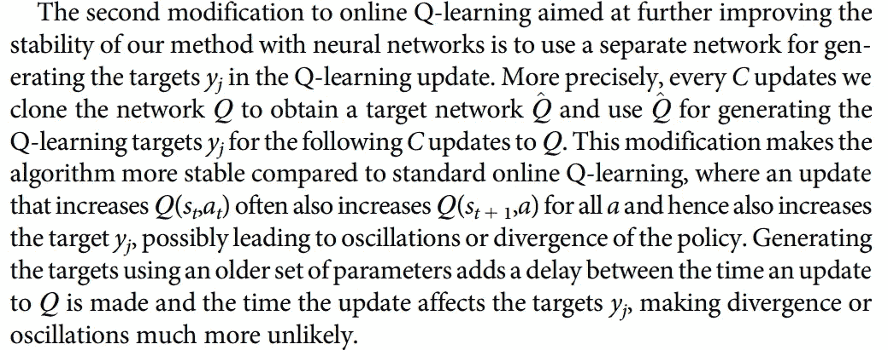

[Human-level control through deep reinforcement learning, V. Mnih & al., *Nature* **volume 518**, pages529–533(2015)](https://www.nature.com/articles/nature14236)

# Pytorch 实现

我不想在这里用几行代码来打扰你，所以我建议你参考我的 github repo:

 [## gandroz/rl-taxi

### 用 OpenAI/gym 和 Keras 或 Pytorch 进入 RL 世界的一些探索脚本和笔记本。还探索了 keras-RL…

github.com](https://github.com/gandroz/rl-taxi) 

## 模型上的注释

用于这个玩具示例的模型非常简单。它包括一个嵌入层(一个状态是一个从 0 到 500 的简单整数)，两个具有 ReLU 激活而没有任何正则化的隐藏密集层，以及一个最终的密集线性层，即没有激活函数。因为 Q 值的值不受限制。

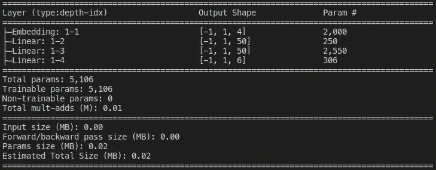

model architecture

嵌入层将输入整数嵌入到一个 4 坐标向量中。我使用 50 个节点的隐藏层，最后一个密集层将节点映射到一个 6 坐标向量，因为`Taxi-v3`游戏有 6 个可能的动作。

# 超参数调谐

在本文中，我们经常提到超参数、折扣因子、ε-贪婪策略、目标网络更新周期，但是我们也可以提到学习速率和批量大小。正如我已经说过的，调整这些批量大小是很棘手的，深度 Q 学习的目标是一个移动的目标，所以这个过程可能不是很稳定。因此，让我们在这些超参数中挖掘一点，尝试看看它们对训练过程的影响。

首先，这里是我结束的训练结果

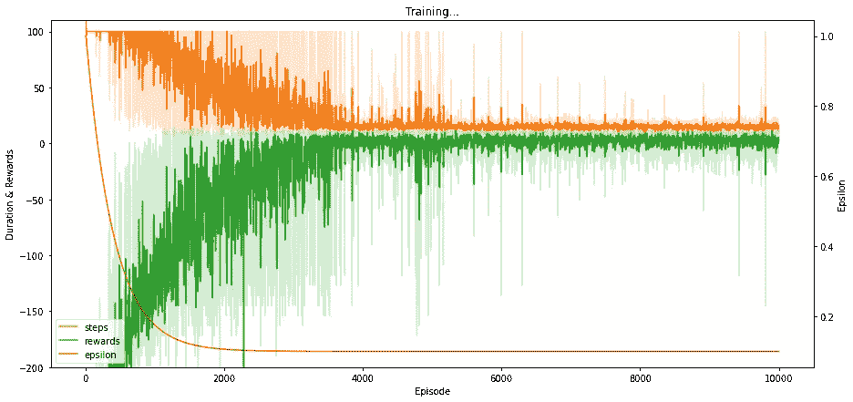

Training curves for a set of hyperparameters that made the training converging

我们在这张图上看到了回报曲线、阶梯曲线和ε曲线。奖励剧情是每集所有奖励的总和。一集是从一个全新的环境开始，以游戏结束(乘客在正确的地方下车)或最大数量的步骤结束，因为我们不想花太多时间探索这个环境。步数曲线是每集执行的步数。我们要的是回报最大化，每集步骤最少化。

我们还发现图上的ε曲线。它是ε-贪婪策略的超参数ε的演化。该参数被选择为随剧集而变化，因为我们希望训练过程让我们的代理在开始时探索环境，但我们也希望它利用学习到的模型。ε参数作出这样的选择:它在开始时接近于`1`,以便为一个步骤选择随机动作的概率接近于`1`,即代理探索环境。这个概率沿着道路指数地降低到一个低值(在本例中为`0.1`),以让代理利用该模型。

## 批量

一个简单的超参数是批量大小。批次中的样本太少，模型将看不到大量数据来执行历元，而数据太多，模型将看到太多“错误”数据。事实上，至少在训练开始时，收集的数据几乎是随机选择的。

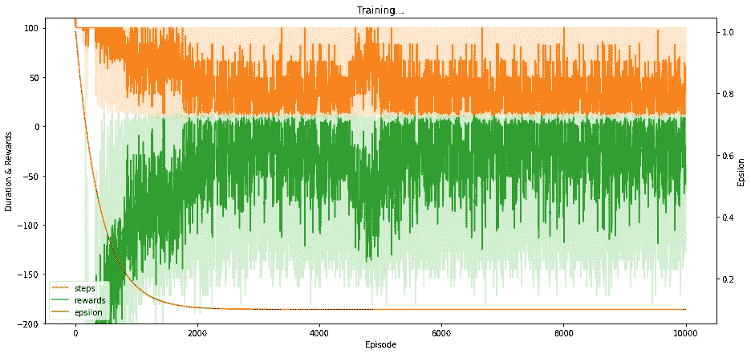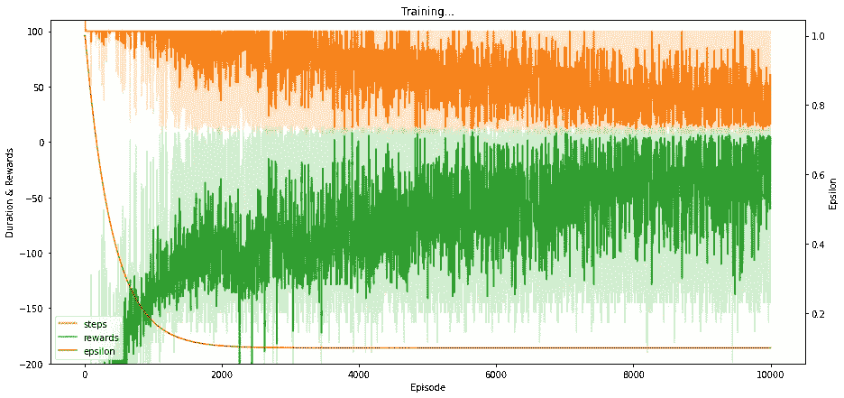

Large batch size (left) vs. small batch size (right)

正如我们在这里看到的，使用大批量加快了训练速度。随机模型。由于数据质量太低，模型无法收敛。相反，如果批量太小，模型学习速度很慢，也不会收敛(至少在 10，000 集之后不会),因为它可利用的数据太少。

## 学习率

我不会详细描述学习率，因为我假设你对它很熟悉，但是这里有一个高低学习率的比较

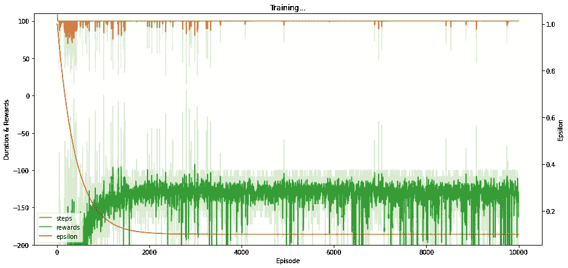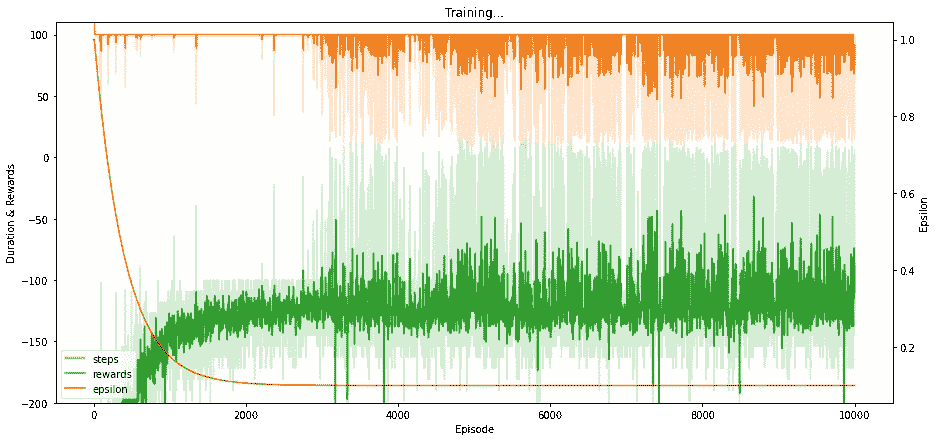

High learning rate (left) vs. low learning rate (right)

注意，为了获得收敛模型的训练曲线，我没有使用恒定的学习速率。相反，我让它在剧集中呈指数级下降，以加速开头的学习，并帮助结尾的收敛。

## ε-贪婪政策

从图中我们已经可以看出，ε超参数在各期中并不恒定。我已经解释了原因，但我们仍然可以改变结束点，并选择是否希望代理在培训结束时探索更多或更少的内容。

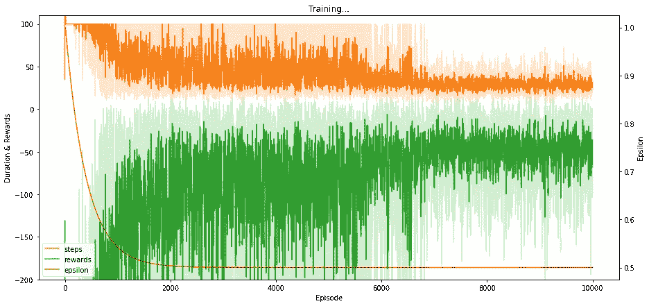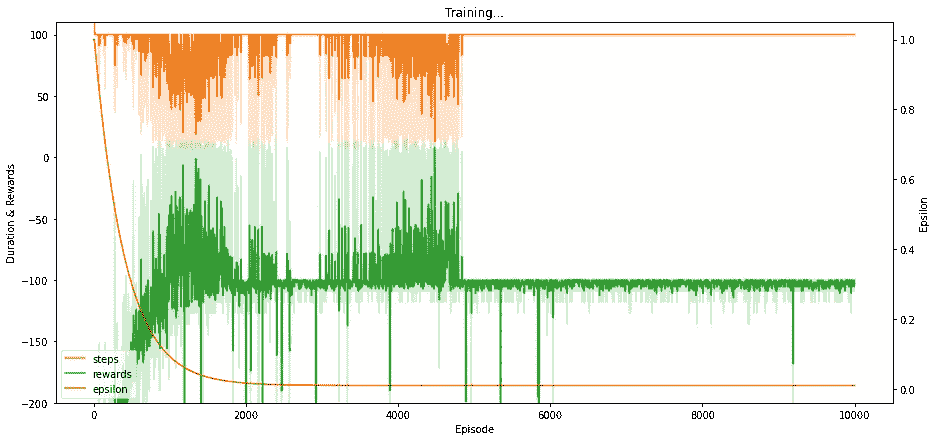

High steady state ε (left) vs. low ε (right)

如果我们让代理探索太多的环境，我们可能很难说模型收敛。可以肯定的是，我们需要在几集内评估该模型，看看它是否能很好地玩游戏。左边的曲线告诉我们，方差随着情节的推移而减少，因此我们可以怀疑模型已经收敛，但剩余的高方差可能是由于高概率的探索。即使模型采取了正确的决策，ε-贪婪策略也会迫使代理人选择另一种方式。相反，如果探索的概率太低太快，并且模型没有注意到收敛，我们将会以存储器中的数据逐渐被不准确的数据所取代而结束，从而模型会开始发散。这就是我们在这个例子中看到的。

## 贴现因素

我们选择使用高折扣系数`~0.99`。这意味着我们对奖励和目标 Q 值的重视程度是一样的。如果折扣系数太低，我们不允许模型从错误中学习，它不会收敛，至少不会很快收敛。

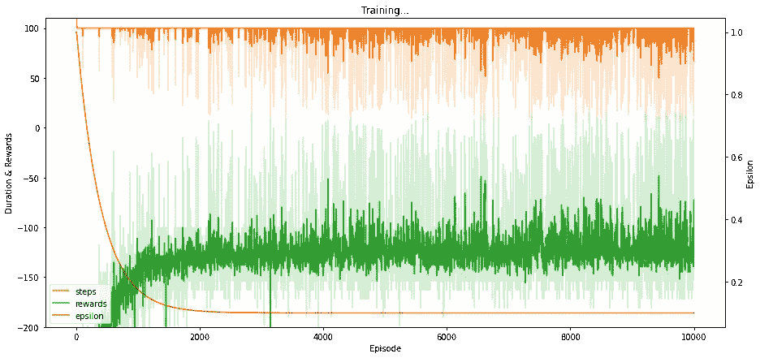

Low discount factor

## 更新期

正如谷歌深度思维论文的作者所说，使用第二个网络并定期更新它可以稳定学习过程。

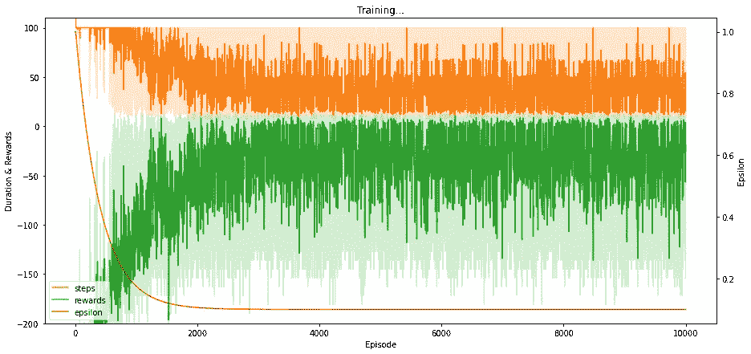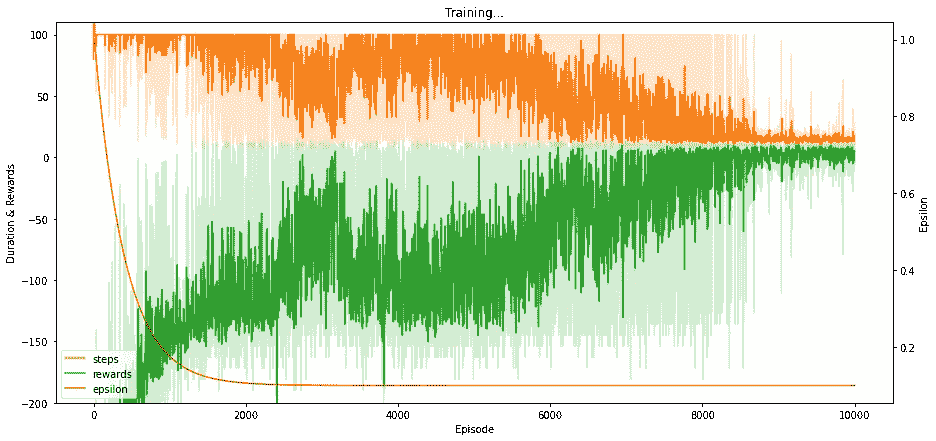

Update the target model very often (left) vs. rarely (right)

我们可以看到，从高方差来看，更新模型经常会破坏学习过程的稳定性。由于回报较高，预测可能相当不错，但由于目标变化太频繁，预测并不稳定。然而，如果更新频率太低，模型会快速收敛到目标，但会收敛到错误的目标。该模型最终收敛，但收敛速度会更快。

# 结论

在本文中，我们已经看到了如何使用强化学习和深度学习来一起学习一些策略来玩一个简单的游戏。虽然在这个简单的游戏中，可以用一个表格将每个状态映射到正确的动作上，但是对于更复杂的游戏来说，这可能很棘手甚至是不可能的。这就是为什么我们用深度学习模型取代了 Q 表，这种方法可以推广到更多的环境中。然而，我们也看到，培养这样一种模式可能比传统的深度学习模式更难。这并不是说模型本身更复杂，而是因为数据是一个移动的目标，所以这个过程很难稳定。

我希望你和我一样喜欢这次旅行！