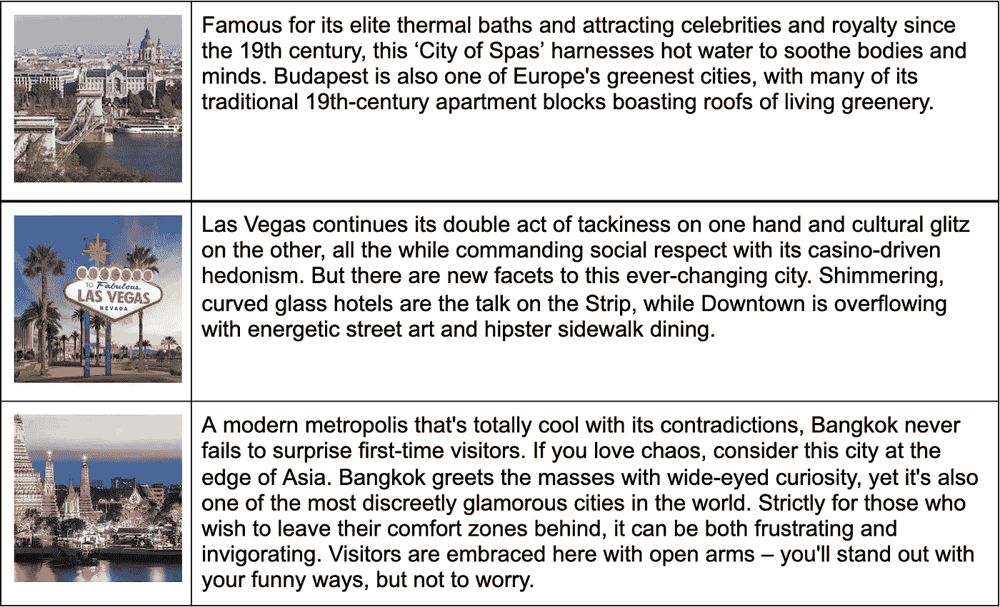
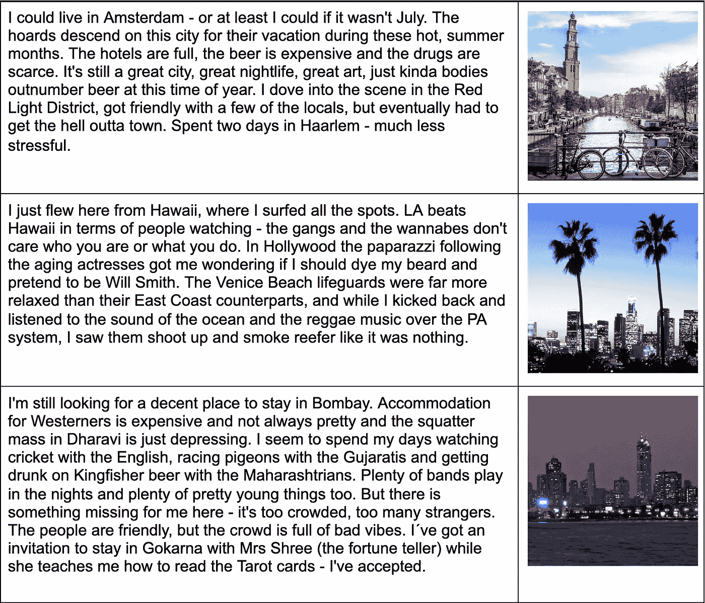
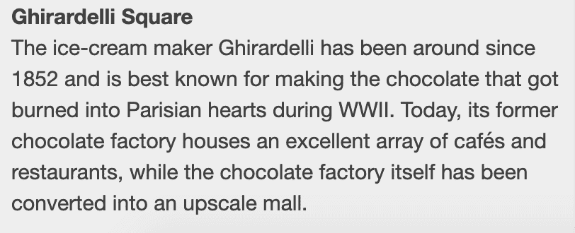
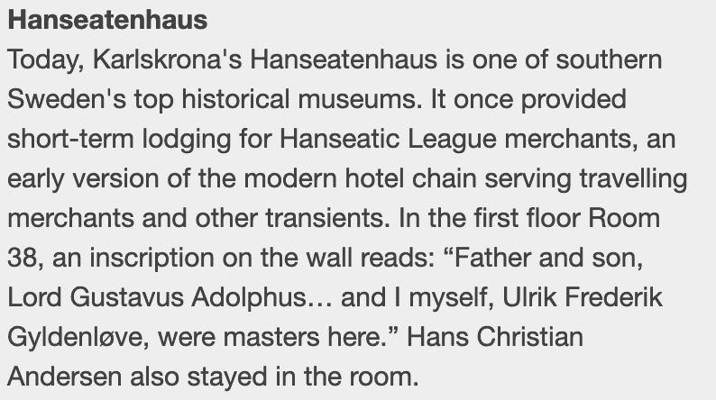
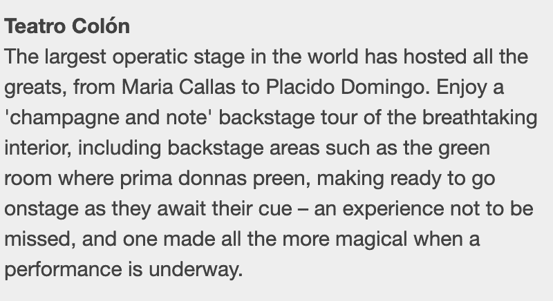

# 深度旅行:作为旅行作家的艾

> 原文：<https://medium.com/mlearning-ai/deep-travel-ai-as-a-travel-writer-ffd3b7c16508?source=collection_archive---------2----------------------->

当我在谷歌苏黎世工作一段时间时，我是介绍新员工的一员。作为其中的一部分，我们总是会问他们的爱好是什么。最常见的回答是“摄影、徒步旅行和旅游”。因此，难怪技术领域的人经常得出这样的结论:接下来最好的事情是创办一家旅游创业公司。给这些人最好的建议是"[不要做](https://www.phocuswire.com/Why-you-should-never-consider-a-travel-planning-startup)"——我应该知道，我已经[做了](https://creativecommons.org/2004/02/25/world66travelsite/) [两个](https://www.triposo.com/about/story)。

所以毫不奇怪，当 [GPT-3](https://openai.com/blog/gpt-3-apps/) 问世时，我的第一个想法是:我们可以用它来帮助编写自动旅行指南吗？我参与的上一个旅游初创公司 Triposo 的价值主张是，网络上有环游世界的所有信息，你需要的只是一些小聪明，将这些信息打包成一个方便的旅游指南，适合你手中已经有的手机。

GPT-3 已经有了网络的所有信息，所以我们需要做的就是问。基础并不难。GPT-3 可以完成一些文本，所以如果我们给它一个城市列表，每个城市后面都有一个摘录，比如说， [Wikivoyage](https://en.wikivoyage.org/wiki/Main_Page) ，我们会得到一些不错的结果:

Descriptions of cities generated by GPT-3 based on Wikivoyage examples

顺便说一下，我在这里嵌入了一个图像，因为 Medium 似乎不知道表格。我把表格[放在谷歌文档](https://docs.google.com/document/d/1M232wvDRhfPqPiLb_-kdwvFFnNWow-XFQYz7h64moUY/edit)中，以防你出于某种原因想要复制文本。

它读起来相当令人信服，但并不那么令人兴奋。比“[我想去那里](https://tenor.com/view/i-want-to-go-to-there-liz-lemon-tina-fey-30rock-i-wanna-be-there-gif-21958017)”更符合事实。如果我们不是从维基百科而是从稍微更具戏剧性的[孤独星球](https://www.lonelyplanet.com/)向人工智能输入描述，计算机就会开始写一些更吸引人的东西:

Descriptions of cities generated based on the Lonely Planet model of Travel

也许这样更好？肯定更有趣，更有可能吸引游客到你的旅游网站。我们能让它变得更有趣吗？如果不是《孤独星球》,而是我们给它一些例子，听起来像一个长期旅行者在当地酒吧吹嘘他们所做的所有惊人的事情？它变得更加个人化，也许可以为 instagram 旅行订阅提供动力？也许有更好的照片。

This time we have a backpacker telling about their experiences

我相信有一天我们会有技术来为这些文本片段生成匹配的图像，但现在我只是从谷歌图像搜索中获得它们——我认为足够裁剪以声称合理使用。

根据旅游指南，你还可以做一些其他有趣的实验。你可以用 Wikivoyage 的方式来描述一个城市，然后你会得到哪个城市最匹配，这就有点像一个旅游推荐系统:“好啤酒和漂亮的运河”->阿姆斯特丹。有趣，但像很多这些事情有点击中和错过。对于滑雪和海滩，它推荐兰萨罗特。尽管 Expedia [为该岛提供了一系列滑雪酒店](https://www.expedia.com/Lanzarote-Hotels-Ski-Hotel.0-0-d282-tSkiHotel.Travel-Guide-Filter-Hotels)，但这只是又一个软件出错了。

我想更进一步，为每个目的地制作更多的旅游指南。请记住，GPT-3 的工作方式是，你给它一段文字，然后它会以最好的方式为你完成。因此，如果你给它看一段带有城市名称的文本，接着是对一个城市的描述，接着是另一个城市的名称，接着是对那个城市的描述，我们重复这种模式一段时间，最后是我们想要描述的城市的名称，GPT 3 号抓住了这一点，并给出了一些相关的描述。

对于较短的文本来说，这样做很好，但是对于一页纸的目的地介绍来说，这种介绍后面是一个兴趣点列表，每个兴趣点都有自己的描述。我们可以利用这种结构，让 GPT 3 号不仅能给出目的地的描述，还能给出兴趣点的名称。对于其中的每一个，我们要求 GPT-3 再次生成一个描述。

结果是…喜忧参半。通常它看起来很有说服力，尤其是对于你不太了解的地方。如果你看着一个你很熟悉的地方，它很快就会分崩离析。例如，关于旧金山的吉拉尔德利广场，上面写着:

听起来很合理。年份是正确的，我不确定巴黎参考，但除此之外，看起来不错。我准备好去探索那些咖啡馆了。

在瑞典南部的小镇 Karlskrona，人们这样描述 Hanseatenhaus:

汉萨同盟是一个东西，但卡尔斯克朗成立于 1680 年，此时该同盟已经失去了大部分权力。Hanseatenhaus 听起来确实像是商人可以待的地方——德国就有一家。ulrik Frederik gyldenlve 是一名挪威将军，参与了决定汉萨命运的战争，实际上他出生在德国。汉斯·克里斯蒂安·安徒生来自欧登塞，一个不太远的小镇，所以他住在卡尔斯克朗的一家旅馆里似乎很有可能。

介于两者之间:

这是布宜诺斯艾利斯著名的剧院，似乎完全值得一去。尽管它可能不是世界上最大的歌剧舞台。卡拉斯和多明戈在那里唱过，那都是真的。有一个内部参观，但我找不到任何绿色房间的参考。所以这不完全是真的，但也不全是编造的。

对我来说，这是最迷人的。这些大型语言模型很容易在事实和虚构之间漂移，提出事实描述，但在缺乏知识的地方编造东西，却无法真正区分两者。很有人情味！人们总是说一些本身不真实的事情，但听起来像是真的，当被追问时，他们会否认是他们编造的。

四处看看吧！