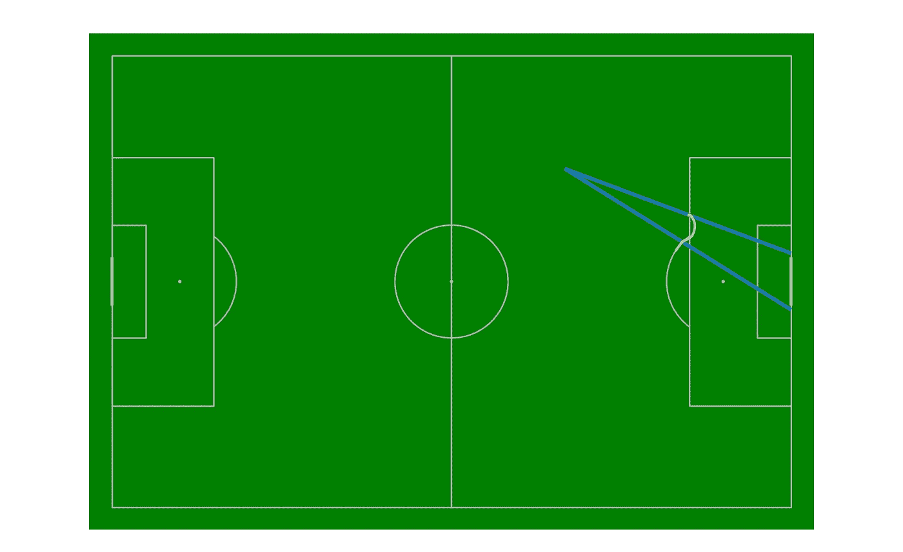

# DeepxG 教程第 1 部分:训练自己的深度学习模型预测预期目标(xG)

> 原文：<https://medium.com/mlearning-ai/deep-xg-training-your-own-expected-goals-xg-deep-learning-model-cbb9b9eb5465?source=collection_archive---------3----------------------->

## 使用 python、statsbomb、mplsoccer 和 pandas 创建数据集


Photo by [Sven Kucinic](https://unsplash.com/@skucinic9?utm_source=medium&utm_medium=referral) on [Unsplash](https://unsplash.com?utm_source=medium&utm_medium=referral)

## 介绍

我们大多数关注足球的人都听说过一个叫做**预期目标**的统计数据，通常被称为 [**xG**](https://en.wikipedia.org/wiki/Expected_goals) 。预期目标是一种统计数据，用于量化进球机会的质量。通常 xG 是在每次射门的基础上计算的，目标是(双关语)找出射门得分的概率。在电视屏幕上显示给我们的统计数据通常是从比赛开始到显示统计数据的时间点所拍摄的所有镜头的总 xG，即所有镜头的 xG 的总和。

xG 的使用方法有很多，下面是几个例子:

*   经理可以评估他们的团队是否创造了高质量的机会。
*   管理人员和进攻球员可以识别出球场上对应于高 xG 的区域，这些信息让球员知道是射门还是将球移到不同的区域。
*   防御者可以识别他们应该占领的区域。理想情况下，防守者会希望占据对应于高 xG 的区域，以阻止任何进攻，并将球引导到低 xG 的区域。
*   分析师和球探可以根据一个赛季的 xG 来确定购买哪个前锋。

在这一系列文章中，我们将介绍任何人如何构建自己的 xG 模型。我们将利用 [Statsbomb](https://statsbomb.com/) 提供的[这里](https://github.com/statsbomb/open-data)的开源数据。在本文中，我们使用西甲联赛 17 个赛季的赛事数据来训练、验证和测试我们的模型。

本文将由三部分组成:

*   **数据准备**:在这一部分，我们将展示如何创建数据集。数据转换、清理等。参与其中。
*   **模型训练:**我们将向您展示如何利用 [pytorch](https://pytorch.org/) 和 [pytorch-lightning](https://www.pytorchlightning.ai/) 构建、训练和测试深度学习模型。
*   **模型评估:**我们将运行一些实验来进一步评估我们的模型，并展示 xG 模型的不同使用方式。

# 数据准备

今天的文章将重点关注创建一个数据集，该数据集可用于训练任何机器/深度学习模型来预测 xG。我们将主要使用[熊猫](https://pandas.pydata.org/)和 [MPLSoccer](https://mplsoccer.readthedocs.io/en/latest/index.html) 库。在可用的 17 个赛季的西甲数据中，我们使用 15 个赛季的数据作为我们的训练集，一个赛季用于验证，另一个赛季用于测试。为了获得每个赛季的赛事数据，我们需要获得 statsbomb 拥有数据的所有比赛的比赛 id。这就是我们在下面的代码片段中所做的。

请注意，我们已经通过利用 statsbomb 发布的比赛数据获得了我们想要使用的赛季 id。在运行这个函数时，我们将有三个 match_id.csv 文件，对应于我们将为训练、验证和测试创建的数据集。

## 特征

在下一步中，我们将从每个匹配的事件数据中提取一些特征来创建数据集。我们使用以下特征来训练我们的模型。

*   **到球门的距离:**从射门地点到球门中心的距离。
*   **球门柱之间的角度:**在他的书和课程 [Soccermatics](https://soccermatics.readthedocs.io/en/latest/lesson2/statisticalModelsIntro.html) 中，David Sumpter 解释了球门正面的可见性对于射门球员在确定从给定位置射门是容易还是困难时的重要性。从射门的地方到两个球门柱的角度可以很好地估计出球门的正面能被看到多少。



Angle between the goal posts of a shot

*   **射门结果:**判断射门是否进球。
*   **技术名称:**球员投篮的类型，如截击、半截击等。
*   **压力下:**识别出手的球员是否有压力。球员承受的压力越大，他们就越难有干净利落的一击，所以理论上球员在压力下应该更难得分。
*   **身体部位名称:**用于拍摄的身体部位。这个特征主要帮助我们区分头球和用双脚触地。
*   **位置名称:**出手球员的位置。我们会认为后卫比前锋更不擅长射门。这一功能有助于模型了解优秀的终结者倾向于在哪个位置比赛。
*   **传球技术名称:**该特征用于描述提供给射门球员的传球类型。它可以用来确定它是否是一个直传球、传中球等。
*   **射门区域:**我们将球场分成 80 个区域，类似于我们在[上一篇文章](/@buildingblocks/visualizing-attacking-build-up-play-using-dynamic-passing-networks-33f12329ac87)中创建动态传球网络时的做法。我们使用拍摄的区域作为特征。这是因为某些区域比其他区域更容易得分。
*   **传球顺序**:我们会跟踪投篮前的所有传球。这背后的意图是，包括传球序列可能表明创造的空间量和机会的类型，例如，如果这是一次反击或由球在球场高处被赢得的反压情况等。

所有这些都在下面显示的函数中实现

前几行代码(1–7)获取给定匹配 id 的事件数据。我们根据索引对事件数据帧进行排序，以确保所有事件都处于正确的时间顺序(按时间排序)。对于每个新的匹配，我们初始化两个变量，称为 *prev_possession_team* 和 *pass_sequence。*

*prev_possession_team* 跟踪上一场比赛前一直领先的球队。该变量对于确定传递序列是否结束非常重要。当控球的球队完成所有传球，丢球并且不再控球时，传球序列就结束了。

*pass_sequence* 变量跟踪给定移动中的所有走刀(第 12-13 行)。传球序列可能会被多种方式中断，例如球员被抢走，控球失误，球出界等。第 14-15 行确保我们跟踪传球的类型，例如传球/内旋传中等等。如果传球导致射门。

如果事件是一个镜头，则第 17–32 行收集与该镜头相关的所有特征。我们记下射门的位置，以找到两个球门柱之间的距离和角度。如果在投篮之前没有发现传球技术，这意味着传球技术是一条南线(27-28)。如果比赛是从任意球或点球开始的，我们清空到那个时间点的所有传球序列(第 29-30 行)。最后，我们在投篮结束时清空传球序列数组，开始我们新的进攻动作。

第 34-38 行用于查找传球序列何时结束，而不管是否射门。我们假设，只要第 34 行提到的列表中有任何事件，并且所有权没有转移到另一个队，传球序列就会继续。**压力**事件适用于对方球员对持球球员施加压力的情况。

下面是用于查找到球门的距离以及球门柱和球所在区域之间的角度的函数。stackoverflow 上的 *get_shot_angle* 功能归功于[这个](https://stackoverflow.com/questions/58953047/issue-with-finding-angle-between-3-points-in-python)帖子。

## 数据转换

数据集准备的最后阶段涉及一些数据转换。我们执行以下转换:

*   将所有[分类](https://en.wikipedia.org/wiki/Categorical_variable)变量转换为唯一 id。我们有以下分类变量。

```
CATEGORICAL_VARIABLES = [SHOT_TECHNIQUE_NAME, BODY_PART_NAME, POSITION_NAME, PASS_TECHNIQUE_NAME]
```

*   将拍摄地点和传球地点的坐标转换为区域编号。
*   [标准化](https://towardsdatascience.com/normalization-vs-standardization-explained-209e84d0f81e#:~:text=It%20is%20a%20scaling%20technique,(X%20max%20%E2%80%94%20X%20min))两个连续变量，射击距离和角度。以确保两个变量的数量级在模型训练期间不成问题。

第 3–16 行使用前面显示的效用函数将射门和传球坐标转换为区域。如果坐标是 nan 的，我们给出一个默认区域 80(记住我们有 80 个区域，编号从 0-79，因为索引从 0 开始，所以索引 80 对应一个后备区域)。

接下来(第 18-48 行),我们使用一些简单的熊猫技巧来转换我们的分类变量和连续变量。请记住，我们只需要从训练数据中学习数据转换和映射的所有参数。为此，我们计算训练集中每个连续变量的平均值和标准差，并将其保存为一个 json 文件。加载保存的 json 文件(第 41、49–50 行)后，相同的均值和标准差被应用于来自验证和测试集的原始数据。

对于分类变量，我们将训练中每个变量的所有类别保存在一个字典中，并将字典保存为一个 json 文件(第 29–38 行)。当我们转换验证和测试数据时，如果给定的类别不在训练集中，我们给它一个唯一的 id，等于类别数的长度，利用索引从 0 开始并且索引处等于类别列表长度的类别实际上不存在的事实。

# 结论

现在，我们已经准备好了训练、验证和测试集，可以训练深度学习/机器学习模型。在本系列的第 2 部分中，我们将浏览一些 pytorch 和 pytorch-lightning 代码来设置数据模块、模型架构、训练逻辑等。如果你认为我们可以使用其他一些很酷的功能来训练 xG 模型，请在下面留言。

*如果你有兴趣继续了解更多关于数据科学和机器学习如何应用于足球世界的信息，请做* [*关注*](/@buildingblocks) *我们，查看我们之前的一些文章！*

[](/mlearning-ai/mlearning-ai-submission-suggestions-b51e2b130bfb) [## Mlearning.ai 提交建议

### 如何成为 Mlearning.ai 上的作家

medium.com](/mlearning-ai/mlearning-ai-submission-suggestions-b51e2b130bfb)