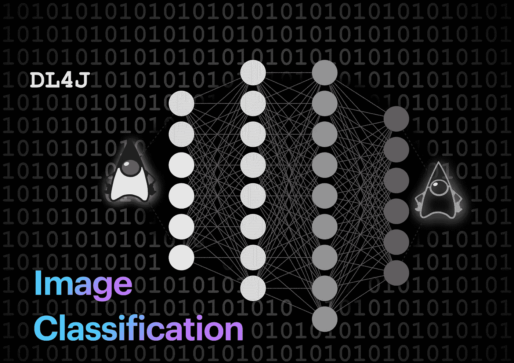
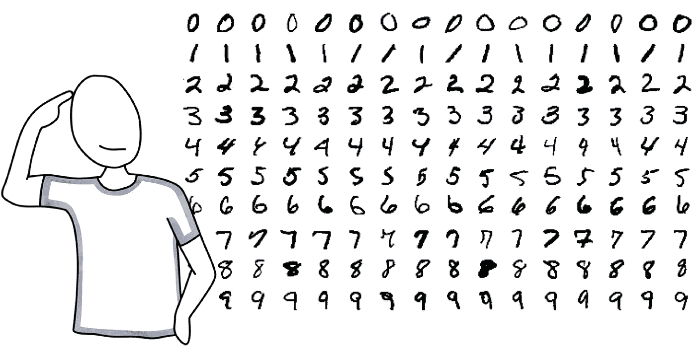
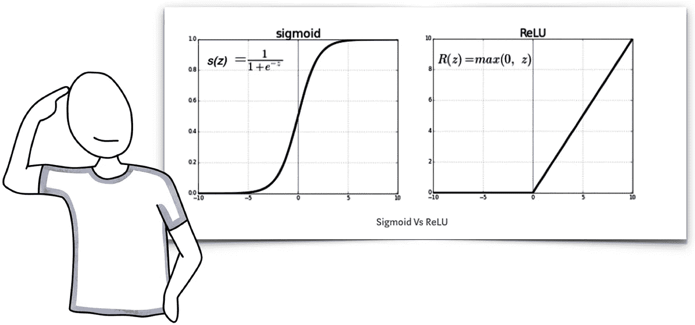
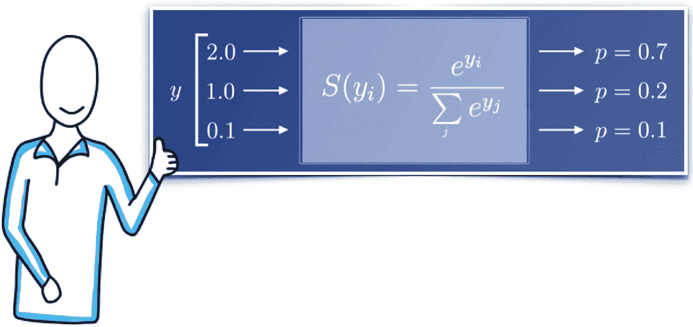
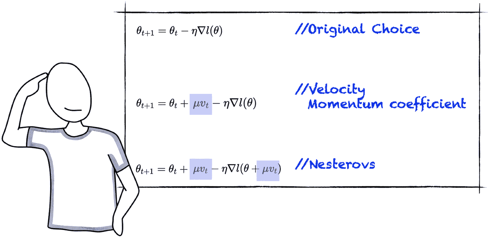

# DeepLearning4J:简单图像分类

> 原文：<https://medium.com/mlearning-ai/deeplearning4-for-image-classification-part-1-fc01cb2b1c62?source=collection_archive---------0----------------------->



让我们回顾一下如何使用 **Deeplearning4j** 库用神经网络实现图像分类。如果你是神经网络的新手，你会喜欢读我的入门故事， [*什么是神经网络？*](/analytics-vidhya/neural-networks-in-a-nutshell-with-java-b4a635a2c4af?sk=6d3e0924646beddc233c1edf875565c7) 。而且，如果你不熟悉 **DeepLearning4J** 库，我可以推荐看看我的故事， [*DeepLearning4J:入门*](/mlearning-ai/neural-networks-getting-started-with-eclipse-deeplearning4j-897f3662832b) *。*

使用神经网络进行图像分类是一个非常简单的过程。我们需要一个包含多幅图像的数据集，用来训练我们的神经网络。我们将使用每张图片中的每一个像素作为输入。并且，我们期望得到我们期望识别的类别作为输出。

让我们做一个简单的项目:一个识别手写数字 0 到 9 的模型。我们将执行以下操作:

1.  获取并加载数据集
2.  创建、训练和评估模型
3.  在应用程序中部署模型

我将这篇文章分成两部分。在这一部分，我将介绍数据集和模型。稍后我们可以回顾模型的部署。

# 1.MNIST 数据集

我们的目标是创建一个神经网络来识别手写数字 0 到 9。因此，我们需要大量手写数字的图像。包含**手写数字**的最著名的数据集之一是由样本组成的 MNIST 数据集，如图 1 所示。这是一个庞大的手写数字数据库，由 7 个 **0，000 个**图像组成。这些数字是由高中生和美国人口普查局的员工写的。每个数字都存储为黑白抗锯齿图像，并被标准化以适合一个 **28x28** 像素边界框。



Figure 1\. Sample images from the MNIST dataset; each digit is stored as a 28x28 pixels image

作为参考，根据 MNIST [网站](http://yann.lecun.com/exdb/mnist/)，一层神经网络(用这个数据集训练)可以达到 12%的错误率(相当糟糕)。相比之下，深度卷积神经网络可以实现低于 0.25%的错误率。

# 2.加载数据

**DeepLearning4j** 为标准数据集提供现成的数据集迭代器，包括 MNIST 数据集。类 **MnistDataSetIterator** 允许我们加载这个公共数据集。 **MnistDataSetIterator** 的构造函数接收三个参数:

*   批量大小，即在比较预期输出和计算误差之前要处理的训练样本的数量。
*   数据集中的样本总数。
*   一个标志，用于指示数据集是否应该二进制化(图像被认为是黑白的，没有灰色阴影)。

让我们使用 100 的批量大小，并要求数据集被认为是黑白图像。此外，让我们加载 60，000 幅图像用于训练，10，000 幅图像用于测试，如下所示:

Source Code 1\. Initialization of DataSetIterator objects for training and testing datasets

很简单。不需要担心处理具有数千个 28 x 28 图像的数据结构的技术细节。

# 3.建立第一个模型

先说一个基本的**单隐层**神经网络。后来，我们可以改进这个最初的方法。用于解决这个问题的单个隐藏层神经网络可以如下:

*   图像中的每个像素成为一个输入；因此，我们有 28×28 =**784 个输入**。
*   我们要预测的每一个数字都成为一个输出；因此，我们在输出层有**十个神经元。**
*   最后，单隐层模型中隐层神经元的数目建议为:介于输入层和输出层之间；输入层大小的 2/3，加上输出层的大小。；或者小于输入层尺寸的两倍。这三条规则为你提供了一个考虑的起点。最终，为你的神经网络选择一个架构将归结为反复试验。我们用**隐藏层**的 1000 个神经元。

现在，我们可以使用类 ***多层配置*** 和 ***多层网络、*** 创建单个隐藏层神经网络，模拟我们在*deep learning 4j*中所做的，如下所示:

Source Code 2\. A model with UNIFORM weight initialization, SIGMOID activation function, and MSE loss function

这个类 ***多层配置*** 是一个魔术:

*   使用 SIGMOID 作为激活函数，将 784 个输入全部连接到中间层中的 1000 个神经元
*   中间层中的 1000 个神经元连接到输出层中的 10 个神经元，使用 SIGMOID 作为激活，使用 MSE 作为损失函数。

那个 ***多层配置*** 对象被用作 ***多层网络*** 对象的输入。然后对该对象做了两件重要的事情:

*   我们设置学习率(记住一个 0 到 1 之间的值)。
*   我们通过调用方法 ***fit()*** 来训练我们的模型，该方法对提供的输入数据集执行一次迭代。

# 4.评估我们的第一个模型

我们将初始化一个新的 ***评估*** 对象来评估将存储批处理结果的模型。请注意，参数 10 代表我们的网络试图识别的 10 个类别。我们分批迭代数据集，以保持合理的内存消耗率，并将结果存储在 ***评估*** 对象中。请记住，在创建 ***数据集*** 对象时，我们建立了一个 100 的批处理大小。最后，我们通过调用 ***stats()*** 函数得到结果:

Source Code 3\. Evaluation object

我们得到的结果如下:

```
 Accuracy:        0.6442
 Precision:       0.7334 (1 class excluded from average)
 Recall:          0.6254
 F1 Score:        0.6447 (1 class excluded from average)
```

MNIST 数据集上的这些数字非常糟糕。有多种方法可以改善这一点，首先是激活和丢失功能。另外，也许，隐藏层数。

# 5.建立第二个模型

让我们改进我们的基本**单隐层**神经网络。我们可以改变并将显著改进我们模型的三个要素:

*   重量初始化。太大的初始化导致爆炸梯度(偏导数)和大量更新。太小的初始化会导致渐变消失(偏导数)和最小的更新。统一初始化通常不是一个好主意。使用随机值可以提供一个更好的解决方案，不是所有的值最终都会变大或变小。此外，让我们考虑具有随机值的初始化，其中平均值(正值和负值)为零。此外，每一层的方差保持不变。这就是我们用 XAVIER 初始化得到的结果。
*   隐藏层的激活功能。隐藏层中流行的激活函数是整流线性激活( **ReLU** )函数。如果是正的，ReLU 直接输出输入；否则，它将输出零。ReLU **克服了消失梯度问题**，让模型表现更好。



Figure 2\. SIGMOID vs ReLU activation functions

*   输出层的激活函数。需要考虑的一个基本问题是，SIGMOID 函数是独立的；因此，对我们的问题来说，尝试对 10 类图片(数字 0 到 9)进行分类并不是最好的主意。SOFTMAX 函数是处理多个类的输出图层的常用激活函数。softmax 函数将 N 个实数的向量 *n* 作为输入。它将其归一化为由与输入数字的指数成比例的 *N* 个概率组成的概率分布。在我们的例子中，我们从 10 个输出转移到这些输出发生的 10 个概率。



Figure 3\. Example of SOFTMAX activation function with N = 3

*   误差或损失函数。均方差(MSE)是比较数值的好方法。但是，现在我们想比较概率，我们需要不同的东西。输出层中的 SOFTMAX 函数与**负对数似然函数**一起用于计算误差或损失。我们测量观察数据 ***y*** 由参数值 ***w.*** 产生的可能性。可能性值在 0 到 1 的范围内。将对数应用于可能性有助于梯度的计算。因此，我们这样做。最后，0 到 1 范围内的对数值无穷大到 0。我们让它们为负，取值范围从无穷大到 0。

应用这些变化，我们的新模型如下:

Source Code 4\. A model with XAVIER weight initialization, RELU and SOFTMAX activation function, and NEGATIVELOGLIKELIHOOD loss function

# 6.评估我们的第二个模型

我们的结果改进如下:

```
Accuracy:        0.9576
Precision:       0.9586
Recall:          0.9582
F1 Score:        0.9574
```

还不错。但是我们仍然可以做得更多。

# 7.构建第三个模型

我们还能做什么？完善培养机制。在*什么是神经网络中，*我描述了**梯度下降**的基本方法。有一些方法可以比普通的梯度下降带来更好的训练。梯度下降的一个限制是，当梯度变得平坦或曲率变大时，搜索的进度会变慢。改进的一个选择是将**动量**包含在等式中。动量是一个物理概念，是运动物体的运动量(其质量和速度的乘积)。如果我们把这个想法应用到梯度下降计算中。可以将动量添加到梯度下降中，以将一些惯性结合到更新中。此外，如果我们把这个动量包含在方程中，作为梯度下降计算的一部分。**内斯特罗夫**动量或**内斯特罗夫**加速梯度是正常梯度下降的微小变化。是的，它有可能改善我们模型中的学习。下图总结了我在这里描述的内容。



Figure 4\. Comparing Gradient descendant, Accelerated gradient, and **Nesterov** Accelerated Gradient

注意到代表势头的 ***v*** ，先是独自一人，然后以内斯特罗夫的方式。

我们可以使用更新配置选项来设置训练机制。更新器方法的参数是一个 ***更新器*** 对象。例如，一个 ***Nesterovs*** 类可用于将**内斯特罗夫**加速梯度作为训练机制。 ***Nesterovs*** 实体接收两个参数:学习率和动量系数。

最后一点，我们可以将训练数据多次输入神经网络。每次用整个训练数据集训练神经网络被称为一个时期。训练中的单一时期是不够的，会导致不适应。鉴于现实世界问题的复杂性，训练一个神经网络可能需要数百个历元。请注意，如果我们将历元数设置得太低，训练甚至会在模型收敛之前停止。相反，如果我们设置的历元数太高，我们将面临过度拟合；此外，我们将浪费计算能力和时间。我们可以将历元数指定为*方法的第二个参数。让我们在模型的训练中使用 15 个时期。应用这些变化，我们的新模型如下:*

*Source Code 5\. A model with Nesterov Accelerated Gradient as updater and 15 Epochs*

# *8.评估我们的第三个模型*

*我们的结果改进如下:*

```
*Accuracy:        0.9862
Precision:       0.9860
Recall:          0.9863
F1 Score:        0.9861*
```

*最后，低于 0.95。*

*观察最后一个模型的混乱矩阵，注意我们所有的类，事情开始变得有意义*

```
*=========================Confusion Matrix=========================
    0    1    2    3    4    5    6    7    8    9
---------------------------------------------------
  994    0    0    0    2    2    1    0    1    1 | 0 = 0
    0 1118    0    0    2    0    0    1    4    2 | 1 = 1
    3    4  974    4    0    0    0    4    1    1 | 2 = 2
    1    0    4  997    0   13    0    8    3    6 | 3 = 3
    0    2    2    0  970    0    1    0    0    5 | 4 = 4
    1    1    1    1    1  857    0    0    1    0 | 5 = 5
    3    1    0    0    3    4 1003    0    0    0 | 6 = 6
    1    1    2    0    3    1    0 1056    2    4 | 7 = 7
    1    2    0    0    2    4    2    2  930    1 | 8 = 8
    3    1    0    2    4    0    1    4    0  963 | 9 = 9Confusion matrix format: Actual (rowClass) predicted as (columnClass) N times
==================================================================*
```

*就是这样！这就是神经网络如何识别图像中的模式，并用 **Deeplearning4j** 库实现它们。但是，如果我们在一幅大图片中寻找元素，比如照片中的猫，那该怎么办呢？神经网络仍然是一个很好的选择，但我们可以进入神经网络模型的下一个阶段:卷积神经网络。这是另一个故事的主题。*

*之前使用的完整源代码可以在我的 [GitHub 资源库](https://github.com/javiergs/Medium/tree/main/NeuralNetwork/digitsModel)中找到。感谢阅读。请在下面留下您的反馈和评论。*

# *最后一件事*

***DeepLearning4j** 中提供的其他数据集加载器包括:*

*   *[Iris](https://archive.ics.uci.edu/ml/datasets/iris) ，包含三个类，每个类 50 个实例，每个类指一种鸢尾植物；*
*   *TinyImageNet([ImageNet](http://www.image-net.org/)的子集)，根据 WordNet 层次结构组织的图像数据集；*
*   *[CIFAR-10](https://www.cs.toronto.edu/~kriz/cifar.html) ，数据集由 10 类 60000 张 32x32 的彩色图像组成，每类 6000 张；*
*   *[野外标记人脸](http://vis-www.cs.umass.edu/lfw/)，人脸照片数据库；而且，*
*   *[曲线片段地面实况数据集](http://vision.lems.brown.edu/datasets/cfgd)，用于评估边缘检测或边界检测方法。*

*[](/mlearning-ai/mlearning-ai-submission-suggestions-b51e2b130bfb) [## Mlearning.ai 提交建议

### 如何成为 Mlearning.ai 上的作家

medium.com](/mlearning-ai/mlearning-ai-submission-suggestions-b51e2b130bfb)*