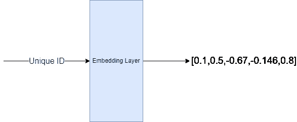
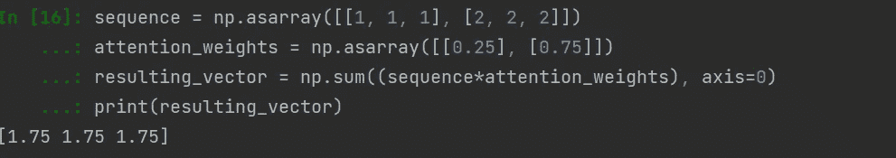
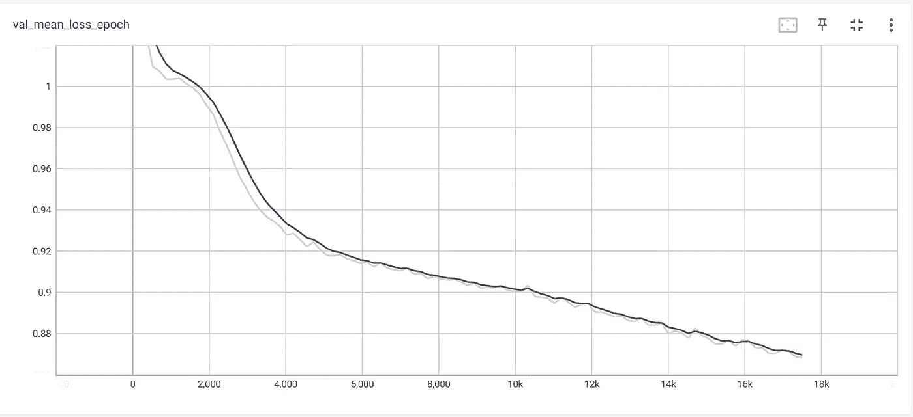
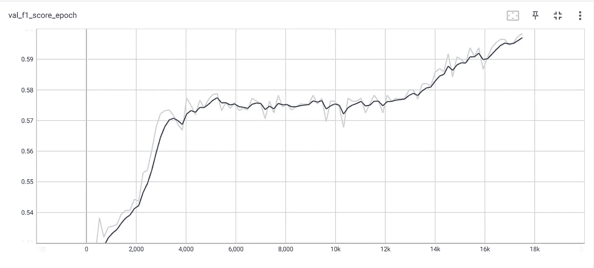
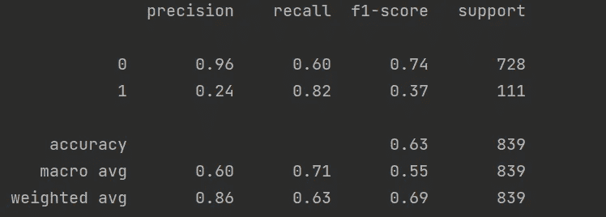

# DeepxG 教程第 2 部分:训练自己的深度学习模型，预测预期目标(xG)

> 原文：<https://medium.com/mlearning-ai/deepxg-tutorial-part-2-train-your-own-deep-learning-model-to-predict-expected-goals-xg-425e4e9636bd?source=collection_archive---------3----------------------->

## 使用 Pytorch 和 Pytorch-lightning 训练深度学习模型

# **简介**

欢迎回到 DeepxG 教程的第 2 部分！在[第一部分](/mlearning-ai/deep-xg-training-your-own-expected-goals-xg-deep-learning-model-cbb9b9eb5465)中，我们了解到 [xG](https://en.wikipedia.org/wiki/Expected_goals) 是一个度量标准，它告诉我们射门得分的概率是多少。我们还介绍了创建数据集的步骤。今天，我们将浏览一些代码，利用这些数据集来训练我们自己的深度学习模型。我们将触及如何嵌入和自我关注层可以用来处理分类和序列数据。我们将主要使用的库是 [pytorch](https://pytorch.org/) 、 [pytorch-lightning](https://www.pytorchlightning.ai/) 和 [sklearn](https://scikit-learn.org/stable/) 。本文将分为以下几个部分:

*   **DataModules:** 在 PyTorch-lightning 中，DataModules 负责以一种我们的模型可以使用的格式加载和转换数据集。数据模块执行的一些常见操作是将数据集分成小批、填充任何顺序数据、数据扩充等。在这一节中，我们将单步执行一些代码来创建我们的数据模块。
*   **嵌入和关注:**在本节中，我们将简要介绍什么是嵌入和关注，以及我们如何在足球赛事数据中使用它们。
*   **模型架构和训练:**在这一部分，我们将遍历一些代码来创建我们的深度学习模型，解释在模型的正向传递中会发生什么，以及我们如何训练模型。

*编辑:在与计算各种指标相关的代码中发现了一个 bug。需要通过应用 sigmoid 函数将模型向前传递的 logit 得分转换为概率得分。测试集上的代码要点、图像和最终度量已经更新，以反映该修复。*

# 数据模块

## **数据集**

让我们开始创建数据模块。前几行代码导入了我们需要的所有库和函数。

创建数据模块的第一步是创建 PyTorch [数据集](https://pytorch.org/tutorials/beginner/basics/data_tutorial.html)。在构造器中(第 11-19 行)，我们从[第 1 部分](/mlearning-ai/deep-xg-training-your-own-expected-goals-xg-deep-learning-model-cbb9b9eb5465)加载训练/验证/测试数据集。模式变量决定了我们将哪个数据集加载到内存中。在第 12 行中，我们用-1 替换任何 nan 变量。预测 xG 可以被**视为一个二元分类** **任务**。即，给定关于射门的一些特征，我们预测射门是否会导致进球。第 13–14 行创建了一个变量，该变量根据原始事件数据存储射门是否导致进球。这将是我们分类任务的标签。

我们的数据集包含四种类型的特征，第 15–19 行提取了这些不同的特征:

*   **分类:**投篮技术名称、身体部位名称、位置名称、传球技术名称、投篮区域
*   **分类顺序:**传递顺序
*   **布尔:**欠压特征可以是真也可以是假。
*   **连续:**拍摄角度，拍摄距离

第 21–24 行处理向数据加载器返回数据集的长度，并在数据加载器提供索引( *item)* 时返回相应的数据行。需要注意的关键是，我们批处理中的每个条目将由 5 个项目组成 *pass_sequence、shot_zone、categorical _ features、continouns+boolean features 和 label。当我们解释我们的模型架构时，这种格式的原因将变得更加清楚。*

## 数据模块

这个模块非常简单，但是非常有用。pytorch-lightning 根据我们是否处于模型训练管道的训练、验证或测试阶段，计算出它需要使用哪个数据加载器。我们创建了一个 *custom_collate* 函数(第 9-12 行)来处理我们的顺序数据。

我们的序列特征/变量是投篮前传球区域的序列。**需要注意的是，不同的传递序列可以有不同的长度。**然而，如果批量大于 1 ，我们就不能拥有长度可变的张量**。为此，我们填充所有的通过序列，以匹配批次**中最长通过序列的**长度。我们的 pad token id 是 80，这是第 81 个区域，即一个不存在的区域。我们已经在第 1 部分的[中介绍了原因。我们的 collate 函数被所有的数据加载器调用来处理 *pass_sequence* 特性。](/mlearning-ai/deep-xg-training-your-own-expected-goals-xg-deep-learning-model-cbb9b9eb5465)**

# 嵌入和自我关注

分类变量给只能接受数字数据作为输入的机器学习算法带来了一个独特的问题。用于处理分类变量的一些常见技术有标签编码、一键编码、二进制编码等。这个[库](https://contrib.scikit-learn.org/category_encoders/)是学习更多分类数据编码技术的好资源。然而，深度学习的扩散使得利用**嵌入层**来处理分类数据变得非常流行。

## **嵌入图层**

嵌入层将唯一的 id 映射到 n 维向量。嵌入层的一个主要优点是**它是机器学习模型的一个参数，它的权重(n 维向量的值)可以通过任何优化算法更新，例如 SGD 或 Adam** 。在[第 1 部分](/mlearning-ai/deep-xg-training-your-own-expected-goals-xg-deep-learning-model-cbb9b9eb5465)中，我们通过利用*标签编码器将每个分类变量的值映射到一个唯一的 id。*这背后的原因是将分类变量的每个值映射到我们嵌入空间中的一个 n 维向量。

The embedding layer maps an ID to an N-dimensional Vector

## 注意力

*pass_sequence* 特征由分类变量的**序列组成。当通过嵌入层时，我们将获得一系列嵌入。由于不同的序列在不同的批次**中可以有不同的长度**，我们需要找到一种方法来获得包含序列**中所有嵌入的**摘要的单个向量。这是自然语言处理中常见的一个问题，在自然语言处理中，表示文档的标记数量可能是可变的。处理这种情况的一些常见技术是取所有嵌入的平均值(平均值池)、取所有嵌入的总和、取所有嵌入的最大值(最大池)等。然而，使用[注意力](https://lilianweng.github.io/posts/2018-06-24-attention/)(这个博客很神奇)层已经被证明在不同的深度学习架构中极其有效。**

Illustration of how Attention Weights can be used to obtain sequence summary

【attention 背后的思想是找到序列中所有嵌入的加权表示以有效地概括序列的内容。注意层将为序列中的每个向量提供权重。然后，这些权重可以用于计算序列的加权和。

在上图中，我们展示了注意力是如何被利用的。假设你有一个两个向量的序列。每个向量是 n 维的(在我们的例子中 n 是 3)。注意力层将提供序列中每个向量的注意力权重。然后，我们计算该序列的加权和，以获得概括该序列的单个 n 维向量(0.25*1 + 0.75*2 = 1.75)。

通过马尔可夫模型对足球事件进行建模是很常见的，在马尔可夫模型中，当前状态仅依赖于先前状态，或者假设所有事件彼此独立。**注意力机制提供了一种有效的方式，可以避免做出如此强烈的假设**毕竟，在一次进攻行动中可能会有多次关键传球或运球，从而导致进球。最终，它是所有项目(传球、运球等)的组合。)这导致了一个目标。

我们的模型将利用一种称为[自我关注](https://towardsdatascience.com/illustrated-self-attention-2d627e33b20a)的关注来处理 *pass_sequence* 特征*。*自我关注已经成为深度学习中最受欢迎的关注类型。为了简洁起见，我们不会深入自我关注的细节，但是已经有很多关于它的文章了。

# 模型架构和培训

Model Architecture

## 体系结构

我们的每个分类变量都经过一个嵌入层(蓝色)。**为了利用关于传球顺序的信息**，我们创建了*位置嵌入*，并将它们与*传球区域嵌入相加。*嵌入的结果序列被发送到自我关注层。自关注层的输出被求和以获得单个 n 维向量来表示每个经过的序列。

*shot_technique、body_part、position 和 pass_technique* 嵌入被发送到一个线性层，然后是一个 GELU [激活函数](https://machinelearningmastery.com/using-activation-functions-in-neural-networks/#:~:text=Activation%20functions%20play%20an%20integral,a%20simple%20linear%20regression%20model.)。 *pass_zones 和 shot _ zone**嵌入分别**发送到另一个线性层。最后一步是连接来自线性层*压力下*(布尔)特征、*发射角度、*和*发射距离*(连续变量)的投影，并将它们通过多层感知器(MLP)。实现如下所示。***

*我们进行必要的导入，并设置我们的随机种子，以确保我们的实验和结果的可重复性。第 24–28 行实例化了我们所有的嵌入层。第 31 行添加了自我关注层。第 34–36 行创建线性层。第 39–43 行创建了我们的 MLP。*

*第 46 行声明我们的分类阈值是什么，即大于 0.5 的概率得分**将被视为预测给定射门**的进球。第 47–49 行创建了必要的对象来跟踪我们想要监控的不同指标。Torchmetrics 与 torch-lightning 模块完美集成，使得记录和计算不同指标变得非常简单。我们最感兴趣的指标是[宏观 F1 得分](https://towardsdatascience.com/micro-macro-weighted-averages-of-f1-score-clearly-explained-b603420b292f)这是因为宏观 F1 得分**将预测进球的 F1 得分视为与未预测进球的 F1 得分同等重要。**尽管阶级不平衡。*

## *前进传球*

*神经网络中的正向传递是将输入数据发送到模型时发生的事情。**它决定了深度学习模型的不同组件/层被调用的顺序，以及它们如何相互连接**。我们的流程如上图所示，实现如下。*

*第 5–7 行处理通过不同的嵌入层传递我们的分类数据。第 7-15 行显示了我们如何处理 *pass_sequence* 数据。首先，我们将它通过一个嵌入层。接下来，我们创建一个张量来捕捉通道的顺序。我们假设位置 id 0 对应于区域 80，即处理所有 nan 区域或填充区域。*

*在第 8 行中，我们创建了一个掩码，以找出我们应该屏蔽掉每个传递序列的哪些索引**，因为它们是 nan 或填充标记**。在第 13 行，我们确保对应于 nan/padded 区域的所有 *pass_zone* 嵌入被置零。这是一种教导模型不要注意填充标记或 nan 区域的方法。在第 15 行，我们对自关注层产生的所有传递嵌入求和，以获得单个 n 维向量来表示我们的传递序列。*

*线(17–21)通过线性层传递嵌入。第 24 行将投影嵌入传递给我们的 MLP，以获得最终得分/logit。通过 sigmoid 函数传递 logit 得分，我们可以从 logit 中获得概率得分。*

## *培训和评估*

*接下来，我们指定每个训练/验证和测试步骤的逻辑。基本上我们所做的就是调用 forward 函数，然后计算我们的损失。因为我们正在处理二进制分类问题，所以我们使用*二进制 _ 交叉 _ 熵 _with_logits* 损失函数。*

***我们的数据是不平衡的，因为更多的射门没有进球，而不是进球**。从训练数据集中，我们发现导致进球的射门与不导致进球的射门之间的比率(正标签:负标签)是 1:7.25。在计算损失时，我们使用该信息为我们的阳性标签提供一个[增加的权重(第 3 行和第 10 行)。这意味着正标签上的损失乘以 7.25 倍。**这使得该模型比没有权重因子时更关注于提高召回率。**](https://stackoverflow.com/questions/68611397/pos-weight-in-binary-cross-entropy-calculation)*

*代码中的其他步骤包括记录不同的指标。在计算指标之前，我们需要通过应用 sigmoid 函数(第 12 行)将原始 logit 分数转换为概率。默认情况下，火炬闪电记录到[张量板上](https://www.tensorflow.org/tensorboard)。第 29–31 行定义了我们将使用的优化器。第 33–42 行处理对我们的测试集进行预测，并打印出性能。*

## *配置教练*

*最后一步包括配置我们的训练对象，以确定我们要训练多少个时期，多久验证一次等等。早期停止(第 3-4 行)确保如果我们正在监控的指标(在这种情况下是一个时期结束时的验证损失)在超过**n**(n 的值由耐心参数决定)**连续**验证步骤后没有改善，我们将停止训练模型。*

*我们的模型检查点(第 5-9 行)确保我们保存的模型**对应于最佳的 f1-分数**。请注意，良好的准确性分数可能会产生误导**,因为大多数射门不会导致进球，而总是预测射门不会进球的模型仍然会有良好的准确性分数**。*

# *结论*

*这是我们在 tensorboard 上训练模型的一些图。我们看到，随着我们继续训练模型，我们的验证损失稳步下降。未达到峰值或稳定水平的验证损失是一个信号，表明我们可以为我们的模型训练更多的步骤/时期。我们的模型在验证集上的性能也遵循相同的模式。*

**

*Mean Validation Loss Over An Epoch*

**

*Validation F1 Macro Score*

*我们在验证集上保存对应于最佳宏 F1 分数的模型，并针对我们的测试集运行它。我们获得 0.55 的宏观 F1 分数。要知道这是不是一个好成绩，还是不要调到第 3 部分！*

**

*Results of our trained model on the test set.*

*谢谢你能走到这一步！今天，我们介绍了如何利用嵌入层来处理分类特征，利用关注层来处理足球比赛中的序列数据。我们展示了如何使用 pytorch-lightning 在笔记本电脑上创建和训练深度学习模型。*

*在本系列的第 3 部分中，我们将介绍一些评估和使用 DeepxG 模型的酷方法。我们将展示如何用它来预测比赛结果，预测比赛的最佳得分者，等等。我们还将比较我们的模型与 Statsbomb 官方使用的模型的性能。如果您希望我们在未来涵盖任何其他主题，请给我们留下评论。*

**如果你有兴趣继续了解更多关于数据科学和机器学习如何应用于足球世界的信息，请关注* [*关注*](/@buildingblocks) *我们，查看我们之前的一些文章！**

* [## Mlearning.ai 提交建议

### 如何成为 Mlearning.ai 上的作家

medium.com](/mlearning-ai/mlearning-ai-submission-suggestions-b51e2b130bfb)*