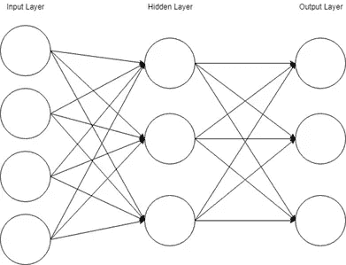
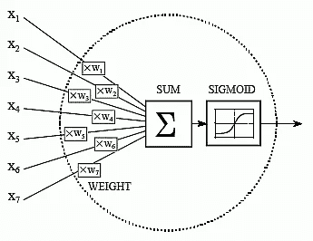

# 定义神经网络中的关键术语和概念(第一部分)

> 原文：<https://medium.com/mlearning-ai/defining-key-terms-concepts-in-neural-networks-part-1-5cc6a9563a13?source=collection_archive---------8----------------------->

Photo by [Andrea De Santis](https://unsplash.com/@santesson89?utm_source=unsplash&utm_medium=referral&utm_content=creditCopyText) on [Unsplash](https://unsplash.com/s/photos/machine-learning?utm_source=unsplash&utm_medium=referral&utm_content=creditCopyText)

作为一生都在研究数学的人，简单地说，神经网络是一个很大的数学函数。一个复杂的数学函数，考虑到许多系统，但是，当分解时，它是一个包含许多部分的大函数。

我这篇文章的目标是为我自己和其他对理解神经网络感兴趣的人分解这个复杂的主题。对于不熟悉深度学习的人来说，深度学习是机器学习的子集。对于那些不熟悉机器学习的人，我将返回来添加一些背景知识。我们习惯于明确地告诉我们的软件应用程序做什么和如何做。我们写代码是为了告诉我们的机器/应用程序/软件做什么。好吧，机器学习在某些方面是相反的。机器/应用程序/软件从数据中学习。换句话说，机器学习就是给计算机编程，让它们能够从数据中学习。这也有助于人们理解为什么获取数据和获取好的数据如此重要。非常聪明的人现在能够从数据集创建复杂的应用程序，因为我们拥有这样做的知识和计算能力。我非常喜欢研究系统设计，如果你有正确的系统，有正确的数据提取和采集过程，有许多 ML 和 DL 应用是可能的。这些应用程序将帮助您提高效率，因此，节省和赚钱。这就是为什么公司希望投资成为数据驱动的公司。

# **ML 和 DL 架构的区别？**

就像我之前提到的，深度学习(DL)是机器学习的一个子集，所以在我们进入深度学习之前，我们必须了解什么是机器学习，但为了给你一个预览，本质上，深度学习利用了深度计算堆栈，这意味着涉及了深度堆栈的**隐藏层**。

现在，我将介绍被称为**多层感知器(MLP)的神经网络的“香草”网络。****多层感知器(MLP)** 由神经网络架构中的多个层组成。它由一个**输入层**、**隐藏层**和一个**输出层**组成。这是一个超级基本的人工神经网络，但对理解 ML/DL 建立的基础极其重要。

Multilayer Perceptron

# 术语

*   **神经元**

神经元是感知器和神经网络的基本构件。上图中的圆圈是神经元。他们受到生物神经元的启发。我们可以看到，输入层有 4 个神经元，隐藏层有 3 个神经元，输出层有 3 个神经元。一个神经元由一个通常在 0-1 之间的**输入**，一组**权重**和一个**激活函数**组成。

# 创建模型

*   **图层**

***输入层*** :这是数据首次引入网络的第一层。通常，数据应该由 0 和 1 组成。因此，通常会对数据进行预处理，以优化网络性能。

*:隐藏层是输入层和输出层之间的层。这是隐藏层将**权重**应用到输入层并基于工作中的**激活函数**计算它们的地方。*

****输出层*** :这是你的神经网络的最后一层，也是结果层。这个图层将根据您回答的问题输出您的结果。*

*   ***权重和偏差***

**

*weight & bias*

***权重**是控制两个神经元之间连接强度的值，这意味着输入层的神经元通常乘以权重，这些权重将定义输入对下一层的影响程度。初始化神经网络时，重要的是在学习开始前随机化权重值。*

***偏差**项是附加在神经元上的附加常数，在**激活功能**被应用之前添加到加权输入中。初始化神经网络时，重要的是在学习开始前随机化偏差值。*

*   ***激活功能***

**

*如果我们回到多层感知器的图像，我们可以看到有 4 个神经元指向下一层的每一个神经元。每个神经元由一个输入*权重+偏差组成，我们取指向下一层神经元的所有神经元的总和，并用一个**激活函数**包装所有这些。激活函数是归一化权重、输入和偏差方程的函数。激活函数的例子有 Relu，Sigmoid。谭。这些数学函数将使输出在-1 和 1 之间正常化，这样我们的神经网络将不断被输入它喜欢的数字。*

*在这篇文章中，我写了如何创建模型，如何将数据插入模型，以及如何通过输出层进行预测。这是一个很好的概述，但我们如何知道，或者更准确地说，模型如何知道它正在对手头的任务做出正确的预测。我将在下一篇关于神经网络中的**关键术语和概念的文章中更深入地讨论这个问题。***

*如果你认为这些信息丰富，请给我一个关注或几个掌声。谢谢大家！*

*   ***参考文献:***

*3Blue1Brown Youtube 频道。*

*使用 Scikit-Learn、Keras & TensorFlow 进行机器学习。*

*Franç ois Chollet 用 Python 进行深度学习。*

*[迪派](https://deepai.org/)*

* [## Mlearning.ai 提交建议

### 如何成为 Mlearning.ai 上的作家

medium.com](/mlearning-ai/mlearning-ai-submission-suggestions-b51e2b130bfb)*