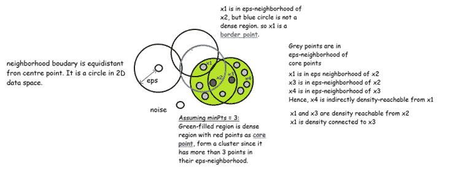
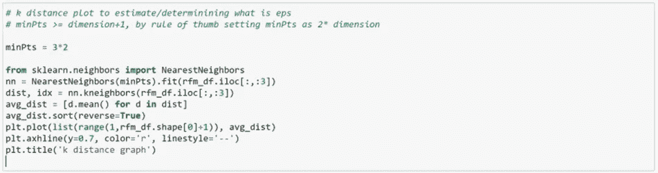
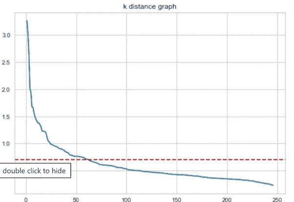
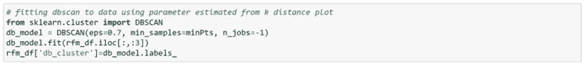
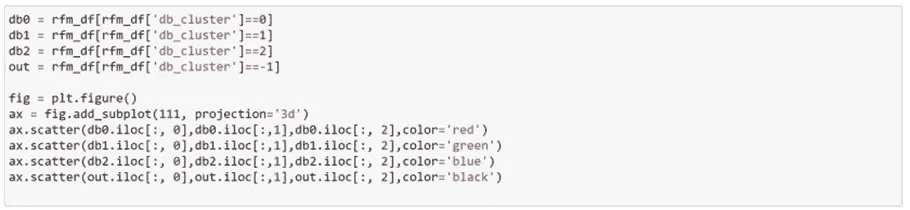
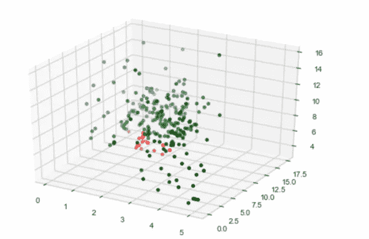
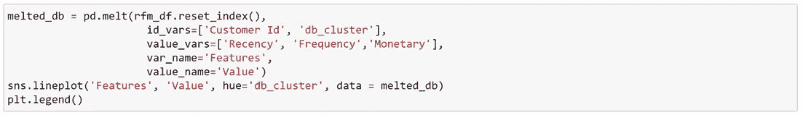
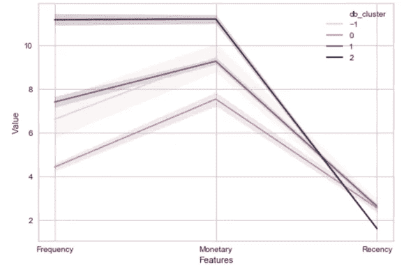
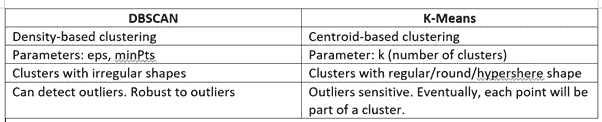

# 使用 Python 演示 DBSCAN 聚类的客户细分

> 原文：<https://medium.com/mlearning-ai/demonstrating-customers-segmentation-with-dbscan-clustering-using-python-8a2ba0db2a2e?source=collection_archive---------2----------------------->

## 带噪声的基于密度的空间聚类应用程序(DBSCAN)，这是一个备受瞩目的获奖聚类算法。了解什么是 DBSCAN 及其在客户细分中的应用，这是业务分析中的一个关键领域。

What is clustering?

**简介**

我们总是试图专注于潜在客户的子集，而不是广泛的覆盖面，通过客户细分努力缩小我们的目标客户，从而优化我们的业务目标。回想一下在之前的[帖子](/swlh/exploring-customers-segmentation-with-rfm-analysis-and-k-means-clustering-93aa4c79f7a7)中讨论的通过基于质心的聚类(K-Means)进行的客户细分，我们可能希望最小化或甚至消除与应用的模型相关的一些缺点，以提出更灵活或稳健的模型作为替代方案。在本文中，我们将介绍一种基于密度的解决方案——DBS can，它可以解决这些问题。

**为什么是 DBSCAN？**

从 K-Means 的聚类结果来看，每个数据点被分配到一个聚类，点的平均值是每个聚类的质心。因此，每个点在确定集群中发挥了它们的作用。实际上，一些数据点偏离“正常”并不罕见，也就是所谓的异常或异常值。单个点中存在单个异常值或微小变化可能会扭曲整个聚类结果。此外，由 K-Means 形成的簇更接近球形，如果簇是其它奇数或椭圆形，问题就出现了。碎石图和剪影图作为确定参数 k 的指导，但它们受模型对异常的敏感性的影响很大。创造一种新的方法旨在克服现有方法的复杂性。DBSCAN 处理 K-Means 的大部分缺点。

**数据库扫描**

DBSCAN 也是基于密度的非参数无监督学习，我们不指定数据来自的任何模型。假设更少，模型建立更灵活，应用更广泛。与 K-Means 类似，DBSCAN 根据距离函数和密度，按相似性对数据进行分组。这里的密度是指由模型参数定义的区域中的点数。让我们定义用于解释幕后发生的过程的术语:

1. *eps* —定义一个点的邻域， *x* ，或以 *x* 为圆心的圆(或 N-D 空间中的超球)的半径

2.*min pts*——邻域内形成密集区域的最小点数

3.核心点——在 *eps 内至少有 *minPts* 个数据点的点。*

4.边界点-位于密集区域或聚类内但不是核心点的点

5.噪音-不属于任何聚类

6.直接密度可达—点 *x* 是从 *y* 直接密度可达的，如果 x 在*EPS*-y 的邻域内

7.间接密度可达—点 *x(1)* 据说是从 *x(n)* 间接密度可达的( *eps，minPts* ，如果有一个点链{ *x(1)* ，…， *x(n)* }使得 *x(i+1)* 是从 *x(i)* 直接密度可达的。

8.密度连通性—如果有一个点 *z* 使得 *x* 和 *y* 都可以从 *z* 直接到达，则点 *x* 是从 *y* 密度连通的( *eps，minPts* )。

DBSCAN 对数据进行分区，使得密集区域被稀疏区域分隔开。它处理具有以下特征的数据:

不规则簇形状

不同的集群大小

异常值的存在

算法:

1.在*EPS*-邻域中随机选取一个点并检查其是否为具有 *minPts* 点的核心点，形成一个簇。

2.在核心点附近的点上递归运行，直到所有点都被访问，将密度可达点指定为一个集群。

3.对剩余的未访问点重复该过程。

Illustrating DBSCAN process. credit: [https://www.digitalvidya.com](https://www.digitalvidya.com/blog/the-top-5-clustering-algorithms-data-scientists-should-know/)

**实现 DBSCAN**

只有当我们试图探究数字背后的含义时，数据才有用。如果我们不对数据进行分析、消化和可视化，那么数据将只是一个记录。在对 DBSCAN 做了一些简单的介绍后，下文将通过采用之前[帖子](/swlh/exploring-customers-segmentation-with-rfm-analysis-and-k-means-clustering-93aa4c79f7a7)中经过预处理的真实世界数据来演示 DBSCAN 的应用。总体规划将是相同的，但这一轮 DBSCAN 将接管 K-Means 的角色，并负责执行分区任务。

首先，我们需要估计和指定 DBSCAN 的参数，从 *minPts* 开始，然后是 *eps* 使用前者。如果 *minPts=1* ，每个数据点将自己形成一个簇，这意味着如果我们有 n 个数据，我们将有 *n 个*簇。这对于进行聚类没有任何意义。如果 *minPts=2* ，则与单链接层次聚类相同。因此， *minPts* 应设为 *minPts ≥ D+1* 。然而，根据经验，为简单起见，下面将其设置为 *minPts=2*D* 。向前移动， *eps* 由 k 距离图确定。计算距离 *k* 最近邻居的平均距离，并根据 1:n 的范围绘制。曲线上“肘”点的 y 值，在这种情况下 *eps=0.7* 。

*Python 代码:*

code for determining parameter eps.

k distance graph

应用估计的参数，拟合 DBSCAN 模型，并在 3D 绘图中可视化结果。注意黑点是检测到的异常，sklearn 库中的 DBSCAN 模型会标注为'-1 '。异常被发现松散地分布在远离密集区域的地方。聚类数和离群值集在很大程度上受参数设置的影响。在一些令人困惑的情况下，发现“肘部”可能是主观的，因为曲线没有显示连续点之间的距离有明显变化。因此，记录要寻找的簇的可能或逻辑数目可能是重要的。在这种情况下，尝试改变参数，可能会获得大量的簇，这不太合理，并且偏离了我们感兴趣的内容。解释这种情况的原因之一是由于处理数据的样本量小。然后在下面的蛇图中分析和总结每个聚类的重要特征或聚合特征，以帮助企业做出商业决策。

*Python 代码:*

code for fitting a model.

code for visualizing clusters in 3D plot.

3D plot. Black color points are anomalies detected.

*Python 代码:*

这幅蛇图的整体形状与图 6 [中的](/swlh/exploring-customers-segmentation-with-rfm-analysis-and-k-means-clustering-93aa4c79f7a7)相似，但仔细观察上面记录或绘制的数字，还是有一些不同。“货币”方面的差异稍微明显一些。集群 2 对具有最低“新近性”的企业最具经济价值。最高的“货币”和“频率”。当这个任务的目标改变时，我们看待这个结果的方式应该更新，以做出合理的商业决策。例如，如果企业希望保留潜在的流动客户或寻找一些新产品或促销的目标，具有高“新近性”的聚类吸引我们的注意，随后选择其他聚类而不是 2 个。仔细和全面规划的分析目标至关重要，因为它会影响数据的处理方式，从而对结果产生重大影响。

**DBSCAN vs K-Means**

Comparing kmeans and dbscan.

**结论**

距离函数用于计算样本之间的相似性。参数的选择基于所选择的功能。在更简单的情况下，我们设法直观地确定散点图中的密集区域。这种现象非常罕见，尤其是当我们接触到更高维度的数据或密集区域之间没有清晰边界的数据时。虽然 DBSCAN 比 K-Means 有优势，但是当数据维数太大时，它的结果会恶化，出现“维数灾难”问题。具有不同密度或松散分布的数据的聚类结果不会太好，甚至偏离我们的目标。有时这些点会落在边界不清的混乱区域，它们可能会被归入任何一个聚类中。了解我们拥有的数据，选择能够处理数据结构的模型，以获得讲述真实故事的最准确的结果。