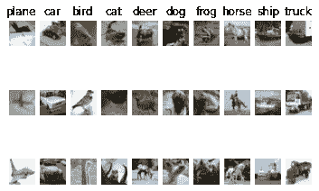
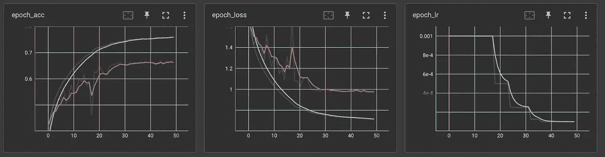
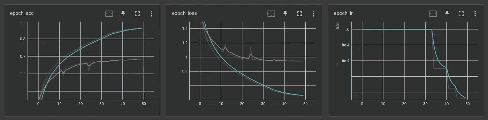
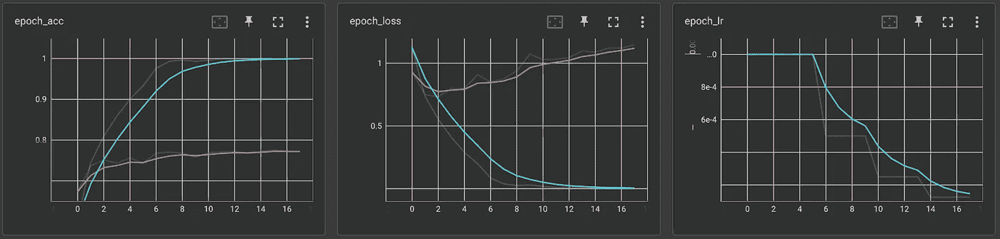
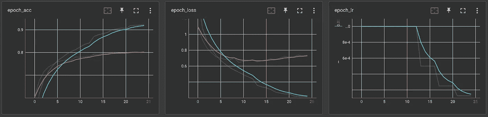
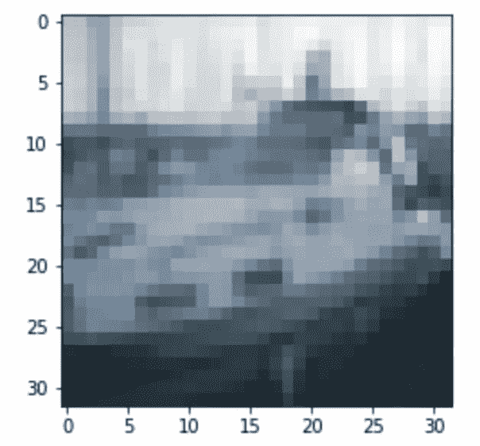
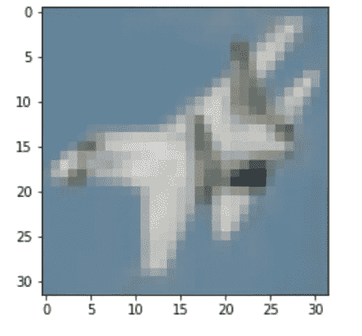
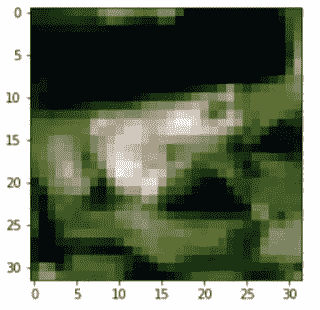

# 揭秘批处理规范化与删除

> 原文：<https://medium.com/mlearning-ai/demystifying-batch-normalization-vs-drop-out-1c8310d9b516?source=collection_archive---------0----------------------->

## 批量规范化真的是经验法则吗？将结果与 CIFAR10 数据集上的丢失进行比较

众所周知，批量归一化(BN)可以提高模型性能，减轻内部协变量偏移，并应用较小的正则化效果。国阵的这些功能和证明国阵有效性的实证研究有助于巩固人们使用国阵而不是辍学的偏好。BN 迅速取代了许多深度学习模型中的辍学层。为什么会这样呢？BN 用自己的平均值和标准偏差对每批的单位值进行标准化。另一方面，Dropout 随机丢弃神经网络中预定义比例的单元，以防止过度拟合。因此，使用 dropout 图层和 batch normalization 图层(为了更加明确起见，将它们放在一起)会造成这两者之间的不协调。虽然 BN 有轻微的正则化效果，但它更多的是归一化过程的副作用。相反，Dropout 是一种简单但强大的正则化方法，用于解决过度拟合问题。

这里出现了一个难题:你应该选择批量规范化还是放弃，反之亦然？回答这个问题到一些问题，还是挺简单的。当你使用序列模型，如 RNN 或 LSTM，你不能使用 BN。取而代之的是，可以使用层标准化或丢弃作为替代方案。在序列模型中，剔除是一种更广泛采用的正则化方法。然而，对于其他深度神经网络，尤其是在卷积神经网络(CNN)中，使用 BN 而不是 dropout 通常被认为是经验法则。

出于我对国阵几乎总是赢退学生的深深怀疑和好奇，我进行了一项实验。在开始之前，我想指出我做这个实验的动机远不是拒绝 BN 的作用或者证明一个比另一个好。这个实验的目的是看看 BN 是否真的优于 dropout，以及在我们的用例中我们是否可以安全地选择 BN 而不是 dropout。

实验是通过 colab 环境使用 CIFAR10 数据集完成的。我用不同的模型架构构建了四个不同的模型来比较结果。基线模型是用两层和 BN 层的 VGG 块构建的 CNN 模型。第二个模型是比基线模型更深的模型。第三个模型与第二个模型具有相同的结构，但是 ADAM 是为优化器实现的。所有其他模型都使用 SGD 作为优化器。最后，最后一个模型用 dropout 代替 BN。你可以在这个 [GitHub 链接](https://github.com/Irene-kim/Demystify_NeuralNets)中看到每个模型是如何设计的，以及运行实验的一步一步的代码指南。为了清楚起见，这个实验使用了四个不同的模型:

1.  带 BN + SGD 的 VGG2(基线)
2.  VGG2，每个 CNN 层上有 BN+SGD
3.  VGG2，每个 CNN 层上有 BN+ADAM
4.  VGG2 带压差+ SGD

下图显示了数据预处理后 CIFAR 10 数据集中十个不同类别的三个示例。

CIFAR 10 dataset

## 每个模型的训练和验证过程及结果如下(蓝线—训练集，红线—验证集):

1.具有 BN + SGD 的 VGG2(基线):
acc: 0.6658，loss: 0.9705，auc: 0.9457

Model Accuracy, Loss, and Learning Rate

2.在每个 CNN 层上具有 BN 的 vgg 2+SGD:
ACC:0.6786，loss: 0.9437，auc: 0.9489

3.在每个 CNN 层上具有 BN 的 vgg 2+ADAM:
ACC:0.7512，loss: 0.7312，auc: 0.9680

4.vgg 2+SGD:
ACC:0.7803，loss: 0.6453，auc: 0.9741

与其他模型相比，具有 SGD 优化器的 BN 模型似乎减少了过度拟合。有意思的是，dropout 模型在准确率和损耗方面远远胜过其他有 BN 的模型！检查训练和验证历史，具有脱落层的模型 4 呈现最佳性能，其次是模型 3。其测试精度达到约 0.8，而其他模型的精度较低。同样，模型 4 的训练和验证数据集的损失也是最低的。

过度拟合似乎是所有模型的问题。为了缓解这个问题，我引入了提前停止并获取最佳超参数来构建最佳性能模型。

## 让我们用自己的眼睛来看看每个模型是如何对一艘船的形象进行分类的！船只图像的标签是 8。

Image of a ship

1.  带 BN + SGD 的 VGG2(基线)
    —预测:8
2.  每个 CNN 层上有 BN 的 vgg 2+SGD
    —预测:0
3.  每个 CNN 层上有 BN 的 vgg 2+ADAM
    —预测:8
4.  带压差的 vgg 2+SGD
    —预测:0

这里的模型 2 和 4 做出了不正确的预测。他们认为那是一架飞机而不是一艘船。

让我们试试另一个！这次图像是平面的，标记为 0。

Image of a plane

1.  带 BN + SGD 的 VGG2(基线)
    —预测:0
2.  在每个 CNN 层上有 BN 的 vgg 2+SGD
    —预测:4
3.  在每个 CNN 层上有 BN 的 vgg 2+ADAM
    —预测:0
4.  带压差的 vgg 2+SGD
    —预测值:0

这次只有 model 2 做了一个不准确的决定。模型 2 预测它是一只鹿。也许尖角状的飞机尾部与这个错误有关。

现在让我们看看模特们是如何表现动物形象的。

Image of a frog

1.  2 带 BN + SGD(基线)
    —预测:6
2.  每个 CNN 层上有 BN 的 vgg 2+SGD
    —预测:2
3.  在每个 CNN 层上有 BN 的 vgg 2+ADAM
    —预测:6
4.  带压差的 vgg 2+SGD
    —预测:6

再次，模型 2 犯了一个错误。模型 2 预测青蛙是一只鸟。

这次让我们看看模型是如何预测这张看起来很奇怪的鹿照片的。鹿的地面真相标签是 4。

Image of a deer

1.  2 带 BN + SGD(基线)
    —预测:0
2.  在每个 CNN 层上有 BN 的 vgg 2+SGD
    —预测:0
3.  在每个 CNN 层上有 BN 的 vgg 2+ADAM
    —预测:4
4.  带压差的 vgg 2+SGD
    —预测:4

模型 1 和 2 认为鹿的图片是一架飞机！背景和喇叭可能会混淆天空和飞机尖尖的尾翼的模型。

总的来说，与 BN 模型相比，具有 dropout 层的模型似乎表现得相当好。这个结果对我来说非常有趣，因为数据科学领域的许多人盲目地相信 BN 比 dropout 层工作得更好，最终从未尝试比较这两者。结果表明，在某些情况下，漏失层的性能优于 BN。最后但并非最不重要的是，结果告诉我们永远要用自己的眼睛测试和观察！虽然 BN 是一种先进而复杂的技术，但在某些情况下，简单的脱落层也可以利用图像数据获得类似甚至更好的结果。