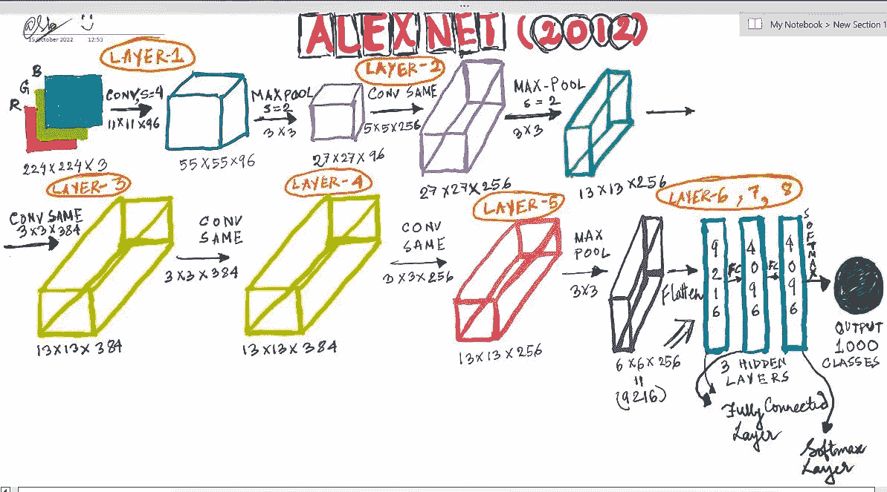
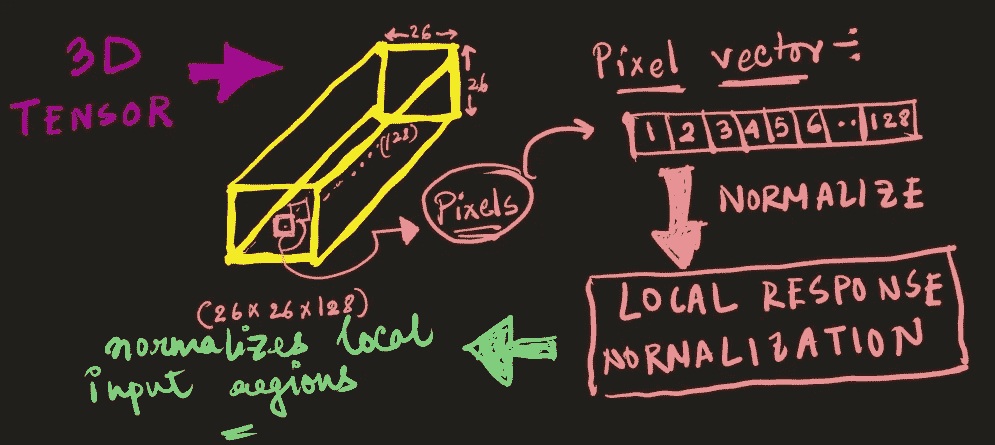

# 揭开 DCNNs 的神秘面纱 AlexNet

> 原文：<https://medium.com/mlearning-ai/demystifying-dcnns-the-alexnet-6081eccb8f57?source=collection_archive---------2----------------------->

## 亲自实施 AlexNet 架构

Source — gifs.com

# Introduction🧧

还记得 2012 年的 ImageNet 视觉识别挑战赛吗？

你当然知道！经过大量的反复试验和实验，研究员 Alex Krizhevsky 和他的合著者 Ilya Sutskever 和 Geoffrey E. Hinton(他们从字面上理解了深度学习中的“深度”)推出了以第一作者命名的 AlexNet 架构，并赢得了 ImageNet 挑战赛，从而为深度卷积神经网络的对象检测带来了深度迁移学习的新时代！

在这篇博客中，我们将揭开 AlexNet 论文的神秘面纱，深入讨论它的架构，然后动手实践我们所学到的东西！

事不宜迟，我们开始吧。🤜🏼🤛🏼

# 先决条件⏮️

本文假设您非常了解-

1.  卷积运算
2.  最大池、步幅、内核、填充
3.  神经网络(CNN)和激活函数(Softmax，ReLU)
4.  卷积神经网络

# 修改专区！🤔

> 如果您已经非常了解先决条件，请跳过这一部分

我附上一些我学习深度学习基础的地方的资源，给你帮助。

1.  卷积运算— [看这个](https://www.youtube.com/watch?v=Etksi-F5ug8)
2.  卷积神经网络— [看这个](https://www.youtube.com/watch?v=SH8D4WJBhms)
3.  学习激活功能，请到我的[博客](/analytics-vidhya/activation-functions-all-you-need-to-know-355a850d025e)

# 打开八层怪兽🤖

为了更容易理解复杂的架构，我画了一个更容易理解的模型架构。在整个博客中仔细遵循架构！

AlexNet Architecture Simplified (Source-Author)

让我们把它分解开来，一步一步地理解架构——

1.  从上面绘制的架构中，观察 224×224 尺寸的 **RGB 图像以及 3 个通道**(红色(R)、绿色(G)和蓝色(B))。它代表任何彩色图像，因此，我们的输入。
2.  **第 1 层** —在第 1 层中，我们应用步长大小为 4 的卷积运算，并且具有大小为 11 x 11 的 96 个内核。当应用这些操作时，会产生 96 个大小为 55 x 55 的图像(因为我们的内核有 96 个通道)。这只是一个三维张量。
3.  然后，我们应用内核大小为 3x3、步长大小为 2 的最大池。这导致图像大小为 27x27，有 96 个通道。
4.  **第 2 层** —在 AlexNet 的第 2 层中，我们再次应用卷积，并用 256 个大小为 5x5 的内核进行填充。注意，我在图中的卷积旁边提到了“相同”。填充中的**相同**意味着过滤器将被应用于**输入的所有**元素，并且填充在模型训练阶段应被设置为相同。这确保了输出尺寸与输入尺寸相同。这再次导致具有 256 个这样的通道的大小为 27×27 的 3D 张量。
5.  同样，我们应用了内核大小为 3x3、步幅大小为 2 的 max-pooling 层，就像我们在第 1 层之后所做的那样。这产生了具有 256 个通道的 13x13 大小的图像。
6.  **第 3 层** —在 AlexNet 的第 3 层中，我们再次使用相同的填充(如第 2 层所述)和 384 个大小为 3x3 的内核进行卷积。这导致具有 384 个通道的尺寸为 **13x13** 的 3D 张量。
7.  **第 4 层** —在第 4 层中，我们用 384 个大小为 3x3 的内核应用相同填充的卷积。这再次导致具有 384 个通道的尺寸为 **13x13** 的 3D 张量。
8.  **第 5 层** —在第 5 层中，我们使用 256 个大小为 3x3 的内核，应用具有相同填充的卷积。这再次导致具有 256 个通道的尺寸为 **13x13** 的 3D 张量。
9.  现在，我们再次应用步幅大小为 2 的最大池和 3×3 最大池过滤器(内核)。这产生了具有 256 个通道的 6x6 大小的图像。
10.  **层 6、7、8 —** 在 6x6x256 (= 9216) 3D 张量上应用展平操作(维度的简单乘积)时，我们简单地得到 2 个完全连接的层，然后是最终的 softmax 层，以输出我们的类。(请注意，该图有 1000 个输出类，因为它用于对 ImageNet 问题进行分类，其中有 1000 个要识别的类)

因此，基本上，AlexNet 有 5 个卷积层，然后是 2 个完全连接的层，最后是用于产生输出的 Softmax 层。

# 为什么 AlexNet 这么酷？！

> 嘎吱嘎吱地嚼纸…

让我们来讨论一些最重要的概念，这些概念在深度学习和物体检测中广泛使用，甚至在今天，这些概念是在 AlexNet 的论文中介绍的

1.  AlexNet paper 是第一个使用强大的非线性激活函数概念的公司。
2.  **退出**用于防止过拟合，并确保学习中模型的鲁棒性和泛化能力。
3.  **数据扩充**用于将数据转换成各种形式(水平/垂直翻转、旋转等)。)来增强训练数据的多样化。
4.  **多个 GPU**用于训练模型以获得良好的性能测量。

> 除此之外，AlexNet 论文还使用了一个名为**局部反应归一化(LRN)** 的概念，尽管这是一个值得注意的概念，但它被批量归一化等高级技术进一步取代。

就我个人而言，在解决深度学习问题时，我确实更喜欢批处理规范化，但 LRN 的概念如此美丽，以至于我在研究 AlexNet 论文时无法跳过它。

# LRN 将神经科学与人工智能联系起来🔮🪄

我们知道，在使用任何激活函数之前，我们的神经网络的隐藏层希望我们将高维数据归一化为零均值和单位方差，以正确地对数据建模。规范化转换数据集中列的值并对其进行缩放，而不会扭曲值范围的差异或丢失信息。

使用 ReLU 后，也就是 f (x) = max (0，x)，你会发现使用 ReLU 后得到的值没有像 tanh 和 sigmoid 函数那样的值域。因此，在 ReLU 之后必须做一个规范。研究人员在 AlexNet 的论文中提到了一种叫做局部反应正常化的方法，这种方法对我来说似乎很有趣，因为它被发现是由神经科学中一个叫做“**侧抑制**的重要概念所激发的，它谈到了活跃神经元对其周围神经元的工作，对特定刺激做出反应。

假设你已经知道 ReLU 的工作原理，数据应该在 0 和 1 之间归一化为任何<0 is 0 in ReLU theories. For an unbounded function (no maximum value) like ReLU, LRN is used to normalize those unbounded activations given out by ReLU.

You will be surprised to know that the concept of LRN in artificial neural networks was adapted from a neuroscience concept called **侧抑制**。

> 侧抑制包括通过兴奋神经元来抑制远处的神经元。

在我们的中枢神经系统中，兴奋或受刺激的神经元往往会抑制远处神经元的活动，这有助于增强我们的感官知觉(回想一下，当你的注意力集中在目标物体上时，你仍然可以模糊地识别周围的环境——当你看着一只鸟时，你仍然可以感觉到周围的树木)。这种视觉抑制反过来增强了视觉图像中的感知和对比度。它有助于改善我们观看时的视觉和视力(以及听觉、嗅觉等)。)!

**但是，LRN 是如何与侧抑制联系在一起的呢？**

Source — Author

**局部响应归一化**也是一个涉及卷积神经网络输入特征(特征图)对比度增强的过程。 **LCN 在考虑到每个像素的特征图(图像)的局部邻域中执行。**

总的概念是增强输入图像或特征图上的“峰值”和抑制“平坦”响应，因为峰值与目标物体或刺激的存在正相关，而平坦但高频的响应不给出太多涉及物体或刺激是否实际存在的数据。因此，LRN 增加了神经对所需刺激的感觉灵敏度。

综上所述，我们可以推断出，如果与目标对象/刺激(峰值)存在强相关性，则图像的局部区域(或邻域)中的神经元之间的仿真使得**强相关性将抑制弱相关性，从而增强峰值**。但是如果有一个平坦但强的相关性，那么这些强相关性中的每一个都将几乎相等地抑制彼此，这样整个邻域都将被**阻尼**。

> 因此，LRN 过程增强了对象检测和识别。

> LRN 的概念被即将出现的层和批归一化的概念所掩盖(它的影响很小)，层和批归一化是指归一化特征图的整个层或创建小批特征图并归一化每一批，到目前为止在几乎每个神经网络上都工作得很好。

有了这些，我们基本上完成了研究论文。现在让我们进入有趣的部分。

# AlexNet 的实际实施👩🏼‍💻

只要看一下架构，我们就可以很容易的对 AlexNet 的架构进行编码。下面是同样的代码—

这就对了。传说中的 AlexNet 触手可及！

# 参考🔃

我使用了以下资源及其链接，以供参考-

1.  [AlexNet 论文(2012)](https://papers.nips.cc/paper/2012/file/c399862d3b9d6b76c8436e924a68c45b-Paper.pdf)
2.  [侧向抑制](https://en.wikipedia.org/wiki/Lateral_inhibition)
3.  [LRN](https://stats.stackexchange.com/questions/145768/importance-of-local-response-normalization-in-cnn)

# 结论🔚

希望您在学习 AlexNet 的过程中感到愉快！如果你希望我涵盖任何其他神经网络架构或研究论文，请在评论中告诉我！

> 如果你是数据科学和机器学习的初学者，并对数据科学/ML-AI、向数据科学的职业过渡指导、面试/简历准备有一些具体的疑问，或者甚至想在你的 D-Day 之前获得模拟面试，请随时在此预约 1:1 电话[。我很乐意帮忙！](https://topmate.io/sukannya)

Source — Author

快乐学习！😎

 [## Mlearning.ai 提交建议

### 如何成为 Mlearning.ai 上的作家

medium.com](/mlearning-ai/mlearning-ai-submission-suggestions-b51e2b130bfb)