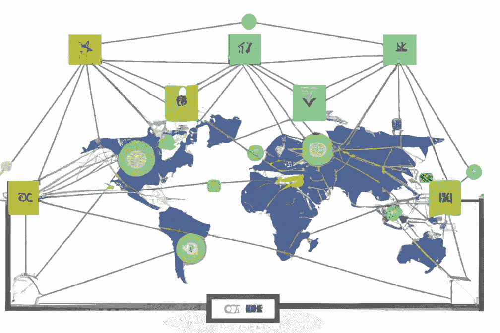
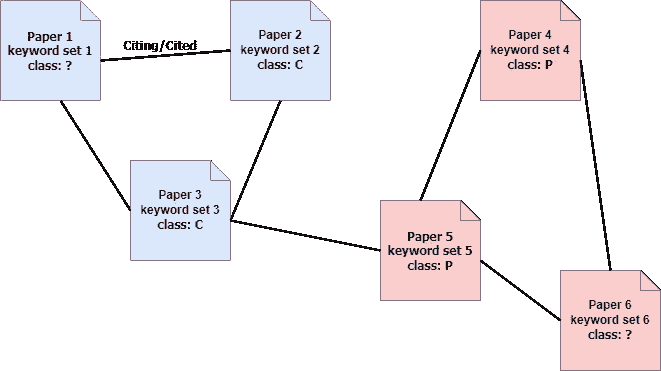
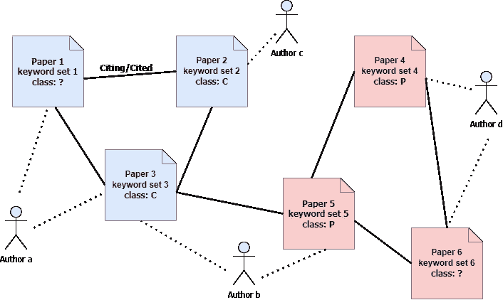
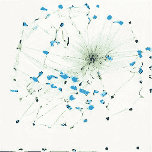
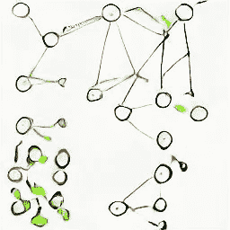
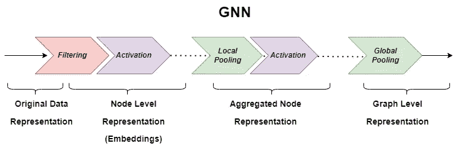
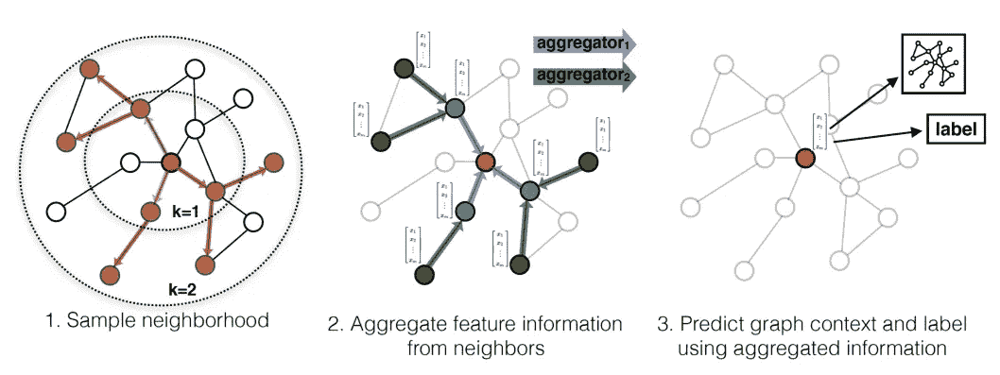

# 揭开基于图的机器学习的神秘面纱

> 原文：<https://medium.com/mlearning-ai/demystifying-graph-based-machine-learning-ed6b6b7c4081?source=collection_archive---------0----------------------->

## 以及为什么你不能不使用图表

Image Created by [https://openai.com/dall-e-2/](https://openai.com/dall-e-2/)

我花了很长时间来尝试图形学习…我可能患上了数据科学家中最常见的流行病:找到一把锤子，四处寻找更多的钉子来敲打…当你进行深度学习时，一切看起来都像一个漂亮的钉子！

更糟糕的是，当我还是一名计算机科学博士生时，我在机器学习(ML)实验室工作时，选修了一系列高级图算法课程……但我从未想过图如何有利于机器学习，更不用说彻底改变它了……公平地说，那是 10 多年前，那时深度学习还没有兴起，更不用说 GNNs 了……但仍然…

主要的问题是，在机器学习的经典学派中，数据的表格表示总是被假定，因此，重点是设计最好的特征工程和模型架构；所以我从来没有质疑过表格表示法是否能捕捉和表示数据中的所有信号；遗憾的是，我关于机器学习的全部知识都基于一个隐含的假设，即你如何表示数据不会影响模型的性能。

什么本吉奥等人。al 在 10 年前说过“……*机器学习算法的成功一般取决于数据表示方式……因为不同的表示方式可以或多或少地纠缠和隐藏数据背后变异的不同解释因素。*“[1]真正抓住了过去十年机器学习的根本革命:表征学习。

嵌入将数据从稀疏的高维空间映射到密集的低维空间，同时保持数据点之间的关系，这可能是表征学习最著名的例子。但是图形表示与我们常规的特征化或嵌入有什么不同呢？

## ***数据表示图:以*** 为例

L et 来看一个简单的例子:CORA 引文网络[2]是一个包含一堆论文及其引文的数据集:它由 2708 个节点组成，其中每个节点代表一个文档/论文，边代表 2 个文档之间通过引文的联系。每个文档还有一个单词包表示，表示文档中存在一个单词( **1433** 单词词汇表)。虽然词袋是论文的稀疏表示，但是文档嵌入(例如，Doc2Vec)可以给我们密集表示，这对于基于距离的算法更友好。

Fig 1\. Example Subgraph of a Citation Network

在图 1 中，我们看到了 6 篇论文，分为计算机科学(C)和物理学(P)两组。如果我们要猜测论文 1 和 6 的标签，一种方法是使用简单的 ML 模型，使用其他仅基于文档的单词包表示的标签示例(或者甚至获得爱好者并为这些单词和文档创建嵌入)，但是我们真的需要这样做吗？仅仅通过查看节点之间的关系，而不是节点的特征，我们就可以将这两篇论文分配到相应的组中，也许甚至不需要查看它们的单词内容。

节点之间的关系是图中的一等公民，其中在表格表示中通常需要根据两个节点的特征值之间的相似性来推断；这个例子可能过于简单，但你得到了要点:基于图的方法具有不公平的优势，即除了节点的特定特征之外，还能够使用网络的全局和局部结构来学习:

***图信号=单个节点特征+图结构***

图形也可以表示 ***异构数据点*** 并包含在它们的各种算法中；例如，在上面的例子中，假设我们也想表示作者:

Fig 2\. adding a different node type (author) creates a heterogeneous graph

## ***但是学习呢？***

但是 ML 如何从中受益呢？许多标准的 ML 算法不需要表格数据吗？答案是肯定的，ML 方法仍然可以通过以下方式利用图形丰富的表示:

—创建 ***图形嵌入*** 以同时捕获节点特征和图形结构，并像使用表格特征一样使用它们

—使用 ***图形原生学习*** 算法

——使用 ***图形神经网络***

## ***图形嵌入***

图嵌入的目的是将图空间中的相似性映射到欧几里德空间中的相似性，你可能会说，我们为什么不用邻接矩阵来表示一个图结构呢，这不是已经在欧几里德空间中了吗？是的，但这种表示是非常高维度和稀疏的，我们都知道维数灾难…这也是我们更喜欢将词袋转换为文本嵌入的确切原因:从高维度稀疏表示到低维度密集表示。

但是我们还能如何对图形结构进行编码呢？我们随便走走吧…

Fig 3\. Random Walks (image created by https://huggingface.co/spaces/dalle-mini)

想象一下，我们问图中的作者。1 在图上走一些路，在随机的路径上，现在你能仅仅通过看那些走过的路径来判断作者 a 是否比作者 d 离作者 b 更近吗？没错！如果两个节点在图上靠得更近，它们在随机行走时可能会共享更多的路径。量化这一概念的一种方法是将遍历转化为被访问节点的序列，并应用 word2vec 算法来创建这些节点序列的嵌入(而不是单词序列)…很棒吧？除了节点，我们还可以嵌入边和子图，但是节点嵌入是最实用的图嵌入类型。

实际上，我们的图有加权的边，所以行走不是完全随机的:行走者选择一条边而不是另一条边的几率与这两条边的权重比成正比…这被称为有偏随机行走。

**Node2Vec** 算法【3】只是把上面描述的步骤(有偏的随机行走后面跟着一个 Word2Vec)打包在一把保护伞下。虽然 Node2Vec 可能是最直观的节点嵌入算法，但它不是唯一的方法:快速随机投影(FastRP) [4]是一种基于 Johnsson-Lindenstrauss 引理的节点嵌入算法，根据该引理，可以将*任意*维的 *n* 个向量投影到 *O(log(n))* 维，并且仍然保持点之间的成对距离:即使是随机线性投影也可以满足这一特性。随着我们增加遍历的长度，Node2Vec 可能会变得非常慢，fastRP 可能是一个快速的替代方案，尽管选择最佳迭代权重并不总是直观的。

当然，除了边或甚至图/子图嵌入之外，还有更多节点嵌入算法，但它们并不常见。

## 图形原生学习

基于图的学习算法使用图结构进行学习。众所周知的图形本地算法有:

**中心性检测:**利用图的结构来评估图中不同节点的重要性。PageRank 可能是最著名的中心性算法，它基于连接的源节点和输入边的重要性迭代地更新每个节点的重要性。谷歌用它来检索与查询相关的重要网页。

Fig 4\. Centrality Detection (image created by [https://huggingface.co/spaces/dalle-mini](https://huggingface.co/spaces/dalle-mini))

**社区检测:**顾名思义，这些算法寻找图中节点的自然分组。这个组中的一个众所周知的算法是标签传播，其在整个图中传播任意节点标签，并通过其邻居的大多数标签来更新每个节点的标签。收敛后，一个图中密集连接的部分往往具有相同的标号。

Fig 5\. Community Detection (image created by [https://huggingface.co/spaces/dalle-mini](https://huggingface.co/spaces/dalle-mini))

**节点相似性算法:**这些算法使用图形结构和/或节点属性来估计图形中两个节点的相似性。这也与确定两个节点是否应该连接的拓扑链路预测算法有关。

当然，还有更多的图形学习算法，如路径查找、拓扑链接预测或最小生成树，它们可能位于 ML 和优化算法的交叉点。

## **图形神经网络**

Gnn 是深度学习模型，旨在捕捉图形结构和常规节点特征。你可能会说，递归神经网络(RNNs)和卷积神经网络(CNN)已经在网络内编码某种级别的结构，那么 GNNs 有什么大不了的？大多数真实世界的网络没有固定大小的输入维度，甚至也没有固定大小的邻域，此外节点排序也不固定；与 rnn 和 CNN 不同，gnn 是排列不变的，并且也适用于任意输入和邻域大小。我们需要一个完整的研究生课程来涵盖 GNN，但是这里将回顾它们最重要的操作，过滤和池，以及一个流行的 GNN 架构:GraphSAGE。

***过滤:*** 图形过滤创建一个新图形，具有相同数量的节点和边，但具有新的节点特征集。过滤层也被称为**置换等变**层，因为它将图形表示映射为同一图形的更新表示。在大多数情况下，这是通过成对的**消息在图节点之间传递**来实现的，其中节点*通过*聚合*从其直接邻居接收的*消息*来更新*它们的表示。因此，每个消息传递层都会将 GNN 的范围增加一跳。

***池化:*** 图形池化创建一个节点较少的新层，可以是局部的，也可以是全局的。本地池类似于节点的下采样，通常通过选择最重要的节点或将节点聚集到较少的组中来实现。另一方面，全局池层提供整个图形的固定大小表示，并且必须是**排列不变的**。正如您可能已经猜到的，GNNs 的最后一层通常是全局池层。

当然，除了过滤和池层之外，还有激活功能来将非线性注入网络，但这与任何其他深度学习架构几乎相同。节点级任务(节点分类或嵌入)的 gnn 通常包含过滤和激活，而图级任务(图分类)包含所有 3 层。

Fig 6\. GNN as a combination of filtering and pooling layers and activation functions

*GraphSAGE [5]是一个简单但有效的归纳框架，它使用邻域采样和聚合来为大型图创建新的节点级表示(嵌入)。邻域采样是一种聪明的策略，它在图中的不同节点上创建相同大小的邻域馈送，并将图学习的其他直推设置转换为归纳设置。换句话说，GraphSAGE 不是为每个节点学习一个单独的嵌入，而是学习一个采样和聚集节点的本地邻域并可以在所有节点之间共享的函数。*

**

*Fig 7\. GraphSAGE sample and aggregate approach (figure from the original paper [5])*

*换句话说，GraphSAGE 提供了一种归纳过滤策略，该策略使用节点先前的状态和节点邻居的随机样本来更新节点级特征。*

*GraphSAGE 的另一个好处是，它可以用于监督和非监督学习任务。当用作无监督算法时，它甚至可以为异构图创建节点嵌入(参见 HinSAGE [6])。*

## ***结论***

*在这篇博客中，我想从 10，000 英尺的角度介绍基于图的 ML，但没有触及一些重要的领域，包括图的谱表示(拉普拉斯矩阵和所有有趣的矩阵代数！)，其他类型的 gnn 或示例 python 代码。但即使没有这些，你也应该能够理解为什么图表是表征学习中最热门的话题，以及为什么你应该考虑尝试一下，如果你还没有的话。*

*如果你觉得这很有帮助，并且有兴趣在另一个博客上扩展我在这里谈到的内容，请告诉我，我会确保优先考虑它。*

## *参考*

*[1] Y .本吉奥，A .库维尔和 p .文森特，“表征学习:回顾和新观点”，载于《IEEE 模式分析和机器智能汇刊》，第 35 卷，第 8 期，第 1798-1828 页，2013 年 8 月，doi: 10.1109/TPAMI.2013.50*

*[2][https://relational.fit.cvut.cz/dataset/CORA](https://relational.fit.cvut.cz/dataset/CORA)*

*[3] Grover，Aditya 和 Leskovec，Jure。" node2vec:网络的可扩展特征学习."在 2016 年第 22 届 ACM SIGKDD 知识发现和数据挖掘国际会议论文集会议上发表的论文。*

*[4] H. Chen，S.F. Sultan，Y. Tian，M. Chen，S. Skiena:通过非常稀疏随机投影实现快速准确的网络嵌入，2019 年。*

*[5] W. L. Hamilton、R. Ying 和 J. Leskovec，“大型图上的归纳表示学习”，arXiv.org。2017 年 6 月 8 日。*

*[https://stellargraph.readthedocs.io/en/stable/hinsage.html](https://stellargraph.readthedocs.io/en/stable/hinsage.html)*

* [## Mlearning.ai 提交建议

### 如何成为 Mlearning.ai 上的作家

medium.com](/mlearning-ai/mlearning-ai-submission-suggestions-b51e2b130bfb)*