# 用 Shapley 值解密神经网络

> 原文：<https://medium.com/mlearning-ai/demystifying-neural-nets-with-shapley-values-cca29c836089?source=collection_archive---------1----------------------->

## 用 Shapley 值和博弈论拆箱

尽管深度学习的历史很短，但它的可解释性正迅速获得动力。可解释的人工智能源于对神经网络决策的公平和正义的日益增长的需求，以及避免编码偏见。所谓的黑盒人工智能可以根据与现实世界产生共鸣的偏差，对一个实体进行假设和预测。许多技术应运而生，以减轻这种有害影响的人，尤其是社会少数群体。这些技术的核心功能是解释神经网络的决策过程及其行为。解释模型行为最广泛使用的工具之一叫做 [**特征重要性**](https://scikit-learn.org/stable/auto_examples/ensemble/plot_forest_importances.html) 。然而，事实证明这并不是反映模型真实行为的最可靠和最稳健的方法。原因如下:

# 特征重要性

*   首先也是最重要的，让我们了解特性重要性是如何运作的。**特征重要性测量置换特征值后模型预测误差的增加**。这意味着一个特性的*重要性*是由模型对该特性的依赖定义的**。如果模型误差在改变特征的值后增加，则意味着该特征在预测中起了很大的作用。相反，如果模型误差在洗牌后仍然停滞不前，这个特性可能不会对模型的决策产生太大影响。**
*   但是，特征重要性仅在线性模型上正确运行。这是由于特征重要性的本质，它将主要特征效应和与其他特征的交互效应相加。因此，任何具有负结果的特征被加上正结果。就像把结果压成一大块。结果是它并没有真正反映出该特性的正面和负面影响。
*   此外，添加相关要素会使输出的解释更加复杂。假设减肥只有一个重要的特征‘*跑步机’*。现在我加了' *stairmill* '，对减肥也有效。我们还假设跑步机和跑步机高度相关。现在，这两个特性在特性重要性图中都降到了中等水平，而不是保持在最高位置。这样的结果需要额外的时间和努力来解释结果。

Shaley 值是克服这些缺点的很好的选择。那么到底什么是沙普利值呢？

# 沙普利值

沙普利价值源于博弈论。博弈论是对理性主体之间互动决策的研究。在游戏实例中，逻辑玩家*决策者*会根据其他玩家的行动做出战略决策，以赢得游戏或实现他们想要的目标。Shapley 值在评估每个参与者对游戏结果的贡献时变得很方便。**通过对所有可能的联盟中所有代理的边际贡献进行加权平均来计算该值**。在机器学习中，玩家或代理对应于特征，该特征的重要性用 Shapley 值来计算。下面是获得 Shapley 值的等式。看看公式下面用人类语言写的描述将有助于解释公式。

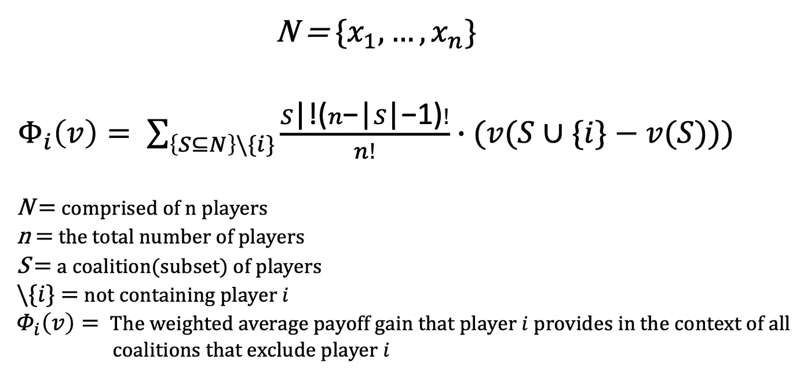

Image by Author

数学符号已经说得够多了，让我们用一个真实的例子来理解它的价值。有两个玩家和四个不同的游戏。第一局，双方球员都没有打比赛。在第二场比赛中，只有 1 号选手上场。第三局，只有 2 号玩家上场。上一场比赛，所有选手都参加了。预测列表示每种情况的预测值。下面的要点解释了如何计算 Shapley 值。

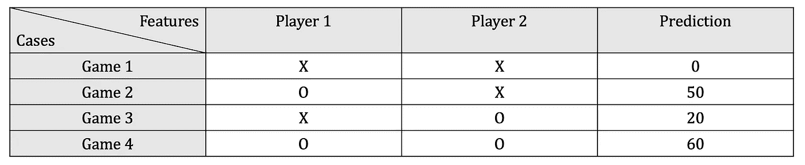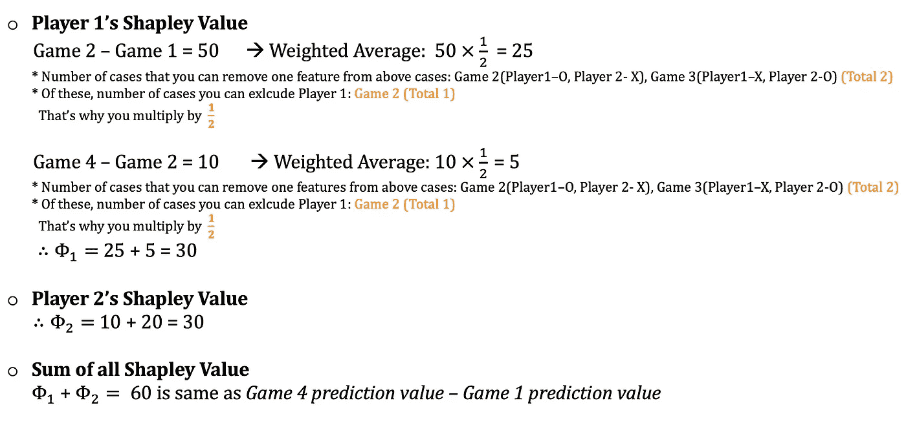

Image by Author

与功能重要性不同，Shapley 值考虑了性能的下降，功能重要性会将负面影响与正面交互影响和主要功能影响一起添加。此外，它在生成结果时更健壮。Shapley 值的优点不止于此。它不仅适用于线性模型，也适用于神经网络！你可以用这个值来解释任何机器学习模型。

你可以使用 python 中的**SHAP**(Shapley Additive exPlanations)库轻松实现这个值。SHAP 的缺点是计算量大且速度慢。此外，需要注意的是，Shapley 值不应被解释为因果关系。仅仅因为某个特征有助于预测并不总是意味着因果关系。

由于 Tensorflow 的版本不兼容问题，您可能会遇到一些错误。我将在这里解释如何解决这些问题，并运行一个简单的实验。实验的内容包括美式化妆和韩式化妆的图像分类，以及哪些特征有助于模型的预测。

这不是一个广泛的实验，而是为了快速检查 SHAP 如何应用于神经网络。在这个实验中，我使用了一个在小数据集上训练的 CNN 模型。因此，通过扩大数据集的大小，结果可能会显著改善。您可以通过这个 [**链接**](https://github.com/Irene-kim/Demystify_NeuralNets/tree/main/Shaply) 访问详细的代码和数据集。

## 以下是在实现 SHAP 时解决错误的非常有用的提示。

> 资源耗尽:使用形状[，，，]分配张量时出现 OOM

当您遇到这个问题时，请尝试以下两个步骤:

1.  将批量减少到 16(可以更大或更小，但不会显示相应的错误)
2.  将输入维度减少到 100(可以更大或更小，但不会显示相应的错误)

> 如果您使用的是 Tensorflow 版本> 2.4.0

重新启动运行时，并在代码顶部包含以下代码。

```
import tensorflow as tf
import tensorflow.compat.v1.keras.backend as K
tf.compat.v1.disable_eager_execution()
```

## 实验

我有两个包含训练集和测试集的文件夹。文件夹中的每张图片分为两类:“美国化妆”和“韩国化妆”。

```
base_dir = '/content/gdrive/MyDrive/research/images'
train_dir = os.path.join(base_dir, 'train')
test_dir = os.path.join(base_dir, 'test')class_name = os.listdir(train_dir)
class_name_test = os.listdir(test_dir)print(class_name)
#['american_makeup', 'korean_makeup'] print(class_name_test)
#['american_makeup', 'korean_makeup']
```

到目前为止，每个类都用一个分类变量编写。我需要把它们编码成整型变量。这里我使用 LabelEncoder 将类名改为整数。完成整数编码后，下一步是执行一键编码。类名“American _ making”现在标记为[1，0],“Korean _ making”标记为[0，1]。

```
integer_encoded = LabelEncoder().fit_transform(class_name)
integer_encoded = integer_encoded.reshape(len(integer_encoded), 1)onehot_encoded = OneHotEncoder(sparse=False).fit_transform(integer_encoded)print(onehot_encoded)
#[[1\. 0.]  [0\. 1.]]integer_encoded_test = LabelEncoder().fit_transform(class_name_test)
integer_encoded_test = integer_encoded_test.reshape(len(integer_encoded_test), 1)onehot_encoded_test = OneHotEncoder(sparse=False).fit_transform(integer_encoded_test)print(onehot_encoded_test)
#[[1\. 0.]  [0\. 1.]]
```

调整训练数据集和测试数据集的大小和形状，并将其保存到新列表中。每个相应的标签存储在训练和测试标签列表中。

```
train_image = []
train_label = []
test_image = []
test_label = []# for train dataset
for i in range(len(class_name)):
    path = os.path.join(train_dir, class_name[i])
    img_list = os.listdir(path)
    for j in img_list:
        img = os.path.join(path, j)
        img = cv2.imread(img, cv2.IMREAD_COLOR)
        img = cv2.cvtColor(img, cv2.COLOR_BGR2RGB)
        img = cv2.resize(img, (100, 100), interpolation =
              cv2.INTER_CUBIC)
        img = img.reshape((100, 100, 3))
        train_image.append(img)
        train_label.append(onehot_encoded[i])# for test dataset
for i in range(len(class_name_test)):
    path = os.path.join(train_dir, class_name_test[i])
    img_list = os.listdir(path)
    for j in img_list:
        img = os.path.join(path, j)
        img = cv2.imread(img, cv2.IMREAD_COLOR)
        img = cv2.cvtColor(img, cv2.COLOR_BGR2RGB)
        img = cv2.resize(img, (100, 100), interpolation =
              cv2.INTER_CUBIC)
        img = img.reshape((100, 100, 3))
        test_image.append(img)
        test_label.append(onehot_encoded[i])
```

在应用 SHAP 之前，还需要完成几个步骤。首先，我们需要标准化数据。另一项重要任务是实际了解您的数据是如何存储的。在我的数据集中，美式化妆图片首先被排序，然后是韩式化妆图片。为了避免任何不希望的信息泄漏或学习，我把整个数据混洗了一遍。

```
# Normalize image dataX_train = shuffle(train_image.reshape(283, 100, 100, 3).astype("float32") / 255, random_state = seed)X_test = shuffle(test_image.reshape(20, 100, 100, 3).astype("float32") / 255, random_state = seed) # Shuffle data or use library to randomly split your datatrain_label = shuffle(train_label, random_state = seed)
test_label = shuffle(test_label, random_state = seed)
```

现在你终于可以设计你的模型了！你的模型的架构完全取决于你想如何构建你的模型**，因为 SHAP 是模型不可知的**！

```
def CNN():input_layer = keras.Input(shape=(100,100,3))x = keras.layers.Conv2D(150, (3,3), padding='same', activation = 'relu', kernel_initializer = keras.initializers.HeUniform(seed=seed))(input_layer)x = keras.layers.BatchNormalization()(x)x = keras.layers.MaxPooling2D((2, 2))(x)x = keras.layers.Conv2D(150, (3,3), padding='same', activation = 'relu', kernel_initializer = keras.initializers.HeUniform(seed=seed))(x)x = keras.layers.BatchNormalization()(x)x = keras.layers.MaxPooling2D((2, 2))(x)x = keras.layers.Conv2D(150, (3,3), padding='same', activation = 'relu', kernel_initializer = keras.initializers.HeUniform(seed=seed))(x)x = keras.layers.BatchNormalization()(x)x = keras.layers.MaxPooling2D((2, 2))(x)x = keras.layers.Conv2D(150, (3,3), padding='same', activation = 'relu', kernel_initializer = keras.initializers.HeUniform(seed=seed))(x)x = keras.layers.BatchNormalization()(x)x = keras.layers.MaxPooling2D((2, 2))(x)x = keras.layers.Flatten()(x)x = keras.layers.Dense(128, activation='relu', kernel_initializer = keras.initializers.HeUniform(seed=seed))(x)x = keras.layers.Dropout(0.5)(x)output_layer = keras.layers.Dense(2, activation='sigmoid')(x)model = keras.Model(inputs=input_layer, outputs=output_layer, name = 'CNN')model.compile(loss='binary_crossentropy', optimizer= keras.optimizers.SGD(learning_rate=0.001),  metrics=['acc', 'AUC'])return model
```

训练好模型后，在十幅美国名人图片和十幅韩国名人图片上进行了测试。让我们看看结果中的一个例子。

```
idx = 6
input_val = X_test[idx:idx+1]
output_val = model.predict(input_val)
real = test_label[idx:idx+1]print("Prediction : ", np.argmax(output_val))
print("Ground Truth : ", np.argmax(real))plt.imshow(input_val.reshape(100, 100, 3),interpolation='nearest')
plt.show()
```

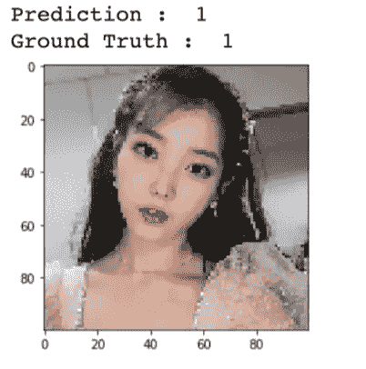

模型准确的对图像进行了分类！剩下的呢？二十张照片中，有三张是错的。

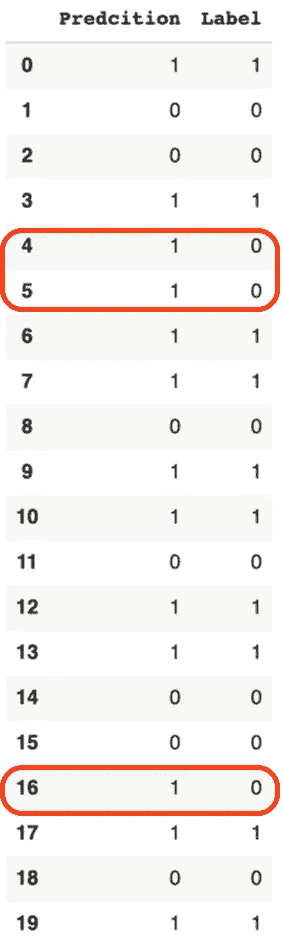

The Complete Testset Result

我想知道是什么影响了模型的分类。一般来说，美妆和韩妆有两种非常鲜明的风格。美国人的化妆倾向于突出拱形眉毛的形状，长长的假睫毛，以及非常烟熏的眼妆。另一方面，韩国化妆倾向于渴望非常自然的眉毛、浅色阴影、清晰的妆容和橘红色的嘴唇。我要看看我的猜测是否真的有助于模型的预测。

这些是美国化妆风格的图像。负 SHAP 值指的是负面影响，正 SHAP 值指的是对模型决策的正面影响。左边的图片是地面真实图像。中间的是 0 号标签，是美式彩妆，最右边的是 1 号标签，是韩式彩妆。

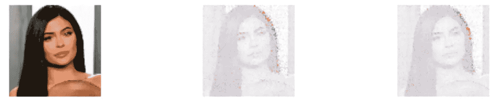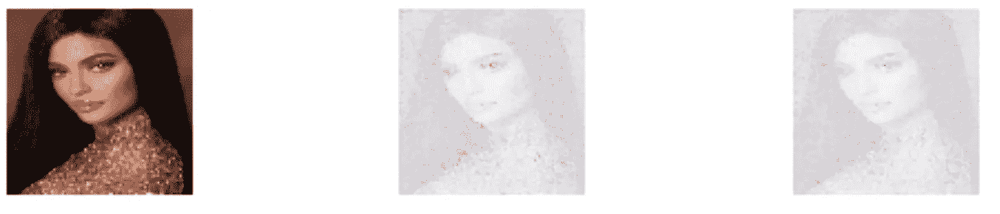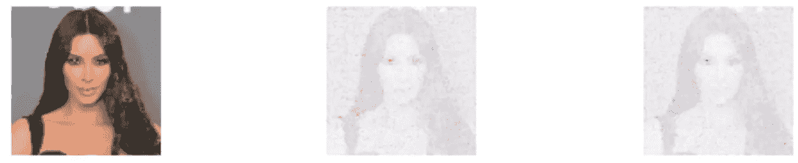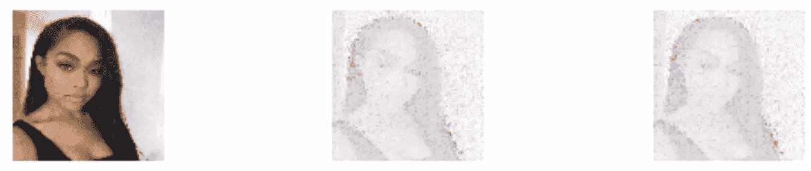

令人惊讶的是，中间图像的红点集中在眼睛和眉毛周围，标签为 0(美国化妆品)。韩式图像上眼睛和眉毛周围的蓝点表明这些部位在告诉我们这不是韩式化妆图像。现在我们来看看相反的结果。

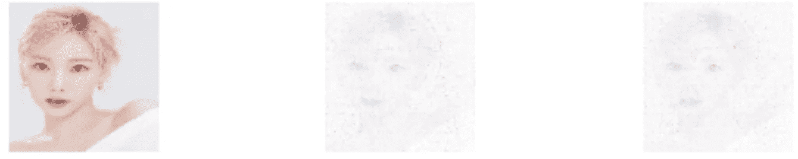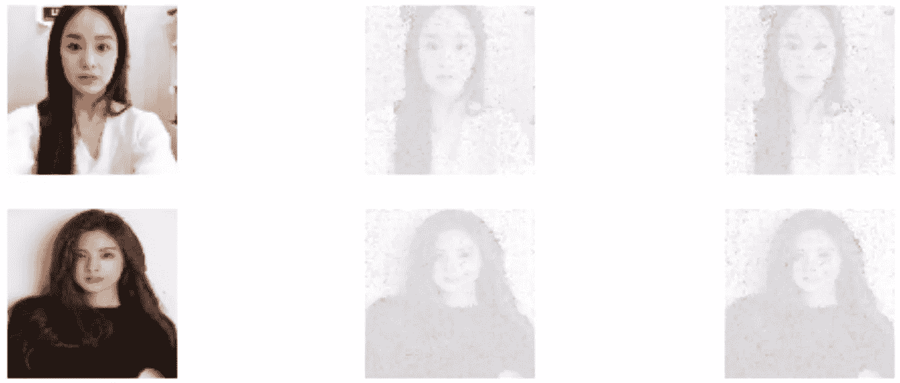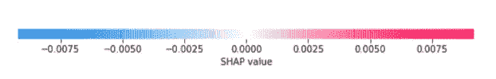

与美国的化妆形象相比，韩式化妆就不那么鲜明了。然而，我们可以猜测，当模型将图像分类为韩国化妆时，这主要是由于面部的整体皮肤或结构，因为红点遍布所有面部。

分类错误的案例呢？

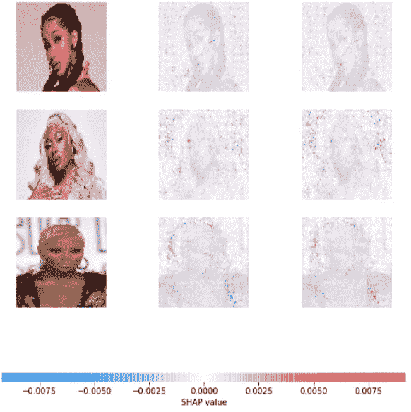

在这里，我们可以看到标签 0 和 1 在图像的各处都有红色和蓝色的点。有趣的一点是，所有贴错标签的病例都不是白色的。这样的结果可以提供非常重要的线索来修复和处理您的模型。在现实生活中，这种有偏见的结果会带来灾难性的后果，并歧视某些人群。

SHAP 有多大用处？活着是多么美好的时光:-)

[](/mlearning-ai/mlearning-ai-submission-suggestions-b51e2b130bfb) [## Mlearning.ai 提交建议

### 如何成为 Mlearning.ai 上的作家

medium.com](/mlearning-ai/mlearning-ai-submission-suggestions-b51e2b130bfb)