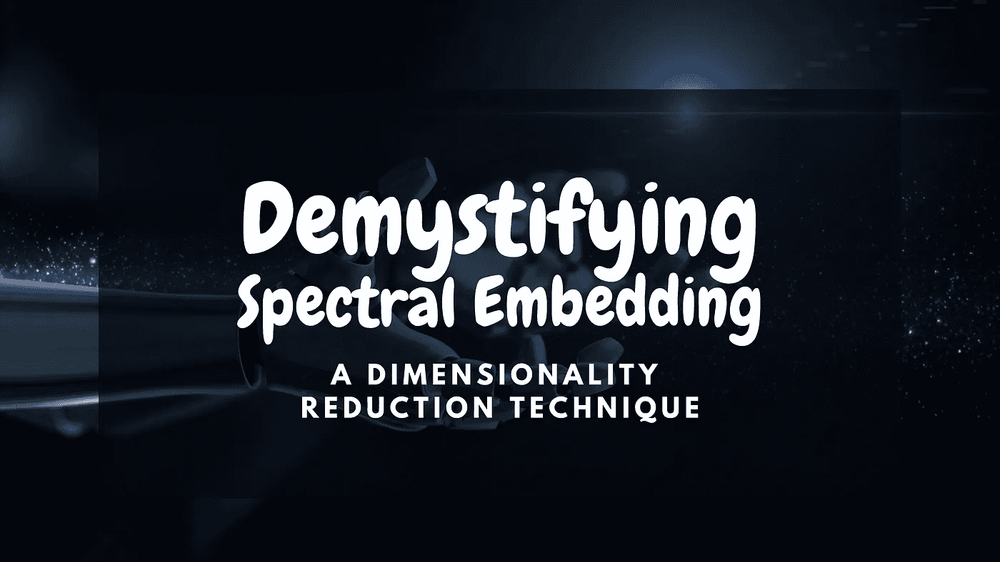

# 解开光谱嵌入之谜

> 原文：<https://medium.com/mlearning-ai/demystifying-spectral-embedding-b2368bba580?source=collection_archive---------2----------------------->

## 一种降维技术

## 大家好，

在这篇博客中，我们将去除**光谱嵌入**的所有复杂性，这是一种用于非线性降维的技术。如果你对什么是降维以及降维的目的不熟悉，那么可以参考我之前的 [*博客*](https://elemento.medium.com/dimensionality-reduction-c4727ad078e6) 。事不宜迟，让我们快速回顾一下本文将涉及的内容。

# 概观

*   谱嵌入和拉普拉斯特征映射简介
*   理解算法的先决条件
*   算法
*   直觉
*   额外资源

# 谱嵌入和拉普拉斯特征映射简介

光谱嵌入是一种用于**非线性降维**的技术。在它的引擎盖下，正在运行的算法是**拉普拉斯特征映射**。拉普拉斯特征映射非常类似于**等距特征映射**(也称为 Isomap)。如果您对 Isomap 不熟悉，可以在本节的末尾找到一个惊人的参考。Isomap 和 Laplacian 特征映射之间的**主要区别**在于 Isomap 的目标是直接保持全局(非线性)几何形状，而 Laplacian 特征映射的目标是保持局部几何形状(即原始空间中的邻近点在缩减空间中保持邻近)。

这种技术依赖于基本假设，即**数据位于高维空间**的低维流形中。现在，这个陈述，可能会让很多读者犯错误，因为术语“流形”本身就是一个完整的数学概念，也是一个重要的概念。如果你熟悉**流形**的概念，并且稍微熟悉**流形假设**的概念，那么你就可以开始了，否则，你可以在本节的末尾找到一个非常容易理解的参考。

频谱嵌入(拉普拉斯特征映射)算法包括三个阶段:

1.  构建邻接图
2.  选择砝码
3.  获得特征图

在第三部分(即算法)，我们将深入这些步骤，看看我们如何以不同的方式执行这些步骤。

 [## Isomap 嵌入——一种令人敬畏的非线性降维方法

### 如何用等距映射“展开瑞士卷”？

towardsdatascience.com](https://towardsdatascience.com/isomap-embedding-an-awesome-approach-to-non-linear-dimensionality-reduction-fc7efbca47a0)  [## 流形:一个温和的介绍

### 继我上一篇文章中的数学内容之后，我将看看另一个出现在…

bjlkeng.github.io](https://bjlkeng.github.io/posts/manifolds/) 

# 理解算法的先决条件

在本节中，我们将讨论理解拉普拉斯特征映射的先决条件。为了保持围绕拉普拉斯特征映射的焦点，我将外包对这些先决条件的解释。此外，以一种更全面的方式重复已经存在的东西没有任何好处。

1.  图形基础与术语*、*、[、参考、](https://www.geeksforgeeks.org/introduction-to-graphs/)
2.  邻接矩阵/邻接图， [*参考*](https://www.geeksforgeeks.org/graph-and-its-representations/)
3.  广义特征向量问题，特征向量和特征值， [*参考*](https://www.statlect.com/matrix-algebra/generalized-eigenvector) 和 [*参考*](https://arxiv.org/abs/1903.11240)
4.  [*拉普拉斯矩阵，参考*](https://en.wikipedia.org/wiki/Laplacian_matrix)

# 算法

在本节中，我们将深入探讨算法的三个主要步骤。

## 1.构建邻接图

第一步是基于给定的数据构建一个邻接图。如果相应的数据点是“接近的”,我们在节点 I 和 j 之间放置一条边。现在，有多种方法来定义“接近”。我将坚持在研究论文中定义的那些，这样，如果你想探索原始的研究工作，你将很容易能够起草类比。

*   *最近邻:*两个点，xᵢ和 xⱼ，如果其中一个是彼此的 k 个最近邻，则通过一条边连接。
*   *ε邻域:*两个点，比如说 xᵢ和 xⱼ，通过一条边连接如果 Norm(xᵢ-xⱼ) < eps，其中范数(x)是通常的欧几里德范数

## 2.选择砝码

现在，下一步是加权边，这是我们在第一步中定义的。这里也有两种不同的变化。

*   *高斯权重*:如果节点 I 和 j 不相连，则 Wᵢⱼ = 0，否则使用公式，Wᵢⱼ = exp[-||xᵢ - xⱼ|| / t]
*   *0/1 权重*:如果顶点 I 和 j 由一条边连接，则 Wᵢⱼ = 1，否则设 Wᵢⱼ = 0。

## 3.获得特征图

在第二步之后，我们将得到权重矩阵(W)。使用 w，我们将获得对角权重矩阵(d ),其元素是 w 的列(或行，因为 w 是对称的)和，即 Dᵢᵢ = ∑ⱼ Wⱼᵢ.一旦我们获得了 D，我们将获得拉普拉斯矩阵(L)，其中 L = D-W。

> L aplacian 是一个对称的半正定矩阵，它可以被认为是定义在 g 的顶点上的函数的一个算子。

现在，最后，我们提出广义特征向量问题，

> Lf=λDf

并找出这个问题的解决方法。再次，如果你有兴趣学习如何解决广义特征向量问题，参考这个伟大的 [*教程*](https://arxiv.org/abs/1903.11240) 。但是我向你保证，你不需要它，因为 scikit-learn 会为你处理它。所以，假设我们解决了这个问题，我们得到了这个问题的解如下:

> f₀ =λ₀Df₀
> 
> f₁ =λ₁Df₁
> 
> …
> 
> fₖ -₁ =λₖ -₁Dfₖ -₁

其中，f₀,f₁ … fₖ -₁，代表这个问题的特征向量，按其特征值排序，即 0 = λ₀ ≤ λ₁ … ≤ λₖ -₁.在这 k 个特征向量中，我们省去特征值 0 对应的特征向量 f₀，使用下一个 *m 个*特征向量来获得**个低 m 维表示**，即，

> xᵢ=[f₁(i]，…fₘ(i]

虽然，我已经描述了拉普拉斯特征映射背后的整个算法，但是，如果你想更深入地探索它，请查看原始的研究工作，链接可以在最后一节找到。

# 直觉

在上一节中，我们详细讨论了算法。然而，我没有提供任何关于这些步骤的动机和意义的解释，以及这些确切的步骤如何将我们引向低维嵌入。这主要是因为两个原因。首先，这些步骤背后的理由是相当全面的，试图在这篇博客中总结它，会使它变得非常长。所以，如果你想得到证明，我强烈建议你查阅原始的研究工作，它提供了非常详细的证明。第二个原因是，我不是很有资格总结研究工作中提供的理由。

尽管如此，让我强调一下原始研究工作中提供的理由，这样你就可以自己决定，是否要探索它们。

*   作者首先表明由拉普拉斯特征映射算法提供的嵌入在某种意义上最佳地保持了局部信息。
*   然后，他们提供了一个理由，说明为什么拉普拉斯 Beltrami 算子的本征函数具有嵌入所需的性质。
*   最后，他们证明了流形上可微函数的拉普拉斯 Beltrami 算子如何与热流密切相关。

> 图的拉普拉斯算子类似于流形上的拉普拉斯 Beltrami 算子。

# 额外资源

*   下面你可以找到这个天才技术背后的原始研究工作的链接。你可以一边喝着茶或者咖啡，一边随意阅读。

 [## 用于降维和数据表示的拉普拉斯特征映射

### 机器学习和模式识别中的一个中心问题是为机器学习和模式识别开发合适的表示。

ieeexplore.ieee.org](https://ieeexplore.ieee.org/document/6789755) 

*   下面你可以在 Scikit-Learn 的用户指南中找到光谱嵌入的简短描述

 [## 2.2.流形学习

### 寻找最基本的必需品简单的最基本的必需品忘记你的忧虑和冲突我是说最基本的…

scikit-learn.org](https://scikit-learn.org/stable/modules/manifold.html#spectral-embedding) 

*   下面你可以找到 Scikit-Learn 的光谱嵌入实现

 [## sk learn . manifold . spectra 嵌入

### 用于非线性降维的谱嵌入。形成一个由指定函数给出的亲和矩阵…

scikit-learn.org](https://scikit-learn.org/stable/modules/generated/sklearn.manifold.SpectralEmbedding.html#sklearn.manifold.SpectralEmbedding) 

# 关于我的一点点👋

如果你没有兴趣认识作者，或者你已经认识我，你可以安全地跳过这一节。我保证这里没有隐藏的宝藏😆。

我是一个机器学习和深度学习的爱好者，这是我基于相同内容的第二篇文章。如果你喜欢，请把你的手放在一起👏如果你想阅读更多基于机器学习和深度学习的文章。

 [## Mlearning.ai 提交建议

### 如何成为 Mlearning.ai 上的作家

medium.com](/mlearning-ai/mlearning-ai-submission-suggestions-b51e2b130bfb)