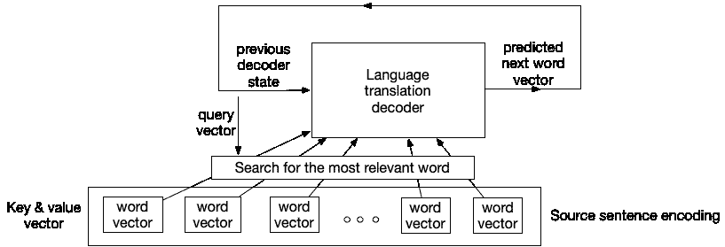
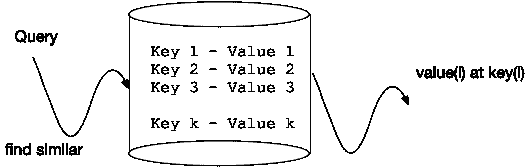
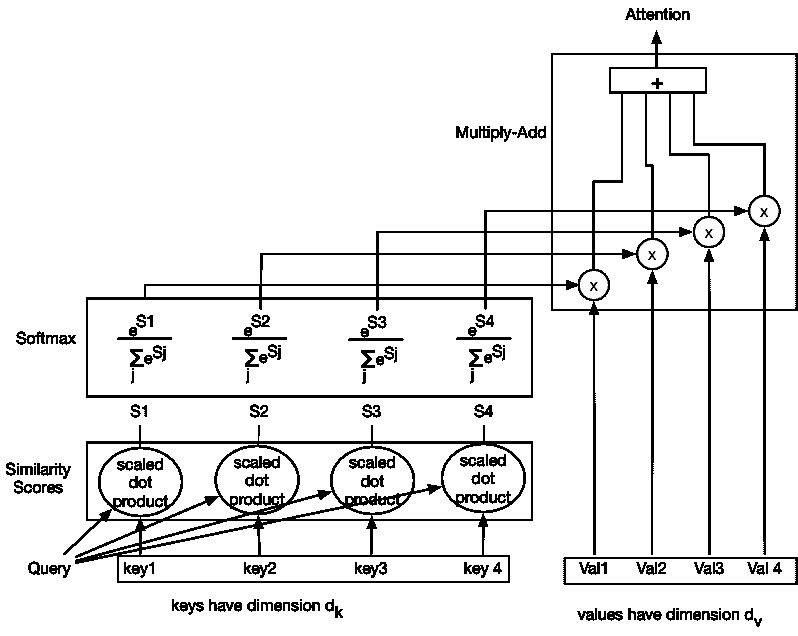
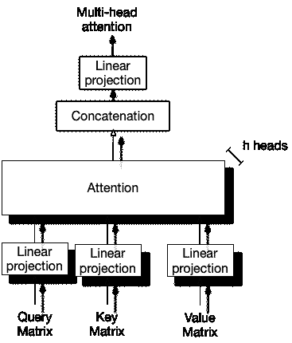

# 揭开变压器网络中注意力构建模块的神秘面纱

> 原文：<https://medium.com/mlearning-ai/demystifying-the-attention-building-block-in-transformer-networks-20780091083e?source=collection_archive---------0----------------------->

# 注意力的重要性

像回答问题和文档分类这样的语言建模任务现在是用 transformer 网络设计的。**注意力构建模块**是变压器的核心组件。最近，[基于变压器的计算机视觉模型](https://arxiv.org/abs/2010.11929)已经取得了最先进的成果(进一步强调了注意力的重要性)。这篇文章提供了对变形金刚核心的注意力块的直观理解。

我假设读者对基于神经网络的空间和序列学习(即 CNN 和 LSTMs)有基本的了解。

在变形金刚(注意)之前，递归网络(LSTMs)是一种构建语言翻译等序列学习任务的自然方式。然而，递归网络的主要缺点是它们的顺序处理流程。过去的单词必须按顺序通过 LSTM 的“记忆”细胞才能为现在的单词建立上下文。另一方面，变形金刚并行处理整个句子，允许更高质量的远距离上下文。

# 在翻译中找到

撇开双关语不谈，注意力的根源在于语言翻译；源语言首先被转换成编码形式；接下来，单词必须一步一步地翻译成目标语言。为了让解码器预测下一个字向量，使其包含来自所有编码隐藏状态的最相关信息，我们对编码字执行加权平均。每个编码状态对加权平均值的贡献由该编码状态和解码器的先前隐藏状态之间的对准分数来确定。我们可以将之前的解码器状态视为**查询**向量，编码器隐藏状态视为**键**和**值**向量(如下图所示)。

输出是值向量的加权平均值，其中权重由查询和键之间的兼容性(或相似性)函数确定。该输出用于预测下一个单词。

# **自我关注**

当构建语言模型时，我们感兴趣的是*一个单词相对于源*序列中每一个其他单词的相似性度量，并且这可以被公式化为(从数据库中)使用值为 **v(i)** 的查询 **q** 在关键字 **k(i)** 处可用的检索。

*Attention can be defined as a query that performs the best “match” against a set of keys that are then used to retrieve a value associated with the key.*

注意力可以定义为对一组键执行最佳“匹配”的查询，然后用于检索与该键相关联的值(如上图)。

具体来说，查询是我们正在操作的单词，键和值是我们在过去生成并在内存中可用的单词。键和值可以是同一个东西。

总的来说，在关注操作中，我们通过使用相似性度量来获取查询并找到最相似的键，并获得对应于该键的值。

注意，对于通过误差反向传播学习的注意力参数，其数学公式必须是可微分的。

# 计算

如下所示，我们计算查询向量与每个键的点积，并应用一个比例因子。接下来，我们将 softmax 函数应用于缩放后的点积值，这具有将输出归一化为 1 的效果，反映了概率得分。最后，相似性的概率加权输出与值向量线性组合，以产生注意。顺便提一下，点积运算是通过键的尺寸的平方根来缩放的(√dₖ).

To produce Attention, take the dot-product of the Query vector with *each* of the Key vectors, normalize to probability scores (the weighted similarity of Query and Key) and combine the weighted similarity with the Value vector

# 多头注意力

作为类比，在卷积神经网络中，我们在输出端使用几个滤波器来产生几个不同的特征图。多头注意力服务于类似的目的。使用不同的、已学习的线性投影将查询、关键字和值多次( **h** 次)投影到不同的空间。然后通过多个“头”(下面表示为 h 头)进入注意力层。将所有头部的输出连接起来，并用线性层投影，以产生多头注意力。

# 计算复杂性

自我关注的计算复杂度为 O(n * d)，其中 **n** 为序列长度 **d** 为表征(嵌入)维度。平方项来自于这样一个事实，即每个位置(单词)都必须与其他每个单词相关联才能获得相似性度量。有利的一面是，在所有情况下(与 LSTMs 不同),单词之间的长程相关性都是单位距离的。

这种 n 平方计算复杂性的可取之处在于，由于我们同时查看每一对单词，因此整个注意力操作可以并行化，从而使复杂性在支持并行计算的硬件上不再是问题。

# 参考

[注意力是你所需要的一切](https://arxiv.org/pdf/1706.03762.pdf)

[CS480/680 第 19 讲:注意力和变压器网络](https://www.youtube.com/watch?v=OyFJWRnt_AY)

[自我关注:情感分析神经网络分类器的更好构建模块](https://arxiv.org/pdf/1812.07860.pdf)

 [## Mlearning.ai 提交建议

### 如何成为 Mlearning.ai 上的作家

medium.com](/mlearning-ai/mlearning-ai-submission-suggestions-b51e2b130bfb)