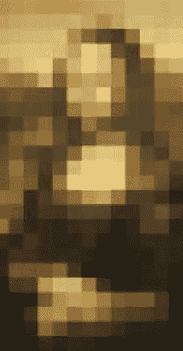
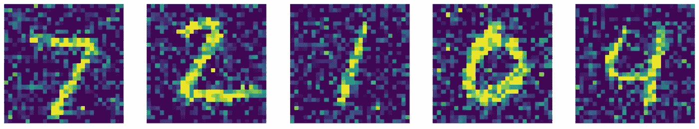
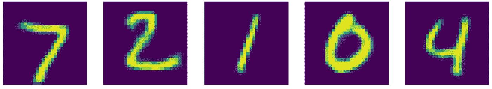

# 降噪自动编码器

> 原文：<https://medium.com/mlearning-ai/denoising-autoencoders-b54ecacc0b40?source=collection_archive---------9----------------------->

在我之前的一篇文章中，我讨论了不同类型的自动编码器。在这篇文章中，我将更多地关注一种特定的类型——去噪自动编码器。

去除图像中的噪声是图像处理和计算机视觉中具有挑战性的重要任务。分析图像时，去除噪声会非常有帮助。目标可能是提取最重要的特征，如果你有办法扔掉所有不必要的信息，这是可取的。

让我们看一个 autoencoder 能够消除噪声的例子。由此可知:



这个网络被训练成这样:


这个想法是扰动输入图像，但是将原始图像设置为期望的输出。这样，我们的网络将不仅仅学习身份函数，因为输入和输出是不同的。

让我们深入去噪自动编码器的实现。对于数据集，我选择了 mnist。

首先，导入必要的库:

```
import numpy  as npimport matplotlib.pyplot as pltfrom keras.models import Sequentialfrom keras.layers import Denseimport PILimport tensorflow as tffrom keras.datasets import mnistfrom tensorflow import kerasfrom keras.models import Sequentialfrom keras.layers import (Conv2DTranspose,Reshape,BatchNormalization, SeparableConv2D, MaxPooling2D, Activation, Flatten, Dropout, Dense, Conv2D,UpSampling2D,Input)from PIL import Image as imfrom keras.models import Modelfrom sklearn.model_selection import train_test_splitimport cv2
```

然后定义**加载数据**的函数，**归一化**图像:

```
def load_data(): (x_train, y_train), (x_test, y_test) = mnist.load_data() m = x_train.shape[0] n = x_test.shape[0] x_train = np.reshape(x_train, (-1,28,28,1)) x_test = np.reshape(x_test,(-1,28,28,1)) y_train = tf.keras.utils.to_categorical(y_train)     y_test = tf.keras.utils.to_categorical(y_test) x_train = x_train.astype('float32') x_test = x_test.astype('float32') x_train /= 255 x_test /= 255 return x_train,y_train,x_test,y_test
```

并加载数据:

```
x_train,y_train,x_test,y_test = load_data()
```

我们想给输入添加噪声，所以我们定义了**高斯噪声函数**:

```
def add_gaussian_noise(X_imgs): gaussian_noise_imgs = [] row, col, ch= X_imgs[0].shape for X_img in X_imgs: gaussian = X_img + 0.3*np.random.normal(loc = 0.0,scale =    1.0,size = (row, col, 1)) gaussian_img = np.clip(gaussian, 0., 1.) gaussian_noise_imgs.append(gaussian_img) gaussian_noise_imgs = np.array(gaussian_noise_imgs, dtype =   np.float32) return gaussian_noise_imgs
```

向输入图像添加噪声:

```
x_train_noisy = add_gaussian_noise(x_train)x_test_noisy = add_gaussian_noise(x_test)
```

让我们看看与原始数据相比，我们的扰动数据是什么样的:


perturbed image


original image

为我们的自动编码器创建编码器:

```
def encoder(input_img): conv1_1 = Conv2D(16, (3, 3), activation='relu', padding='same')(input_img) conv1_2 = BatchNormalization()(conv1_1) conv1_3 = MaxPooling2D((2,2))(conv1_2) conv2_1 =   Conv2D(32,kernel_size=3,strides=2,padding='same',activation='relu')(conv1_3) conv2_2 = BatchNormalization()(conv2_1) conv2_3 = MaxPooling2D((2,2))(conv2_2) conv3_1 =  Conv2D(64,kernel_size=3,strides=2,padding='same',activation='relu')(conv2_3) conv3_2 = BatchNormalization()(conv3_1) conv4 = Flatten()(conv3_2) conv4 = Dense(576)(conv4) return conv4
```

并创建解码器:

```
def decoder(encode): conv5_1 = Reshape((3,3,64))(encode) conv5_2 = Conv2DTranspose(32, kernel_size = 3, strides = 2,activation='relu', padding='valid')(conv5_1) conv6_1 = Conv2DTranspose(16, kernel_size = 3, strides = 2,activation='relu', padding='same')(conv5_2) conv7_1 = Conv2DTranspose(1, kernel_size=3, strides=2, padding='same', activation="sigmoid")(conv6_1) return conv7_1
```

定义我们的模型:

```
inChannel = 1x, y = 28, 28input_img = Input(shape = (x, y,inChannel))autoencoder = Model(input_img, decoder(encoder(input_img)))
```

编译我们的模型。这里我使用了 SGD 优化器:

```
opt = tf.keras.optimizers.SGD(learning_rate=0.5)autoencoder.compile(loss='binary_crossentropy', optimizer = opt)
```

分割训练数据:

```
train_X,valid_X,train_ground,valid_ground =
train_test_split(x_train_noisy,x_train,test_size=0.2,random_state=13)
```

训练模型并保存权重:

```
autoencoder_train = autoencoder.fit(train_X, train_ground, batch_size=batch_size,epochs=epochs,verbose=1,validation_data=(valid_X, valid_ground))autoencoder.save_weights('autoencoder.h5')
```

训练结束后，看看结果:

```
reconstructs = autoencoder.predict(x_test_noisy)reconstructs = np.reshape(reconstructs,(-1,28,28))x_test_noisy = np.reshape(x_test_noisy,(-1,28,28))plt.figure(figsize=(15,12))for i in range(5): plt.subplot(2,5,1+i) plt.imshow(x_test_noisy[i]) plt.axis('off') plt.subplot(2,5,6+i) plt.imshow(reconstructs[i]) plt.axis('off') plt.show()
```



input



output

噪音已成功消除。结果是惊人的，我真的建议玩不同的架构和不同的数据集。

此外，尝试将获得的结果用于某些分类。但是，请注意，去噪自动编码器在与训练数据没有显著差异的数据上表现良好。例如，如果我在 ImageNet 数据集上尝试这个模型，我可能会得到很大的重建误差。

希望这篇文章有用:)

[](/mlearning-ai/mlearning-ai-submission-suggestions-b51e2b130bfb) [## Mlearning.ai 提交建议

### 如何成为 Mlearning.ai 上的作家

medium.com](/mlearning-ai/mlearning-ai-submission-suggestions-b51e2b130bfb)