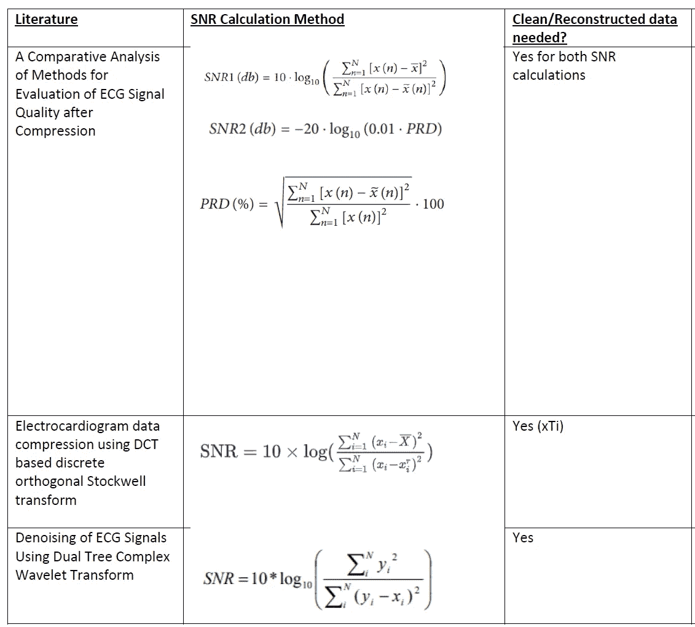
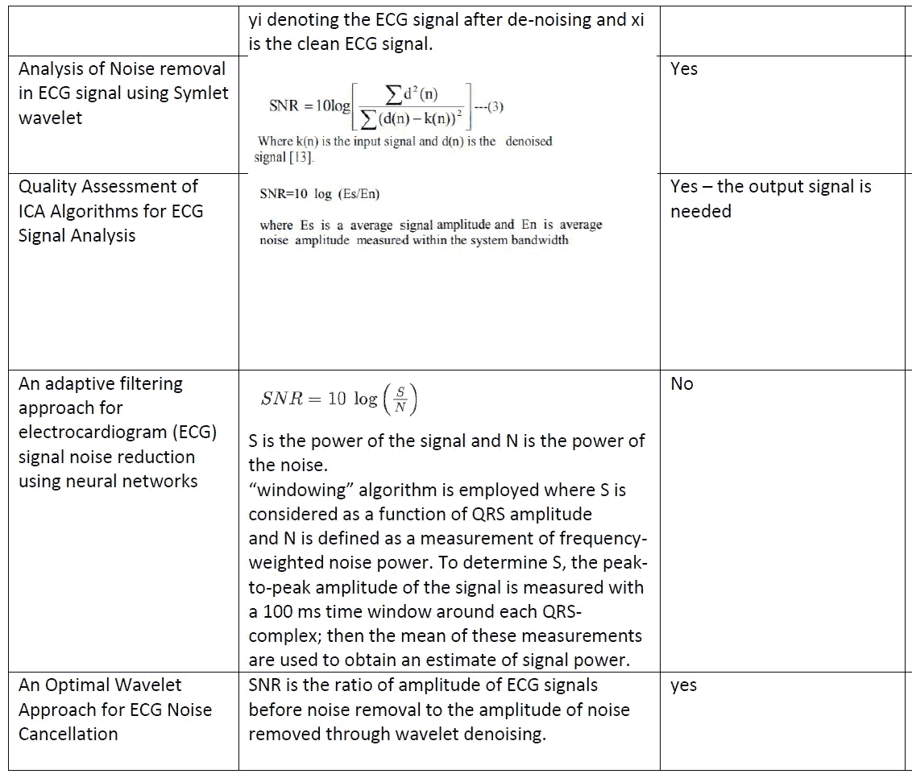
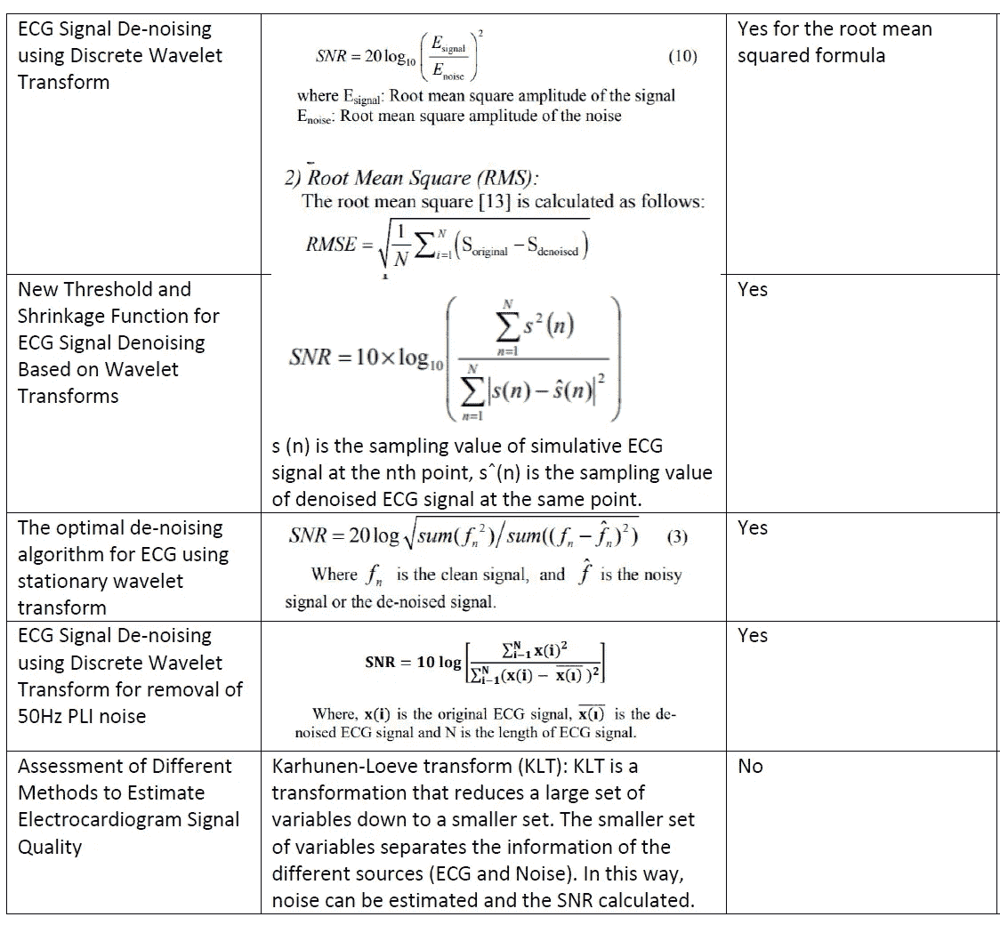
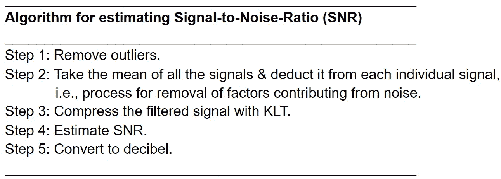
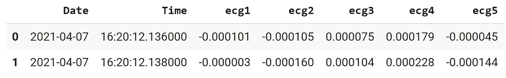
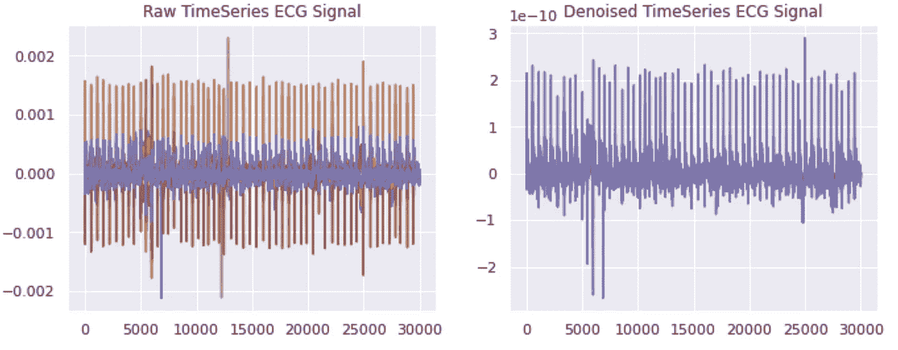
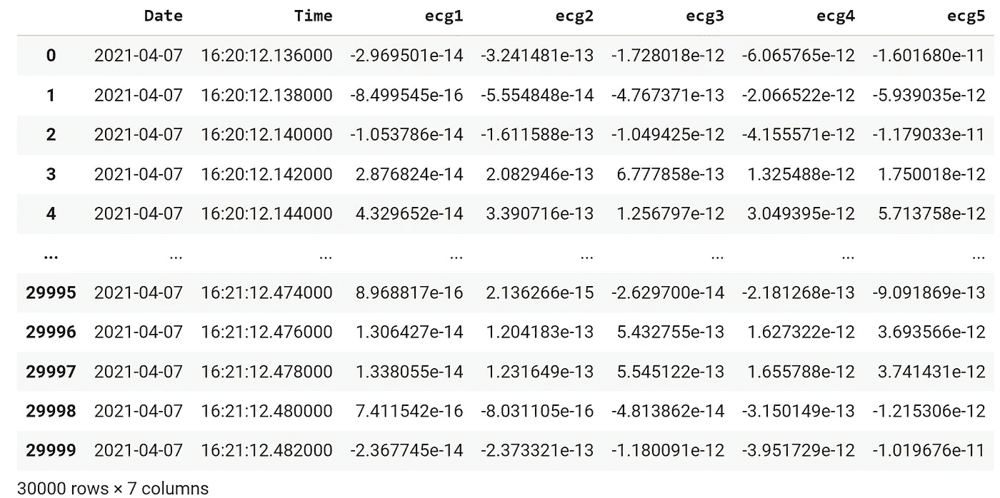

# 基于集成滤波器的心电信号去噪

> 原文：<https://medium.com/mlearning-ai/denoising-ecg-signals-with-ensemble-of-filters-65919d15afe9?source=collection_archive---------1----------------------->

一个**自动化命令行应用**可用于时间序列信号数据，并提供实用服务，如预处理原始数据、信噪比(SNR 或 S/N)估计、过滤原始数据中的噪声等。

[***TL；DR: ECG CLI 应用代码***](https://github.com/ajayarunachalam/Deep_XF/tree/main/blog_examples/denoising_signals/cli_ecg_application)

[***TL；DR:去噪演示笔记本***](https://colab.research.google.com/drive/1-iJWYUdDrN00jRGfORBf0Gcj7HXMMsn9?usp=sharing)

朋友们好，

在本教程中，我们将研究 ECG 数据集，并使用一系列不同的滤波器，通过集成方法消除信号中的噪声。此外，我们将看到小波去噪如何有助于过滤噪声。首先，我们将了解如何首先确定噪声，然后了解如何从原始时序信号数据中滤除噪声，并通过动手演示示例进行说明。此外，在本教程的最后，我提供了我开发的**命令行界面****【CLI】**应用程序，用户可以直接使用它来处理自己的原始数据，使用不同的算法估计信噪比，并通过简单的单线性低代码解决方案轻松消除噪声(过滤噪声)。

## ECG 时间序列数据

一个 [**心电信号**](https://bmcmedinformdecismak.biomedcentral.com/articles/10.1186/s12911-020-1107-2) 可以描述为一个**非平稳时间序列**，它在波形上呈现出一些不规则性。心电图(ECG)信号用于监测人类心脏的健康状况，其产生时间序列信号，该信号本质上是循环的，并代表独特的心脏活动模式。关于**信号与时间序列**的比较，查看本博客 [**此处**](https://ajay-arunachalam08.medium.com/introduction-to-deepxf-e90ce7c2858c) **。**

## 时序信号数据中的噪声

用时间序列的上下文来解释噪声的直观方法是简单地引用时间序列中来自其典型模式的一些**随机波动**，这些随机波动是随机的(不需要的)并且不携带有用的信息。在保留有用信息的同时消除这种随机或无用信息的目标被称为**去噪**。

## 什么是信噪比(SNR 或 S/N)？

**信噪比**是一种简单的测量方法，它将所需信号的水平与背景噪声的水平进行比较。SNR 是对**信号质量**的估计。用**分贝(dB)** 来表示。

## 信噪比估计方法的相关最新著作(文献综述)

下表列出了 ECG 信号质量评估的大部分相关工作。表中给出了计算 SNR 的相应方法，以及干净/重建数据所需的先决条件。在下表所示的大多数工作中，需要干净的信号数据(参考信号数据),或者必须重构原始数据来估计质量。

Image by author: Signal-to-noise (SNR) ratio estimation literature survey

Image by author: Signal-to-noise (SNR) ratio estimation literature survey

Image by author: Signal-to-noise (SNR) ratio estimation literature survey

## 我的方法论

下面给出了我提出的另一种 SNR 估计方法的伪码。首先，我们从去除异常数据点开始。接下来，我们将估计所有信号的平均值，并从每个单独的数据点中减去它。然后，我们用 [***卡尔洪嫩–洛夫变换***](https://en.wikipedia.org/wiki/Karhunen%E2%80%93Lo%C3%A8ve_theorem) (KLT)压缩信号，接着计算**信噪比**，最后将其转换成所需的单位。

Image by author: Psuedocode for my SNR estimation algorithm approach

## 从数据中检测/滤除噪声的其他替代方法

这里，我们将看到基于**机器学习**的技术从原始信号/数据中去除噪声。人们当然可以使用深度学习技术对数据进行降噪，也可以利用降维技术进行降噪，还可以坚持使用经典的信号处理技术。

下面列出了一些随机技术，仅供参考。

*1)深度去噪自动编码方法*

*2) PCA(主成分分析)*

对比主成分分析

*4)傅立叶变换技术/快速傅立叶变换技术以及更多…*

## 什么是过滤器？

[**信号处理中的滤波器**](https://en.wikipedia.org/wiki/Filter_(signal_processing)) 基本上可以是从原始信号中去除一些不需要的成分或特征的器件(硬件)或过程(软件)。有关信号&不同类型医疗信号的更多信息，请查看本博客 [**此处**](https://ajay-arunachalam08.medium.com/learning-similarities-between-biomedical-signals-with-deep-siamese-network-7684648e2ba0) 。

## 不同滤波器的组合如何有助于有效去噪？

提出了许多滤波器来解决降噪问题。最常用的滤波器是低通、高通、带通和带阻。一般来说，滤波器可以分为两大类，即**低通滤波器**(通过频率低于某一截止频率的信号，并衰减频率高于截止频率的信号)& **高通滤波器**(通过频率高于某一截止频率的信号，并衰减频率低于截止频率的信号)。我们采用[巴特高/低通](https://en.wikipedia.org/wiki/Butterworth_filter)滤波器、 [IIR](https://en.wikipedia.org/wiki/Infinite_impulse_response) 或 [FIR](https://en.wikipedia.org/wiki/Finite_impulse_response) 滤波器、[带阻](https://en.wikipedia.org/wiki/Band-stop_filter)滤波器等的组合。以减少背景噪音。为了直观地解释信号滤波器，请查看此处 的 [**材料。**](https://training.dewesoft.com/online/course/filters)

下面的代码片段应用不同的滤波器对原始信号进行去噪，通过组合这些技术来产生单一的复合效果。

# 演示插图

现在，我们已经看到了所有相关的理论概念。让我们从一个例子开始。在这里，我们将使用我从一家领先的智能服装和纺织公司获得的数据，该公司为健身爱好者生产**运动红外性能和康复运动服**。所提供的数据包括针对不同活动(如坐、走、站等)测试的 sportwear 的心电图记录。

**请注意** :-出于数据隐私和数据安全的原因，我希望保持实际数据源的匿名性，并且仅为读者提供完整数据集中实际数据(样本数据)的子集，以便遵循本教程。

我们将看到"[**Deep-XF**](https://github.com/ajayarunachalam/Deep_XF)" python 库也可以直观地用于信号去噪。为了快速介绍&，所有其他由 **deep-xf** 包支持的用例应用程序都在博客文章[中列出。此外，看看**预测，临近预报**博客与动手演示教程从](https://ajay-arunachalam08.medium.com/introduction-to-deepxf-e90ce7c2858c) [**这里**](https://ajay-arunachalam08.medium.com/building-explainable-forecasting-models-with-state-of-the-art-deep-neural-networks-using-a-ad3fa5844fef)**&**[**这里**](https://towardsdatascience.com/interpretable-nowcasting-with-deepxf-using-minimal-code-6b16a76ca52f) 服务提供使用相同的软件包。进一步地，check out how[**deep-xf**](https://pypi.org/project/deep-xf/)**也可以用于从 [**这里学习信号相似性表示**](https://ajay-arunachalam08.medium.com/learning-similarities-between-biomedical-signals-with-deep-siamese-network-7684648e2ba0) 。**

**对于库安装遵循以下步骤 [**此处**](https://github.com/ajayarunachalam/Deep_XF#installation) &对于手动先决条件安装检查 [**此处**](https://github.com/ajayarunachalam/Deep_XF#requirements) 。**

****

**Image by author: Peek into raw data**

**导入数据后，接下来我们输入采样频率(fs)、阶数、截止阈值等参数。用**设置 _ 参数**的方法。一旦设置了自定义的用户输入参数，我们就可以通过装配不同的滤波器(如黄油高通滤波器、黄油低通滤波器和陷波滤波器)来去除原始数据中的噪声，然后绘制&图，用**的绘图和写入**方法输出滤波后的数据。**

****

**Image by author: Graph plots of raw vs. filtered ecg signal data**

****

**Image by author: Viewing filtered output data**

## **CLI ECG 应用**

**最后，开发了一个 ECG 命令行应用程序，涵盖所有里程碑/交付成果，捆绑为一体式 CLI 程序，供用户轻松利用该工具，用户可以输入原始数据、选择特定算法、提供保存去噪数据的路径、估计和打印数据中每个 ECG 信号的 SNR 值、保存图等。代码放在文件夹“ **cli_ecg_application** 中，自述文件从[到**再到**T5。完整的应用程序代码可以在](https://github.com/ajayarunachalam/Deep_XF/blob/main/blog_examples/denoising_signals/cli_ecg_application/README.txt) 这里找到 [**。**](https://github.com/ajayarunachalam/Deep_XF/tree/main/blog_examples/denoising_signals/cli_ecg_application)**

**它包括估计 SNR 的两种算法选择(估计噪声的经典方法，使用 KLT 方法)，以及对原始信号去噪的两种算法选择(使用 DWT 方法，使用滤波器集合)。估计信噪比(SNR 或 S/N)的代码片段如下所示。**

**类似地，从原始信号中滤除噪声可以使用两种选择，即或者使用滤波器集合，或者使用**离散小波变换** ( **DWT** )技术，如下面的片段所示。**

**要运行该应用程序，请遵循以下代码片段中所示的使用步骤，这些步骤接受命令行输入，如原始数据集、存储滤波数据集的输出路径、采样频率、snr 估计的算法选择以及滤波算法的选择。完整的应用代码可以在 [**这里**](https://github.com/ajayarunachalam/Deep_XF/tree/main/blog_examples/denoising_signals/cli_ecg_application) 找到。**

## **结论**

**通过这篇文章，我们已经了解了信号的一些基本知识，并讨论了评估信号质量的方法。我们已经了解了如何处理原始 ECG 信号，以便从实际信号中滤除噪声。我们还了解了如何评估信号质量。最后，我们浏览了一个端到端的 **ECG CLI 软件程序**，最终用户可以使用该程序来评估信号质量、滤除原始信号中的噪声、以图形显示以及将滤波后的数据输出到磁盘等。通过命令行。**

# **让我们连接起来**

**你可以在 ajay.arunachalam08@gmail.com 找到我；通过 [Linkedin](https://www.linkedin.com/in/ajay-arunachalam-4744581a/) 联系**

**继续学习，干杯:)**

****关于作者****

**我是 **AWS 认证的机器学习专家&云解决方案架构师**。根据我处理现实世界问题的经验，我完全承认，找到良好的表示是设计系统的关键，该系统可以解决有趣的挑战性现实世界问题，超越人类水平的智能，并最终为我们解释我们不理解的复杂数据。为了实现这一点，我设想学习算法可以从未标记和标记的数据中学习特征表示，在有和/或没有人类交互的情况下被引导，并且在不同的抽象级别上，以便弥合低级数据和高级抽象概念之间的差距。我也确实相信人工智能系统的不透明性是当前的需要。考虑到这一点，我一直努力使人工智能民主化，并且更倾向于建立可解释的模型。我的兴趣是建立实时人工智能解决方案，大规模的机器学习/深度学习，生产可解释的模型，深度强化学习，计算机视觉和自然语言处理，特别是学习良好的表示。**

****参考文献****

** [## 信号处理和时间序列(数据分析)- GeeksforGeeks

### 信号处理是一个工程领域，重点是分析模拟和数字信号的时间…

www.geeksforgeeks.org](https://www.geeksforgeeks.org/signal-processing-and-time-series-data-analysis/)  [## 时间序列-维基百科

### 在数学中，时间序列是按时间顺序索引(或列出或绘制)的一系列数据点。最常见的是…

en.wikipedia.org](https://en.wikipedia.org/wiki/Time_series)  [## 时间序列、信号和傅立叶变换

### 未来文章的介绍和入门

towardsdatascience.com](https://towardsdatascience.com/time-series-signals-the-fourier-transform-f68e8a97c1c2)  [## 时间序列和信号的区别是什么？

### 回答(第 1 题，共 3 题):时间序列总是按时间索引，但信号可以更一般。例如……

www.quora.com](https://www.quora.com/What-is-the-difference-between-Time-series-and-Signal)  [## 滤波器(信号处理)-维基百科

### 在信号处理中，滤波器是一种从信号中去除一些不需要的成分或特征的装置或过程…

en.wikipedia.org](https://en.wikipedia.org/wiki/Filter_%28signal_processing%29)  [## 过滤器-简单的英语维基百科，免费的百科全书

### 过滤器是一种用来从某物中去除不需要的部分的装置。例如，从液体中去除固体颗粒…

simple.wikipedia.org](https://simple.wikipedia.org/wiki/Filter)  [## PTB-XL，一个大型公开的心电图数据集-科学数据

### 心电图是心血管疾病的一种重要的非侵入性诊断工具，正日益受到人们的重视

www.nature.com](https://www.nature.com/articles/s41597-020-0495-6)  [## 时间序列心电图与吸烟关系的保健知识…

### 背景:在为数不多的临床经验研究中，吸烟可能与缺血性心脏…

bmcmedinformdecismak.biomedcentral.com](https://bmcmedinformdecismak.biomedcentral.com/articles/10.1186/s12911-020-1107-2)  [## SciPy

### SciPy 提供优化、积分、插值、特征值问题、代数方程等算法

scipy.org](https://scipy.org/)  [## 信号和噪声-定义和示例-概念上

### 一个思考你试图探测的有意义的信息是什么的概念。信号是有意义的…

conceptually.org](https://conceptually.org/concepts/signal-and-noise)  [## 噪音(信号处理)-维基百科

### 在信号处理中，噪声是一个通用术语，指信号中不需要的(通常是未知的)修正

en.wikipedia.org](https://en.wikipedia.org/wiki/Noise_%28signal_processing%29)  [## 信噪比-维基百科

### 信噪比(SNR 或 S/N)是科学和工程中使用的一种测量方法，它可以比较所需信号的水平

en.wikipedia.org](https://en.wikipedia.org/wiki/Signal-to-noise_ratio)  [## 什么是信噪比，如何测量？

### 在模拟和数字通信中，信噪比，通常写为 S/N 或 SNR，是对信号强度的一种度量。

www.techtarget.com](https://www.techtarget.com/searchnetworking/definition/signal-to-noise-ratio)  [## 什么是信噪比，为什么它很重要？

### 您可能已经看过列出的产品规格，甚至读过关于信噪比的讨论…

www.lifewire.com](https://www.lifewire.com/signal-to-noise-ratio-3134701)  [## karhunen-love 定理-维基百科

### 在随机过程理论中，Karhunen-love 定理(以 Kari Karhunen 和 Michel love 命名)也…

en.wikipedia.org](https://en.wikipedia.org/wiki/Karhunen%E2%80%93Lo%C3%A8ve_theorem)  [## 离散小波变换-维基百科

### 在数值分析和泛函分析中，离散小波变换(DWT)是指任何满足以下条件的小波变换

en.wikipedia.org](https://en.wikipedia.org/wiki/Discrete_wavelet_transform)  [## 基于深长短时记忆网络的心电信号异常检测

### 心电图(ECG)信号被广泛用于测量人类心脏的健康状况，由此产生的时间序列…

ieeexplore.ieee.org](https://ieeexplore.ieee.org/document/7344872)  [## 降噪-维基百科

### 降噪是从信号中去除噪声的过程。音频和图像都有降噪技术…

en.wikipedia.org](https://en.wikipedia.org/wiki/Noise_reduction)  [## 使用滤波器降低噪声

### 噪声是导致音频信号失真的不良因素。通过滤除…重建原始信号

medium.com](/@abhijnanprakash/noise-reduction-using-filters-5c8fa8bce42) 

[https://www . electronic design . com/technologies/displays/article/21778769/blocking-out-of-noise-means-select-the-right-filter](https://www.electronicdesign.com/technologies/displays/article/21778769/blocking-out-the-noise-means-selecting-the-right-filter)

 [## 信号处理:滤除噪音

### 随着云计算变得无处不在和物联网的出现，与大数据的三个 v 相关的问题…

www.catchpoint.com](https://www.catchpoint.com/blog/signal-vs-noise)  [## 利用滤波器降低信号噪声的分析

### 本文设计并比较了三种不同的滤波方法来降低噪声对医疗卫生系统的影响

ieeexplore.ieee.org](https://ieeexplore.ieee.org/document/8346412)  [## 信号滤波、信号抑制、信号处理|去软

### 模拟滤波器是信号处理的一个基本模块，设计用于处理连续信号

training.dewesoft.com](https://training.dewesoft.com/online/course/filters)  [## Mlearning.ai 提交建议

### 如何成为 Mlearning.ai 上的作家

medium.com](/mlearning-ai/mlearning-ai-submission-suggestions-b51e2b130bfb)**