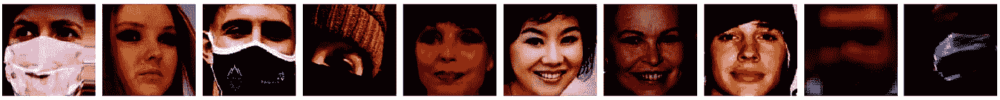
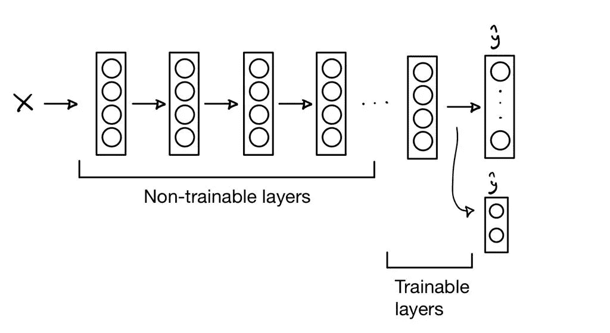
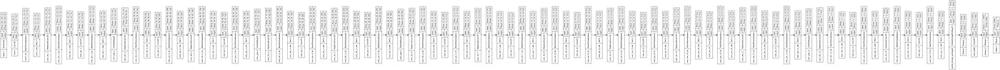
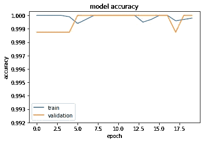
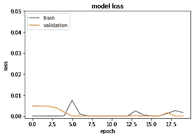
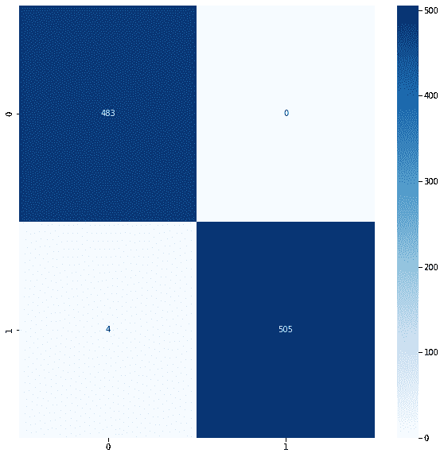

# 使用 Flask 部署口罩检测 web 应用程序

> 原文：<https://medium.com/mlearning-ai/deploy-a-face-mask-detection-web-app-with-flask-part-1-10c19722bf0?source=collection_archive---------5----------------------->

如何部署面具检测应用程序-即使用模型预测图片中是否存在面具的应用程序。


Photo by [Anastasiia Chepinska](https://unsplash.com/@anastasiiachepinska?utm_source=medium&utm_medium=referral) on [Unsplash](https://unsplash.com?utm_source=medium&utm_medium=referral)

要构建这个 web 应用程序，我们需要几样东西:

1.  获取数据。
2.  训练和评估一个 CNN(卷积神经网络)来检测面罩。
3.  使用 Flask 为 web 应用程序构建后端。
4.  使用 HTML 和 CSS 构建前端。
5.  使用 Heroku 测试和部署我们的 web 应用程序。

在本文中，我们将讨论列表的前两部分；收集数据，训练和评估我们的 CNN。

你可能知道，神经网络通常非常渴望数据，所以我们可能需要大量数据来训练一个。虽然如果你用[转移学习](https://machinelearningmastery.com/transfer-learning-for-deep-learning/) ( *剧透:我们会*)，你可能没那么需要*。*对于这个项目，我们将使用来自 Kaggle 的以下[数据集作为我们的数据源。这个数据集包含我们两个类的 12 k 以上的图像；戴口罩，不戴口罩。](https://www.kaggle.com/ashishjangra27/face-mask-12k-images-dataset)

现在我们有了数据，让我们继续，看看我们要用它做什么。首先，我们需要将数据导入我们的 Jupyter(或 Colab)笔记本。这是通过以下 API 命令完成的:

```
kaggle datasets download -d ashishjangra27/face-mask-12k-images-dataset
```

现在，我们获得了训练集、验证集和测试集的路径，并导入了必要的库:

```
import numpy as np
import tensorflow as tf
from tensorflow import keras
from tensorflow.keras.models import Sequential
from tensorflow.keras.layers import Activation, Dense, Flatten, BatchNormalization, Conv2D, MaxPool2D, Dropout
from tensorflow.keras.optimizers import Adam
from tensorflow.keras.metrics import categorical_crossentropy
from tensorflow.keras.preprocessing.image import ImageDataGenerator
from sklearn.metrics import confusion_matrix
import os
import matplotlib.pyplot as plt
import seaborn as sns
```

为了继续我们的图像预处理，我们必须选择是训练我们自己的定制模型，还是使用使用迁移学习的预训练模型。通过迭代几个定制模型和预训练模型，MobileNet 给出了最快和最准确的结果。

MobileNet 架构使用深度方向可分离卷积来构建轻量级深度神经网络。你可以在这里阅读 MobileNet 论文[。](https://arxiv.org/abs/1704.04861)

为了帮助预处理图像，Tensorflow 有一个非常有用的工具，叫做 *preprocess_input* ，我们将使用它来处理我们的[*imagedata generator*](https://www.tensorflow.org/api_docs/python/tf/keras/preprocessing/image/ImageDataGenerator)。我们将使用[*flow _ from _ directory*](https://keras.io/api/preprocessing/image/)*函数将我们的图像流入生成器*

```
*train_batches =     ImageDataGenerator(preprocessing_function=tf.keras.applications.mobilenet.preprocess_input).flow_from_directory(
directory=train_path,
color_mode='rgb',
classes=['WithMask','WithoutMask'],
batch_size=32)valid_batches = ImageDataGenerator(preprocessing_function=tf.keras.applications.mobilenet.preprocess_input).flow_from_directory(
directory=valid_path,
color_mode='rgb',
classes=['WithMask','WithoutMask'],
batch_size=32)test_batches = ImageDataGenerator(preprocessing_function=tf.keras.applications.mobilenet.preprocess_input).flow_from_directory(
directory=test_path,
color_mode='rgb',
classes=['WithMask','WithoutMask'],
batch_size=32,
shuffle=False)>>> Found 10000 images belonging to 2 classes. 
>>> Found 800 images belonging to 2 classes.
>>> Found 992 images belonging to 2 classes.*
```

*我们现在可以看到这些图像。*

**

*Sample from train_batch*

*我们可以使用下面的代码行来检查我们的训练集中有多少幅图像:*

```
*np.unique(train_batches.labels,return_counts=True)>>> (array([0, 1], dtype=int32), array([5000, 5000]))*
```

*我们有 5000 张戴面具的人的照片，和 5000 张不戴面具的人的照片；平衡良好的数据集。*

*现在，我们需要下载我们的预训练模型 MobileNet，并删除最后一层，即 1000 级 softmax 激活层。代替最后一层，我们将添加我们自己的二进制类 Sigmoid 层。*

```
*mobile = tf.keras.applications.mobilenet.MobileNet()*
```

**

*Graphic representation of Transfer Learning*

*对于我们预训练的 MobileNet 模型，我们将选择 n 层来训练自己，以确保我们的模型具有最高的准确性和尽可能最小的损失。通过几个选项进行迭代，让模型的最后 23 层(共 91 层)未经训练给出了最好的结果。*

```
*for layer in model.layers[:-23]:
    layer.trainable = False*
```

**

*Visual representation of our MobileNet model*

*既然我们的模型已经准备好了，我们只需要编译它，并训练它。我们将使用一些正则化的方法，比如提前停止以避免过度拟合…但是什么是提前停止呢？早期停止是一种优化技术，用于在不影响模型精度的情况下减少过拟合。主要想法是在模型开始过度适应之前停止训练。有几种方法可以使用早期停止，但在我们的情况下，当我们的验证集损失开始增加或更新变小时，我们将基本上停止训练。*

```
*model.compile(optimizer=Adam(learning_rate=0.0001),
    loss='binary_crossentropy', metrics=['accuracy'])history = model.fit(x=train_batches,
    steps_per_epoch=len(train_batches),
    validation_data=valid_batches,
    validation_steps=len(valid_batches),
    epochs=30,
    verbose=2,
    callbacks=[tf.keras.callbacks.EarlyStopping(
        monitor="val_loss",
        min_delta=0,
        patience=5,
        verbose=0,
        mode="auto",
        baseline=None,
        restore_best_weights=False,)])*
```

*如果您一直在撰写本文，您可能会发现我们已经获得了很好的性能。绘制准确度和损失的图表显示，由于提前停止，我们只需要训练 20 个纪元。*

```
*print(history.history.keys())#  "Accuracy"
plt.plot(history.history['accuracy'])
plt.plot(history.history['val_accuracy'])
plt.title('model accuracy')
plt.ylabel('accuracy')
plt.xlabel('epoch')
plt.legend(['train', 'validation'], loc='upper left')
plt.show()# "Loss"
plt.plot(history.history['loss'])
plt.plot(history.history['val_loss'])
plt.title('model loss')
plt.ylabel('loss')
plt.xlabel('epoch')
plt.legend(['train', 'validation'], loc='upper left')
plt.show()*
```

**

*Model accuracy vs epochs*

**

*Model loss vs epochs*

*这些成绩太棒了！但是，让我们确保我们没有过度适应训练和验证集。让我们使用一个混淆矩阵，它将显示我们的模型预测的真阳性、假阳性、真阴性和假阴性的数量。*

```
*predictions = model.predict(x=test_batches,verbose=0)cm = confusion_matrix(y_true=test_labels,y_pred=predictions.argmax(axis=1))plt.figure(figsize=(10,10))
sns.heatmap(cm,annot=True,fmt='g',cmap='Blues',vmin=0)*
```

**

*Confusion Matrix for the test set*

*在我们的测试集预测中，我们得到了 483 个真阳性，0 个假阳性，4 个假阴性和 505 个真阴性。总的来说，准确率为 100%，召回率为 99.17%。对于这个项目的范围来说，这些分数是很棒的！现在，我们只需要保存模型，以便在现实生活中进行测试。*

```
*import os.path
if os.path.isfile('/content/drive/MyDrive/mask_detection.h5') is False:
    model.save('/content/drive/MyDrive/mask_detection.h5')*
```

*恭喜你！您刚刚训练了自己的定制 MobileNet 网络。请务必关注以保持最新状态。:)*

*感谢您抽出时间阅读本文。*

*[](/mlearning-ai/mlearning-ai-submission-suggestions-b51e2b130bfb) [## Mlearning.ai 提交建议

### 如何成为 Mlearning.ai 上的作家

medium.com](/mlearning-ai/mlearning-ai-submission-suggestions-b51e2b130bfb)*