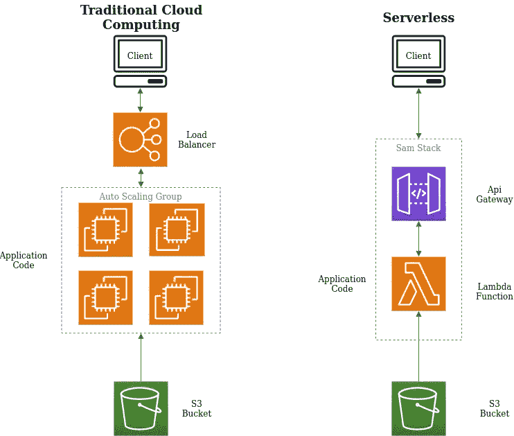
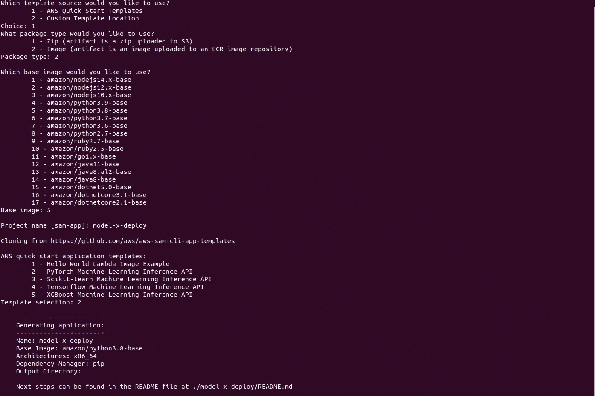
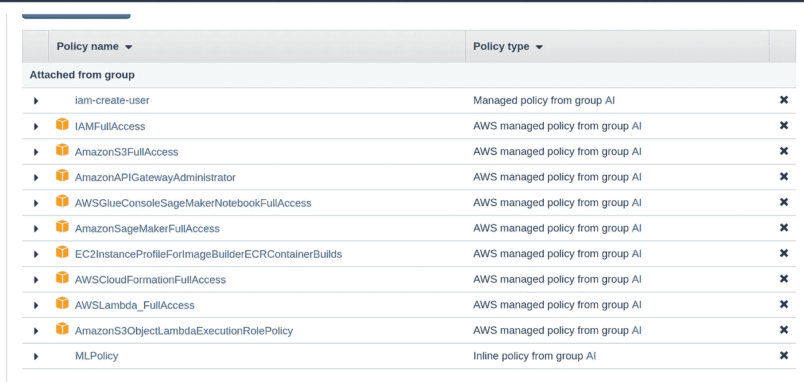

# 使用 SAM 在 AWS 上部署本地训练的机器学习模型

> 原文：<https://medium.com/mlearning-ai/deploy-a-local-trained-machine-learning-model-on-aws-using-sam-cbb065067692?source=collection_archive---------4----------------------->


Center_of_the_Milky_Way_Galaxy

## 介绍

> 部署机器学习模型可能会令人头疼。它可能花费与构建、开发、培训和评估同样多的时间，甚至更多的时间和精力。我没有找到很多关于这个话题的博客，特别是关于 SAM 的，但是不用担心！在这篇博客中，我将总结我在修复依赖项、配置和策略错误近一周后的部署经验。我还将对用于部署您的机器学习模型并将其 dockerize 的最佳实践提出一些建议，所以让我们开始吧。

## 为什么是萨姆？

AWS 无服务器应用程序模型(SAM)使机器学习模型的部署比以往任何时候都更容易。它从创建(s3 桶，ecr，lamda 函数，..等等)以及更多简单的命令(可以自动化)。让您的应用程序可以使用端到端的公共 API。下面的图 1 显示了无服务器架构的优势。



Figure 1

你可以在它的文档中找到更多关于 SAM 的信息[这里](https://aws.amazon.com/serverless/sam/)

# 先决条件

您应该在 PC 上安装以下软件，以便能够使用 SAM 进行部署:

*   Python(推荐版本> 3.7)
*   Docker(推荐版本 20.10.12)
*   AWS CLI(推荐版本 2.7.4)你可以从[这里](https://docs.aws.amazon.com/cli/latest/userguide/getting-started-install.html)安装
*   SAM(推荐版本 1.33.0)你可以从[这里](https://docs.aws.amazon.com/serverless-application-model/latest/developerguide/serverless-sam-cli-install.html)安装

# 步伐

我们将从一个 SAM 模板开始，并用我们的模型和推理功能的逻辑对其进行编辑..安装 SAM 后

# **-初始化一个 SAM 项目**

(附在下面的图 2 中的所有这些设置)

1-终端中的类型 **sam init**

2-选择 **1** (AWS 快速入门模板)

3-选择 **2** (图像选项更好，因为我们的 docker 图像大小限制为 10g，Zip 选项只有 250 兆)

4-选择**5**(Amazon/python 3.8-base)或最适合你的 ML 模型的 python 版本

5-键入您的应用名称，例如: **model-x-deploy**

6-选择 **2** (PyTorch 机器学习示例)-不要担心，我们将在下一步编辑我们的需求文件-

您将找到一个包含模板文件的生成文件夹和一个 README.md，其中包含部署应用程序的后续步骤的详细信息。**(注意:根据 SAM 版本的不同，这些设置的名称、编号和顺序可能会有所不同，但最终结果应该是相同的)**



Figure 2

# -构建 SAM 项目

为了构建我们的本地映像，我们首先需要用我们的依赖项和推理函数的逻辑来编辑这个模板。

1-打开 docker 文件，你会在 *app* 文件夹中找到它，应该是下面这样

```
FROM public.ecr.aws/lambda/python:3.8

COPY app.py requirements.txt ./
COPY model /opt/ml/model

RUN python3.8 -m pip install -r requirements.txt -t .

CMD ["app.lambda_handler"]
```

这里，我们从 ecr.aws lamda 注册表中提取所需的 python 版本映像，以便调用该映像中的 lamda 处理程序。然后，我们复制我们的 app.py，它具有 app.py 中 lamda_handler 函数的推理逻辑。我们还复制我们的模型(您应该将模型物理地放在名为 model 的 app 文件夹中)。我们将这个模型文件夹检查点中的内容复制到我们的相对路径“opt/ml/model”中，稍后我们将使用这个相对路径作为代码中的硬编码路径。然后，我们在 requirements.txt 文件中安装所有需要的依赖项。

关于最佳实践，我在这里发现了一个重要的词，你不应该直接从文本文件中获取需求，而是直接将它们一行一行地放入 dockerfile 文件中。这样，您将尽可能多地使用缓存，因为每次您在. txt 文件中添加新的依赖项时，所有其他包的缓存都将丢失，您必须从头开始下载它们，这与您只在 docker 文件中添加新的包 pip install 不同。另一个提示是，您应该在大的包中增加-default-time out = 200，以免由于超时错误而导致大量失败。一个好的实践是为每个包都有一个特定的版本，以便在未来的版本中不会面临任何依赖问题。不要忘记使用 COPY 命令在映像中添加任何本地包或其他源代码或任何依赖项。您还需要确保添加最后一行来制作应用程序。调用处理程序。

对于 app.py，您应该将您的逻辑放在 *lamda_handler* 函数中，并确保像这样将模型作为全局变量加载

`model_file = ‘/opt/ml/model’
model = torch.jit.load(model_file) # pytorch example`

对于数据，您应该有这个带有事件变量的函数，它被传递给 `lamda_handler`(事件，上下文)。如下图所示

```
def parse_event(event):
    if 'body' in event.keys():
        return json.loads(event['body'])['data']
    else:
        return event['data']
```

看看`template.yaml` 文件，你可以编辑你喜欢的路径和其他参数，就像我下面做的编辑一样。但是通常你不需要编辑那么多。

```
Properties:
    Path: /model_x_inference
    Method: post
```

2-使用命令**sudo Sam build-debug**构建你的映像

3-在本地运行**sudo Sam local start-API—debug**来测试您的映像。通过在另一个终端中运行以下 curl 命令来测试它

```
curl --request POST \
  --url http://127.0.0.1:3000/model_x_inference/ \
  --header 'content-type: application/json' \
  --data '{
  "data": {
    "data_key": "data_value"
  }
}'
```

# -部署 SAM 项目

要将本地映像部署到 AWS，请使用以下命令

**sudo sam 部署—调试—引导**

然后按照终端指示进行操作。

**您可能会遇到的错误以及解决方法将在本节中列出**

1)“没有基本身份验证凭据”错误

这是我花时间和精力试图解决的最难的错误:该错误意味着 AWS CLI 无法找到您的访问键环境变量来使用您的凭证部署您的本地映像。

**基本解决方案**使用 **aws configure** 命令你会看到类似这样的东西:

AWS 访问密钥 ID [****************xxxx]:

AWS 秘密访问密钥[****************xxxx]:

你应该在这里输入你的密钥，你可以使用这个[链接](https://docs.aws.amazon.com/powershell/latest/userguide/pstools-appendix-sign-up.html)来生成它们

第一个解决方案链接是[这里是](https://stackoverflow.com/questions/34689445/cant-push-image-to-amazon-ecr-fails-with-no-basic-auth-credentials)

如果您尝试了这些解决方案，但仍然得到相同的错误，该怎么办？(和我一样)…别担心，我有另一个解决方案给你:)

您可能知道，当运行任何使用 Docker 的命令或试图运行任何本地映像时，它将需要 sudo 访问。如果您尝试使用 sam 进行构建，而不在命令中包含 sudo，则可能会失败。因此，当使用 sudo 时，您现在访问的是 root 用户的环境变量，正如您可能猜到的那样，这些变量没有您刚刚添加的凭证。

因此，第二个解决方案是运行 **sudo aws configure** ，您将会看到凭证和区域尚未设置，这样就可以修复第一个错误了。

2)“授权令牌已过期”

当您在部署时尝试使用 docker 存储库而不是 sam 推送您的映像并将映像 url 发送到 sam 时，会发生这种情况，因为出于安全原因，docker 凭据仅在 12 小时后过期。解决方案在[这里](https://stackoverflow.com/questions/41379808/authorization-token-has-expired-issue-aws-cli-on-macos-sierra)有。

3)“登录 AWS 帐户时出现大量权限错误”

我也很纠结这个问题，以为问题出在我的 SAM 或 CLI 版本或任何其他依赖项上，结果发现这只是我们 ML 策略组的另一个权限，这需要与软件负责人或 Devops 团队领导讨论很多，才能从他们的超级用户根帐户获得这个权限。在这里，我列出了所有策略，甚至内联编写的策略，通过这些设置和策略，我能够成功部署这些策略。



figure2 the list of policies

对于 ML 内联策略，这里是它的 JSON[ref 链接](https://stackoverflow.com/questions/65137639/lambda-does-not-have-permission-to-access-the-ecr-image)

```
{
 "Version": "2012–10–17",
 "Statement": [
 {
 "Sid": "VisualEditor0",
 "Effect": "Allow",
 "Action": [
 "ecr:SetRepositoryPolicy",
 "ecr:GetDownloadUrlForLayer",
 "ecr:BatchGetImage",
 "ecr:CompleteLayerUpload",
 "ecr:DescribeImages",
 "ecr:DescribeRepositories",
 "ecr:UploadLayerPart",
 "ecr:ListImages",
 "ecr:InitiateLayerUpload",
 "ecr:BatchCheckLayerAvailability",
 "ecr:GetRepositoryPolicy",
 "ecr:PutImage"
 ],
 "Resource": "*"
 },
 {
 "Sid": "VisualEditor1",
 "Effect": "Allow",
 "Action": "ecr:GetAuthorizationToken",
 "Resource": "*"
 }
 ]
}
```

4)“基于云形成误差”

似乎 SAM 有时候无法自动更新或删除一个旧栈，所以当你发现错误与 cloudwatch 有某种关联时，应该尝试手动删除，像这个`“ValidationError Stack:arn` aws cloudformation stack 处于 ROLLBACK_COMPLETE 状态，无法更新。“类似错误的链接是[这里的](https://stackoverflow.com/questions/57932734/validationerror-stackarn-aws-cloudformation-stack-is-in-rollback-complete-state)。你可以从主菜单访问云手表，删除任何失败的堆栈，如果它第一时间没有删除也不用担心。它会要求您验证该删除是否会删除与其相关的功能和模块，然后成功删除。

5)“内部服务器错误”

最后，您现在已经部署了您的模型，当在公共 API 上测试它时，它失败了，并显示这个错误，但是这个错误到底是什么意思呢？你需要访问 AWS 云观察日志来检查它。请使用此链接。如果错误还没有出现，似乎是环境变量的名称造成的。将来可能会更改，但对我来说，当将名称从**$ context . integration error message**更改为**$ context . integration . error**[参考链接](https://noise.getoto.net/2020/09/04/troubleshooting-amazon-api-gateway-with-enhanced-observability-variables/)时会显示出来

6)`OSError: [Errno 38] Function not implemented`

这个比较棘手。当您在 Python 中使用任何多线程函数时，都会发生这种情况。似乎 Python 的 aws lamda 函数仍然存在错误，所以对我来说，解决方案是在 pytorch 模型中设置 num_workers = 0。错误已解决。[参考链接](https://stackoverflow.com/questions/69042763/error-oserror-errno-38-function-not-implemented-accessing-trend-deepsec)

7)“冷启动问题”

在这漫长的旅程之后，如果您在成功部署之后刚刚测试了它，并且发现了类似“超时”或其他类似的错误，请不要惊慌。这是因为冷启动众所周知的问题。你可以在其他博客或文章中了解更多。所以无论如何，耐心点，你的 API 最终会部署成功:)

我希望你会发现这篇文章很有用，并修复你将面临的一个或多个错误。欢迎在评论区问我，如果是一般性的错误，我会尽力帮助并把这些新错误添加到博客中。祝您好运，并愉快地部署每个人:)

[](/mlearning-ai/mlearning-ai-submission-suggestions-b51e2b130bfb) [## Mlearning.ai 提交建议

### 如何成为 Mlearning.ai 上的作家

medium.com](/mlearning-ai/mlearning-ai-submission-suggestions-b51e2b130bfb)