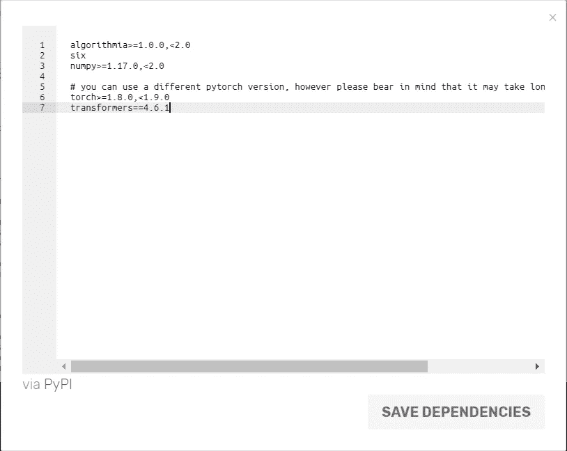
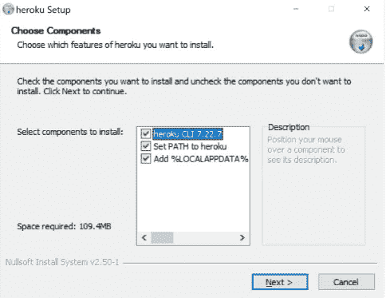
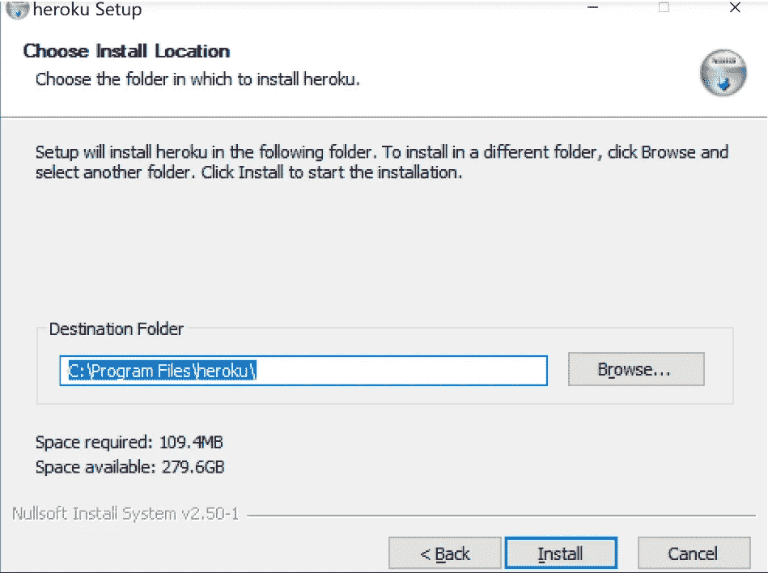
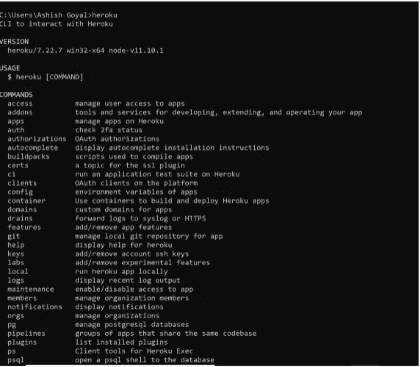
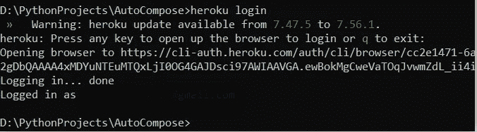

# 免费部署 GPU 加速的深度学习模型

> 原文：<https://medium.com/mlearning-ai/deploy-gpu-accelerated-deep-learning-models-for-free-c671ccf60a68?source=collection_archive---------5----------------------->

## 终极黑客

## 创建一个 API，用于将深度学习模型与 Algorithmia 轻松对接


Photo by [Robert V. Ruggiero](https://unsplash.com/@rvrmakes?utm_source=medium&utm_medium=referral) on [Unsplash](https://unsplash.com?utm_source=medium&utm_medium=referral)

在本文中，我将带您在 GPU 服务上部署深度学习或 ML(机器学习)模型(免费)。这是文章[“情感表达诗歌的自动生成”](http://example.com/)的延续，在这篇文章中，我们构建了创作原创诗歌的模型。如果你没有读过它，这是完全没问题的，你仍然可以跟着读，因为这是一篇独立的文章。

我们将使用 [Algorithmia](https://algorithmia.com/) ，它将在 GPU 上托管深度学习模型(你也可以选择在 CPU 上托管)，并在 [Heroku](https://www.heroku.com/) 上部署一个 API 来连接模型。在本文中，将使用 [Flask](https://flask.palletsprojects.com/en/2.0.x/) 构建 API，但是您也可以使用任何其他技术。

整个项目的代码可以在这个 [github 库](https://github.com/prajwalcr/AutoCompose)中找到。诗歌生成器 app 的现场版可以在[这里](http://autocompose.herokuapp.com/)找到。该应用程序能够在一秒钟内生成新的诗歌，因为它利用了 Algorithmia 的 GPU 服务。如果在 CPU 上运行，生成一首诗大约需要 7 秒钟。(请注意，由于冷启动，生成首诗可能需要大约 30 秒。之后应该就像做梦一样工作了)。

# 为什么要用 Heroku 和 Algorithmia？

Heroku 是平台即服务(PaaS ),可用于完全在云中托管应用程序。它具有良好的自由层，并且易于设置和使用。

Algorithmia 是一个 MLOps 平台，它允许你训练和部署 ML 模型到产品中。它专门研究“算法即服务”，在这里你必须创建一个算法来运行你的模型。令人惊奇的是，您的模型可以使用 API 调用，并且现在完全独立于应用程序的其余部分。您可以构建不同的应用程序，所有的应用程序都可以使用 API 访问模型。另一个好处是，你不再需要在 heroku 上托管那些庞大的 ML 模型，由于空闲层的存储限制，这有时是不可能的。您可以直接将模型上传到 Algorithmia 上(它也可以支持 512MB 以上的模型)。

对于那些来自前一篇文章的人，我使用 git lfs 将模型上传到 Huggingface 的模型中心，并在 Algorithmia 中运行模型时访问它们。您可以这样做，也可以将模型上传到 Algorithmia。

Algorithmia 每月免费提供一定量的计算时间(可以用于 CPU，也可以用于 GPU)。如果你只是想为一个大学项目建立一个 ML 应用程序，或者想获得一些 ML 方面的经验，或者向他人炫耀你的辛勤工作，你可以完全免费使用 Algorithmia。你甚至可以允许其他开发者免费或收取版税使用你的模型。然而，如果你想为一家企业打造一个实际的产品，没有捷径可走，你需要根据所使用的资源付费。

# 创造神奇的算法

## 1.在 Algorithmia 上创建一个帐户

前往 Algorithmia [注册](https://teams.algorithmia.com/signup)页面，免费创建一个新账户。

## 2.创建新算法

进入**创建新的**下拉菜单，点击**算法**。这将带您进入**创建新算法**页面。

输入算法的名称。选择 Algorithmia 作为存储库主机。根据您的需求选择合适的可见性和许可。选择要用来编写算法代码的语言和适当的环境。Algorithmia 支持大量语言，如 Python、Java、Scala、Javascript、R、Ruby 和 Rust。对于我的项目，我选择了 *Python 3.x* 作为语言，Python 3.8 + PyTorch 1.8.x 作为环境。最后，点击**创建一个新算法**。

## 3.上传 ML 模型

如果您正在使用 HuggingFace 模型中心或任何其他模型中心上托管的模型，则可以跳过此步骤。

点击左侧窗格中的**数据源**。这是与所有算法相关的数据所在的位置。移动到**我的托管数据**目录。在这里为您的每个项目创建一个单独的文件夹，并将您的模型上传到那里。在您的算法中，您可以通过以下路径访问模型:*" data://<username>/<folder>/<model-file>"*

## 4.源代码

我们完成了所有的设置，实际的东西从这里开始。选择您创建的算法并点击**源代码**。这将带您进入 Algorithmia IDE。如果您使用的是 python 环境，您可以看到已经为您创建的以您的算法命名的两个 python 文件。对于本教程，我们将忽略测试文件。整个代码将被写入第一个文件。

因为我们定义了一个 API 来与算法交互，所以所有的输入和输出都是 JSON 字符串。在源代码中，您需要提供用于加载模型、接收和解析 JSON 格式的输入、在模型上运行输入并返回 JSON 格式的输出的代码。

模型仅在**冷启动**期间加载。当算法在一段时间内处于非活动状态时，即在与前一个请求间隔很长时间后出现请求时，会发生冷启动。发生这种情况是因为如果算法在一段时间内没有被任何人调用，它就会进入睡眠模式。

## a)依赖性:

点击 IDE 中的**依赖关系**按钮。这将打开一个弹出窗口，您可以在其中的新行上列出每个依赖项及其名称和版本。根据环境的不同，某些依赖关系可能已经存在。请确保保存您在此所做的任何更改。



Image by Author

## b)编码:

导入算法所需的所有依赖项。此外，编写加载模型的任何代码。确保这在 *apply()* 函数之外，因为您不想每次调用算法时都加载模型。这确保了模型仅在冷启动期间加载，如上所述。

## c)应用()函数:

*apply* ()函数是一个特殊的函数，每次向算法发出 API 请求时都会调用这个函数。这里的代码在每次客户端调用算法时都会运行。这段代码应该接受并解析 JSON 输入，对输入运行模型，并将输出作为 JSON 字符串返回。

## d)构建:

将所有代码放在一起后，下一步是构建算法。点击 **Build** 按钮，这将安装依赖关系中提到的所有库，算法将准备运行。在屏幕底部的 Algorithmia 控制台中，您可以输入 JSON 格式的算法输入，然后按 enter 键在该输入上运行它，并获得适当的输出。您可以使用它进行基本的调试。成功构建后，您就可以发布算法了。

## 5.出版

为了访问您的算法，您需要发布它。为此，单击 IDE 中的**发布**按钮。您可以为正在发布的算法版本添加发行说明。在下一页中，对样本输入运行算法以获得输出。这个样本输入输出对将在算法的主页上可见。在最后一页，您可以配置算法的设置。您可以将其设为公共或私有。您也可以设置版税，然后点击**发布**按钮。

**恭喜恭喜！！**你已经成功地部署了你的第一个 Algorithmia 算法，你的 ML 模型现在已经准备好投入使用了。下一步是构建一个简单的 API 来与模型交互。您可以使用 web 框架，如 Flask、Django、Node 或任何其他框架来构建 API。你可以在我的 [github 库](https://github.com/prajwalcr/AutoCompose/tree/main/src)中看到我构建的 flask 应用。

## 6.调用发布的算法

在算法主页的底部，你可以看到一个叫做**安装和使用**的部分。在这里，您可以获得各种语言调用算法的说明。

要使用 python 调用算法，首先需要安装 Algorithmia 客户端。

```
pip install algorithmia
```

导入 Algortihmia 并使用您的 API 密钥创建客户端。您可以在主页的 **API Keys** 选项卡中找到它。

```
**import** Algorithmiainput = "neutral"
client = Algorithmia.client('<YOUR-API-KEY>')
```

一旦你有了你的客户，你需要选择你的算法并指定你想要使用的版本。然后，您可以使用 pipe()函数将输入传递给算法，并作为结果访问输出。

```
# String format: '<user>/<Algorithm>/<Algorithm-version>'
algo = client.algo('pgcr/PoetryGeneration/1.1.0')try:# Get the result
poem = algo.pipe(emotion).resultexcept Exception as error:# Algorithm error if, for example, the input is not correctly formatted
print("Error:", error)
```

通过这种方式，您可以轻松地将您的 ML 模型输出到您的应用程序中。在我的例子中，我得到了一首由模特创作的原创诗歌。我可以继续在我的应用程序中处理这首诗，删除任何奇怪的标点符号，为它生成一个标题，并显示给用户。

# 使用 Heroku 部署应用程序

假设您已经创建了一个利用 Algorithmia 模型的应用程序，下一步是将其部署到生产中。这就是 Heroku 的用武之地。我将带你在 Heroku 上部署 Flask 应用程序。首先，如果你还没有为你的应用创建一个 github 库。

## 1.在 Heroku 上创建一个帐户

如果您没有 Heroku 帐户，您可以通过前往 [Heroku](https://www.heroku.com/) 轻松创建一个免费帐户。点击**注册**按钮，输入所需的详细信息并创建您的帐户。

## 2.安装 Heroku CLI

如果您没有安装 Heroku CLI，请下载并安装。点击[这里](https://devcenter.heroku.com/articles/heroku-cli#download-and-install)并根据您的操作系统下载合适的安装程序。运行安装程序。确保选择所有组件并点击**下一步**。



选择合适的安装目标文件夹，点击**安装**。等待安装完成。应该不会花太长时间。



安装成功完成后，关闭安装程序。打开您的命令提示符并键入`heroku`,您应该会看到以下输出:



## 3.在 Heroku 上创建您的应用程序

使用以下命令在您的终端中登录 heroku。

```
heroku login
```

这将在您的浏览器上打开一个页面，您必须在其中输入所需的凭据。



下一步是创建 Heroku 应用程序。在这里，我将创建名为 **heroku-app-name** 的应用程序。将此替换为您自己的应用程序的名称。请记住，您在此给出的名称将决定您的应用程序的 URL。URL 的格式是*http://heroku-app-name.herokuapp.com*确保你给的名字是唯一的。

```
heroku create heroku-app-name --buildpack heroku/python
```

在您的终端中导航到您的项目文件夹(git 在其中初始化),并通过向 heroku 应用程序添加一个遥控器将您的 git 存储库链接到 heroku。

```
heroku git:remote -a heroku-app-name
```

## 4.修改用于部署的 Flask 应用程序

## a)安装 Gunicorn

[Gunicorn](https://gunicorn.org/) 是一个用于 UNIX 的 Python WSGI HTTP 服务器。这将有助于为 Heroku 提供您的 Flask 应用程序。

```
pip install gunicorn
```

## b) **过程文件**

ProcFile 基本上包含在 Heroku 上启动应用程序的命令，因此是部署应用程序所必需的。flask 应用程序的 procfile 应该包含应用程序的 python 文件的名称和该文件中构造 Flask 应用程序的应用程序变量的名称(`app = Flask(__name__)`)。在 git 存储库的根目录下创建一个 Procfile(文件名为“procfile”)。

```
web: gunicorn src.app:app
```

这是我的应用程序的 Procfile。这表明 flask 应用程序的 python 文件名为“app.py ”,位于“src”文件夹(src/app.py)中，并且构造 flask 应用程序的变量名为“app”。

## c)要求. txt

在根目录下创建一个 **requirements.txt** 文件。这是 Heroku 将应用程序视为 python 项目所必需的，它将安装所有要求并为项目创建所需的环境。

```
pip freeze > requirements.txt
```

## d)提交更改并推送到 Heroku

暂存并提交您所做的所有更改。

```
git add .
git commit -m "deployment to Heroku"
```

将更改推送到 heroku 的`main`分支。请注意，对 heroku 中任何其他分支的更改都不会对应用程序产生影响。

```
git push heroku main
```

现在开始部署中最令人焦虑的部分。稍等几分钟，等待命令运行。如果你一切顺利，你将在`*http://heroku-app-name.herokuapp.com*`T13 有一个工作申请。否则，祝你调试好运:)

[](/mlearning-ai/mlearning-ai-submission-suggestions-b51e2b130bfb) [## Mlearning.ai 提交建议

### 如何成为 Mlearning.ai 上的作家

medium.com](/mlearning-ai/mlearning-ai-submission-suggestions-b51e2b130bfb)