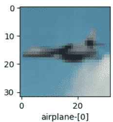
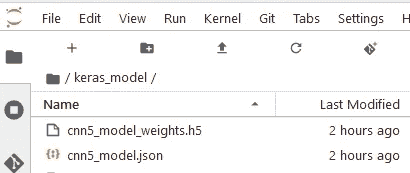
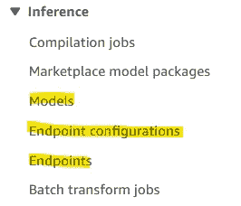
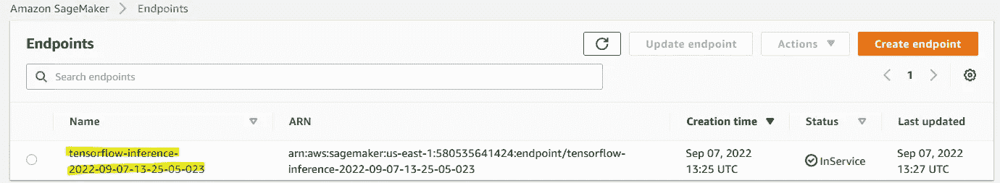

# 在 AWS SageMaker 端点上部署预训练的 Keras 图像分类模型以进行推理

> 原文：<https://medium.com/mlearning-ai/deploy-pre-trained-keras-image-classification-model-on-aws-sagemaker-endpoint-for-inference-c120e3e1de90?source=collection_archive---------1----------------------->

在上一篇文章(下面的链接)中，我实现了一个卷积神经网络来对来自 CIFAR-10 数据集的图像进行分类。这是一个典型的 ML 工作流，从数据导入、训练、调优和推理的所有步骤都在我们钟爱的 IDE 中本地进行。


Photo by [An Tran](https://unsplash.com/@vinhan?utm_source=medium&utm_medium=referral) on [Unsplash](https://unsplash.com?utm_source=medium&utm_medium=referral)

[](/mlearning-ai/cifar-10-image-classification-linear-model-vs-cnn-e1596ec2be26) [## CIFAR-10 图像分类:线性模型与 CNN

### 计算机视觉的应用在过去十年里急剧上升，这要归功于…

medium.com](/mlearning-ai/cifar-10-image-classification-linear-model-vs-cnn-e1596ec2be26) 

在本文中，我概述了我第一次尝试将相同的(几乎)模型部署到 AWS SageMaker (SM)进行推理。对于那些不太熟悉这项服务的人来说，简而言之，SM 是一个云无服务器平台，可以在 ML 生命周期的所有阶段为您提供帮助，从导入数据、培训、调整和部署经过培训的模型到大规模生产。欲了解更多信息，请访问下面的文章进行概述。

[](https://www.analyticsvidhya.com/blog/2022/05/an-introduction-to-aws-sagemaker-for-beginners/) [## AWS Sagemaker 初学者入门-分析 Vidhya

### 这篇文章作为数据科学博客的一部分发表。数据科学家需要创建、培训和部署…

www.analyticsvidhya.com](https://www.analyticsvidhya.com/blog/2022/05/an-introduction-to-aws-sagemaker-for-beginners/) 

然而，训练通常是计算量最大的任务，由于成本或技术不熟悉，使用 SM 内置训练作业可能不是所有情况下的最理想选择，尤其是当我们都太习惯于在其他地方训练和优化我们的模型时。幸运的是，SM 提供了将您训练好的模型用于推理任务的方法。另一方面，这个任务的实际实现并不简单，尤其是对于不熟悉许多云计算概念的初学者(比如我)。有不同的方法来部署一个训练好的模型，并且不同类型的模型(例如，sklearn、keras、torch……)有它们自己的部署变化。

所有这些使得第一次尝试进入这个美丽的大规模生产水平 ML 的世界是一个非常陡峭的学习曲线。为了完成这项任务，需要从各种来源进行改编，而网络社区使这成为可能。

经过几天(痛苦的)学习(和谷歌搜索)，以下是这个特殊案例的主要步骤:

1.  在本地对模型进行定型，然后对其进行测试，以确保正确的模型输入数据类型和推断格式。
2.  将训练好的模型导出到. h5 和。json 文件
3.  将这些文件上传到 SM 笔记本，并将权重加载到 json 结构中，以创建加载的模型对象。
4.  将这个模型对象转换成 SM 使用的**格式和文件结构。**
5.  将模型注册到 SM 模型目录，然后将其部署到一个端点进行推理。
6.  调用端点进行样本预测。

现在，让我们深入细节。

# 1.在本地训练、测试和导出模型

我按照上面链接中解释的相同步骤来重新训练 CIFAR-10 数据集，只是仅针对 5 个时期，牺牲了时间的准确性(75%)，因为我们只关注部署模型而不是准确性方面。在导出模型之前，让我们做一些测试。注意，在这一整节中，我们还没有触及 SM。(你可以在这里找到包括培训、测试和导出[在内的整个笔记本)。](https://github.com/joshuavaple/cifar-10-for-sagemaker.git)

首先，我们可以从测试集中抽取一幅随机图像。这一次，返回 index = 8777 的飞机图像。



现在，让我们将图像数组传递回训练好的模型。调用`reshape()`方法只是为了确保图像尺寸符合模型期望的输入形状。

模型返回如下，表示输入图像形状为 32×32 像素，3 个通道，最高类概率为第一个，对应类名飞机。

```
(32, 32, 3)[[9.7909743e-01 1.9577092e-05 1.3614256e-03 3.2661922e-06 7.3834424e-05 1.8172224e-07 8.5703596e-07 9.3790965e-07 1.9413525e-02 2.8970726e-05]]airplane
```

接下来，让我们将此图像导出到一个. jpeg 文件，图像索引号用作名称的一部分，以便于识别。然后，我们将导入这个图像并再次运行这个模型。执行此步骤是为了模拟稍后通过导入和外部映像来测试模型的过程，并确认代码可以在 SM 笔记本环境中重用以测试下游映像。

export the random image to .jpeg

import the .jpeg image and pass it to the model

这里不出意外，模型正确返回以下内容，表明它是一架飞机。名为`img-9777.jpeg`的图像文件(现在与笔记本一起保存在本地目录中)稍后将用于在线测试我们的模型。

```
[[1\. 0\. 0\. 0\. 0\. 0\. 0\. 0\. 0\. 0.]] airplane
```

由于测试是令人满意的，我们可以通过下面的代码将模型工件导出到两个文件中:一个. json 文件和一个. h5 文件(改编自本文[文章](/@baraaalbourghli/deploy-your-keras-or-tensorflow-machine-learning-model-to-aws-using-amazon-sagemaker-how-to-2d88a6e779cc))。运行此代码块后，将在同一本地文件夹中创建这两个文件。我们现在已经完成了前两步。使用本地环境到此结束，让我们转移到 SageMaker。

# 2.准备在 SM 笔记本中部署模型

在我们开始之前，请注意这些步骤可以通过 SM 控制台上的点击方式来完成(查看下面 Mike Chambers 的 YouTube 系列，获得一个很好的演示)。

然而，我发现在笔记本环境中执行它们更便于故障排除。我不会过多地探究 AWS 控制台上的逐步导航或关于 AWS 角色、可访问性等的细节。，而是专注于手头的核心任务。如果你需要澄清，请给我留下评论/问题。现在让我们继续读下去。

让我们在 SM 控制台中启动一个笔记本实例。在里面，创建一个文件夹并上传我们上面创建的两个文件。



现在，我们可以通过执行以下代码将这两个文件“组合”成一个加载的模型对象，这些代码改编自[数据 Liam](https://www.youtube.com/watch?v=RPnvfxR5DY8&t=537s) 。请注意，上面这个文件夹的目录用于打开和加载必要的文件。

接下来，我们通过运行下面的代码块来执行前面大纲中的步骤 4。这是根据 Liam 的方法改编的，也是 Peter Van Katwyk 在这篇[帖子](https://stackoverflow.com/questions/67505781/loading-pretrained-keras-to-sagemaker-local-classification-works-but-sagemaker)中的贡献，它似乎帮助我解决了目前 SM 上使用更新的 TF 版本的问题。总之，这些代码编写了一个特定的文件夹结构(在创建的`export` 文件夹中), SM 需要它来注册模型工件，然后将它压缩到一个`.tar.gz`文件中。在 SM 笔记本环境中，您应该会在与您的主笔记本文件相同的位置下看到该文件。

# 3.创建和部署模型

期待已久的步骤来了。模型工件已经压缩好了，下一步是将它上传到 S3 桶中。一旦完成，就可以基于 S3 上传的文件建立一个 SM 模型(这是 AWS 喜欢做的)，并注册到模型目录中。最后，它被部署到一个端点。请看下面代码中的注释以获得更清晰的内容，改编自上面 Liam 的视频。

您可以随时检查 SM 控制台上的以下位置，以查看新型号、端点配置和端点的存在。一旦端点被标记为“InService ”,请记下该端点的名称，以便稍后执行推理任务。



endpoint name

# 4.使用模型端点的推断

最后，为了测试端点是否正常工作，这意味着它可以接收输入，运行模型，并返回预测，我们首先将之前保存的图像`img-9777.jpeg`上传到 SM 笔记本目录。然后，在同一个笔记本中调用以下代码来调用端点并使其工作。注意，您必须将自己的端点名传递给变量`endpoint_name.`

这种情况下的结果就是`airplane`。请注意，在测试步骤中，我们使用了与第 1 节相同的编码结构。因此，在使模型适应 SM 环境之前，总是离线测试您的代码，并让模型工作。

重要提示:完成实验后删除端点，以避免产生额外费用。

# 5.结论和今后的改进

这是我遇到的最陡的学习曲线之一，因为我对云计算，尤其是 AWS，知之甚少。然而，在线社区提供的资源极大地帮助了我完成这项工作。我有一个值得注意的观察，Peter 在他的帖子中也提到了，SM 返回的类概率与本地 IDE 不一样。他设法用一个旧的 TF 版本解决了这个问题，这可能是不可持续的，我也没能执行。这将是这个职位的未来修订的机会。

非常感谢您的评论和建议来改进这篇文章，并随时通过我的 [LinkedIn](https://www.linkedin.com/in/levuanhphuong/) 联系我。

***主要引用:***

*   [https://medium . com/@ baraalbourghli/deploy-your-keras-or-tensor flow-machine-learning-model-to-AWS-using-Amazon-sage maker-how-to-2d 88 a6e 779 cc](/@baraaalbourghli/deploy-your-keras-or-tensorflow-machine-learning-model-to-aws-using-amazon-sagemaker-how-to-2d88a6e779cc)
*   [https://stack overflow . com/questions/67505781/loading-pre trained-keras-to-sage maker-local-class ification-works-but-sage maker](https://stackoverflow.com/questions/67505781/loading-pretrained-keras-to-sagemaker-local-classification-works-but-sagemaker)
*   [https://stack overflow . com/questions/56192998/tensor flow-2-0-0a 0-attribute error-module-tensor flow-has-no-attribute-glob](https://stackoverflow.com/questions/56192998/tensorflow-2-0-0a0-attributeerror-module-tensorflow-has-no-attribute-glob)
*   [https://www.youtube.com/watch?v=RPnvfxR5DY8&t = 537s](https://www.youtube.com/watch?v=RPnvfxR5DY8&t=537s)
*   [https://AWS . Amazon . com/blogs/machine-learning/deploy-trained-keras-or-tensor flow-models-using-Amazon-sage maker/](https://aws.amazon.com/blogs/machine-learning/deploy-trained-keras-or-tensorflow-models-using-amazon-sagemaker/)

[](/mlearning-ai/mlearning-ai-submission-suggestions-b51e2b130bfb) [## Mlearning.ai 提交建议

### 如何成为 Mlearning.ai 上的作家

medium.com](/mlearning-ai/mlearning-ai-submission-suggestions-b51e2b130bfb)