# 部署您的第一个机器学习项目来简化云计算

> 原文：<https://medium.com/mlearning-ai/deploying-your-first-machine-learning-project-to-streamlit-cloud-d6b62ee03874?source=collection_archive---------2----------------------->

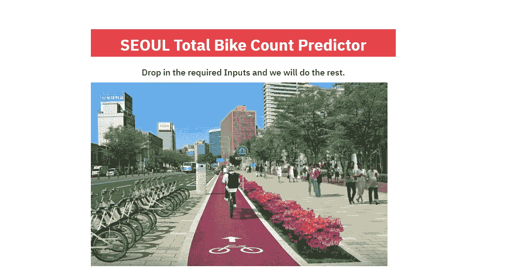

Screenshot of the web app.

感谢像 Streamlit 或 Heroku 这样的平台，将你的任何项目部署到 UI 都变得如此容易。就我而言，我非常喜欢这种体验，所以不确定我是否会选择另一种体验。这至少是我此刻的感受。

你可以通过点击这个[链接](https://share.streamlit.io/avangarde2225/seoul_bike_count_prediction/Seoul_Bike_Prediction_Model.py)来检查这个项目的最终版本，然后告诉我它需要的任何改进。

**步骤**:

1.  数据清理和探索性数据分析
2.  简单线性回归
3.  套索和山脊规则
4.  部署

# 介绍

我通过 Medium.com 分享我的数据科学路线图经验，并试图在我所做的事情上独树一帜。正如你已经知道的，博客中涉及的大部分项目几乎是相同的。我意识到的一件事是解决你可能面临的挑战。在这个项目中，我尝试实现了一个从数据提取阶段到 UI 部署的端到端的机器学习项目。

我最初的想法是从各种网络应用程序中收集数据并进行分析。我做到了，但它成为了另一篇文章的主题，这篇文章可以在这里找到:

[](/mlearning-ai/lessons-learned-while-scraping-data-from-dynamic-sites-for-my-regression-ml-project-c7f52e5ef7ea) [## 为我的回归 ML 项目从动态站点收集数据时学到的经验教训

### 希望这篇文章是关于分享我的经验，关于我用“两行代码”刮一个网站或…

medium.com](/mlearning-ai/lessons-learned-while-scraping-data-from-dynamic-sites-for-my-regression-ml-project-c7f52e5ef7ea) 

许多现代城市引入了租赁自行车，为通勤提供了另一种方式。例如，在 T4 的一些城市，自行车比汽车多。至关重要的是，不仅在像市中心这样受欢迎的地方，而且在有一些交通的地方，都可以在码头找到租赁自行车。骑自行车也与天气和季节密切相关。也可能不是...让我们深入细节...

# 资料组

这些数据是从 UCI ML 知识库中提取的，可以在这里找到。

数据集包含天气信息(温度、湿度、风速、能见度、露点、太阳辐射、降雪量、降雨量)、每小时租赁的自行车数量和日期信息。

**属性信息:**

**日期**:年月日
**出租自行车数** —每小时出租自行车数
**小时** —一天中的小时
**温度**—摄氏度温度
**湿度** — %
**风速** —米/秒
**能见度**—10 米
**露点温度** —摄氏度
**季节** —冬、春、夏、秋
**节假日** —节假日/无节假日
**功能日** —无功能时间(NoFunc)，乐趣(Fun)

现在我们知道了我们在这里处理的是什么样的变量，让我们来看看事情的本质。


Photo by [Jodie Louise](https://www.pexels.com/@sugacoatit?utm_content=attributionCopyText&utm_medium=referral&utm_source=pexels) from [Pexels](https://www.pexels.com/photo/red-cruiser-bike-parked-on-metal-bike-stand-805303/?utm_content=attributionCopyText&utm_medium=referral&utm_source=pexels)

# 1.数据清理和探索性数据分析(EDA)

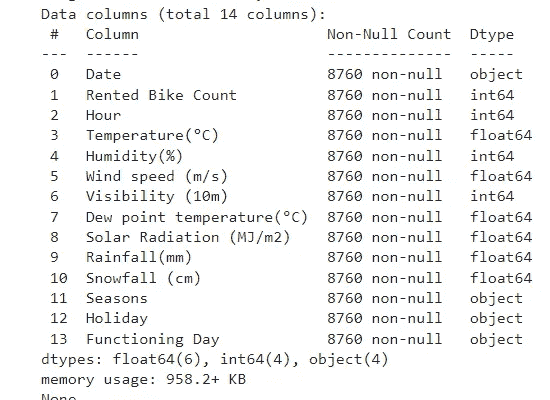

我喜欢任何没有任何缺失值的数据集！

将“日期”对象转换为正确的日期时间格式，然后将其拆分成多个片段，以便我们可以深入到每小时和季节信息。

```
*# Let's extract new columns (day of the week, day of the month, hour, month, season, year etc.) by using new index.*
df['Date'] **=** pd**.**to_datetime(df['Date'])
df['Year'] **=** df['Date']**.**dt**.**year
df['Month'] **=** df['Date']**.**dt**.**month
df['Day'] **=** df['Date']**.**dt**.**day
df**.**tail()
```

除了冬季，自行车数量全年都相当稳定。

```
Month **=** df**.**groupby("Month")**.**sum()**.**reset_index()
plt**.**figure(figsize**=**(16,4), dpi**=**150)
sns**.**barplot(x**=**"Month", y**=**"Rented Bike Count", data**=**Month)
plt**.**xticks(rotation**=**90);
```

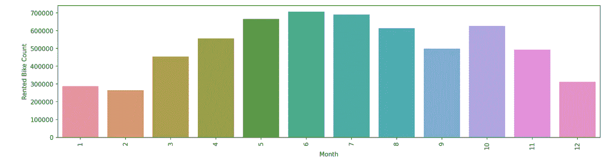

这可能没什么意义，但稍后这可能会给我们一个月中天数分布的概念，所以我在这里分享它；

```
Day **=** df**.**groupby("Day")**.**sum()**.**reset_index()
plt**.**figure(figsize**=**(16,4), dpi**=**150)
sns**.**barplot(x**=**"Day", y**=**"Rented Bike Count", data**=**Day)
plt**.**xticks(rotation**=**90);
```

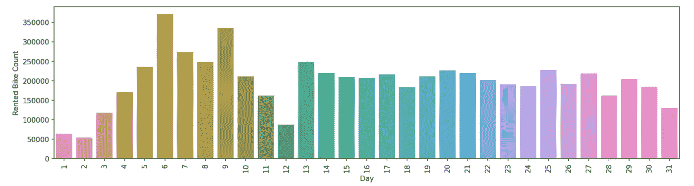

不知何故，上面的图表描绘了一幅有趣的图画。每个月的头几天，也就是第 12 天，是真正缺乏需求的时候。进一步深究，会引出这样的问题:

一个月中有没有什么特殊的日子对自行车进行检查？或者在首尔，这些日子有什么特殊的文化意义吗？

最后，如预期的季节性…

```
Season **=** df**.**groupby("Seasons")**.**sum()**.**reset_index()
plt**.**figure(figsize**=**(16,4), dpi**=**150)
sns**.**barplot(x**=**"Seasons", y**=**"Rented Bike Count", data**=**Season)
plt**.**xticks(rotation**=**90);
```

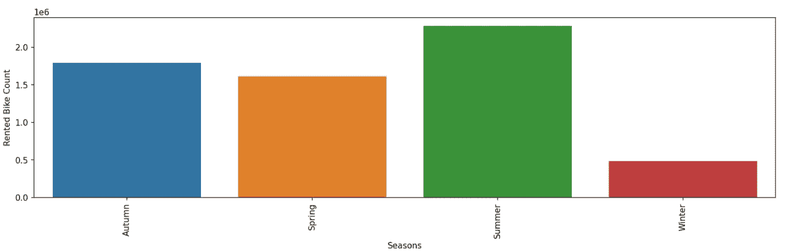

从这里，我想得到的是一年四季中每天的时间分布。人们似乎大多在高峰时间使用自行车，尤其是在每个季节的晚上！我认为这是一个非常好的迹象，尤其是当世界正在向零排放迈进的时候！

```
plt**.**figure(figsize**=**(12,4), dpi**=**100)
graph **=** sns**.**lineplot(data**=**df, x**=**"Hour", y**=**"Rented Bike Count", hue**=**"Seasons")
```

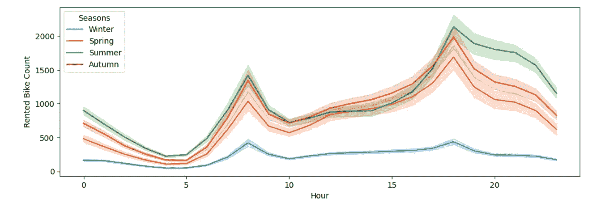

进入数据处理之前的最后一步是显示热图，以显示“租赁自行车数量”和其他变量之间的关系。“小时”和“温度”出现了，因为这两个变量与自行车总数变量密切相关。

```
plt**.**figure(figsize**=**(2,4), dpi**=**150)
sns**.**heatmap(df**.**corr()[["Rented Bike Count"]]**.**sort_values
            (by**=**"Rented Bike Count", ascending**=False**)[1:],annot**=True**)
```

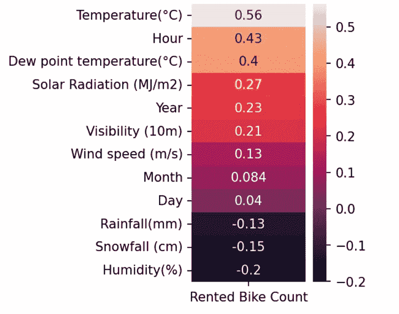

# 1a)数据处理和准备

为了更直观，让我们用日期名称代替数字。

```
mapping_dictDay**=**{'Monday':1,'Tuesday':2,'Wednesday':3,'Thursday':4,'Friday':5,'Saturday':6,'Sunday':7}

df['WeekDayEncoding']**=**df['WeekDay']**.**map(mapping_dictDay)
df**.**head()
```

获取虚拟模型和一次性编码

```
df_one_hot_coded **=** pd**.**get_dummies(df,columns**=**['seasons','holiday', ],prefix**=**'C')df_one_hot_coded **=** df_one_hot_coded**.**rename(columns**=**{'C_No Holiday': 'C_No_Holiday'})
df_one_hot_coded**.**head()
```

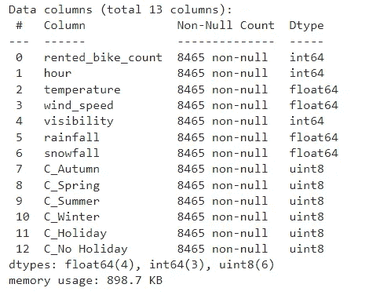

# 2)简单线性回归

设置 X、y 轴并分割数据

```
*#features & target*
X **=** df_one_hot_coded**.**drop(columns**=**['rented_bike_count'],axis**=**1)
y **=** df_one_hot_coded['rented_bike_count']X_train, X_test, y_train, y_test **=** train_test_split(X, y, test_size**=**0.2, random_state**=**42)
```

y _ 测试和预测比较；

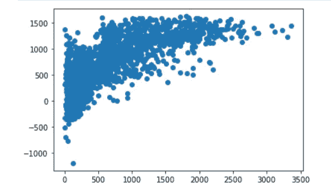

```
print("MAE: ", metrics**.**mean_absolute_error(y_test, predictions))
print("MSE: ",metrics**.**mean_squared_error(y_test, predictions))
print("RMSE: ", np**.**sqrt(metrics**.**mean_squared_error(y_test, predictions)))
print("R^2: {}"**.**format(model**.**score(X_test, y_test)))R^2: 0.5343183750523306
```

让我们尝试通过应用套索和山脊正则化来提高模型测试分数。

# 3)套索和脊正则化

阿尔法值为 0.5 的套索

```
plt**.**scatter(test_set_pred, y_test, alpha**=**.5)
plt**.**plot(np**.**linspace(10,**-**2,100));
```

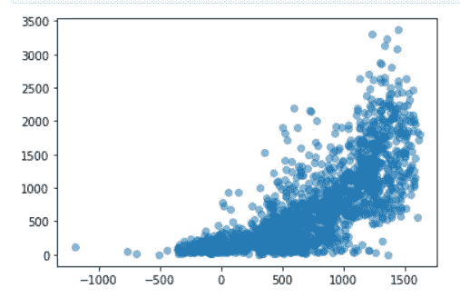

模型分数没有一点提高

```
lassoReg**.**score(X_test,y_test)0.5259229915556245
```

通过在 alpha 为 0.05 时应用脊

```
ridgeReg **=** Ridge(alpha**=**0.05, normalize**=True**)

ridgeReg**.**fit(X_train,y_train)

pred **=** ridgeReg**.**predict(X_test) print("MAE: ", metrics**.**mean_absolute_error(y_test, pred))
print("MSE: ",metrics**.**mean_squared_error(y_test, pred))
print("RMSE: ", np**.**sqrt(metrics**.**mean_squared_error(y_test, pred)))
print("R^2: {}"**.**format(model**.**score(X_test, y_test)))MAE:  323.3309122601071
MSE:  182862.18183393966
RMSE:  427.62387893327434
R^2: 0.5343183750523306
```

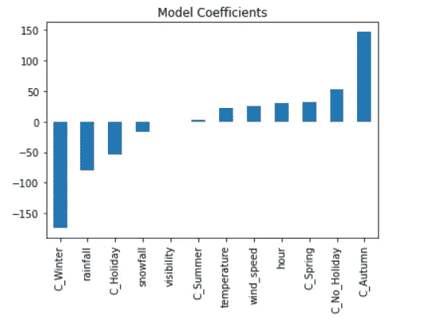

阿尔法值为 0.5

```
ridgeReg **=** Ridge(alpha**=**0.5, normalize**=True**)

ridgeReg**.**fit(X_train,y_train)

pred **=** ridgeReg**.**predict(X_test)print("RMSE: ", np**.**sqrt(metrics**.**mean_squared_error(y_test, pred)))
print("MSE: ",metrics**.**mean_squared_error(y_test, pred))RMSE:  442.2031481156279
MSE:  195543.624203372
```

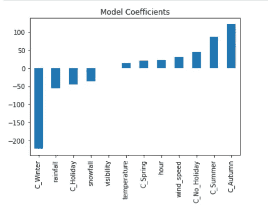

阿尔法在 5

```
ridgeReg **=** Ridge(alpha**=**5, normalize**=True**)

ridgeReg**.**fit(X_train,y_train)

pred **=** ridgeReg**.**predict(X_test)print("RMSE: ", np**.**sqrt(metrics**.**mean_squared_error(y_test, pred)))
print("MSE: ",metrics**.**mean_squared_error(y_test, pred))RMSE:  545.559063745746
MSE:  297634.692035135
```

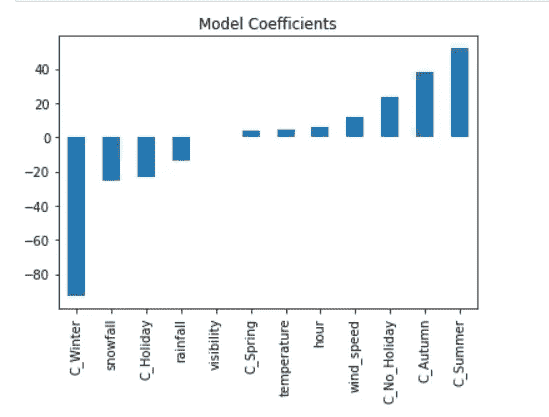

**套索**:

**Pro** :非常适合修剪特征和集中解释几个关键特征

**弊**:丢弃实际有用的功能的风险

**山脊**:

**Pro** :非常适合平滑处理多重共线性，在处理稀疏要素时非常好

**缺点**:永远不会完全放弃功能

将模型保存为 pickle 文件，以便我们可以使用它进行部署。

```
*# saving the model* 
**import** pickle 
pickle_out **=** open("rf_model", mode **=** "wb") 
pickle**.**dump(rf_model, pickle_out) 
pickle_out**.**close()
```

# 4)部署

Streamlit 有非常详细的文档，可以在[这里](https://docs.streamlit.io/streamlit-cloud/get-started/deploy-an-app)找到。让我们从文件夹结构开始。

**文件夹结构**

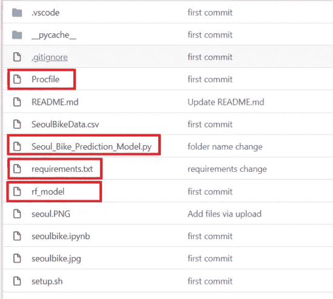

确保您选择了您喜欢的应用程序名称。你可以从下面的截图中看到你的应用程序的网址是什么样子的。

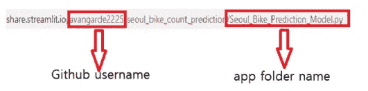

为 Python 依赖关系添加一个[需求文件](https://docs.streamlit.io/streamlit-cloud/get-started/deploy-an-app/app-dependencies#add-python-dependencies)。您可以使用下面的命令将**环境的当前**包列表添加到需求中。

> pip 冻结>要求。文本文件（textfile）

Procfile 用于首先执行 **setup.sh** ，然后调用 streamlit run 运行应用程序。

而 rf_model 是’。包含我们的模型的“pkl”文件。

**但是如何部署呢？**

去[https://share.streamlit.io/](https://share.streamlit.io/)用你的 GitHub 账户注册。我说过你的代码必须托管在 Github 仓库里吗？请告知！

从下面的截图可以看出，你必须用你的 GitHub 和你的主帐户登录，才能继续部署。


点击**新应用**，然后点击**从现有回购**

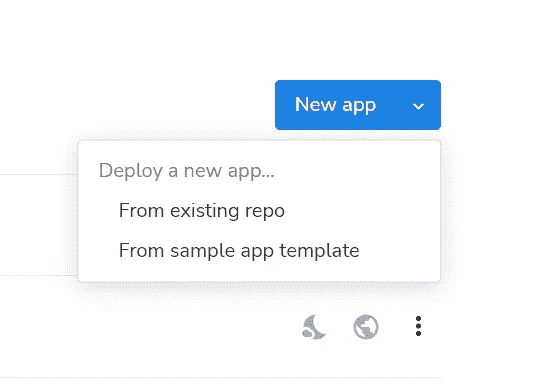

然后进入**库扩展**，点击**部署**。你可以走了！


**定价呢？**

如你所见，这太棒了！与 Heroku 不同的是，在社区计划中，您可以自由使用该服务，次数不限。

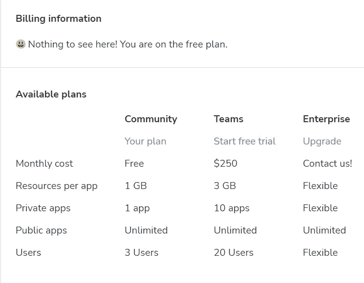

感谢您在机器学习的探索之旅中支持我！请提供任何可能帮助我提高写作水平的反馈，最重要的是我的项目方法！

[](/mlearning-ai/mlearning-ai-submission-suggestions-b51e2b130bfb) [## Mlearning.ai 提交建议

### 如何成为 Mlearning.ai 上的作家

medium.com](/mlearning-ai/mlearning-ai-submission-suggestions-b51e2b130bfb)