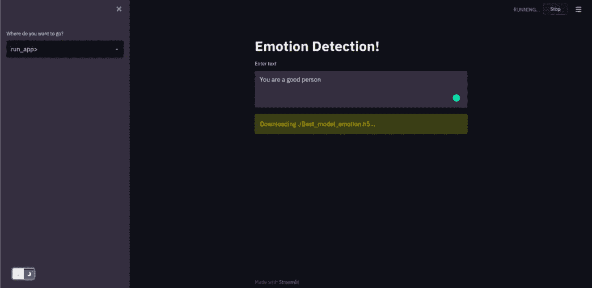
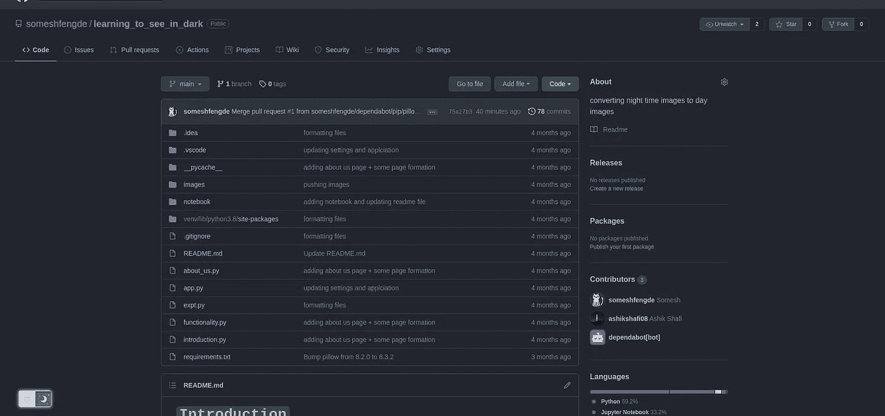
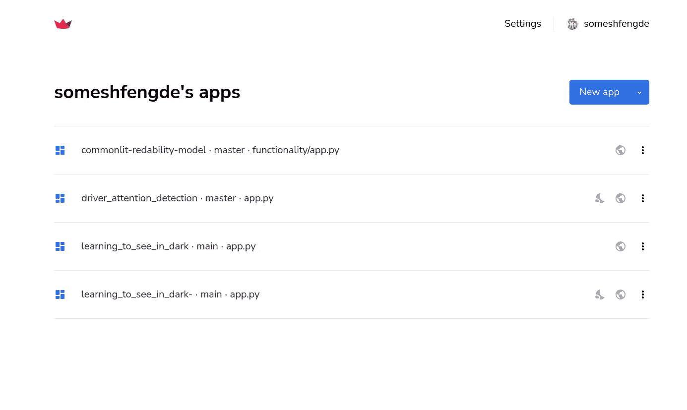
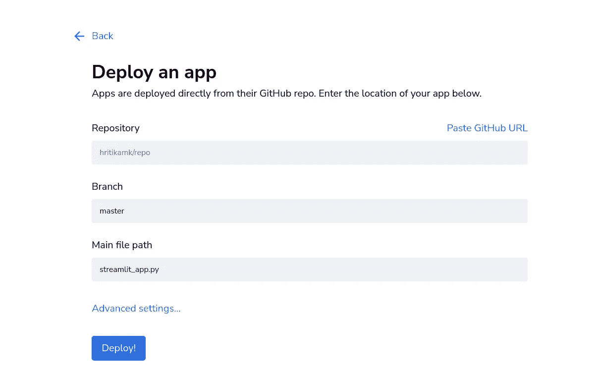
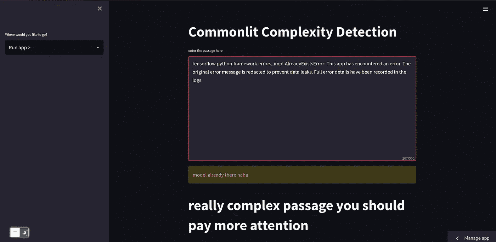

# 在 web 上部署您的 ML 模型，共享它们，制作令人惊叹的 web 界面第 3 部分

> 原文：<https://medium.com/mlearning-ai/deploying-your-ml-models-on-the-web-sharing-them-and-making-the-awesome-web-interface-part-3-edeff49179bc?source=collection_archive---------6----------------------->

对于以前的部署，请参考第 1 部分的链接

 [## 在 web 上部署您的 ML 模型，共享它们，制作令人惊叹的 web 界面第 1 部分

### 在对某个问题建立了机器学习模型后，你可能想与其他朋友分享，让他们看看…

medium.com](/mlearning-ai/deploying-your-ml-models-on-the-web-sharing-them-and-making-the-awesome-web-interface-part-1-1b70c6579d71) 

第 2 部分的链接，

 [## 在 web 上部署您的 ML 模型，共享它们，制作令人惊叹的 web 界面第 2 部分

### 在前面的部分，我们已经设计了 app.py 我们的主界面，在这一部分，我们将重点放在…

medium.com](/mlearning-ai/deploying-your-ml-models-on-the-web-sharing-them-and-making-the-awesome-web-interface-part-2-1db472b1ca0b) 

如果你已经完成了上面部分的教程，你应该在你的机器上有一个工作演示，如果你运行这个演示，你应该会看到这个屏幕。

在下一篇博客中，我们将讨论如何在 Streamlight 云平台上部署它。https://share.streamlit.io/

这里我假设你把所有的文件都存储在你的 Github 中，并且你的 GitHub repo 是公开的

打开 https://share.streamlit.io 后，您应该会看到类似于下面的窗口

打开 Streamlit 网站后，你必须点击新的应用程序

点击新应用程序后，您必须从下面显示的回购中选择您的 GitHub 回购

进入此窗口后，您必须输入存储库的回购公共 URL，并选择 branch 作为主文件，对于主文件路径，您需要键入 app.py，之后，您只需单击 deploy 按钮，应用程序将在我们的云机器的帮助下部署到 web 上。

大约 5 到 10 分钟后，您将获得带有 URL 的应用程序，您可以与朋友分享。这是我的另一个已经部署在 Streamlit 上的应用程序的截图。

> **我尝试部署上一部分中的模型，但由于模型的大小约为 3 GB，因此需要相当长的时间来进行预测和运行，这也是我进一步提及我以前的一个项目的原因

# 我在 Streamlit 上部署的一些项目的链接

[https://share . streamlit . io/someshfengde/learning _ to _ see _ in _ dark/main/app . py](https://share.streamlit.io/someshfengde/learning_to_see_in_dark/main/app.py)

Github 链接

 [## GitHub-someshfengde/learning _ to _ see _ in _ dark:将夜间图像转换为白天图像

### 将夜间图像转换为白天图像。我们已经在 streamlit 上部署了该应用程序，该应用程序旨在学习…

github.com](https://github.com/someshfengde/learning_to_see_in_dark) 

分析段落复杂性的另一种实现

[https://share . streamlit . io/someshfengde/common lit-red ability-model/functionality/app . py](https://share.streamlit.io/someshfengde/commonlit-redability-model/functionality/app.py)

> *感谢阅读我的博客:)关注更多，在评论中向我问好，这鼓励我写更多的博客:)祝你有美好的一天:)*

 [## Mlearning.ai 提交建议

### 如何成为 Mlearning.ai 上的作家

medium.com](/mlearning-ai/mlearning-ai-submission-suggestions-b51e2b130bfb)