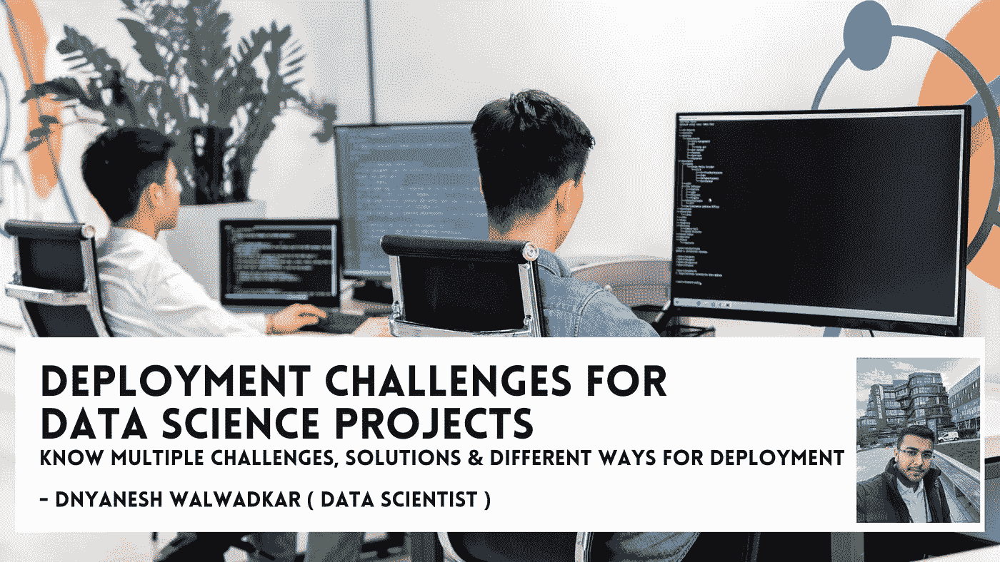
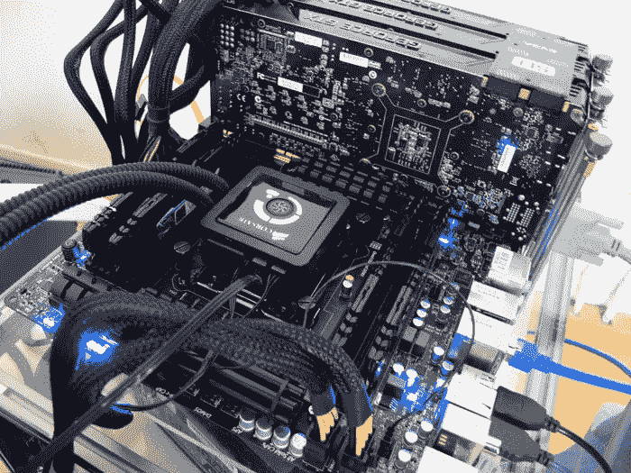
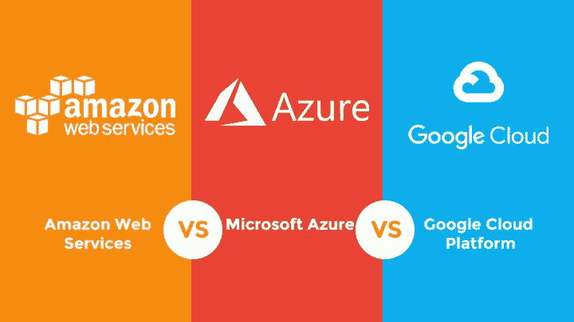
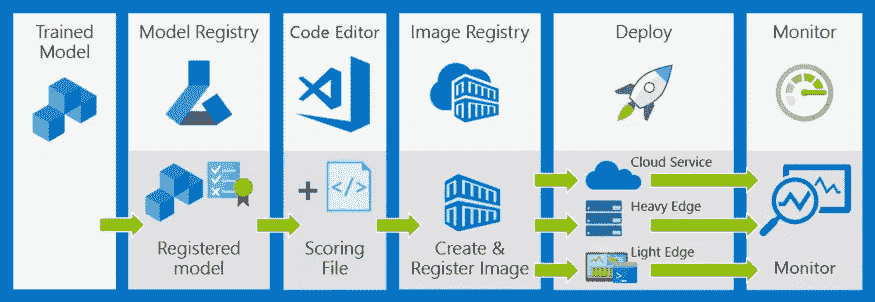

# 数据科学项目的部署挑战

> 原文：<https://medium.com/mlearning-ai/deployment-challenges-for-data-science-projects-9eb8b3bd8365?source=collection_archive---------4----------------------->

## 了解多种挑战、解决方案和不同的部署方式。

D 数据科学工作流是开发预测分析解决方案和智能应用的敏捷迭代方法。学习和协作通过它得到了改善。最佳实践和结构的应用促进了数据科学计划。

一个公司的分析程序必须完全实现，以收获其所有的好处。作为生命周期的一部分，项目通常会经历以下阶段，这些阶段通常会反复出现:

*   发展业务理解
*   数据的获取和理解
*   开发模型
*   部署流程
*   顾客对产品的接受和消费

机器学习(ML)模型的大规模部署是希望利用人工智能创造价值的公司面临的主要挑战之一，随着模型变得更加复杂，这只会变得更加困难。

根据我作为一名数据科学家的经验，ML 项目并不经常投入生产。部署可能是 AI 项目失败的原因之一。为了降低部署模型时的失败风险，决策者完全理解部署如何工作是至关重要的。

> *术语“部署模型”指的是可以在生产环境中输入和输出的任何代码单元。*

根据我的经验，数据科学家通常会将他们的数据模型交给工程人员来实现。在一些公司中，数据科学家可以自由地专注于创建更好的模型，而开发运维团队可以使用他们了解的工具更有效地管理部署。这些是一些最常见的数据科学问题出现时的步骤。

# 为什么知道部署对数据科学家或机器学习工程师很重要？

**使用任何库和任何模型&算法的灵活性给人一种创新自由的感觉。部署需要过程知识，以使您能够在任何阶段处理任何问题，而不影响创新或模型开发的质量。**

使用 Pandas、scikit-learn 和 Matplotlib 等库可以很容易地探索 Python 中的简单机器学习(ML)算法。这些模型在现实世界中没有用，除非它们在互联网上被共享和访问，这样它们就可以被用来进行预测。因此，机器学习只能以这种方式为社会带来好处。

**当一个模型被部署到 web 应用程序或 Android 应用程序时，它为用户提供了好处。如果你知道数据科学而不知道部署策略，你就像一个知道如何准备食物但不知道如何吃的人。**

## 挑战

几个独特的功能使得机器学习很难大规模部署。通过了解数据科学家面临的不同挑战，您将能够更好地解决和分析这些挑战。以下是任何新数据科学家面临的一些问题:

## ***数据科学语言管理***

众所周知，机器学习应用程序通常由用不同编程语言编写的元素组成。这两者并不总能很好地协同工作。r，Python，和另一种语言都在一个 ML 管道中使用过，我见过很多次。

一般来说，Python 和 R 是机器学习应用最流行的语言，但生产模型出于速度和其他原因很少使用这些语言。将 Python 或 R 模型移植到 C++或 Java 之类的生产语言是一项挑战，并且原始模型的性能可能会降低(速度、准确性等。).

当软件的新版本发布时，R 包有可能崩溃)。此外，R 很慢，不会高效地处理大数据。

这种语言是原型开发的理想语言，允许简单的交互和问题解决，但是生产需要 Python、C++或 Java。

通过使用容器化技术，如 Docker，有可能解决大量工具带来的不兼容性和可移植性挑战。自动依赖检查、错误检查、测试或构建工具无法克服语言障碍。

再现性也是一个挑战。数据科学家使用不同的编程语言、库或同一库的不同版本来构建不同版本的模型并不罕见。**手动跟踪这些依赖关系是很困难的。**需要一个 ML 生命周期工具来管理这些挑战，通过在培训阶段自动跟踪和记录这些依赖关系作为代码配置，并随后与经过培训的模型捆绑在一起作为随时可部署的工件。

如果您希望您的数据科学团队在 API 背后部署模型，以便它们可以在任何地方集成，最好使用可以在语言之间翻译代码的工具或平台。

## ***计算机和 GPU 的力量***

训练和推断神经网络需要大量的计算能力，因为它们通常非常深入。问题是，对于许多用户来说，我们通常希望我们的算法很快，这可能是一个挑战。

今天，许多生产 ML 算法都是基于 GPU 的。然而，如果没有它们，很难扩大机器学习的规模，因为它们稀缺而昂贵。

src : guru3d.com

## **便携性。**

有趣的是，模型部署是不可移植的。根据我的经验，传统的分析系统经常会有这个问题。如果一个组件不能轻松地迁移到另一个主机环境，组织就有可能被锁定在一个特定的平台上。因此，数据科学家在创建和部署模型时可能会遇到障碍。

## **可扩展性。**

在许多人工智能项目中，可伸缩性是一个主要问题。为了确保您的模型在生产中的健壮性和可伸缩性，您需要确保它们能够处理性能和应用程序需求的增长。在项目开始时，我们的初始数据通常是相对静态的和可管理的。当一个模型从开发阶段转移到生产阶段时，它可能会暴露于更大的数据量和不同的数据传输模式。当性能和可伸缩性挑战出现时，您的团队需要使用几种工具来监控和解决它们。

**我相信，使用一致的基于微服务的生产分析方法将解决可扩展性问题。**一个简单的配置更改应该允许团队轻松地将模型从批处理迁移到按需迁移到流。为了支持更复杂的工作负载，团队应该能够扩展他们的计算和内存空间。

## ***机器学习计算在尖刺中工作***

当你的算法被训练时，它们并不总是被使用——它们只在需要的时候被调用。

在上午 8:00，您可能只支持 100 个 API 调用，但是在上午 8:30，您可能支持 10.000 个。

**根据我的经验，在避免不必要开支的同时，扩大和缩小规模是一项挑战。**

因此，只有一小部分数据科学项目真正转化为生产系统。

## 强有力的运作

每次我们做模型的时候，我们都要花很多时间来准备。当一个模型是健壮的时，它是以这样一种方式被开发的，即它实际上可以服务于所讨论的用户数量，这通常需要相当大的努力。

在许多情况下，有必要用与现有架构兼容的语言重新编码整个模型。仅这一点就经常阻碍部署过程，导致数月的延迟。除了前面讨论的所有库问题之外，一旦完成，它还必须集成到公司的 it 架构中。更糟糕的是，通常很难访问生产中的数据，这通常是因为技术和/或组织数据孤岛。

## 自动化机器学习的平台

自动化机器学习平台可能对你们中的一些人来说很熟悉。用这种方法可以更快地制作模型。此外，该平台支持开发和比较多个模型，因此企业可以选择具有最佳预测准确性、延迟和计算能力的模型。

> *在企业中，90%的 ML 模型都可以自动开发。自动化之外的小部分模型可以由数据科学家和业务人员一起开发。*

模型随时间漂移(性能下降)是很常见的。因此，有必要监控部署的模型。每个部署的模型都应该记录所有的输入、输出和异常。模型性能的日志存储和可视化是模型部署平台的基本特性。通过密切关注机器学习模型的性能，可以有效地管理它的生命周期。

## 这里有一个在同一个预测端点上托管多个模型的详细指南，这是一个降低部署风险的好方法。

## 分析和验证模型

在您的数据科学沙盒中仔细训练和评估模型后，检查模型是否能在您的生产环境中正常工作是非常重要的。诸如此类的任务通常包含在此流程中:

*   建立一个监控系统来存储和可视化模型度量，
*   制作捆绑模型并运行技术测试的 web 应用(模型运行速度快吗？它需要多少内存？等等。)以及预测测试(我的模型还能像它应该的那样预测吗？)
*   端到端测试模型，并将其与您的业务应用程序集成
*   通过在生产中使用蓝绿色部署或金丝雀测试(稍后将详细介绍)，您可以在生产中部署应用程序。
*   基于业务度量分析同一模型不同版本的有效性(称为 A/B 测试)。

## 有多种部署选项可供选择

## 标准程序的实施

部署模型的最简单方法是创建一个定制的 web 应用程序，该应用程序托管模型并接收预测请求。在测试中，发送 HTTP 请求，检查日志，并收集指标。

用 SageMaker 实现这一点要容易得多。可以将模型部署到 HTTPS 端点，并且可以使用 SageMaker SDK 中的 Estimator 对象(或内置算法、TensorFlow 等的子类)运行预测测试。).不需要写任何 app。此外，CloudWatch 默认包含技术指标。

## 阿姆松·萨格马克

从构思到生产 ML 模型通常是复杂且耗时的。训练模型需要管理大量数据、选择正确的算法、管理计算能力，然后部署模型。亚马逊 SageMaker 服务简化了构建和部署机器学习模型的过程。使用 SageMaker 的各种算法和框架，您可以在 Pb 级规模上训练您的模型，并在选择正确的算法和框架后将其部署到生产中。

## Azure 机器学习服务

作为 Azure 机器学习服务的一部分，工作区代表了一个中心位置，用于协作、管理对计算目标、数据存储、模型、docker 图像和 webservice 部署的访问，以及跟踪使用它运行的所有实验。使用 Python SDK，数据科学家可以创建工作空间和实验，并管理授权。

**要开始使用 Azure 机器学习，可以使用 Python。**可以创建多个工作区，并且可以与多人共享每个工作区。通过分配所有者、参与者、读者等角色来共享工作区。Azure 机器学习服务使数据科学家能够在建立满意的模型后轻松部署和监控训练好的模型。

# 作为结论

我们仍然处于机器学习的早期阶段。的确，硬件和软件组件都在不断发展，以满足机器学习的当前需求。

为了克服异构性和基础设施挑战，可以使用 Docker/Kubernetes 和微服务架构。利用现有工具自己解决一些问题是可能的。所有这些工具都需要整合在一起，才能在今天实现机器学习，我认为这是最大的挑战。

机器学习的实现现在和将来都很有挑战性，这是组织必须面对的现实。然而，数据科学家能够受益于几种新的架构和产品。此外，越来越多的公司在扩展其数据科学运营时，正在实施使模型部署更容易的工具。

 [## Mlearning.ai 提交建议

### 如何成为 Mlearning.ai 上的作家

medium.com](/mlearning-ai/mlearning-ai-submission-suggestions-b51e2b130bfb)