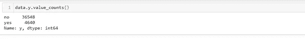
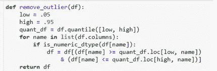

# 存款预测模型:不平衡学习的案例研究

> 原文：<https://medium.com/mlearning-ai/deposit-predictive-model-a-case-study-of-imbalanced-learning-3e408507c3ef?source=collection_archive---------3----------------------->

不平衡数据集建模

Photo by [Kevin Ku](https://unsplash.com/@ikukevk?utm_source=medium&utm_medium=referral) on [Unsplash](https://unsplash.com?utm_source=medium&utm_medium=referral)

用不平衡数据训练机器学习算法的主要问题之一是该算法将倾向于预测多数类。此外，通过总是选择多数，可以错误地假设算法已经正确地模拟了数据。在本文中，我将通过一个银行业问题的例子来分享一些处理此类数据的方法。

大多数企业的主要目标之一是在保持现有客户的同时寻找新客户。在竞争激烈的银行业，维护老客户可能有点困难，因为有很多可供选择的客户

在大多数银行中，投资和投资组合部门都希望确定哪些客户有可能认购他们的定期存款。因此，大多数营销经理对仔细调整他们的直接营销活动以严格选择联系人有了更高的兴趣；我们的目标是找到一个模型，可以预测哪些未来客户将订阅定期存款。拥有这样一个有效的预测模型有助于提高活动效率。这将有可能确定客户谁将订阅定期存款和直接营销的努力。

这种提高的效率将有助于管理银行资源，如人力、电话和时间。因此，该银行收集了大量的数据，包括必须订阅定期存款和没有订阅定期存款的客户资料。我们的目标是开发一个稳健的预测模型，帮助识别未来会或不会认购其定期存款的客户。获得了包含以下特征的数据。

# 数据描述

1 —年龄(数字)

2-作业:作业类型(分类:“管理。”、“蓝领”、“企业家”、“女佣”、“管理人员”、“退休人员”、“个体户”、“服务人员”、“学生”、“技术人员”、“失业人员”、“未知人员”)

3-婚姻:婚姻状况(分类:“离婚”、“已婚”、“单身”、“未知”)；注意:“离婚”是指离婚或丧偶)

4 —教育(分类):“基础. 4y”、“基础. 6y”、“基础. 9y”、“高”。学校的”，“文盲的”，“专业的”。课程'，'大学。程度'，'未知')

5 —违约:有信用违约？(分类:“否”、“是”、“未知”)

6 —住房:有住房贷款？(分类:“否”、“是”、“未知”)

7 —贷款:有个人贷款？(分类:“否”、“是”、“未知”)#与当前活动的最后一个联系人相关:

8-联系人:联系人通信类型(分类:“手机”、“电话”)

9-月:一年中的最后一个联系月(分类:“一月”、“二月”、“三月”、“十一月”、“十二月”)

10-星期几:一周的最后一个联系日(分类:“星期一”、“星期二”、“星期三”、“星期四”、“Fri”)

11-持续时间:最后一次联系的持续时间，以秒为单位(数字)。重要注意事项:该属性对输出目标有很大影响(例如，如果 duration=0，则 y='no ')。然而，在执行呼叫之前，持续时间是未知的。同样，结束呼叫后‘y’显然是已知的。因此，该输入应仅用于基准测试目的，如果目的是获得现实的预测模型，则应丢弃。

**其他属性**

12-活动:在此活动期间为此客户执行的联系次数(数字，包括最后一次联系)

13-pdays:从上一个活动中最后一次联系客户后经过的天数(数字；999 表示之前没有联系过客户)

14-previous:在此活动之前为此客户执行的联系次数(数字)

15-pout come:之前营销活动的结果(分类:“失败”、“不存在”、“成功”)

**社会经济背景属性**

16 —电磁脉冲。var.rate:雇佣变动率-季度指标(数字)

17 — cons.price.idx:消费者价格指数—月度指标(数字)

18 — cons.conf.idx:消费者信心指数—月度指标(数字)

19 — euribor3m: Euribor 3 个月利率—每日指标(数字)

20 — nr。就业人数:雇员人数——季度指标(数字)

**输出变量(期望目标):**

21 — y —客户是否订阅了定期存款？(二进制:“是”，“否”)

# **预处理**

由于数据中分类特征的数量以及数据的不平衡性质，预处理的某些阶段对于获得良好的模型是必不可少的。

对 y 列中不同值的快速计数显示出不均匀的分布。

y_value_counts

通过用一个热编码器处理分类列来预处理数据。使用如下所示的四分位值移除异常值。

Outlier function

MinMaxScaler 用于缩放数据，使 PCA 算法能够有效地分解数据。

然后使用 PCA 分析来降低数据的高维度，这样做是为了使算法能够适当地拟合模型。PCA 分析的代码可以在 [repo](https://github.com/instabaines/Deposit_Predictive_Model) 库中找到。分解后保留了约 95%的方差。

PCA ANALYSIS

# **建模和性能评估**

> 如前所述，数据是一个不平衡的数据。这个问题可以通过过采样或欠采样使用 imblearning 库来解决。在这方面有两种算法值得一提:SMOTE 和 TomekLinks 算法。

**Tomek 链接**

Tomek 链接算法从具有 Tomek 链接的多数类中移除数据。tomek 链接被定义为彼此最近邻的不同类别的数据。这是一种欠采样技术。

**重击**

合成少数过采样技术(SMOTE)通过用直线完全连接少数类中的所有点来为少数类生成新点。然后，对于每个现有的数据点，SMOTE 确定这些互连上的一个点，以基于有多少最近的邻居被考虑用于合成来制作新点。这是一种过采样技术。

在这项研究中，SMOTE 算法产生了更好的性能。这是可以预料的，因为欠采样往往会丢失一些重要的信息。

采用的机器学习算法有 LogisticRegression、MLPClassifier、XGBoost。特别有用的模型是这种性质的分类问题。K-fold 和分层 K-fold 用于分割数据以提高性能。

但是，使用其中任何一种方法时，性能都没有显著差异。这可以归因于 SMOTE 算法对数据执行的操作。RandomizedSearchCV 和 GridSearchCV 分别用于调整 MLPClassifier 和 Logistic 回归的超参数。

使用 f1 分数来估计算法的性能。它考虑了精确度和召回。在不平衡的二进制分类数据上，它可以是比准确度更好的度量。

算法的精度给出如下。

F1 score for the algorithm

XGBoost 算法的 F1 值最高

这个项目的代码和数据可以在[这里](https://github.com/instabaines/Deposit_Predictive_Model)找到。