# 描述性统计:集中趋势、变化和位置的测量

> 原文：<https://medium.com/mlearning-ai/descriptive-statistics-measure-of-central-tendency-variation-and-position-fc4681a54f7c?source=collection_archive---------2----------------------->

## 描述性统计中的测量以及如何使用 Python 进行计算

Photo by Nataliya Vaitkevich from [Pexels](https://www.pexels.com/photo/gray-laptop-beside-white-printer-paper-8062289/)

# 介绍

数据是统计学的核心。我们收集的观察数据在使用前需要分析。当我们的数据非常大的时候，对数据进行汇总是很重要的。总结数据确实有助于我们从数据中分析和提取见解。

描述性统计非常关键，我们可以很容易地将数据总结成数字和图形。更确切地说，描述性统计是一种收集数据、处理数据(总结和呈现)、描述和分析所有数据的方法。描述性统计最关键的是以信息的形式交流数据，并支持对数据的推理。

在描述性统计中有 3 个关键的衡量标准。它是集中趋势的度量、变化的度量和位置的度量。在本文中，我们将深入研究它，并使用 Python 进行计算。

> 你可以在这里访问我们使用[的完整代码](https://github.com/dedee95/descriptive_statistics/blob/main/desciptive_statistics.ipynb)

# 集中趋势的度量

集中趋势的度量是一种值度量，可用于表示数据集的中心值。在统计学中，有三种方法来衡量集中趋势:均值(平均值)、中位数(中间值)和众数(经常出现的值)。

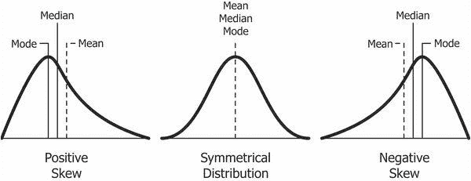

Source: [https://www.quora.com/What-does-SKEWED-DISTRIBUTION-mean](https://www.quora.com/What-does-SKEWED-DISTRIBUTION-mean)

## 平均

平均值是数据集中值的总和除以数据集中值的数量。一般来说，当我们谈到平均数时，我们指的是算术平均数。总体和样本的平均值以同样的方式计算。

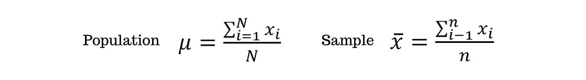

The formula for calculating the mean (Image by author)

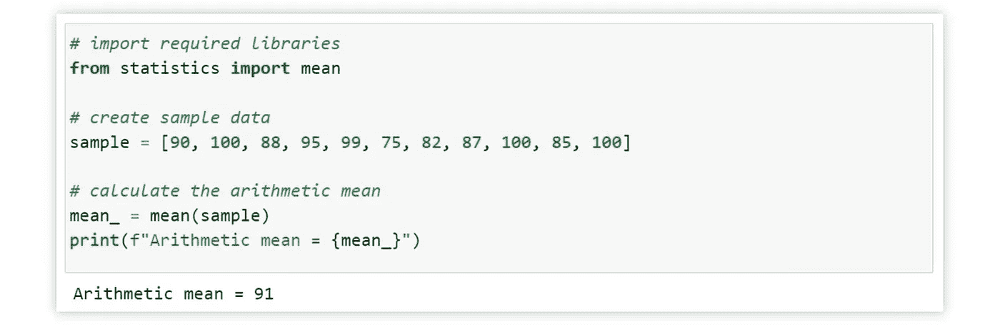

Calculating arithmetic mean using Python (Image by author).

此外，加权平均值是算术平均值的子集。在加权平均值中，我们假设每个值都有一定的权重，因此要计算加权平均值，我们必须先将该值乘以其各自的权重。

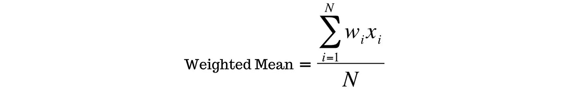

The formula for calculating the weighted mean (Image by author)

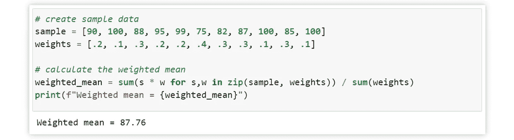

Calculating weighted mean using Python (Image by author).

然后，还有几何平均。几何平均值的计算方法是将数据集中的所有值相乘，然后用数据集中的和值的幂求根。

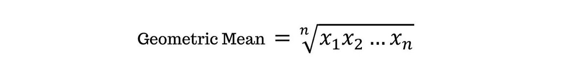

The formula for calculating the geometric mean (Image by author)

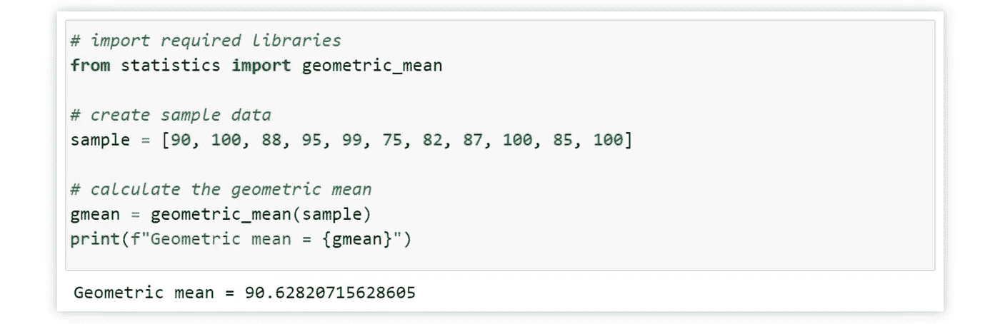

Calculating geometric mean using Python (Image by author).

此外，还有一个调和的意思。调和平均值的计算方法是将数据集中值的数量除以数据集中每个值的倒数。

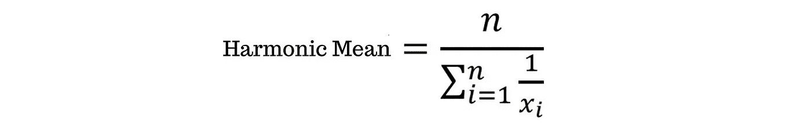

The formula for calculating the harmonic mean (Image by author)

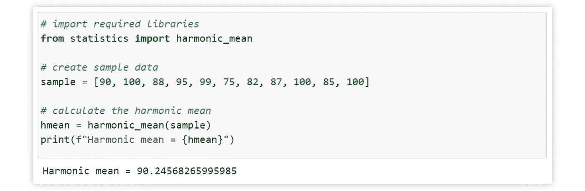

Calculating harmonic mean using Python (Image by author)

## 中位数

中位数是数据集的中间值。要找到中值，我们必须首先对数据集中的所有值进行排序(从最小值到最大值)，然后寻找数据集的中点或中间值。如果数据集的数值是偶数，则取两个中间值的平均值。

Middle value (Image by author)

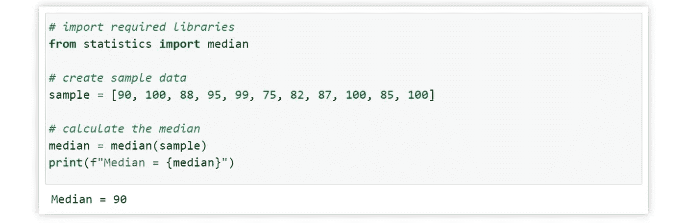

Calculating median using Python (Image by author)

## 方式

模式是数据集中经常出现的值。当一个值在数据集中出现的频率相同时，说明没有模式。同时，如果有两个值出现频率最高，则称为双峰。

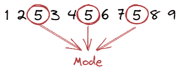

The value that appears frequently (Image by author)

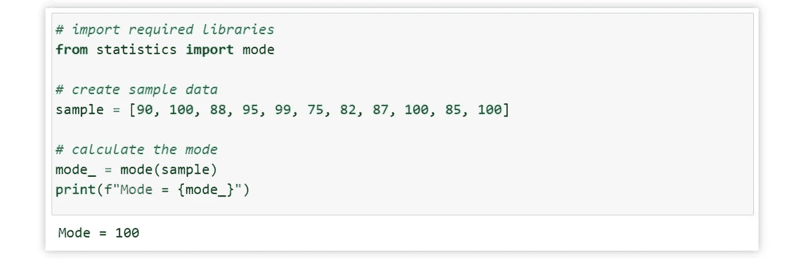

Calculating mode using Python (Image by author)

# 变化的度量

变异或离差的度量是可用于表示数据的多样性或分布的值的度量。通过这个度量，我们可以确定数据如何从最小的数据扩散到最大的数据，或者数据如何远离整体数据分布的中心。当变化量为零时，则表明数据中的总体值是一致的。

## 范围

该范围是数据集中最大值和最小值之间的差值。但是，该范围有一个缺点，因为它在测量过程中只包括两个值。

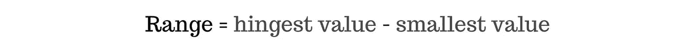

The formula for calculating the range (Image by author)

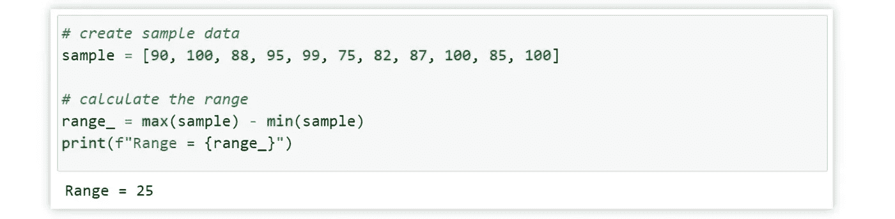

Calculating range using Python (Image by author)

## 四分位数间距(IQR)

四分位数间距或四分位数之间的范围是通过减去第三个四分位数(Q3)和第一个四分位数(Q1)的值计算的。IQR 不会受到极端值(异常值)的影响。

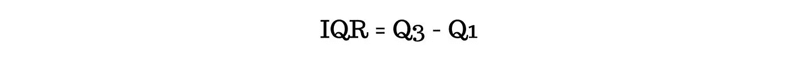

The formula for calculating interquartile range (Image by author)

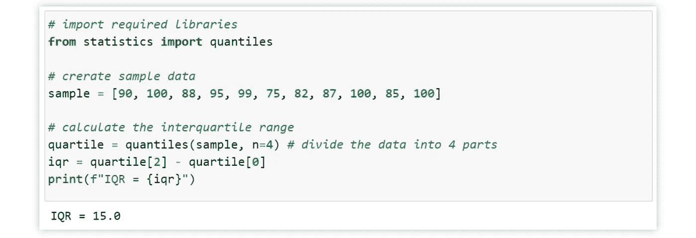

Calculating interquartile range using Python (Image by author)

## 差异

方差是衡量一组值围绕平均值分布的程度。方差的主要缺点是该值不再具有与数据集中的值相同的比例。但是，标准差可以解决这个缺点。

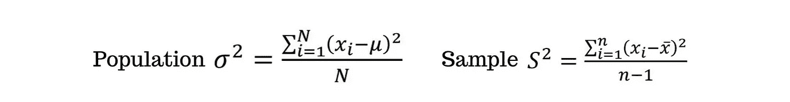

The formula for calculating variance (Image by author)

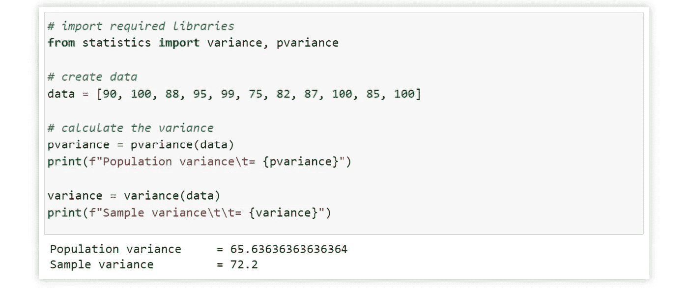

Calculating variance using Python (Image by author)

## 标准偏差

标准偏差是用于确定数据分布并查看数据与平均值的接近程度的值。标准差的作用是看每个数字与平均值的差，求差的平方，然后看差的平方的平均值。最后，求平方根。

The formula for calculating the standard deviation (Image by author)

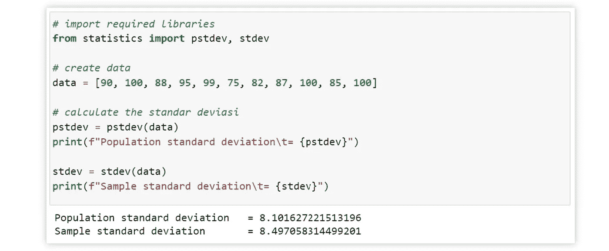

Calculating standard deviation using Python (Image by author)

当标准偏差较高时，数据更加偏离平均值。相比之下，如果标准偏差较小，数据分布将接近平均值。

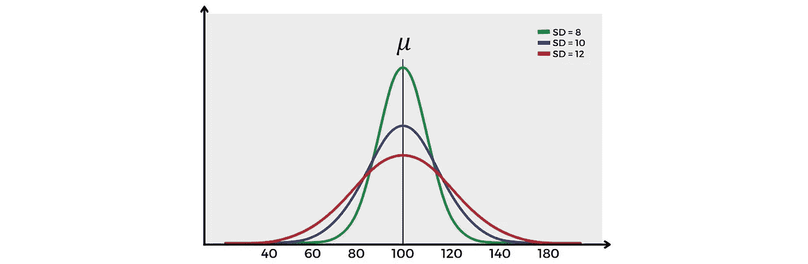

Standard deviation comparison in a normal distribution (Image by author)

此图说明了正态分布曲线的点如何随着标准偏差的增加而减小。相反，正态分布曲线的峰值点随着标准差的减小而增加。

# 位置的度量

位置度量是用于确定数据点相对于数据集的位置的度量。这种测量可以指示一个值是高、低还是平均。

## 四分位数

四分位数是将有序数据集分成四等份的值。有三个值被称为四分位数:Q1、Q1 和 Q3。第二个四分位数的值等于平均值。

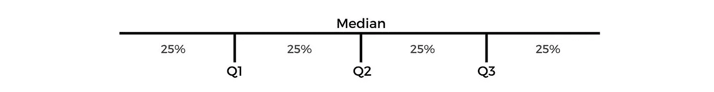

Quartile illustration (Image by author)

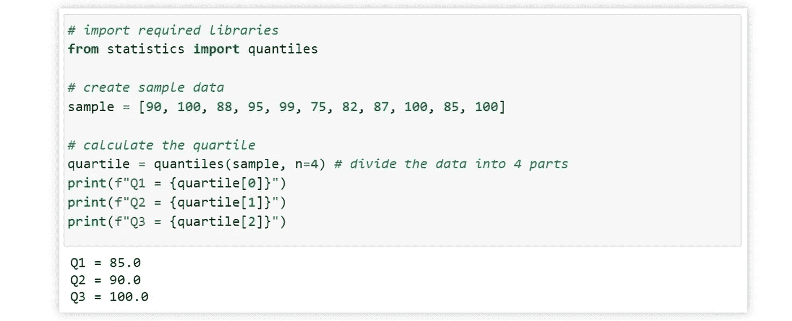

Calculating quartiles using Python (Image by author).

## 十分位数

十分位数是将有序数据集分成 10 等份的值。这些值被命名为第一个十分位数(D1)、第二个十分位数(D2)，依此类推，直到第九个十分位数(D9)。

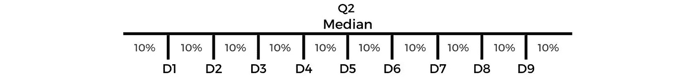

Decile illustration (Image by author).

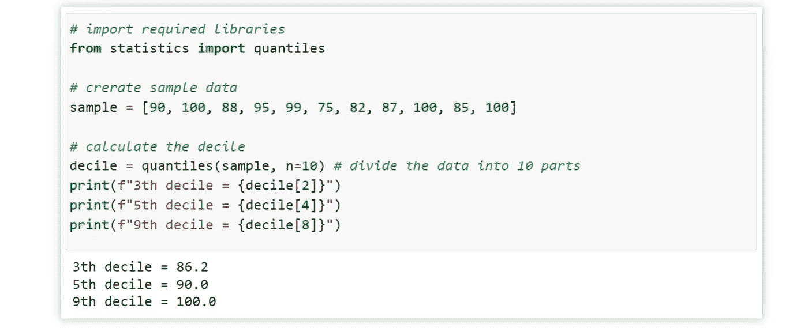

Calculating deciles using Python (Image by author).

## 百分位

百分点值是将有序数据集分成 100 个相等部分的值。有 99 个百分位值，从 P1、P2……和 P99 开始。百分点可用于检测异常值。当一个值小于第 5 百分位(P5)或大于第 95 百分位(P95)时，它可以被归类为异常值。

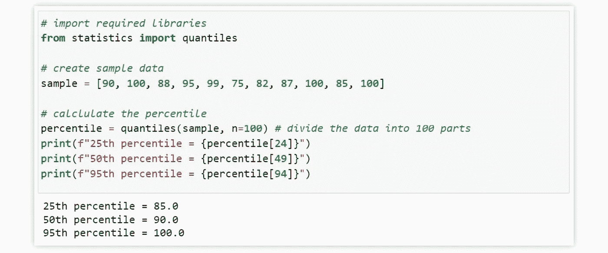

Calculating percentiles using Python (Image by author).

# 结论

描述性统计对汇总数据非常有用。当我们的数据非常大的时候，对其进行总结会让我们理解数据变得容易得多。中心趋势的计算对于确定数据集的中心或中点非常有用。然后，变化计算可用于确定数据集的分布和变化。而位置计算对于确定数据集的相对位置是有用的。

# 参考资料:

[1]t .尼尔德(2022 年)。*数据科学的基本数学:用基本的线性代数、概率和统计学控制你的数据*(第 1 版。).奥莱利媒体。

[2]统计—数理统计函数— Python 3.10.5 文档。Docs.python.org。(2022).检索于 2022 年 7 月 20 日，来自 https://docs.python.org/3/library/statistics.html.

 [## Mlearning.ai 提交建议

### 如何成为 Mlearning.ai 上的作家

medium.com](/mlearning-ai/mlearning-ai-submission-suggestions-b51e2b130bfb)