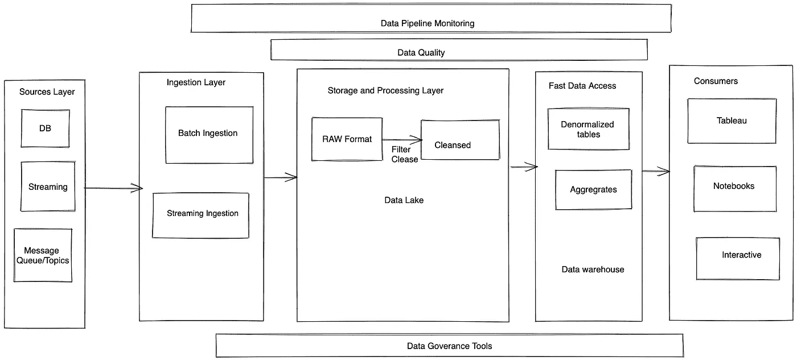
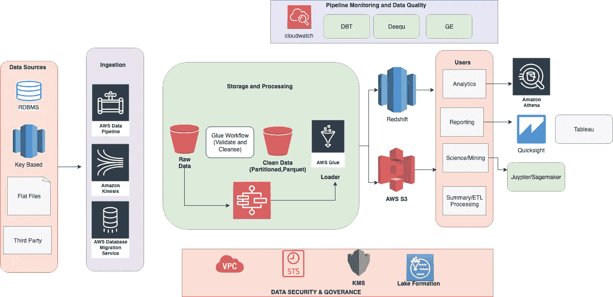

# 设计数据平台

> 原文：<https://medium.com/mlearning-ai/designing-a-data-platform-20426450158a?source=collection_archive---------2----------------------->

# 动机

数据平台设计不仅与 ETL 管道有关，还与其他组件有关，这些组件使数据分析之旅高效而健壮。本文的目的是提供一个完整数据平台中每个组件的介绍和范围。

以下是数据平台的 6 大支柱。

# 数据平台的支柱

1.  ELT 层
2.  数据发现层
3.  数据谱系
4.  数据质量
5.  自动化监控和警报
6.  数据治理(审计和访问控制)

# 设计数据平台的先决条件

## 1.识别源系统

存储交易数据并可供分析使用的源系统。

*   服务的事务关系数据库(MySQL、Postgres、SqlServer)
*   没有 SQL 数据库(AWS DynamoDB、MongoDB..)
*   对象存储(S3、Azure Blob 存储等)
*   消息队列(SQS，MSMQ..)
*   流媒体源(AWS Kinesis、Spark Streaming、Kafka)

## 2.确定利益相关者和数据访问模式

将从数据平台消费数据以获得数据洞察力的利益相关者。

*   高管—提供高级摘要的领导仪表板
*   产品所有者—用于发现新的业务机会
*   数据科学—训练 ML 模型和运行 A/B 测试..
*   SWE —对数据仓库数据的编程访问
*   数据工程师/BIE —构建数据集市和 BI 报告

利益相关者的访问模式可能大不相同，数据平台需要设计为在不影响性能的情况下处理利益相关者的不同访问模式。

## 常见的数据访问模式

*   批量数据加载—从 ETL 工具进行数据访问
*   交互式分析—使用查询工具和 IDE 进行访问(即席 SQL 查询)
*   数据科学—使用 Python ML 库进行数据访问
*   报告—通过 Tableau、Quicksight 等报告工具进行数据访问..

# 设计数据平台

以下是数据平台的高级概述。

High Level Overview of Data Platform

## 1.ELT —提取负载和转换

从源系统中提取数据并以本机格式加载到数据湖，然后对其进行清理、转换并加载到将用于数据分析的新层中。以下是数据湖图层的属性

*   读取模式
*   压缩存储(gzip、snappy 等)—根据文件格式决定
*   存储文件格式(拼花、Avro、CSV、TSV、JSON)

## 2.数据发现

数据发现层将使消费者能够发现平台中可用的数据。

*   表和列详细信息
*   列描述
*   分区密钥信息
*   数据集所有者
*   访问详细信息(谁可以访问数据)

AWS Glue Catalog、Hive Catalog 是支持数据发现的服务。

## 3.数据谱系

数据沿袭层提供了跟踪数据集的上游和下游依赖关系的能力。在典型的 DW 环境中，数据在转换后从 0 级加载到 N 级。跟踪沿袭对于解决数据质量问题和确定影响至关重要。

## 4.管道监控和警报

数据准确性和满足 SLA 对于任何数据分析系统来说都是满足终端用户需求的关键。DW 管线**确实因瞬时原因而失效**。为了有效管理数据平台，需要自动监控和警报。

*   自动重试(有间隔和回退限制)
*   针对手动操作(电子邮件或票证)的警报

## 5.数据质量

数据质量是整个平台的关键组成部分。每个数据集都应该检查以下属性

*   完全
*   精确的
*   及时
*   一致的

数据质量检查可以基于 p **ast 趋势或纯粹基于统计来创建。**

工具:Deequ，远大前程和 DBT

## 6.数据治理(审计和隐私)

数据治理确保跟踪数据使用情况，并确保正确的人能够访问正确的数据集。

最近，GDPR、CCPA 等法律合规性法律变得越来越重要，设计能够在最细粒度级别(表中的记录级别)提取和删除数据的数据平台至关重要

访问控制系统将确保基于细粒度的数据访问控制。ie(表、列或分区级别的访问策略)

数据湖上的积垢:冰山、阿帕奇胡迪、三角洲湖

# 摘要

综上所述，下面是使用 AWS 技术的设计示例。

每项服务都可以用开源或其他云平台服务替代。

 [## Mlearning.ai 提交建议

### 如何成为 Mlearning.ai 上的作家

medium.com](/mlearning-ai/mlearning-ai-submission-suggestions-b51e2b130bfb)