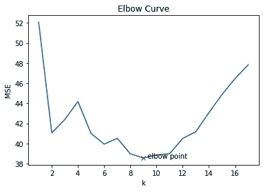

# 利用波士顿住房数据设计预测房价的最优 KNN 回归模型

> 原文：<https://medium.com/mlearning-ai/designing-a-optimal-knn-regression-model-for-predicting-house-price-with-boston-housing-dataset-faef377536e3?source=collection_archive---------0----------------------->


亲爱的读者们好，在本文中，我展示了使用 K 近邻算法(KNN)预测波士顿房价的回归模型的 Python 代码。该代码还包含一个从肘曲线估计 k 的最佳值的函数。该代码是从零开始开发的，仅使用欧几里德距离度量，并且每个邻域中的所有点被同等加权。

(请注意，本文并不介绍和描述 KNN 算法及其概念。请参考 medium.com 上其他帖子的相关文章。)

**波士顿住房数据集**来自美国人口普查局收集的关于马萨诸塞州[波士顿](http://www.cs.toronto.edu/~delve/data/boston/bostonDetail.html)地区住房的信息。有 506 个观察值，有 13 个特征(独立变量)，如房间数量(rm)、犯罪率(crim)、空气污染变量(nox)、每个社区的公共服务成本(税收)、学生教师比率(ptratio)等。因变量/目标变量是以千美元为单位的房价。

**问题陈述**:给定一组描述波士顿房子的特征，设计一个最优 KNN 回归模型，该模型可以预测任何给定房子的房价。

**代码放在这里**:

在本节中，将加载所需的库并导入数据集。

```
# built in datasets and other required functions are imported from 
# sklearn 
from sklearn import datasets
from sklearn.model_selection import train_test_split
import numpy as np
from sklearn.metrics import mean_squared_error
import matplotlib.pyplot as plt
import math#Loading the Boston dataset
boston=datasets.load_boston()
x=boston.data[:,:]
y=boston.target
print(x.shape,y.shape)tsize=0.30 #30% of total data is used for testing and 70% used for training## splitting the dataset into training and testing sets,
# (parameter random state is fixed at some integer, to ensure the 
# same train and test sets across various runs)
xtrain,xtest,ytrain,ytest=train_test_split(x,y,test_size=tsize,random_state=102)
```

这里给出了探索数据集特征和查看少量观察值(记录)的代码。

```
## Exploring the dataset characteristics and having glimpse of data
# printing the sizes of training and testing data sets
print(xtrain.shape,ytrain.shape)
print(xtest.shape,ytest.shape)# Print the information contained within the dataset
print("\nKeys of iris_dataset: \n{}".format(boston.keys()))
print(boston['DESCR'][:500] + "\n...")#Print the feature names
print("\nFeature names: \n{}".format(boston['feature_names']))
#Printing the  Few Rows
print("\nFirst five rows of data:\n{}".format(boston['data'][:5]))
#Print the class values few datapoints
print("\nTarget:\n{}".format(boston['target'][:5]))
#Print the dimensions of data
print("\nShape of data: {}".format(boston['data'].shape))
```

接下来给出用于预测给定房屋的房价的函数(特征向量 tx)。

```
##function to find Euclidean distance
def edist(v1,v2):
    return np.sqrt(np.sum((v1-v2)**2))##function to predict values using knn for given test data tx
def knn_reg(tr_x, tr_y, tx , k):

    distances = []

    #Find distances between new data and all the training data
    for i in range(tr_x.shape[0]):
        distances.append(edist(tr_x[i], tx))

    #sort the distances in ascending order
    distances = np.array(distances)
    inds = np.argsort(distances)

    distances = distances[inds]
    tr_y_sorted = tr_y[inds] #sorted values of target variable

    #predicted value is the average of first k values of target
    #vector
    value = np.average(tr_y_sorted[:k])
    return value
```

下面给出了对于给定的 k 值求均方误差(MSE)的函数。

```
##Function to find mean squared error for the entire test dataset
def knn_mse(tr_x , tr_y, test_x , test_y , k):
    preds = []
    for i in range(test_x.shape[0]):
        value = knn_reg(tr_x, tr_y, test_x[i] , k)
        preds.append(value)

    preds  = np.array(preds)
    err = mean_squared_error(test_y , preds)
    return err
```

上述函数用于计算不同 k 值的均方误差(MSEs ),如下所示。

```
##Finding MSEs for different values of k 
maxk=int(math.sqrt(xtrain.shape[0])) #maximum value of k 
mse_val = [] #to store rmse values for different k
for k in range(1,maxk):
    error= knn_mse(xtrain , ytrain , xtest , ytest ,k)
    mse_val.append(error) #store rmse values
    print('MSE value for k= ' , k , 'is:', error)
```

还绘制了肘曲线，并使用 find_elbow()函数自动找到 k 的最佳值。请注意，在所有情况下选择最小 MSE 点是不够的，因此代码确保选择一个弯头点而不是最小值。参见下面的代码。

```
##plotting the elbow curve 
k=np.arange(1,maxk)
xl="k"
yl="MSE"
plt.xlabel(xl) 
plt.ylabel(yl)
plt.title("Elbow Curve")
plt.plot(k,mse_val)##finding the k for the elbow point 
ke=find_elbow()
print("Best Value of k using elbow curve is ",ke)
plt.plot(ke,mse_val[ke-1],'rx')
plt.annotate("  elbow point", (ke,mse_val[ke-1]))
```

现在观察下图中肘点的 k 值，并检查它是否与 find_elbow()函数找到的值相同。这里通过使用两种方法得到 9。我得到了以下输出:

*使用弯头曲线的最佳 k 值为 9*



在上图中，使用红色十字(x)显示弯头点。

现在这个模型已经准备好了最优 k 和它的时间来预测给定房屋的价格。下面给出了相同的代码。

```
## Now model is ready to predict the cost for new house with given features in xnew vector and ke as kxnew=np.array([2.7310e-02, 0.0000e+00, 7.0700e+00, 0.0000e+00, \ 4.6900e-01, 6.4210e+00, 7.8900e+01, 4.9671e+00, 2.0000e+00, \ 2.4200e+02, 1.7800e+01, 3.9690e+02 ,9.1400e+00])
hcost=knn_reg(xtrain, ytrain, xnew , ke)print("Predicted price of the given house is {:.2f}".format(hcost),\ "thousand dollars")
```

我在这里得到的输出是:

*给定房屋的预测价格为 24.00 万美元*

总之，从头开始编码(而不是使用机器学习算法的库函数)需要对算法有更好的理解，而且如果一个人试图从头开始编码，他/她可以对算法有更好的理解。

希望你喜欢这篇文章。这是我关于使用 Python 进行机器学习的第一篇文章，所以请给出您的评论和建议，以改进代码并报告错误(如果有的话)。