# 二手车数据的详细探索性数据分析(EDA)

> 原文：<https://medium.com/mlearning-ai/detailed-exploratory-data-analysis-eda-on-used-cars-data-1bacac746ff4?source=collection_archive---------0----------------------->

[Source: Unsplash](https://unsplash.com/photos/qwtCeJ5cLYs)

这篇文章是我今天开始的系列文章的一部分，在这里我将分享各种数据集上的实际 EDA 例子。在展示 EDA 的代码之前，我想谈谈它以及它为什么重要，以便我们可以更好地理解它。

## 我们为什么需要 EDA？

探索性数据分析是数据科学项目或流程中至关重要的一步，有助于更好地理解数据。EDA 之所以重要有很多原因，包括以下几点:

1.  它有助于识别数据集中各种要素之间的关系和模式。这些模式无法通过查看原始数据立即发现。
2.  EDA 还有助于发现或识别数据集中任何潜在的异常值或异常值。异常值会对 ML 模型或数据分析结果产生重大影响。因此，移除离群值或处理离群值成为数据科学过程的关键部分。如果你想了解更多关于离群值的信息，你可以在这里阅读我的文章[。](/mlearning-ai/outliers-how-to-find-outliers-and-5-number-summary-c3072ad0f0cc)
3.  EDA 在数据清理过程中也非常有用。数据科学家或数据分析师确保数据的格式正确，因为 EDA 可以识别数据集中的问题，并且使用这些信息，数据科学家可以在进一步分析之前清理和预处理数据。
4.  EDA 有助于使用数据可视化和统计技术来解释数据。我们可以使用各种图表以更简单、更容易理解的方式来解释我们的结果，这可以改善结果的交流。

## 动手 EDA

我将 EDA 过程分成了几个小步骤，这将有助于我们探索数据并得出结论。用于此 EDA 示例的库包括:

1.  熊猫
2.  Numpy
3.  海生的
4.  Matplotlib
5.  警告信息

## 步骤 1:问题陈述和数据收集

甚至在导入所需的包或库之前，定义问题陈述并给出关于数据的信息也是一个好的做法。

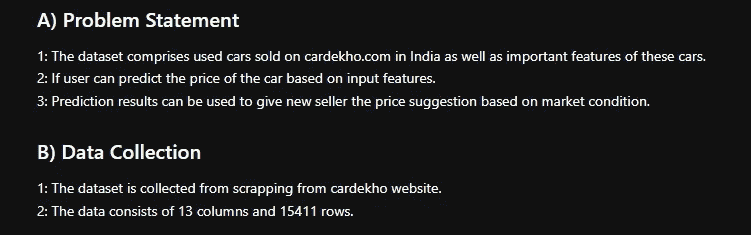

Problem Statement

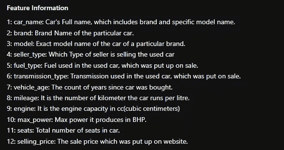

Data Description

## 步骤 2:导入所需的包并加载数据集

你应该能够加载这些库，但是如果你仍然得到一个模块错误，尝试在 google 中搜索 PyPI[库名]并在 cmd 上运行命令。例如，为了安装 seaborn，您需要在命令提示符下运行 pip install seaborn。

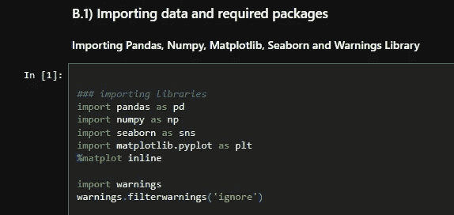

Importing Libraries

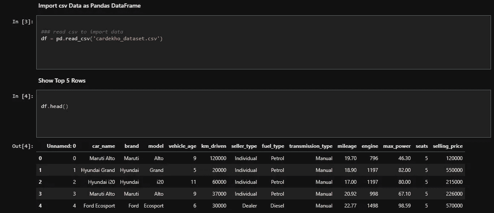

Load Dataset and show the top 5 rows.

现在，我们可以看到有一个名为“未命名:0”的列。该列必须是在将数据抓取并保存到 CSV 文件中时添加的。所以下一步就是丢弃数据。

## 步骤 3:对数据执行基本功能。

如前所述，我们将删除“未命名:0”列，然后通过显示前 5 行再次可视化数据。

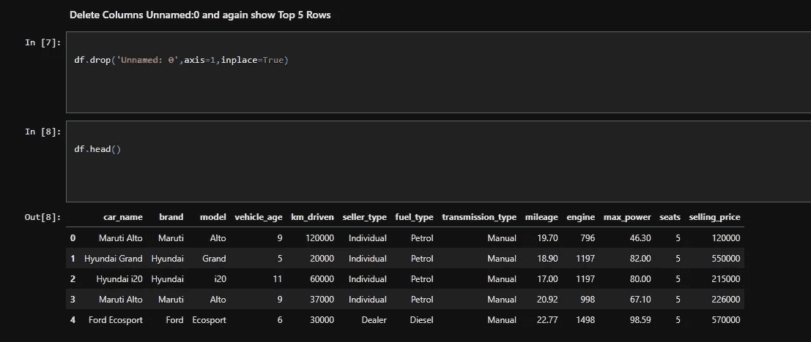

Dropping Column

**3.1:检查数据集中的形状和列** 数据的形状是指数据集中的行数和列数。

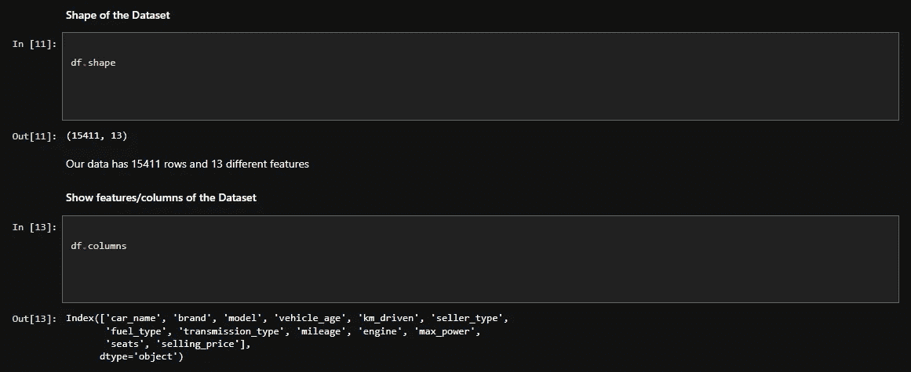

Shape and Columns

**3.2:数值特征描述和各列信息** DataFrame.describe()可以给出数值数据的描述。这可以帮助我们获得每个数字列的最小值、最大值、平均值、标准偏差等值。

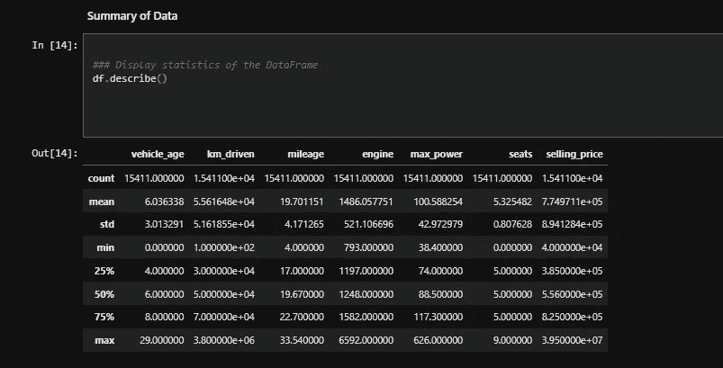

Summary of Data

DataFrame.info()将为我们提供关于数据类型和每列中非空值数量的信息。

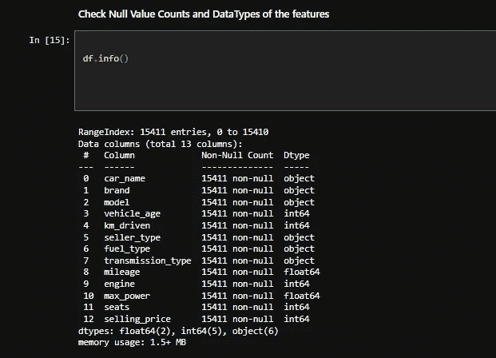

Data Information

**3.3:检查重复值
在我们的数据集中，有 167 个重复值。**

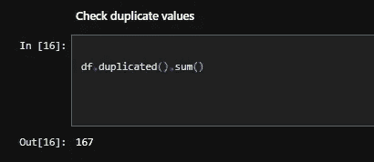

Duplicate Values

**3.4:章节结论** 我总是建议在每一节之后写下结论或从数据中得到的信息。它可以帮助我们以后在执行数据清理和要素工程时识别有关数据集的问题。

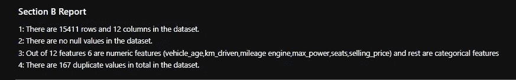

Section Conclusion.

## 步骤 4:探索数据

我们将研究数据集，以便这些信息在单变量、双变量和多变量分析中有用。

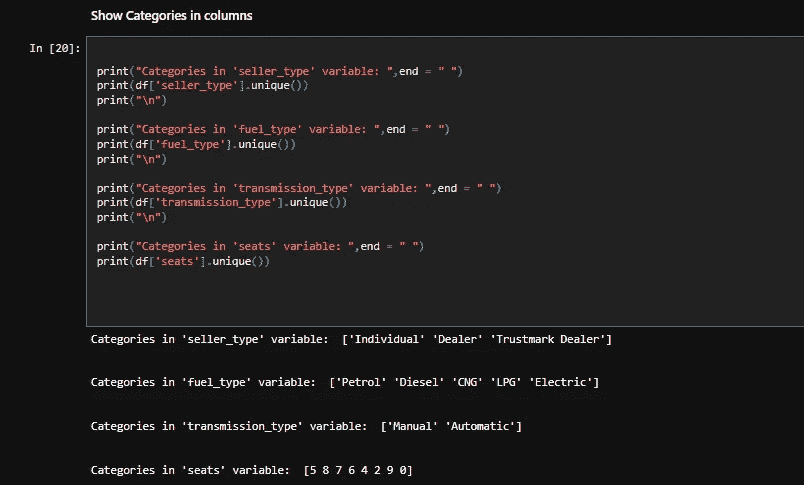

Categories in Columns

如我们所见，有一个 0 类座位是不可能的。因此，我们可以尝试探索座位为 0 的座位列，然后决定删除这些行，或者用其他值(如模式、平均值等)替换 0 值。此外，我们可以将列分为数字列或分类列，这将有助于发现数据中的模式。

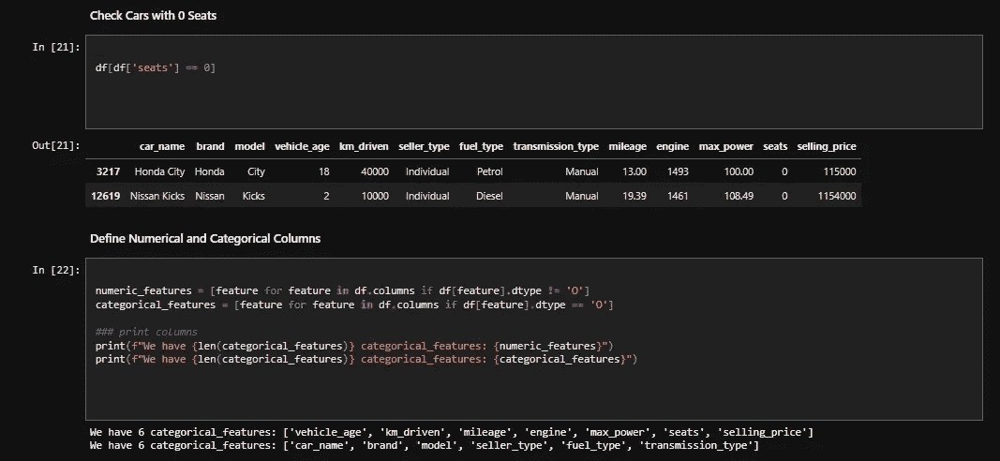

Numerical and Categorical Features

## 第五步:单变量分析

单变量分析是指一次取一列进行分析。为此，我们可以使用 KDE 图、箱线图等图形。

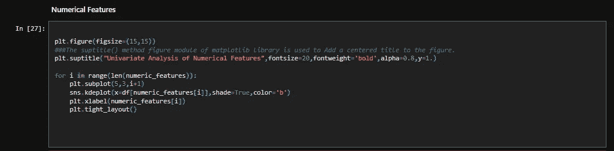

Code for KDE Plot

KDE-Plot

核密度估计(KDE)说明了数据的偏斜度。在上图中，我们可以看到 Km_driven、max_power、selling_price、engine 分别是右偏和正偏。这意味着 km_driven、engine、selling_price 和 max power 中存在异常值。

**计数图** 显示一列中类别的计数。

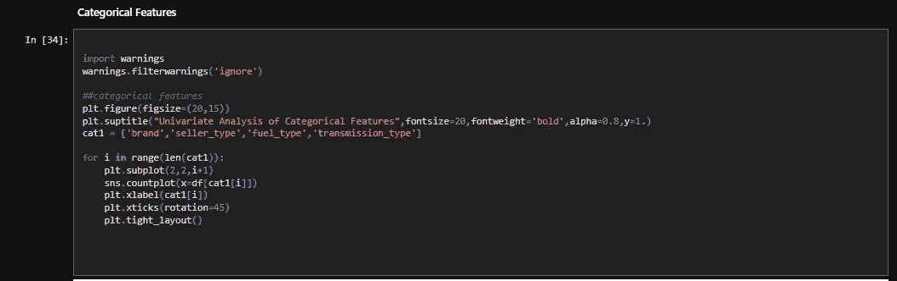

Count plot code

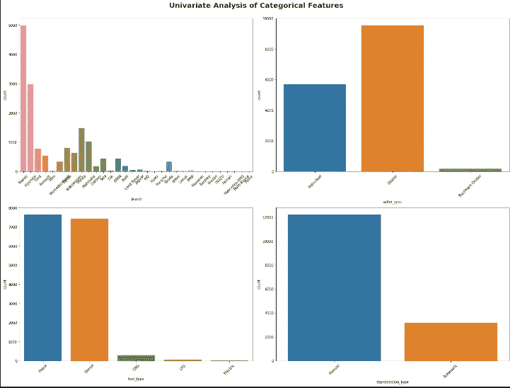

Count Plot

## 第六步:多元分析

取两个或更多的变量，然后分析它们。

**相关性:** 我们可以使用 corr()函数找到各种特征之间的相关性。该功能在 EDA 过程中非常重要，因为我们可以很容易地找到特征之间的相关性。

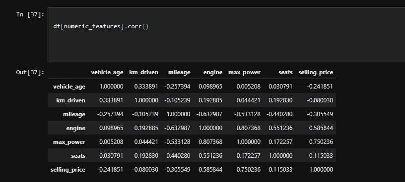

Correlation

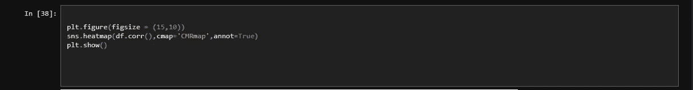

Heatmap Code

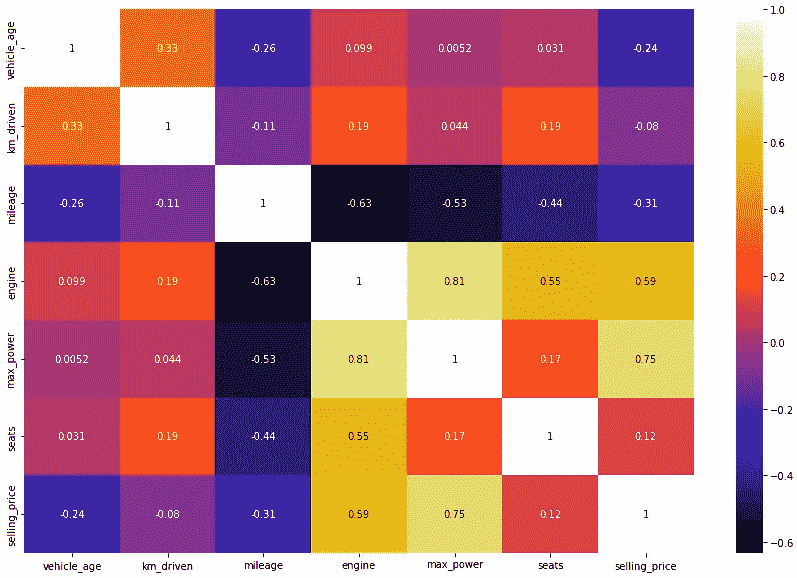

Heatmap

这很重要，因为假设我们有两个独立的列 A 和 B。A 和 B 的相关度为 99%或 95%，因此在选择特征时，我们可以删除其中任何一列，不会影响我的模型。

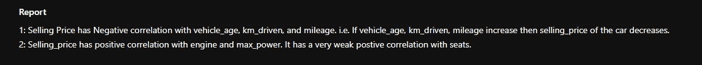

Correlation Observations

**连续特性和目标特性(售价)的关系:**

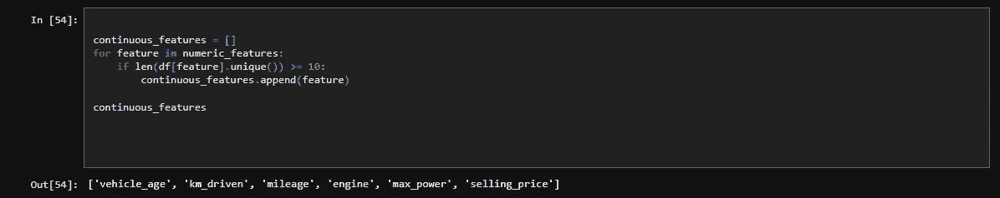

Creating Continuous Features variable

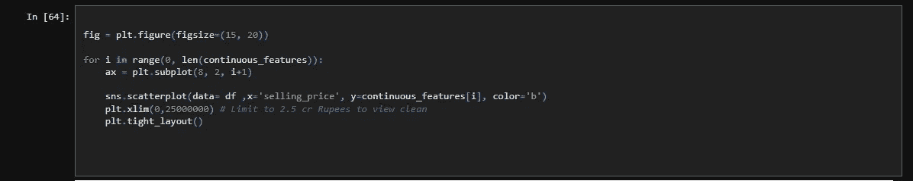

Continuous vs Target Feature Code

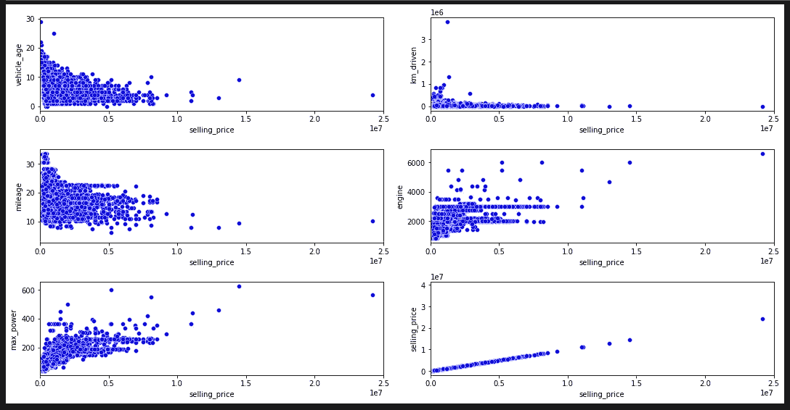

Continuous vs Target Feature Scatter Plot

从上面的散点图中，我们可以看到以下观察结果:

1.  车龄较低的车辆比车龄较长的车辆有更高的销售价格。
2.  发动机 CC 对价格有积极作用。
3.  Kms 驱动对销售价格有负面影响。

## 步骤 7:图形分析

图形分析非常重要，因为这一过程可以帮助我们快速识别和直观识别数据中的模式和趋势。

**售价分布**

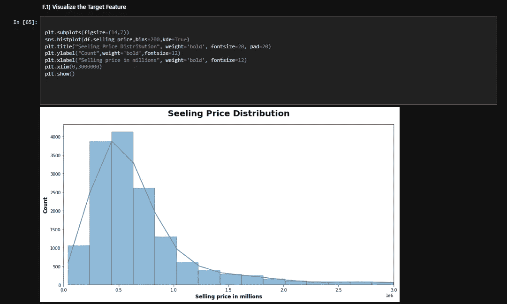

Selling Price Distribution

**销量前十的汽车**

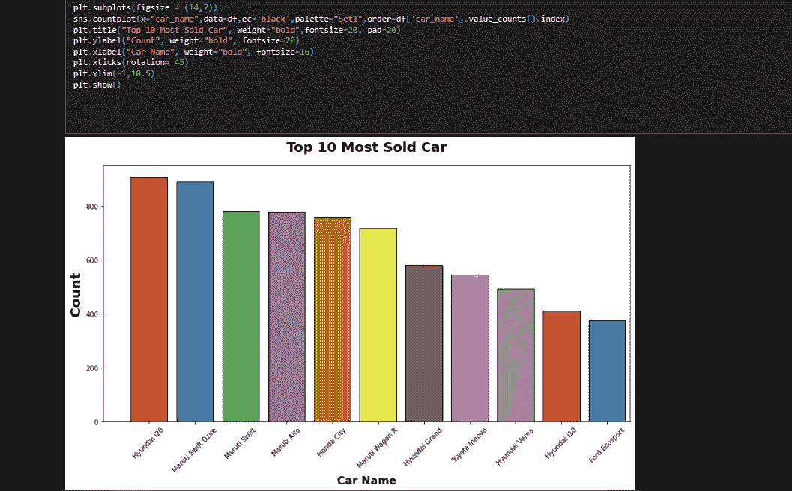

Top 10 cars sold

正如我们在图表中看到的，现代 i20 在网站上发布的广告总量中占 5.8%，其次是马鲁蒂 Swift Dzire。售出的前 10 辆汽车的平均价格为 5.4 卢比。所以，这个特性对目标列有很大的影响。

**品牌 vs 售价**

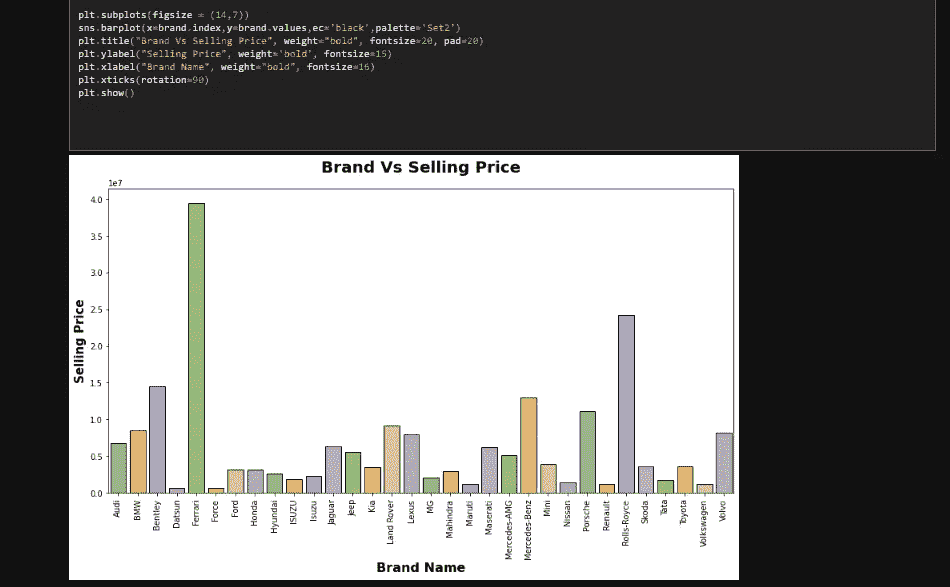

Brand vs Selling Price

最昂贵的品牌鞋底是法拉利，3.95 卢比，其次是劳斯莱斯，2.42 卢比。品牌名称对售价有非常明显的影响。

**行驶里程与售价**

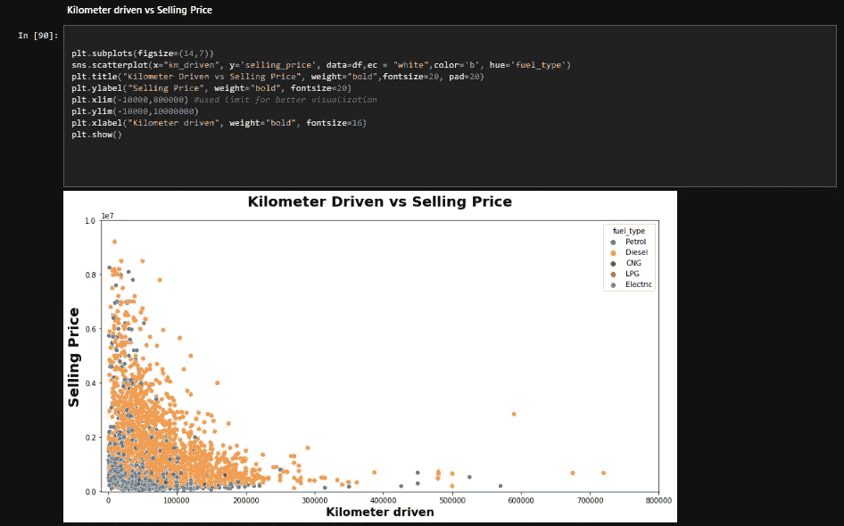

kms_driven vs Selling Price

许多汽车的行驶里程在 0 到 20k 之间，与行驶里程更长的汽车相比，行驶里程短的汽车售价更高。

**燃料类型与售价**

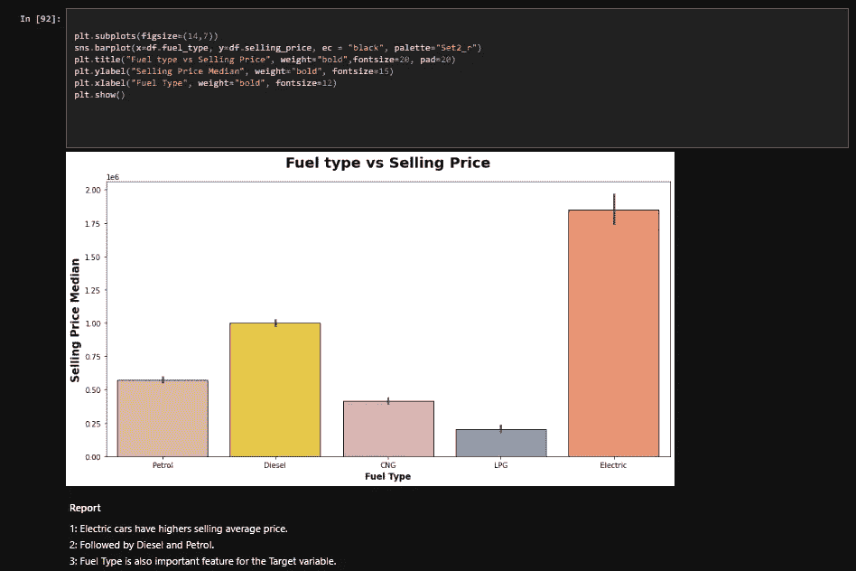

Fuel Type vs Selling Price

**变速器类型与价格**

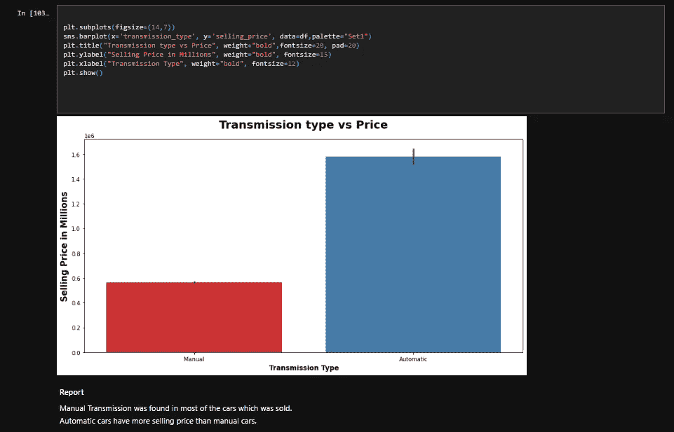

Transmission Type vs Price

## 步骤 8: EDA 报告

1.  数据类型和列名是正确的，有 15411 行和 13 列
2.  selling_price 列是要预测的目标。即回归问题。
3.  km_driven、engine、selling_price 和 max power 中存在异常值。
4.  经销商是二手车销量最高的。
5.  在一些列中发现偏斜，将在处理异常值后检查它。
6.  车龄对价格有负面影响。
7.  手动挡汽车销量最大，自动挡汽车的平均销量高于手动挡汽车。
8.  在二手车网站上，汽油是最受欢迎的燃料，其次是柴油和液化石油气。
    我们只需要对这个数据集进行较少的数据清理。

## 结论

EDA 是数据科学过程中的一个重要步骤，对于理解、清理和准备数据以供进一步分析至关重要。通过彻底探索和总结数据集，我们可以获得有价值的见解，并就如何进行分析做出明智的决策。

你可以在我的 [GitHub](https://github.com/devsachin0879/FullStackDataScience/tree/main/EDA_FE/EDA_UsedCars) 档案中找到代码和数据集。

*感谢您阅读本文！如果你有任何问题，请在下面留言。可以关注我的*[*Linkedin*](https://www.linkedin.com/in/devsachin0879/)*和*[*GitHub*](https://github.com/devsachin0879)*。*

 [## Mlearning.ai 提交建议

### 如何成为 Mlearning.ai 上的作家

medium.com](/mlearning-ai/mlearning-ai-submission-suggestions-b51e2b130bfb)