# 物体检测的基础:更快，屏蔽，级联 R-CNN🔥

> 原文：<https://medium.com/mlearning-ai/details-of-faster-mask-cascade-r-cnn-7b9c34326cdf?source=collection_archive---------0----------------------->

更快的 R-CNN 仍然是比较现代网络架构的对象检测性能的积极引用的基准。在本帖中，我们将讨论论文的见解和贡献。

Photo by [davisuko](https://unsplash.com/@davisuko?utm_source=medium&utm_medium=referral) on [Unsplash](https://unsplash.com?utm_source=medium&utm_medium=referral)

## 引言——为什么我们会在意 2022 年？

更快的 R-CNN 是计算机视觉的一个巨大突破，因为它实现了实时对象检测，并实现了对象检测管道的端到端训练。7 年后的 2022 年，其变体仍被用作实际应用的健壮起点和比较网络架构的基准。

*   该论文具有重要的研究贡献，因为它在概念上是每个两阶段对象检测方案的基础，这是一个流行和活跃的研究分支(表面上，该论文也被引用了 40K+次)。
*   尽管不再是 s.o.t.a(最先进的),管道仍然非常有效，并且是架构不可知的。更快的 R-CNN 始终是您的对象检测应用程序的健壮起点🙂
*   提出**网络架构的论文常规比较“cascade-mask-rcnn”框架上对象检测的性能**(He et al .，2017；蔡等，2018)，更快 rcnn 的流行变种。
*   尽管它很受欢迎并且意义重大，但是这个框架**非常复杂**，并且有许多重要的细节需要针对不同的用例进行修改，这也是这篇文章的动机。训练中涉及到很多超参数和细节，有时候不是那么明显。

## 概观

我们将从简要回顾快速 R-CNN 和更快的 R-CNN 管道开始。然后，我们将讨论流行的级联掩码 rcnn 框架，以及它们如何提高更快的 R-CNN 的性能。这篇文章主要基于论文中有趣的*见解，而不是超参数等的本质细节。但是，我们将在下一篇帖子中讨论实现中涉及的细节，如果您有兴趣，请继续关注！*

在写这篇文章的时候，我参考了流行的公共对象检测框架的实现，但是这篇文章主要关注于`torchvision`实现【R1】。

【R1】*torch vision . models . detection . faster _ rcnn。fasterr CNN—*[[github](https://github.com/pytorch/vision/blob/main/torchvision/models/detection/faster_rcnn.py)][[教程](https://pytorch.org/tutorials/intermediate/torchvision_tutorial.html) ]

【R2】*Facebook research/maskrcnn-benchmark*和*detectron 2—*[【github】](https://github.com/facebookresearch/detectron2)

[R3] *更快-rcnn . py torch*——[[github](https://github.com/jwyang/faster-rcnn.pytorch)

文章末尾提供了提到的论文的参考文献。

## 关键词的摘要和列表

您可以跳过这一部分，稍后再回到这一部分:)

**~快速 R-CNN (Girshick 等人，2014；Girshick 等人，2015)**

*   两阶段对象检测:生成区域建议→计算每个感兴趣区域(RoI)的特征→将每个 RoI 分类为某个对象或背景，回归精确的框坐标。
*   选择性搜索:生成区域建议的经典方法。
*   在快速 R-CNN 中提出 RoI Pooling 来接收具有各种形状的不同对象的 CNN 特征，并缩减为恒定的形状。
*   背景和前景感兴趣区域在采样数据时是平衡的，因为大多数感兴趣区域是背景，随机采样将导致太多简单的背景样本。快速 R-CNN 的*图像中心采样*拾取 N 幅图像，以平衡的方式从每幅图像中提取(batch_size / N)个 ROI。
*   使用额外的*背景*类和 softmax &交叉熵损失来训练对象类的分类。如 Girshick 等人在 2015 年提出的，用平滑的 L1 损失来训练包围盒回归。两个对象以组合损失被联合学习。

**更快的 R-CNN(任等，2015)**

*   基于选择性搜索的区域建议是推理速度的主要瓶颈。快速 R-CNN 提出了一种基于学习的方法，该方法基于区域提议网络，用于精确和廉价的区域提议。
*   区域提议网络(RPN)在 CNN 特征地图上滑动，以预测对象分数——对象或背景和框回归的概率——精确的框坐标细化 *k* 参考*锚框*。
*   RPN 与最初的快速 R-CNN 检测网络共享特征，并且被联合训练。作者还讨论了 3 种联合训练 RPN 和快速 R-CNN 的方案。

**屏蔽 R-CNN(何等，2017)**

*   为训练更快的 R-CNN 总结一个更好的基线，包括更好的数据扩充、超参数和模型架构。
*   提出了一个名为 RoIAlign 的 RoIPool 替代方案，它允许 RoI 的像素到像素对齐。
*   提出了一个基于 RPN 区域建议的密集预测框架，并证明了其在关键点估计和实例分割方面的有效性。

**级联 R-CNN(蔡等，2018)**

*   调查并观察 IoU 重叠阈值问题中有趣的挑战和现象。
*   用小 IoU 阈值进行训练会产生噪声样本，而用大阈值进行训练会降低性能，因为与训练相比，在推断时会出现过拟合和低质量区域建议。
*   当根据其他 IoU 阈值进行评估时，使用特定 IoU 阈值训练的模型可能是次优的，或者给出了不同 IoU 阈值水平的区域建议。
*   建议级联专门的检测器来解决挑战，并能够显著提高性能。

# 快速概述更快的 R-CNN

## 两阶段目标检测

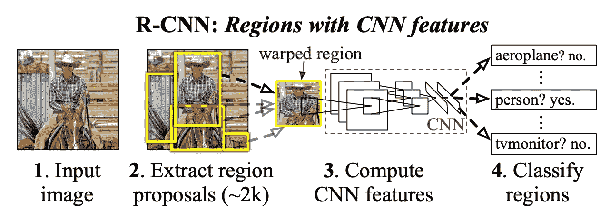

Girshick et al., 2014, an overview of R-CNN, a popular 2-stage object detection method

在两阶段对象检测中(Girshick 等人，2014 年)，一系列区域建议用于表示潜在对象的位置，在上图中用黄色方框表示。然后进一步评估每个区域提议，从而确定对象的类别和精确位置。

以前的方法，如 R-CNN(Girshick 等人，2014 年)和 Fast R-CNN(Girshick 等人，2015 年)依靠试探法，如[选择性搜索](https://pyimagesearch.com/2020/06/29/opencv-selective-search-for-object-detection/)，从图像中计算预定义的区域建议。然后通过基于学习的方法处理这些初始区域提议，这些方法决定每个提议是否是实际对象(即，没有背景)，将类别分配给提议，并改进边界框。

## 快速 R-CNN 流水线

Girshick et al., 2015, an overview of the Fast R-CNN framework

在快速 R-CNN 框架中，图像和预先计算的感兴趣区域被提供给模型。使用 CNN 将图像缩小为特征图，并且基于 RoI 的位置裁剪每个 RoI 的特征。这个裁剪的特征表示该 RoI 的高级信息。

然后应用 *RoIPooling* 图层将每个裁剪后的要素处理成相同的大小，这样它就可以被 MLP 处理。一系列完全连接的层为每个 RoI 创建 RoI 特征向量。最后，特征向量用于 1)将对象类别分配给 RoI，以及 2)细化 RoI 的初始框坐标。

## 快速 R-CNN 训练

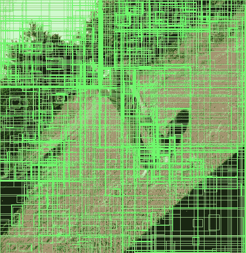

Image by author, example output of selective search

快速 R-CNN 训练的目标是从 RoI 中准确预测对象类别和边界框细化。选择性搜索等区域建议方法可为每幅图像生成约 2000 个 ROI。图像中的对象通常少得多，因此与包含实际感兴趣对象的前景 ROI 相比，绝大多数区域提议包含背景(负)ROI。因此，大多数方法使用一批平衡的 RoI 来训练模型，其中正 RoI 和负 RoI 的比率被严格控制。

在训练批次大小为 K=128 的快速 R-CNN 时，我们从图像数据集中读取 N=2 个图像，并从每个图像中选择 64=K/N 个 ROI，其中 16 个为正 ROI，48 个为负 ROI。如果值在[0.1，0.5]之间，则具有与至少 0.5 的基本事实边界框重叠的并集上的交集(IoU)的对象提议被认为是正的和负的。

对于每个 RoI，该模型预测 1)对象类别和 2)边界框细化。对于类别预测，负 ROI 被标记为“0”类别，而正 ROI 被标记为相应的对象类别。使用预测和基础事实之间的交叉熵来训练该模型。边界框细化预测试图预测区域提议和相关 g.t .边界框的确切位置之间的 xywh 偏移。这是通过最小化预测和实际情况之间的平滑 MSE 损失(Girshick 等人，2015 年)来实现的。稍后，我们将与代码一起精确定义如何计算偏移量。

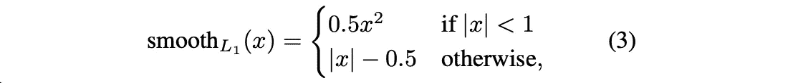

Girshick et al., 2015, smoothed MSE loss

“快速 R-CNN RoI 头”的两个分支用组合损失函数来共同训练。注意，仅当对象提议是*前景*类时，才计算边界框回归损失。这在下面的等式中被描述为“[u ≥ 1]=1 如果 u ≥ 1 否则 0”。

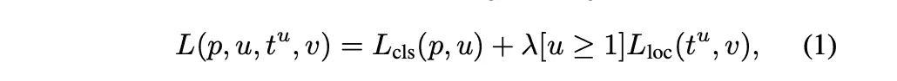

Girshick et al., 2015, Joint Multi-task loss function of Fast R-CNN.

## 更快的 R-CNN

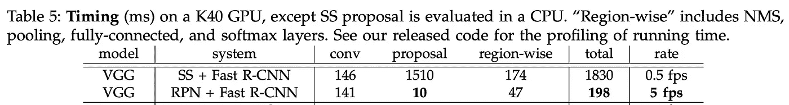

Ren et al., 2015, Faster R-CNN can efficiently generate proposals.

上表描述了每一步推理所需的时间。描述快速 R-CNN 框架的第一行(SS+快速 R-CNN)表明，主要的瓶颈不是 CNN 特征提取器，而是“提议”阶段，该阶段执行选择性搜索(SS)以找到区域提议。为了取代选择性搜索，更快的 R-CNN(Ren 等人，2015 年)建议区域提议网络(RPN)与卷积特征提取器共享特征，以有效地生成区域提议。结果展示了丰富但几乎无成本的区域提议。

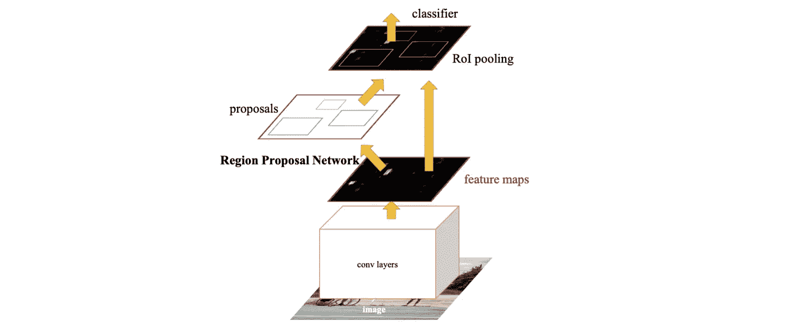

Ren et al., 2015, an overview of Faster R-CNN

更快的 R-CNN 的整体管道与快速 R-CNN 非常相似。CNN 网络从图像中提取特征。快速 R-CNN 对图像执行选择性搜索以生成区域提议，而区域提议网络(RPN)采用 CNN 特征来生成用于更快 R-CNN 的区域提议。RPN 输出约 2K 个区域建议。区域提议和 CNN 特征然后被馈送到快速 R-CNN 头，该头预测对象分类和边界框回归。下面代码片段中的第 8~10 行描述了高级实现。

[[code]](https://github.com/pytorch/vision/blob/ba4b0db5f8379e33dae038f82219531a44ff08c3/torchvision/models/detection/generalized_rcnn.py)

## 区域提案网络

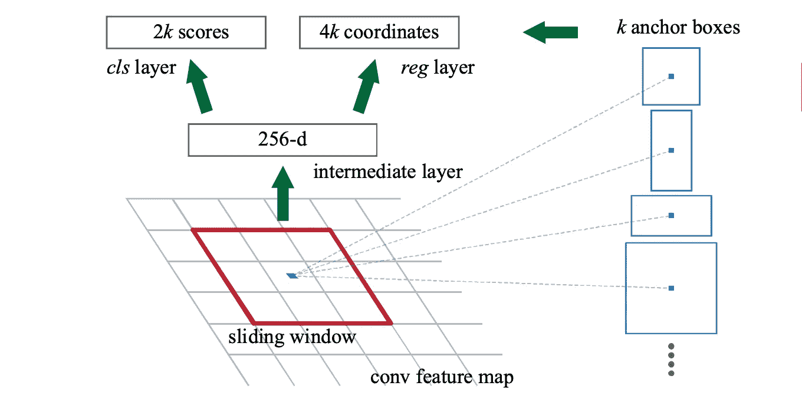

Ren et al., 2015, an overview of region proposal network(RPN)

为了生成区域提议，区域提议网络在卷积特征图上滑动。这个小网络接收部分特征图并预测多个区域提议。在每个滑动窗口位置，最多可以提出 k 个区域建议。这 k 个提议基于 k 个参考锚盒，参考锚盒被定义为比例={128，256，512}和纵横比={1:1，1:2，2:1}的组合，k=9 用于更快的 R-CNN。

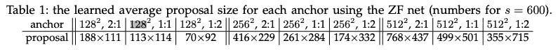

具体地，特征图被投影到中间层中，该中间层用于进行 2 个预测:1)对象性分数( *cls* )预测基于以窗口为中心的每个 k 锚框是对象还是不是对象的区域提议的概率，以及 2)回归层( *reg* )预测 k 个框的坐标。回归层预测相对于相应参考锚定框的框细化。通过组合参考锚点、来自回归层的框坐标细化，以及通过预测的客观性分数来过滤提议，该模型可以预测准确的区域提议。

[[code]](https://github.com/pytorch/vision/blob/d4a03fc02d0566ec97341046de58160370a35bd2/torchvision/models/detection/rpn.py#L16)

有趣的是，解析卷积特征图并生成中间层的滑动窗口可以表示为核大小为 n×n 且没有填充的单个卷积层。然后，可以使用 1×1 卷积层来预测来自中间特征的客观分数或框细化。上面的代码确实演示了这一点(注意 self.conv 在这个实现中可以有多个层)。

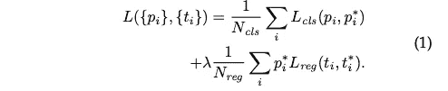

Ren et al., 2015, training loss of RPN in Faster R-CNN

可以通过向每个锚点分配二进制类别标签(是否为对象)并测量交叉熵损失来训练对象性得分。与用于快速 R-CNN 训练的“背景”类相似但略有不同，如果锚具有高于 0.7 的 IoU 重叠，则锚被认为是正的，对于所有地面实况框，锚被认为是负的 IoU 重叠低于 0.3。中间有 IoU 重叠的锚点不用于训练客观性分数。

最后，在使用 RPN 进行训练和推理的过程中，需要注意一些细节。在训练期间，所有的跨界锚点都被忽略，因此它们不会造成损失，但是在推断期间所有的锚点都被保留。作者建议在测试时将跨边界框裁剪到图像边界。阈值为 0.7 的非最大抑制(NMS)被应用于区域提议，以便移除冗余提议。在测试时，基于客观性分数的前 N 名排序建议用于检测。

## 更快的 R-CNN 训练

快速 R-CNN 是快速 R-CNN 和使用区域建议网络的可学习区域建议的组合。因此，培训有两个主要的培训目标:

*   快速 R-CNN 模块—盒回归(平滑 L1)，对象分类(交叉熵)
*   区域建议网络—客观性分数(交叉熵)，箱式回归

Ren et al., 2015, an overview of feature sharing between RPN and Fast R-CNN

快速 R-CNN 和 RPN 都可以独立训练，但由于训练一个模块会改变另一个模块的有用权重，Ren 等人(2015)讨论了通过共享如上图所述的特征来学习快速 R-CNN 和 RPN 的统一网络的几种方法。作者讨论了如下 3 种训练方案:

*   *交替训练*方法首先训练 RPN，然后使用来自 RPN 的建议训练快速 R-CNN。然后用快速 R-CNN 调好的网络初始化 RPN，这个过程是迭代的。
*   *近似联合训练*方法来预测区域建议，并使用区域建议来计算 RPN 损失，并使用这些区域建议来训练快速 R-CNN 检测器。这是有效的，因为在训练 RPN 和快速 R-CNN 时只进行一次向前/向后传递。
*   *考虑非近似联合训练*方法，因为在快速 R-CNN 的 RoIPooling 中使用的区域提议实际上是输入图像的函数。换句话说，来自快速 R-CNN 检测器的梯度也必须流入在做出区域提议中涉及的 RPN 和卷积特征。然而，RoIPooling 是*近似联合训练*，因为梯度在它们之间被切割。

Ren 等人(2015)的作者默认采用替代训练方法，但指出近似联合训练方法更快，同时根据经验证明结果接近。Mask R-CNN 后期实验(何等，2017)实际上采用的是近似联合训练策略。事实上，上面的代码示例`GeneralizedRCNN`演示了这种方法。然而，作者将非近似联合训练方法描述为非平凡的，并且没有提供关于它的实验。

现在，我们将深入研究级联掩码 rcnn 变体，它可以提高更快的 R-CNN 的性能！！🔥

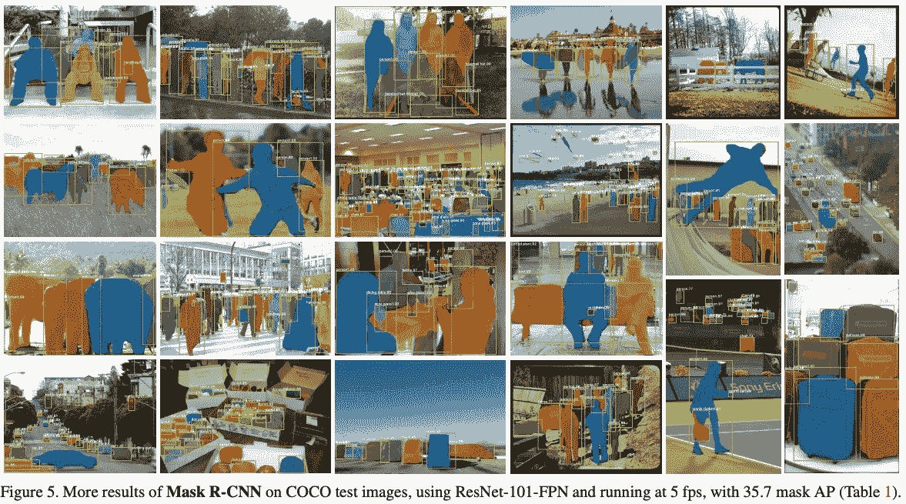

He et al., 2017, Mask R-CNN results on instance segmentation

## 改进快速 R-CNN

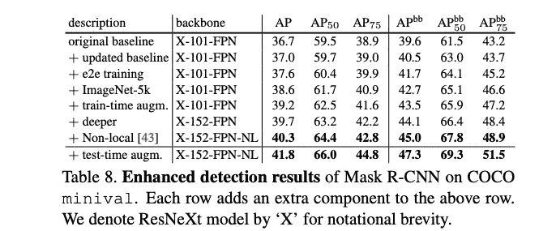

He et al., 2017, Ablation on enhancing Faster R-CNN

Mask R-CNN(He et al .，2017)主要致力于提出一种用于实例分割的强大基线系统，但作者也提出了一种基于更快 R-CNN 的明显更好的对象检测基线。我们将首先讨论在何等人 2017 年的附录中描述的用于提高对象检测性能的超参数和算法。

*   更新基线:将训练步长从 120k 增加到 180k，将 NMS 后处理阈值从 0.3 增加到 0.5。
*   端到端(e2e)训练:使用近似的联合训练策略，而不是原来的交替训练策略，这实际上提高了性能。
*   ImageNet-5k:在 ImageNet-5k 而不是 1k 子集上预先训练特征提取器。
*   训练时间增加:随机缩放图像作为数据增加，进一步增加训练预算到 26 万
*   更深入:使用 ResNext152 模型更深入
*   非本地:通过使用非本地块来改进模型架构
*   测试时间增强:在[400，1200]像素的图像尺度上使用 [TTA](https://github.com/qubvel/ttach) ，步长为 100，并在水平翻转上使用。

还有一些改编自 Lin 等人(2017)的修改，在本消融术中未提及:

*   调整图像大小，使其比例(短边)为 800 像素
*   15 使用比例={32，64，128，256，512}和纵横比={1:1，1:2，2:1}的参考锚。

## 罗伊 Align

RoIAlign 是 RoIPooling 的替代产品，无需量化即可实现像素到像素的对齐。作者认为这是快速/更快 R-CNN 的主要缺失部分，用于密集预测任务，例如实例分割，并发现这一更新对实例分割至关重要。该层仍然为边界框级别的性能提供了细微的改进。我们先来看看 RoIPooling 的问题。

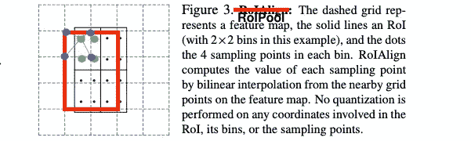

Original image by He et al., 2017, Illustration of the quantization of RoIPool

RoIPool 是一种标准操作，用于从每个 RoI 中提取小特征图(例如，7×7 ), RoI 类似于上面的黑盒。RoIPool 首先将浮点数 RoI 量化为特征图的离散粒度(即红框)。这个量化的 RoI 然后被细分成空间箱，这些空间箱本身被量化(即，蓝点)，并且最后由每个箱覆盖的特征值被聚集(通常通过最大池)。

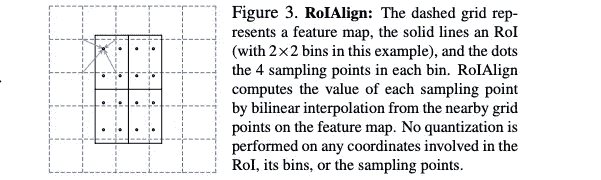

He et al., 2017, Overview of RoIAlign

RoIAlign 没有量化坐标来索引特征地图的最近离散值，而是使用双线性插值来计算 4 个邻近特征的值并聚合它们。不执行量化。

## 实例分割

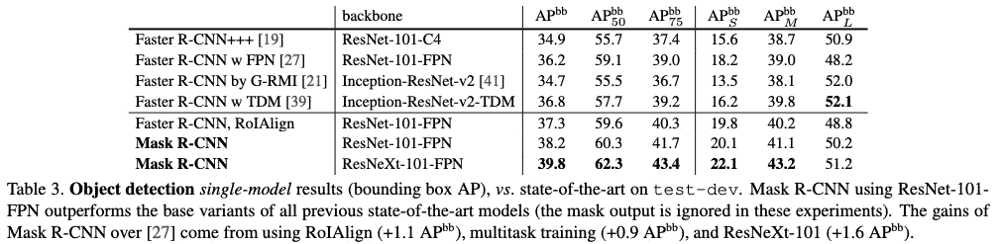

He et al., 2017, Bounding box object detection results of Mask R-CNN

实例分割的任务是检测对象的边界框，同时精确分割每个实例。虽然这个主题可能看起来不相关，但我想简单提一下，作者表明共同学习遮罩和边界框有利于检测器。在上表中，当在*快速 R-CNN，RoIAlign* 实验中移除屏蔽分支时，性能下降。

此外，请注意，虽然我们从对象检测的角度将该论文视为更快的 R-CNN 的变体，但 Mask R-CNN 是一个令人惊叹的基线，可以使用两级检测器和 RPN 的方法解决许多其他涉及定位的任务。

> 我们展示了 COCO 挑战套件的所有三个方面的最佳结果，包括实例分割、包围盒对象检测和人物关键点检测。没有花里胡哨，Mask R-CNN 在每项任务上都优于所有现有的单一模型条目，包括 COCO 2016 挑战赛的获胜者。我们独立地为每个类别预测一个二进制掩码，而没有类别之间的竞争

最后，我们将讨论我们的最后一篇论文，名为 Cascade R-CNN(蔡等人，2018 年)，该论文基于对阈值的深刻观察。🔍

## IoU 阈值

我们已经看到，在两阶段对象检测中，IoU 阈值被定义为确定区域提议是正的(对象)还是负的(背景)。如果 IoU 与基础事实对象的重叠大于阈值，则区域方案被视为正，否则为负。我们还讨论了快速 R-CNN 和后来的方法使用 0.5 的 IoU 阈值。似乎很公平，但在蔡等人 2018 年的文章中，作者认为门槛问题可能不是那么微不足道。

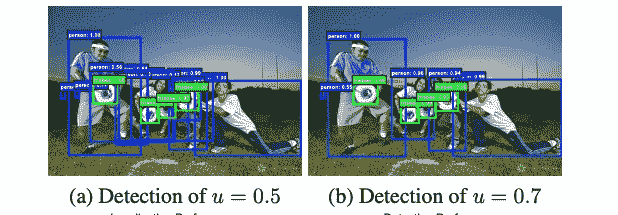

Cai et al., 2018, a threshold of 0.5 permits noisy detections!

首先，作者表明常用的 IoU 阈值 0.5 可能会允许许多被认为是人类误报的检测，如上图所示。好，那如果我们用更高的阈值比如 0.7 训练，*问题解决*？下图(d)说明了用于训练的 3 个不同阈值的对象检测性能，其中 x 轴是用于测量 AP 的 IoU 阈值。我们可以看到，在曲线的大多数部分，使用较高的阈值具有较差的对象检测性能。

作者指出了两个问题，这使得提高门槛和只允许高质量的盒子非常具有挑战性。

1.  过度拟合，因为数据集的多样性随着 IoU 重叠阈值的增加而呈指数下降。
2.  IoU 之间的推理时间不匹配:虽然我们可能能够在训练期间人工采样这样好的区域提议，但是 RPN 并不总是能够生成具有高 IoU 重叠的区域提议。

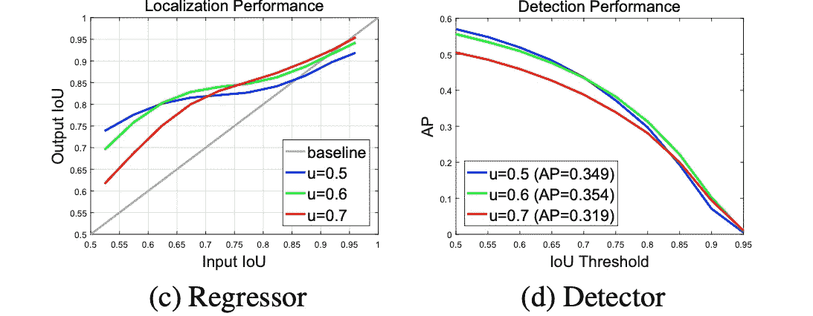

Cai et al., 2018, the performance of box regressor and detector based on IoU threshold used to train model

我们能做些什么吗🙁？图(c，d)给出了我们可以研究的两个有趣的证据。首先，曲线(c)显示了快速 R-CNN 头部边界框回归前后测得的 IoU 重叠。

*   注意，边界框的精度趋于提高(例如，具有 0.7 IoU 重叠的初始框被细化为具有约 0.8 IoU 重叠)，因为大多数曲线都在灰线上。
*   尤其是当输入的 IoU 阈值与训练期间使用的 IoU 阈值相似时。当给出 0.5~0.6 IoU 重叠的相似图像时，用 IoU 重叠> 0.5 的区域建议训练的边界框回归器可能做出良好的改进。

接下来，在图(d)中，对于低 IoU 示例，用 u = 0.5 训练的检测器优于 u = 0.6 的检测器，而在较高 IoU 电平时表现不佳。重要的是，我们注意到，一般来说，在单个 IoU 电平上优化的检波器在其它电平上不一定是最佳的。为了总结在应该使用的 IoU 重叠阈值方面观察到的挑战，

*   使用高 IoU 重叠阈值进行训练会导致 1)由于样本减少而过度拟合，以及 2)由于较差的区域提议而导致推断时间不匹配。
*   针对某一 IoU 阈值优化的检波器可能不适合其它 IoU 阈值。为了在另一个阈值上实现最佳性能，需要一个用不同阈值训练的优化器。

> …我们将假设的质量定义为其与基础事实的 IoU，将检测器的质量定义为用于训练它的 IoU 阈值 u。基本思想是，单个检测机只能对单个质量水平达到最佳。

## 级联 R-CNN

那么，我们如何优化所有 IoU 重叠电平呢？我们将首先讨论解决这个问题的两种简单方法，并建议将它们结合起来可能是最有效的。更快的 R-CNN 框架如下图(a)所示。卷积特征被给予 RPN(H0 ),并且创建对象提议 B0。然后，这些提议被用于解析卷积特征图，并且 RoI 头预测最终的边界框细化 B1 和对象类别 C1。

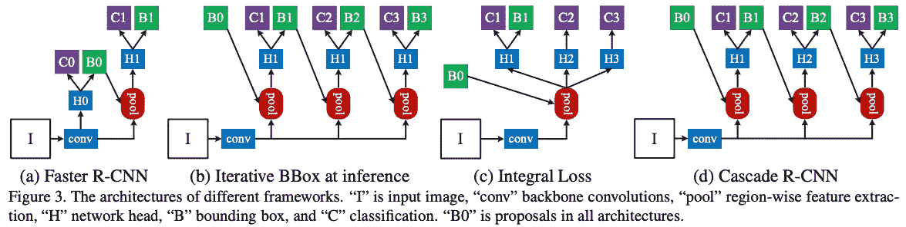

第一种方法是迭代边界框细化，如图(b)所示。细化的对象建议(或边界框)C1 用于再次解析卷积特征图。同样快速的 R-CNN 网络预测新的和可能改进的对象类 C2 和边界框 B2。这个过程可以反复重复。然而，作者认为这种想法忽略了两个问题。

1.  随着改进的继续，IoU 可能会增加。如前所示，在 u = 0.5 时训练的回归量对于较高的 IoU 重叠来说是次优的。
2.  边界框的分布在每次迭代后会发生显著变化。虽然回归变量对于初始分布是最优的，但在此之后它可能是次优的。

另一种方法是开发分类器的集成，每个分类器用不同的 IoU 阈值进行优化。图(c)对此进行了描述，损耗如下式所示，其中 U={0.5，0.55，，0.75}是一组递增的 IoU 阈值。这种方法是有缺陷的，因为正样本集随着 u 的增加而快速减少，这是由于 RPN 的较差区域提议，如下面最左边的直方图所示，该直方图示出了初始 RPN 区域提议的质量。这意味着具有高 IoU 阈值的检测器非常容易过度拟合，并且推断质量低，这使得它们毫无意义。

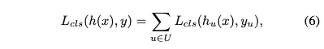

最后，图(d)中描述了级联 R-CNN 框架，该框架使用级联的*专用*回归器，这些回归器通过增加 IoU 重叠阈值进行训练。与作为后处理应用的(b)的迭代盒细化不同，该框架用于训练和推理。使用先前的观察，即包围盒回归通常提高下一个对象提议的质量，我们可以共同增加用于训练的 IoU 阈值。

作者建议按顺序使用 IoU 重叠阈值{0.5，0.6，0.7}训练的快速 R-CNN 头将 RPN 的输出细化 3 次。上面的直方图说明了盒子的质量在整个回归层中是如何提高的。你可能认为所提出的方法非常类似于(b)的迭代盒细化策略，但是惊讶地看到 Cascade R-CNN 的巨大改进。

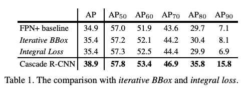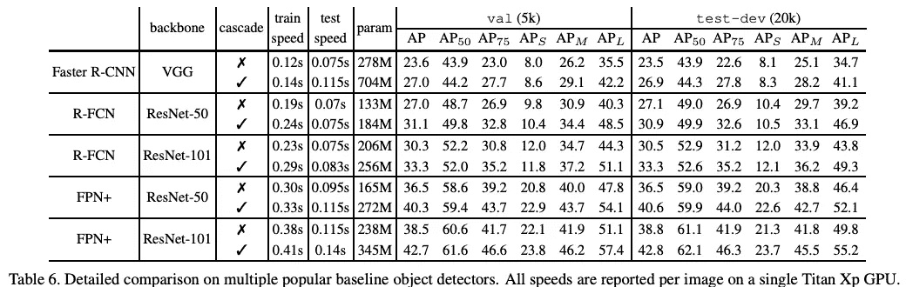

事实上，消融是非常引人注目的，因为它能够显著提高不同检测框架和主干架构的性能。

## 评论

cascade-mask-rcnn 基准是 Mask R-CNN 和 Cascade R-CNN 的组合，其中 Mask R-CNN 的 RoIAlign 层和改进的超参数与 Cascade R-CNN 的级联包围盒回归模块一起使用。常见的实现可以在 [mmDetection](https://github.com/open-mmlab/mmdetection/tree/master/configs/cascade_rcnn) 中找到。

这篇文章是为了减轻我的技术债务，但我真的很喜欢看计算机视觉传奇论文的见解。特别是，我很高兴读到 neet RoIAlign 层和参考锚框+轻微细化的概念，这是一个很好的抽象，表示以某个点为中心的边界框的无限可能性。

我感觉到的一件事是，对于前景和背景 ROI 之间的类别不平衡问题，两级检测器的解决方法还有改进的空间。自 R-CNN 的第一个提议(Girshick 等人，2014 年)以来，一直使用 1:3 采样策略。

另外，*非近似联合训练*的训练网络方法对我来说也很有前途。

在本文中，我没有包括更多最近的物体检测策略，但是我期待着回顾许多关于物体检测的论文，所以如果你感兴趣，请继续关注😇！

# 参考

Girshick、j . Donahue、t . Darrell 和 j . Malik(2014 年)。丰富的特征层次，用于精确的对象检测和语义分割。在*IEEE 计算机视觉和模式识别会议论文集*(第 580–587 页)。

吉尔希克河(2015 年)。快速 r-cnn。IEEE 计算机视觉国际会议记录(第 1440-1448 页)。

任，孙，何，吉希克(2015)。更快的 r-cnn:用区域建议网络实现实时目标检测。*神经信息处理系统的进展*、 *28* 。

林，T. Y .，多拉尔，p .，吉尔希克，r .，何，k .，哈里哈兰，b .，&贝隆吉，S. (2017)。用于目标检测的特征金字塔网络。在*IEEE 计算机视觉和模式识别会议论文集*(第 2117-2125 页)。

He，k .，Gkioxari，g .，Dollár，p .，& Girshick，R. (2017 年)。屏蔽 r-cnn。IEEE 计算机视觉国际会议论文集(第 2961-2969 页)。

蔡，赵，，倪(2018)。级联 r-cnn:钻研高质量的对象检测。在*IEEE 计算机视觉和模式识别会议论文集*(第 6154–6162 页)。

 [## Mlearning.ai 提交建议

### 如何成为 Mlearning.ai 上的作家

medium.com](/mlearning-ai/mlearning-ai-submission-suggestions-b51e2b130bfb)