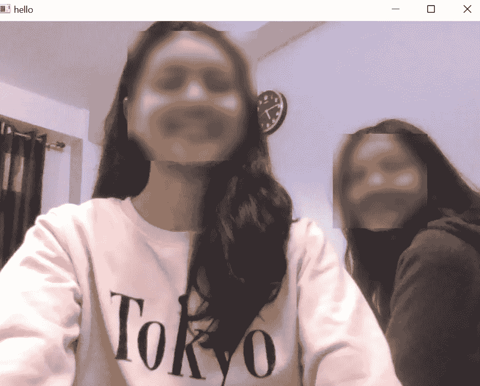

# 使用 OpenCV 和 Python 检测和模糊人脸

> 原文：<https://medium.com/mlearning-ai/detect-and-blur-faces-using-opencv-and-python-3e5e7abf26af?source=collection_archive---------3----------------------->

在本文中，您将学习如何使用 OpenCV 和 Python 来检测和模糊人脸。

> 代码:

> 详细解释:

1.  使用 pip 安装 OpenCV:

***pip 安装 opencv-python***

OpenCV-Python 是一个 Python 库，旨在解决计算机视觉问题。

2.要导入的模块:

***导入 cv2***

3.为了捕捉视频，我们创建了一个 **VideoCapture** 对象:cap。

此方法的参数可以是设备索引或视频文件的名称。由于我们需要实时视频流，我们将给出设备索引作为参数:0

4. ***cv2。cascade classifier(cv2 . data . Haar cascades+' Haar cascade _ frontal face _ default . XML '):***

OpenCV 已经在 XML 文件中包含了许多预先训练好的人脸、眼睛、微笑等分类器。*' Haar scade _ frontal face _ default . XML '*是一个人脸分类器。

要下载预先训练好的*Haar cascade _ frontal face _ default . XML*分类器、 [***点击这里***](https://github.com/opencv/opencv/blob/master/data/haarcascades/haarcascade_frontalface_default.xml) 。将其保存到您的工作目录中。

现在我们将这个分类器加载到我们的*‘model’*变量中。

5. ***while*** 循环将一直运行，直到遇到中断。一旦' cv2.waitKey(10) == 13 '返回 true，循环将结束。

6. ***cap.waitKey(时间单位为毫秒)***

这种方法用于在显示图像(我们认为是视频)时暂停图像。

此外，当我们按下“Enter”键时，该函数将返回 13(键码值), while 循环将中断。

7. ***cv2.imshow("窗口的标题"，图片):***

此方法用于在窗口中显示图像。

8. ***face_blur()*** 函数:

我们将捕获的照片作为参数传递给 face_blur()函数。

9. ***【检测多尺度(图像)*** 方法:

检测图像中的人脸。

该方法将为每个检测到的面返回一个矩形:

x 坐标、y 坐标、宽度和高度

因为可以检测多个面，所以该方法将返回一个二维数组。

10.如果没有检测到人脸，我们将按原样返回照片。

11.如果检测到人脸，我们将对每个人脸运行以下代码:

***crop _ photo = cv2 . blur(photo[nface[1]:nface[1]+nface[3]，nface[0]:nface[0]+nface[2]]，(20，20))***

***photo[nface[1]:nface[1]+nface[3]，nface[0]:nface[0]+nface[2]]= crop _ photo***

12.现在，对于每个 n 接口:

**nface[0] = x 坐标**

**nface[1] = y 坐标**

**nface[2] = width**

**nface[3] = height**

13. ***切片运算符(:)***

列表[开始:结束]

返回从索引*开始*到索引*结束的列表部分。*

**因此，photo[nface[1]:nface[1]+nface[3]，nface[0]:nface[0]+nface[2]]就是照片中包含第 n 张脸的部分。**

14. ***cv2.blur(image，ksize)***

这种方法模糊了图像。

**ksize:** 一个表示模糊内核大小的元组。

***因此，cv2 . blur(photo[nface[1]:nface[1]+nface[3]，nface[0]:nface[0]+nface[2]]，(20，20))将返回照片中包含第 n 张脸的部分的模糊图像。***

这存储在变量 *crop_photo* 中。

15.于是，最后***photo[nface[1]:nface[1]+nface[3]，nface[0]:nface[0]+nface[2]]= crop _ photo***

**原始照片中检测到面部的部分被裁剪和模糊的照片替换。**

# **输出:**

希望你喜欢这篇文章。编码快乐！😊

 [## Mlearning.ai 提交建议

### 如何成为 Mlearning.ai 上的作家

medium.com](/mlearning-ai/mlearning-ai-submission-suggestions-b51e2b130bfb)