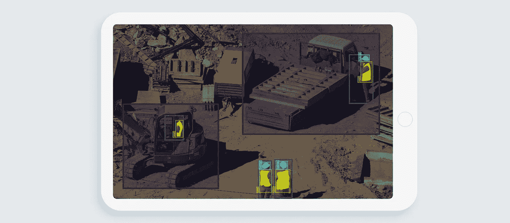

# 为安全驾驶检测睡意:计算机视觉用例

> 原文：<https://medium.com/mlearning-ai/detecting-drowsiness-for-safe-driving-computer-vision-use-case-e67cb0022e78?source=collection_archive---------3----------------------->

计算机视觉技术为视频分析提供了巨大的机会，并帮助各种企业从中获得有价值的信息。它们能够检测、识别、分类、监控事件或对象，然后产生洞察力。今天，我们的故事将是关于建筑公司，以及计算机视觉功能如何帮助解决他们的业务目标，并提供安全的工作场所。

在工作中，建筑公司面临着各种挑战，从过程自动化到安全问题，计算机视觉应用在这些挑战中非常有用:

*   为了提高生产率，CV 系统可以跟踪工作流程，识别潜在问题，发现瓶颈并加以预防。这些困难可能是一些浪费大量时间和降低工作效率的机器运动模式，或者是建筑工地上的问题区域。
*   过程自动化是优化的重要组成部分:计算机视觉技术不仅有助于跟踪施工进度，还能检查工作质量。
*   不幸的是，建筑工地上的盗窃事件频繁发生，因此控制工作和防止建筑材料缺乏成为可能。
*   陌生人绝不能有机会进入施工现场，视频监控解决方案可以确保遵守安全要求。
*   建筑工人的日常工作与健康风险密切相关，建筑公司需要一种防止受伤的解决方案:控制穿戴个人防护设备，在没有人类参与的情况下扫描潜在危险的地方，并警告建筑工人进行必要的维修。

# 如何使用计算机视觉提高建筑工地的安全水平？

我们面临着与安全问题和谨慎使用建筑材料相关的挑战。我们的客户，一家建筑公司，带着一个问题来找我们:起重机操作员感到昏昏欲睡，睡着了。它造成了建筑材料的损失、事故，甚至是工地上的人员损失。

因此，我们为客户提供了一个建筑计算机视觉解决方案的调查；这将有助于检测操作员的困倦迹象并发出通知。在项目期间，我们使用我们的计算机视觉框架 DIET 来了解客户的想法是否可行，以及他的投资是否会有回报。

在第一个发现阶段，我们讨论了解决任务的可能选项。我们考虑了人工智能解决方案、跟踪操作员面部的摄像头以及物联网机会:便携式设备——生理指标的传感器。此外，我们还定义了操作员的工作条件:他的头部位置、一天中的部分时间以及互联网连接的类型。这些信息对解决方案是必不可少的:我们需要检测一张脸，它的元素，并设置相机到适合夜晚的模式；有线或无线互联网的类型会影响解决方案的架构。

我们进行了一项研究，结果发现这些迹象最常用于检测睡意:

1.  长时间眨眼模式—最后一次眨眼的持续时间和眨眼次数。
2.  睁眼百分比:眼睛睁开的时间百分比(每时间间隔(10 秒、1 分钟等)。).
3.  面部轴倾斜模式:面部倾斜的角度。
4.  打哈欠模式:打哈欠的次数。

在下一个构思阶段，我们正在寻找解决我们挑战的工具:用于检测困倦迹象的现成工具和库，但我们没有找到这样的开源解决方案。现有的面部跟踪工具没有 100%解决捕捉迹象的问题，我们为任务定制了每个解决方案。

例如，没有识别哈欠的仪器。我们取了一个检测人脸关键点(面部标志)的 Dlib 库，隔离了嘴唇，计算了嘴巴上下点的距离与嘴巴宽度的比值。通过这种方式，我们确定了一个阈值，如果超过这个阈值，模型就会识别出哈欠。使用 OpenCV 库，我们可以读取视频文件、捕获设备或 IP 视频流，然后将处理后的视频记录到. avi 文件中。

因此，在评估和调查之后，我们有可能检测眨眼和打哈欠的次数、睁眼百分比和面部倾斜角度，作为困倦的标志。咨询阶段完成后，我们的客户计算了未来驾驶员睡意检测系统的投资回报:节省的建筑材料数量，最重要的是，减少了建筑工地的事故数量。

建筑公司在工作流程中实施的数字化转型越多，效率、利润和安全性就越高。作为人工智能领域的技术专家，我们总是很高兴与领域专家讨论真正的业务挑战。如果您有商业想法或问题，请随时[联系我们](https://www.exposit.com/contact/):我们会找到您的痛点，给出时间估计，完成对挑战的研究，以及关于如何解决挑战的宝贵见解。

 [## Mlearning.ai 提交建议

### 如何成为 Mlearning.ai 上的作家

medium.com](/mlearning-ai/mlearning-ai-submission-suggestions-b51e2b130bfb)