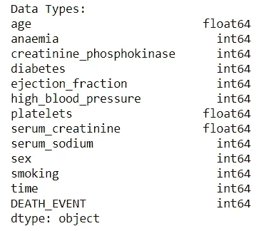
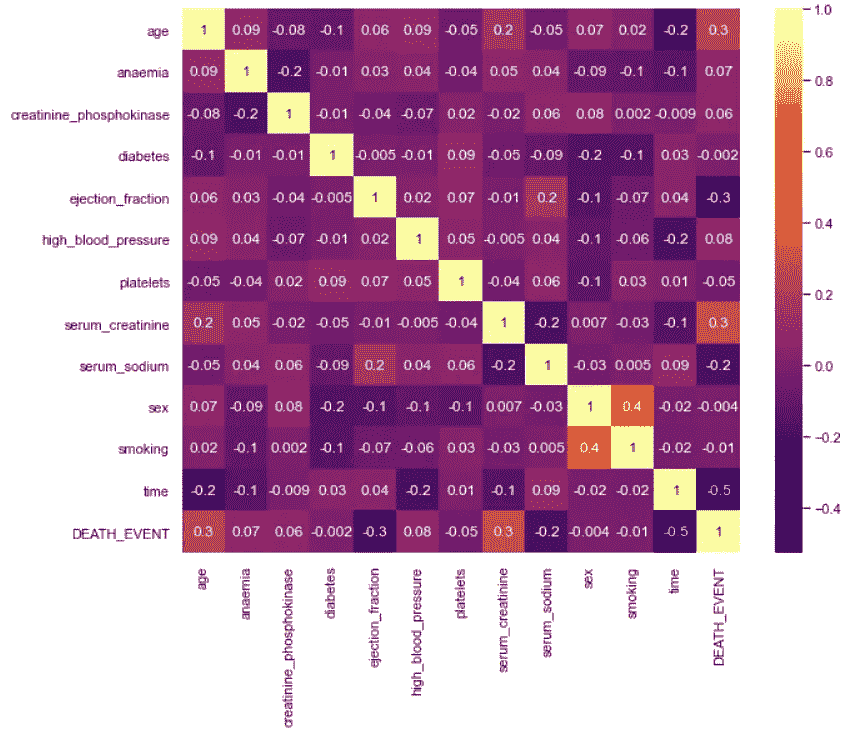
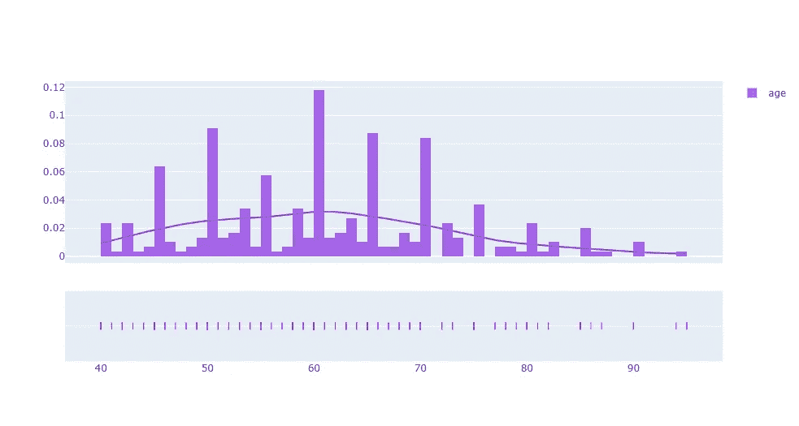
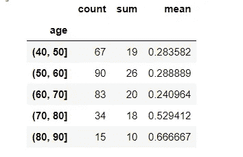
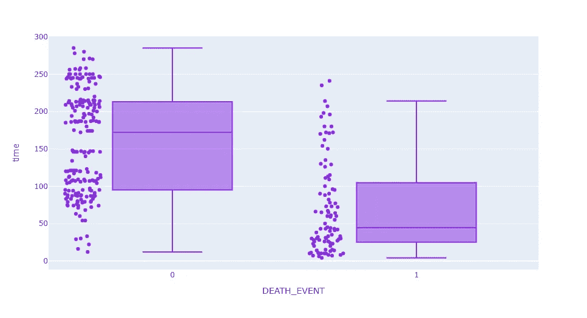
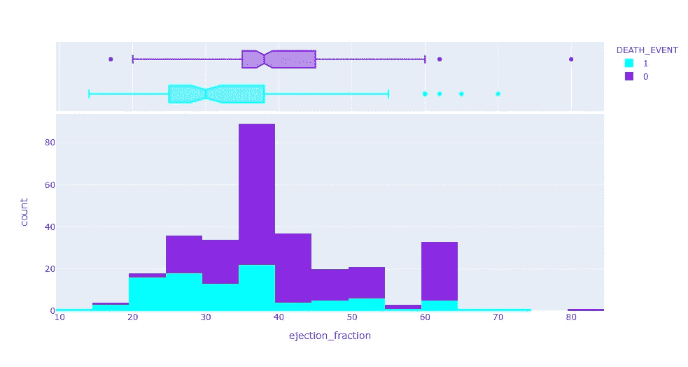
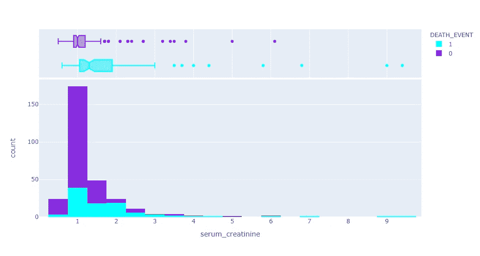

# 使用机器学习检测心力衰竭(第一部分)

> 原文：<https://medium.com/mlearning-ai/detecting-heart-failure-using-machine-learning-part-1-4c99475f4da5?source=collection_archive---------5----------------------->

医疗领域的机器学习已经走过了漫长的道路，解决了一个又一个复杂的问题。因此，医疗专业人员已经开始依赖机器学习工具来检测各种疾病。今天，我将展示一个这样的案例，心力衰竭。

心力衰竭是一种心脏不能泵出足够的血液来满足身体需求的状况。在某些情况下，心脏不能充满足够的血液。在其他情况下，心脏无法以足够的力量将血液泵送到身体的其他部位。这是一个严重的情况，需要立即关注。

有多种方法可以解决这个问题:人们可以使用扫描来检测视觉异常，这将是一个计算机视觉问题，或者人们可以处理由医学研究人员收集和发布的结构化医学数据来检测心力衰竭。我将与后者一起前进。

我提到的笔记本和数据集都在 Github 的存储库中，如果你想深入研究的话(链接:[https://github.com/preeyonuj/Heart-Failure-Detection](https://github.com/preeyonuj/Heart-Failure-Detection))。本文是检测心力衰竭系列文章的一部分，将重点介绍 EDA 的简介和基础知识。

# 资料组

我从 Kaggle(链接:[https://www . ka ggle . com/Andrew MVD/heart-failure-clinical-data](https://www.kaggle.com/andrewmvd/heart-failure-clinical-data))那里得到了这个数据集。只有 12 个特性的特性集并不丰富。但是对于这个演示，它工作得很好。它包含关于受试者的一般信息，如他/她的年龄、性别和是否吸烟，以及更复杂的医学特征，如 CPK 酶水平、血小板和是否患有糖尿病。此处的预测变量是“死亡事件”特征，其表明受试者是否因心力衰竭而存活或死亡。

说到关于数据集的描述性信息，它有 299 个数据点。所有的特性要么是整数，要么是浮点数。

Data types of all the rows in the dataset

我将“年龄”特性的数据类型更改为整数，因为每个数字都有一个设置为 0 的小数部分，这违背了浮点数的目的。对数字特征的描述性统计的研究表明了一个非常不同的值范围，这必须在以后进行调整。

# 探索性数据分析

来到 EDA，我检查的第一件事是它是否有任何 NaN 值，令我惊讶的是，它没有。这似乎是一个理想的场景，因为这个数据集非常小。接下来，我检查了特性之间的相关性。

Correlation Heatmap among the features

与预测变量具有最高相关性的特征似乎是“时间”，这是受试者的随访期。其他高度相关的特征包括“年龄”、“射血分数”和“血清肌酸酐”。我将深入研究这些特性。对于所有的图表，我都使用了 [Plotly](https://plotly.com/python/getting-started/) ，因为它非常具有互动性。

## 年龄

年龄是一个离散的整数特征，顾名思义，它描述了对象的年龄。

Distribution of the ‘age’ feature

这一特征的分布看起来很正常，但向右倾斜，平均值约为 60。为了更清楚地了解这个问题，我收集了一些数据。下表显示，随着“年龄”超过 70 岁，死亡人数也在增加。

Binned ‘age’ statistics

## 时间

时间是描述受试者的随访期(以天为单位)的离散整数特征。由于这个特征与预测变量高度相关，我决定用特定的预测类生成它的箱线图。

Box Plot for Time feature with predicted variable ‘DEATH_EVENT’

从 Box Plot 上可以清楚地看到，时间可以相当好地划分二进制类。我可以看到一些重叠的高端，但不重叠的部分超过了很多。

## 射血分数

射血分数是描述每次收缩时离开心脏的血液百分比的另一个高度相关的特征。绘制该特征的分布表明相当正态分布，在 60 之后具有不寻常的峰值。修改后的方框图显示了与“时间”相同的趋势，类别相对于“射血分数”是部分可分离的。

Distribution and Box Plot for ejection_fraction with respect to DEATH_EVENT

## 血清肌酐

血清肌酸酐是描述血液中肌酸酐水平的连续浮动特征。我使用分布图检查了要素的分布。

Distribution and Box Plot for serum_creatinine with respect to DEATH_EVENT

该图描绘了一个集中在 1 左右的大致正态分布，而剩余值持续到 9。方框图再次显示了二进制类的值范围的部分差异。

接下来，我们将在“要素工程”部分研究如何利用这些要素，然后基于它们构建模型。所有的特征似乎在预测变量的类之间有一些区别，并且可能被利用。敬请期待下一部分！

同时，如果你想更多地了解我和我的工作，以下是我的:

1.  Github 简介:[https://github.com/preeyonuj](https://github.com/preeyonuj)
2.  先前的中型文章:[https://media . com/analytics-vid hya/aptos-blind-challenge-part-1-baseline-efficient net-c7a 256 daa6e 5？sk = 0e 445 f 99 DAA 71d 79 f 0452665 f1 a 59 db](/analytics-vidhya/aptos-blindness-challenge-part-1-baseline-efficientnet-c7a256daa6e5?sk=d0e445f99daa71d79f0452665f1a59db)
3.  LinkedIn 简介:[www.linkedin.com/in/pb1807](http://www.linkedin.com/in/pb1807)

# 参考:

1)https://www . NHL bi . NIH . gov/health-topics/Heart-failure #:~:text = Heart % 20 failure % 20 is % 20a % 20 condition，the % 20 body % 20 with % 20 nothing % 20 force。2)https://bmcmedinformdecisismak . biomed central . com/articles/10.1186/s 12911-020-1023-5