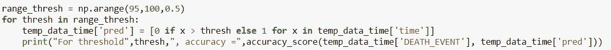
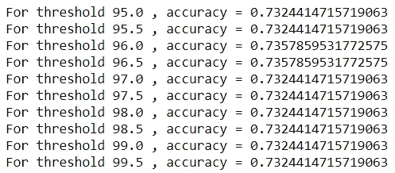
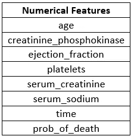
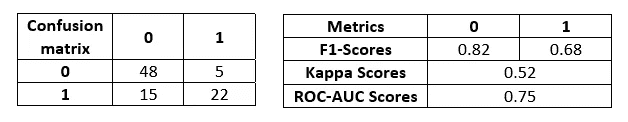
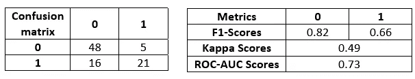
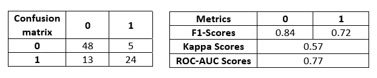
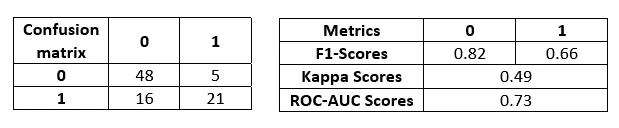
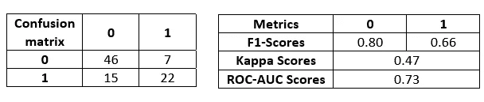
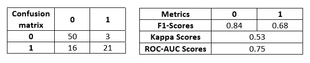

# 利用机器学习检测心力衰竭(下)

> 原文：<https://medium.com/mlearning-ai/detecting-heart-failure-using-machine-learning-part-2-8cca4cac266c?source=collection_archive---------4----------------------->

在本系列的最后一部分中，我讨论了数据集并执行了一些基本的 EDA。因此，下一步应该是利用特征工程和基线建模来利用这些见解。因此，本文将集中讨论这两个步骤。

我提到的笔记本和数据集都在 Github 存储库中，以防你想深入研究(链接:[https://github.com/preeyonuj/Heart-Failure-Detection](https://github.com/preeyonuj/Heart-Failure-Detection))。如果你想跟进系列的上一篇文章，这里有链接[https://preeyonujb 1 . medium . com/detecting-heart-failure-using-machine-learning-part-1-4c 99475 F4 da 5](https://preeyonujb1.medium.com/detecting-heart-failure-using-machine-learning-part-1-4c99475f4da5)。

# 特征工程

特征工程是将给定数据转换成更容易解释的形式的过程。从以前文章中的 EDA 中，我发现我可以使用“年龄”和“时间”特性来创建新的有用特性。

## 年龄

Binned ‘age’ statistics

我观察到，超过一定年龄后，死亡率会翻倍。所以，我把这个特征分组，计算他们死亡的概率，并把它作为一个特征引入。随着年龄的增长，人们死亡的概率也在增加。

Function to create the ‘prob_of_death’ feature

在我最初的笔记本中，我已经加入了一些统计测试来检查“死亡概率”特征和预测特征“死亡事件”之间的相关性。我使用了卡方检验，但是意识到一个先决条件是两个特征都是绝对的。我惊讶地发现，在互联网上很难找到检验分类变量和定量变量之间相关性的统计测试。所以，现在，我已经把它从笔记本和这篇文章中删除了，因为我可能使用了错误的统计测试。我一定会在我以后的系列文章中包含它。

## 时间

时间是另一个特征，在这个特征中，我看到了谓词特征‘DEATH _ EVENT’的类之间的大量分离。因此，我决定创建一个更简单的、具有特定阈值的二进制版本的特性。

根据我上一篇文章中的图表，我估计了一个可以作为阈值的值范围，即 95–100。我检查了每个阈值的准确性度量，发现 96 和 96.5 的性能最好。

Snippet for calculating accuracy with each threshold

Accuracy results for each threshold

肯定有优化的方法，但是由于数据集很小，我可以通过它运行整个数据集。最后，使用阈值 96，我创建了一个特性，如果“时间”变量高于阈值，则设置为 1，如果低于阈值，则设置为 0。这背后的目的是线性参数算法中分类特征的重要性。

# 系统模型化

该数据集混合了分类特征和数字特征。所以我计划分离数字特征，并通过不同的管道运行它们。我还通过一些算法运行了整个特性集，最后，我创建了一个基于多数投票的集成推理管道。在深入研究之前，我将数据分为 70/30 的训练/测试比率。

## 数字特征

Numerical Features in the dataset

数字特征已经在侧面列出。我手动将数字特征从数据集中分离出来。我做的第一件事是使用标准缩放比例将它们缩放到一个共同的范围。

我在这些数字特征上实现的算法是逻辑回归和 SVM。

对于[的逻辑回归](https://scikit-learn.org/stable/modules/generated/sklearn.linear_model.LogisticRegression.html)，结果出来的相当不错。我重点关注的指标是 F1 分数，因为这是一个更全面的衡量标准，此外还有 Kappa ROC AUC 分数，以便更好地理解。

Logistic Regression Results

对于 [SVM](https://scikit-learn.org/stable/modules/generated/sklearn.svm.SVC.html) ，结果与逻辑回归的结果相当接近。

SVM Results

## 整个功能集

在处理整个数据集时，我做的前提步骤是替换原始数据集中的缩放数值。然后，由于数据集具有数字和分类特征的组合，我选择了理论上可以处理这两种特征类型的算法。

我使用的第一个算法是带有 gbtree 助推器的 [XGBoost](https://xgboost.readthedocs.io/en/latest/) 分类器。我设置的初始超参数纯粹基于直觉和以前的经验。结果比早先的推论要好。

XGBoost Results

下面我实现的算法是 [CatBoost](https://catboost.ai/) 带 Log loss 目标函数的分类器。CatBoost 非常快，并且具有一种新颖的梯度增强技术来减少过拟合。同样，我从直观的初始超参数值开始，看起来效果不是很好。结果比 XGBoost 差。

CatBoost Results

接下来，我使用了算法 [LightGBM](https://lightgbm.readthedocs.io/en/latest/) 分类器和传统的梯度提升决策树，在速度上和 CatBoost 差不多。使用直观的超参数进行初始化，模型结果与 CatBoost 和 XGBoost 的范围相同。

LightGBM Results

我实现的最后一个算法是随机森林，带有随机的初始超参数。结果类似于 XGBoost。

Random Forest Results

最后，我执行了一些基本的特征工程，并使用直观设置的初始超参数实现了一些初始模型。现在，我可以通过超参数优化进一步改善这些结果。这是本系列下一篇文章的主题。因此，在下一篇文章中，我将介绍超参数优化的过程，并最终创建一个包含所有模型的集成推理管道。敬请期待下一部分！

与此同时，如果你想更多地了解我和我的工作，这里是我的:

1.  Github 简介:[https://github.com/preeyonuj](https://github.com/preeyonuj)
2.  上一篇媒体文章:[https://Medium . com/analytics-vid hya/aptos-blindness-challenge-part-1-baseline-efficient net-c 7a 256 da a6e 5？sk = d0e 445 f 99 DAA 71d 79 f 0452665 f1 a59 db](/analytics-vidhya/aptos-blindness-challenge-part-1-baseline-efficientnet-c7a256daa6e5?sk=d0e445f99daa71d79f0452665f1a59db)
3.  本系列往期文章:[https://medium . com/mlearning-ai/detecting-heart-failure-using-machine-learning-part-1-4c 99475 F4 da 5？source = friends _ link&sk = fee 63820d 5743 abf 90 C4 caedb 68 cc 781](/mlearning-ai/detecting-heart-failure-using-machine-learning-part-1-4c99475f4da5?source=friends_link&sk=fee63820d5743abf90c4caedb68cc781)
4.  领英简介:[www.linkedin.com/in/pb1807](http://www.linkedin.com/in/pb1807)
5.  推特简介:[https://twitter.com/preeyonuj](https://twitter.com/preeyonuj)