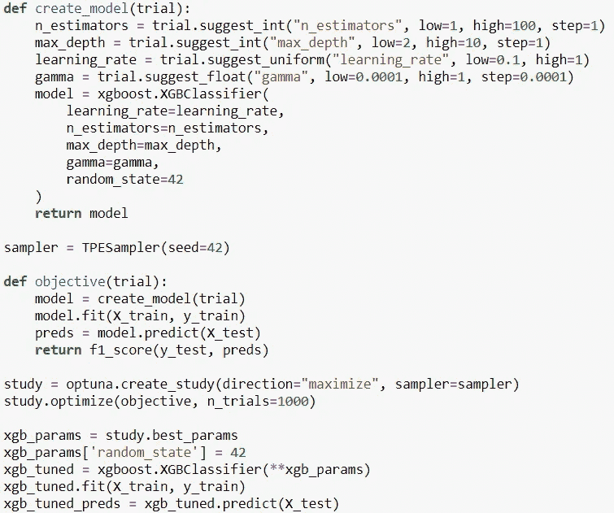
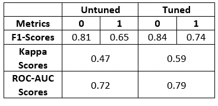
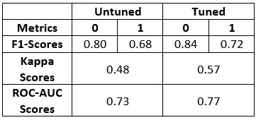
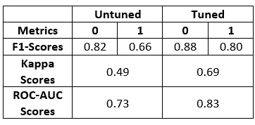
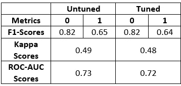
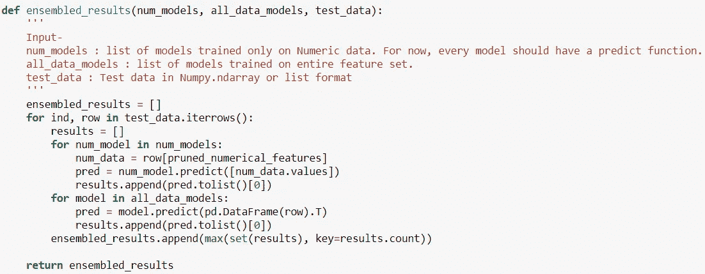
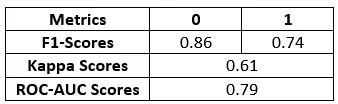

# 使用机器学习检测心力衰竭(第三部分)

> 原文：<https://medium.com/mlearning-ai/detecting-heart-failure-using-machine-learning-part-3-3fb8ab5d595f?source=collection_archive---------8----------------------->

这是心力衰竭检测系列的最后一部分。在之前的文章中，我讨论了数据集，执行了一些基本的 EDA 和功能工程，最后是基线建模。现在，这一部分需要对模型进行超参数优化，并创建推理管道。

我提到的笔记本和数据集在我的 GitHub 存储库中，如果你想深入研究的话(链接:[https://github.com/preeyonuj/Heart-Failure-Detection](https://github.com/preeyonuj/Heart-Failure-Detection))。

# 超参数优化

超参数优化是为学习算法选择一组最佳超参数的问题。有几种方法，如网格搜索，随机搜索，贝叶斯优化等。这里有一篇威尔·科尔森关于不同方法的伟大文章(链接:[)https://towards data science . com/a-conceptual-explain-of-Bayesian-model-based-hyperparameter-optimization-for-machine-learning-b 8172278050 f](https://towardsdatascience.com/a-conceptual-explanation-of-bayesian-model-based-hyperparameter-optimization-for-machine-learning-b8172278050f))。

直到现在，对于我以前的所有项目，我都依赖网格搜索来进行超参数优化。但是由于它没有考虑以前的评估，所以计算量很大。因此，我继续寻找更好的解决方案，在那里我偶然发现了这些不同的方法。在实现方面，我发现 Optuna 有一种非常直观的方法来实现超参数优化。所以，我开始摆弄这个库，这个库中的默认采样器是树形结构的 Parzen Estimator。

树结构 Parzen 估计器(TPE)是一种基于顺序模型的优化(SMBO)方法。SMBO 方法基于历史测量依次构建模型以逼近超参数的性能，然后基于该模型选择新的超参数进行测试。我发现这种方法很容易理解，因此决定将其用于优化过程。

在开始实现之前，我修剪了我的特性集，使其包含至少 0.05 的与预测变量的绝对相关性，并丢弃了其余的特性。尽管有我的期望，我还是看到了一些模型的微小改进，并决定继续使用它。

Defining the optimization process for XGBooster

在上面的代码片段中，我已经为 XGBoost 定义了整个超参数优化过程。让我解释一下这个过程:我创建了一个研究对象，我在其中定义了我希望优化过程最大化目标函数和我将使用的采样器，在这个例子中，是 TPE。创建之后，我用我的目标函数作为输入来实现*优化*函数，如上所述。因此，研究现在将运行目标函数 *n* 次(这里，n = 1000)。 *create_model* 函数包含了我想要训练的参数和训练过程本身。目标函数采用由研究过程建议的具有特定超参数的模型，并在数据集上对其进行训练，并生成度量分数，基于该度量分数对模型进行评估(这里是 F1 分数)。一旦最终确定了超参数，我就使用 *best_params* 变量提取它们，并用最终确定的超参数训练模型。很直观！

我对所有特征上训练的所有模型执行了超参数优化过程，即。XGBoost、CatBoost、LightGBM 和 Random Forest。除了随机森林，所有模型都有改进。我已经列出了比较的结果。对于那些读过我以前的系列文章的人来说，*未调优的*结果可能看起来有所不同。这是因为在优化过程之前，我执行了特征修剪并再次测试了模型，并与这里的结果进行了比较。

Results comparison for XGBoost

Results comparison for CatBoost

Results comparison for LightGBM

Results comparison for Random Forest

因为我看到大多数模型都有改进，所以我可以基于它创建一个推理管道。

# 推理管道

我对 Sklearn 中实现的推理管道有一些大致的想法。但是我的模型不能在同一个特性集上统一工作，所以我自己创建了管道。这是一个非常简单的特定于该用例的实现。

Inference function

我的推理函数接受 3 个输入，即。基于数字特征的模型，基于所有特征和数据进行测试的模型。一旦数据通过每个模型，通过多数投票算法传递单个预测来计算最终输出。我从集合模型中得到的结果比大多数单独的结果要好，但是 Tuned LightGBM 表现得更好。

Ensembled Model’s Result

# 改进的余地

以下是我正在思考的几点，以改进这些结果:

1.  选择合适的超参数-超参数在模型性能中起着重要作用。我使用的模型有许多可用的超参数，我从中选择了几个。可能有一组更好的超参数可以进一步改善结果。
2.  试验次数-超参数优化有固定的试验次数，由用户描述，通常是直接的，有时是间接的。尝试的次数越多，优化器的信息就越丰富。在 Optuna 中，有一个特定的参数名为 *n-trials* ，我为所有模型保存了 1000 个参数。
3.  特性集实验——如果你读过我以前的系列文章，我已经分离了数字特性，并通过不同的算法分别处理了它们。当我试图将它们标准化时，我想到了这个主意。虽然我现在想知道，它是否对结果产生了任何有形的影响。我可能会进行一些比较测试来确定这一点。
4.  特征工程——这有点笼统，但是我可以/应该在特征工程上多花一点时间。我能够生成两个特征，但通过一些研究，我可能已经能够查看医疗特征，如钠*、肌酸酐*水平等。

我们已经到了文章和系列的结尾。感谢所有花时间阅读我的文章的人。我希望这篇文章(事实上，我所有的文章)被看作是演练，而不是指南。我只是记录我所学到的东西，如果你觉得我做错了什么，请在评论区告诉我，无论我在哪里发帖，甚至在媒体上。

与此同时，如果你想更多地了解我和我的工作，这里是我的:

1.  Github 简介:【https://github.com/preeyonuj 
2.  本系列往期文章:[https://medium . com/mlearning-ai/detecting-heart-failure-using-machine-learning-part-2-8 CCA 4c AC 266 c？source = friends _ link&sk = 1f 00696185785708 bdca 9 fa 67426 EC b5](/mlearning-ai/detecting-heart-failure-using-machine-learning-part-2-8cca4cac266c?source=friends_link&sk=1f00696185785708bdca9fa67426ecb5)
3.  领英简介:[www.linkedin.com/in/pb1807](http://www.linkedin.com/in/pb1807)
4.  推特简介:[https://twitter.com/preeyonuj](https://twitter.com/preeyonuj)

# 参考资料:

1.  [https://opt unity . readthedocs . io/en/latest/user/solvers/TPE . html](https://optunity.readthedocs.io/en/latest/user/solvers/TPE.html)