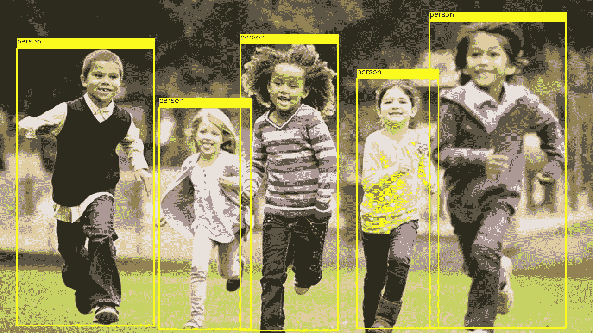
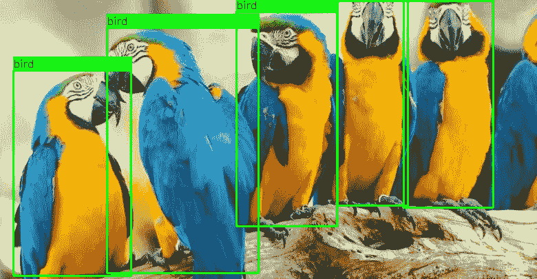
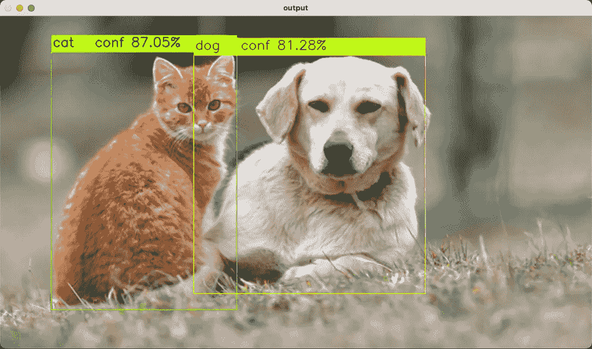
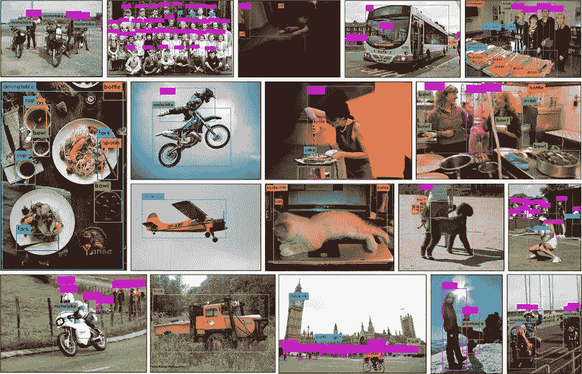
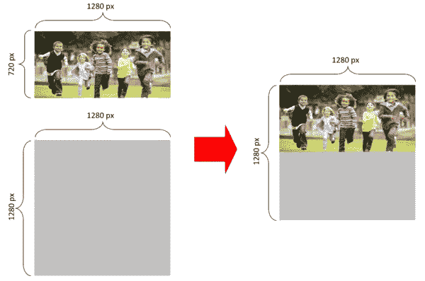
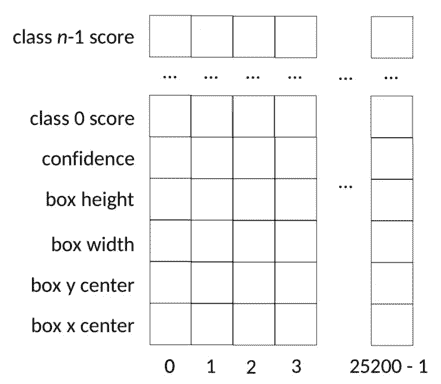
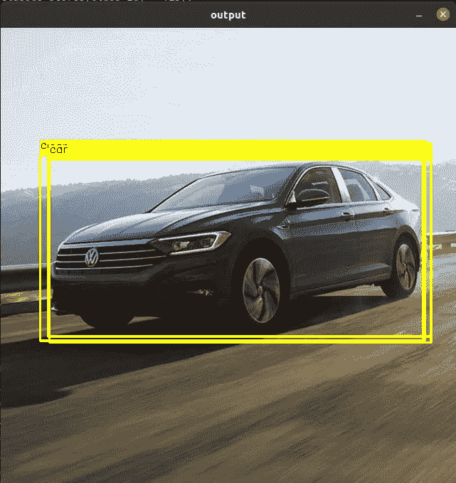
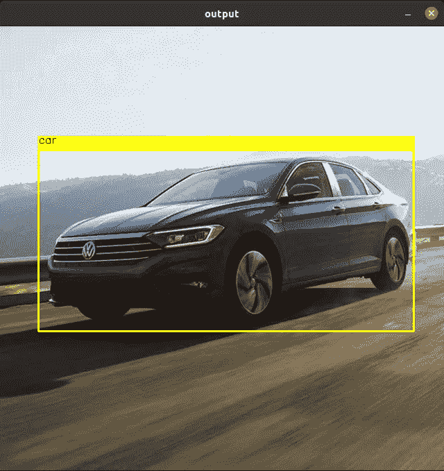

# 用 YOLOv5，OpenCV，Python 和 C++检测对象

> 原文：<https://medium.com/mlearning-ai/detecting-objects-with-yolov5-opencv-python-and-c-c7cf13d1483c?source=collection_archive---------0----------------------->



[source](https://www.malinhapronta.com.br/2016/03/29/que-tal-levar-as-criancas-para-participar-de-uma-corrida-de-rua/)

人们常常认为计算机视觉是一个很难理解的课题，也很难运行。事实上，不久前，编写计算机视觉应用程序是一项高度专业化的任务，需要对机器学习有深入的了解，并对底层计算机基础设施有深刻的理解，才能实现最低限度的可接受性能。

今天，这不再是事实。或者至少对于被称为“物体检测”的一系列计算机视觉任务来说不是这样。在这里我们要讨论今天性能最高的物体检测器之一: [Ultralytics YOLO v5](https://ultralytics.com/yolov5)

在本文中，我将展示如何轻松使用 YOLO V5——最先进的对象检测引擎——来识别图像中的元素。作为案例研究，我们将使用 OpenCV、Python 和 C++来加载和调用我们的 YOLO v5 模型。



Canindé Araras ([source](https://www.passaro.org/arara-do-caninde/))

## 什么是对象检测

目标检测是最重要的计算机视觉任务之一。简而言之，给定一幅图像，物体探测器会发现:

*   图像中的对象
*   他们的类型(通常称为**类**
*   代表图像中物体坐标的**边界框**。



对于每个对象，对象检测算法分配一个**置信度**值，表示该检测的可信度。

## 物体探测器如何知道如何探测物体？

像 YOLOv5 这样的物体探测器经过**训练**来探测物体。这种训练包括使用一组图像和相应的注释来调整模型，并使其学习如何检测对象。

这种训练的结果是一个模型文件。YOLOv5 有一组先前使用 [MS COCO 数据集](https://cocodataset.org/#home)训练的模型。这些预先构建的模型能够探测到人、汽车、自行车、狗、猫、飞机、船等物体



object detection using MS COCO [source](https://www.researchgate.net/publication/335865923_Mini-YOLOv3_Real-Time_Object_Detector_for_Embedded_Applications)

我们可以自己训练 YOLOv5，以便教会它探测其他类型的物体。事实上，训练 YOLOv5 非常容易。这个话题在[另一个故事中有所涉及。](/mlearning-ai/training-yolov5-custom-dataset-with-ease-e4f6272148ad)

## 在这里使用 YOLOv5 的总体情况

基本上，我们的程序执行 4 个简单的步骤:

*   加载 YOLOv5 模型
*   输入图像以获得预测
*   展开输出以获得每个对象的类和边界框
*   使用输出来修饰图像

让我们开始吧！

## 步骤 1 —加载 YOLOv5 模型

这一步由一行代码组成，用于导入模型

Python:

在 C++中:

您可能想知道什么是文件 *yolov5s.onnx* 以及在哪里可以找到它。

*yolov5s.onnx* 是 OpenCV 可识别格式的模型文件。原始文件 *yolov5s.pt* ，可以在 [YOLOv5 github 库](https://github.com/ultralytics/yolov5/releases)中找到。

为了让 OpenCV 读取模型文件，有必要将其转换为 *ONNX* 格式。这就是为什么我们在这里使用 *yolov5s.onnx* 的原因。

按照这里的说明可以很容易地将 YOLOv5 模型转换成不同的格式[。](https://github.com/ultralytics/yolov5/issues/251)

为了您的方便，您可以在这里下载我的 yolov5s.onnx。

## 步骤 2-输入图像以获得预测

YOLOv5 等待具有以下规格的输入图像:

*   RGB 格式
*   [0，1[
*   尺寸 640x640

因此，在调用 YOLOv5 模型之前，我们需要将任意图像格式化为这些规格。这就是 *format_yolov5* 该做的事情:

*format_yolov5* 的 C++代码为 *:*

注意，默认情况下，OpenCV 加载彩色图像作为 BGR。对源图像进行处理以获得平方图像的过程如下所示:



formatting an arbitrary size image to be squared

一旦图像被格式化，调用模型就简单了，如下所示:

或者在 C++中:

在这一步中，我们程序 99%的 CPU 使用率都是很高的。现在，让我们看看如何使用`output`结果。

## 步骤 3-展开输出

在前面的步骤中，YOLOv5 执行了对象检测，返回了在`output` 2D 数组中找到的所有检测结果。下图显示了该数据的结构:



structure of prediction result

这个数组有 25，200 个位置，每个位置是一个 85 长度的 1D 数组。每个 1D 阵列保存一次探测的数据。该数组的前 4 个位置是边界框矩形的`xywh`坐标。第五个位置是该检测的置信水平。第 6 到第 85 个元素是每个类的分数。下面的代码显示了如何从 2D 数组中打开数据:

当然，并非 25，200 次检测中的每一次都是实际检测。我们使用某个阈值，通过`if confidence > 0.4:`测试剔除低置信度检测。

值得注意的是，YOLOv5 认为输入图像是 640x640。因此，有必要将`xywh`坐标重新缩放至实际输入尺寸:

```
x, y, w, h = row[0], row[1], row[2], row[3]
left = int((x - 0.5 * w) * x_factor)                                             top = int((y - 0.5 * h) * y_factor)                                             width = int(w * x_factor)                                             height = int(h * y_factor)                                             box = [left, top, width, height]                                             boxes.append(box)
```

我们还使用了`cv2.minMaxLoc`来查找每个检测中得分最高的类 id。

即使过滤低水平置信度检测，前面的代码也会生成重复的框:



当然，这种重叠是不希望的。为了避免这种情况，通常使用**非最大抑制** (NMS)算法来消除重叠/重复检测:



用 NMS 剪枝解开预测的 C++代码如下:

## 步骤 4—打印生成的图像

我们工作中最困难的部分已经完成。现在，让我们使用得到的预测来打印带有检测结果的图像:

这个代码里没有火箭科学。我们只是使用 OpenCV 函数来打印检测到的盒子和类标签。

## 附加(但重要)主题:CUDA

运行计算机视觉需要大量的处理时间。通常，即使强大的 CPU 也不足以提供实时对象检测。

装有 NVIDIA 卡的计算机可以通过使用一种称为 CUDA 的技术，使用其 GPU 来处理代码。幸运的是，在我们的案例研究中使用 CUDA 非常简单。基本上，要求模型使用它:

或者使用 C++:

如果你没有带 NVIDIA 卡的电脑，代码会自动切换回 CPU 模式。如果你有一台装有 NVIDIA 卡的电脑，但代码不能在 GPU 上运行，也许你需要重新[安装支持 CUDA 的 OpenCV](https://www.pyimagesearch.com/2016/07/11/compiling-opencv-with-cuda-support/)。

最后，将 YOLOv5 与 CUDA 结合使用，我们可以实现实时性能:

## 完整代码

这里使用的完整代码可以在这个 [github 库](https://github.com/doleron/yolov5-opencv-cpp-python)中找到。

[](/mlearning-ai/mlearning-ai-submission-suggestions-b51e2b130bfb) [## Mlearning.ai 提交建议

### 如何成为 Mlearning.ai 上的作家

medium.com](/mlearning-ai/mlearning-ai-submission-suggestions-b51e2b130bfb)