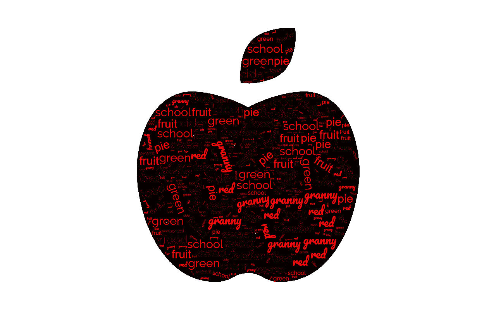
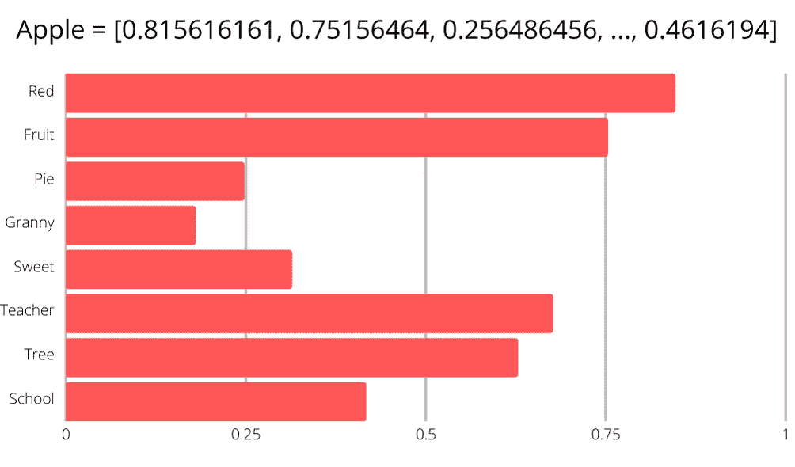

# 用神经网络检测讽刺

> 原文：<https://medium.com/mlearning-ai/detecting-sarcasm-with-neural-networks-d8e7cac68624?source=collection_archive---------7----------------------->

在微软 Shahbaz Mogal 领导的“用神经网络检测讽刺”实验室中，一群来自 Tumo 创新技术中心的亚美尼亚学生编写了一个程序，可以检测任何语言文本中的讽刺。

你可能会问，计算机是如何理解讽刺的？甚至有些人无法理解。看完这篇文章，你会对这一切是如何运作的有个大概的了解。

# Bip，bip，bop，bip？(或者说计算机如何理解单词)

第一个问题是，尽管计算机很聪明，但它们不能像我们一样阅读和理解文字。对他们来说，单词只是一组字符，没有任何意义。所以向计算机解释一个单词的最好方法是用其他单词来描述它。

毕竟，当我们听到“苹果”这个词时，许多其他的词会浮现在脑海中，比如“红色”、“水果”和“美味”。这就是计算机理解单词的方式；它把他们和其他人联系起来。下面，你可以看到一个“苹果”的例子

计算机提取所有这些单词，并按照 0 到 1 的等级对它们的相似度进行评分，如下例所示。

有一千个这样的词，最后，我们得到一个包含所有这些音阶的列表。而那些在我们看来很怪异的数字，正是计算机所理解的。

# 是时候成为讽刺大师了！(多次失败后)

现在计算机可以理解单词了，是时候让它学习了。像人类一样，计算机通过大量的实践来学习，为此，它们需要有许多例子。这就是为什么我们向计算机显示讽刺和非讽刺的句子，这样它就能学会区分这两者。

然后，是时候让计算机通过失败来学习了(是的，即使是计算机也要为了学习而失败)。在处理完所有这些信息后，它开始猜测这个句子是否是讽刺性的。每猜对一次，电脑就会得到奖励，每答错一次，电脑就会受到惩罚。慢慢地，计算机会找出获得最多奖励的最佳方式，并掌握区分讽刺的能力。通过多小时的练习，准确率甚至可以达到 98%！

# 啊哈(那是讽刺吗？)

上面，我们提到我们向计算机展示了许多讽刺性表达的例子。那么，这些例子是什么呢？毕竟，当你断章取义地使用一个讽刺的表达时，它就不再是讽刺了。

因此，用讽刺性的标题代替了通常的讽刺性表达。标题本身通常是不言自明的，它们提供了足够的上下文来帮助计算机。计算机训练的标题主要是从一个新闻网站上提取的，这个网站提供对当前事件的讽刺版本。

# 多语言超级计算机？

好吧，我们帮助计算机理解英语单词，并教它检测英语文本中的讽刺。我们现在必须对世界上所有的语言进行同样的处理吗？这将需要很长时间，然而，伟大的事情是这是不必要的，因为我们已经有模型可以做到这一点！

“怎么会？”你可能会问。请记住，在为计算机定义单词时，我们使用量表来将它们与其他单词进行比较。这个世界的语言仅仅是我们拥有的成千上万种尺度中的一种。例如，英语单词“apple”在其“英语”标度上具有非常接近 1 的数字，而在“亚美尼亚语”标度上具有接近 0 的数字。同样，亚美尼亚语单词“խնձոր”(发音。khndzor)，这也意味着苹果将在“英语”标度上有一个接近 0 的数字，在“亚美尼亚”标度上有一个接近 1 的数字。最终，英语单词“苹果”和亚美尼亚语单词“խնձոր”的差别只有千分之二。这就是为什么语言不是这个项目的障碍。

# 我们完了！

所以，现在你知道电脑是如何检测讽刺的了！它通过与他人比较来定义单词，消耗大量信息，然后通过反复试验来学习。如果你对这个项目感兴趣，并想了解更多，你可以观看 TUMO 创新技术中心的视频,工作室负责人 Shahbaz Mogal 在视频中对这个项目做了更多介绍。下次见:)

 [## Mlearning.ai 提交建议

### 如何成为 Mlearning.ai 上的作家

medium.com](/mlearning-ai/mlearning-ai-submission-suggestions-b51e2b130bfb) 

[成为作家](/mlearning-ai/mlearning-ai-submission-suggestions-b51e2b130bfb)